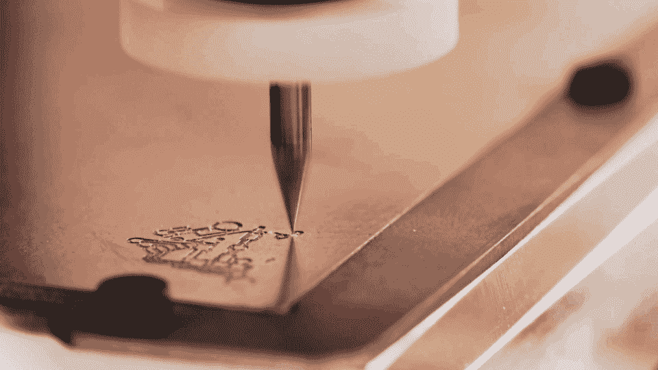

# 3D 打印到底怎么了？

> 原文：<https://web.archive.org/web/https://techcrunch.com/2016/07/10/whatever-happened-to-3d-printing/>

山姆·塞万提斯是一个看起来很安静的人，他真诚地谈论他的工作。

2013 年我参观他位于布鲁克林的 3D 打印机工厂时，装配线上的工人正忙着组装 Solidoodle 打印机。一队组装好的打印机呼呼作响，它们放下一层层熔化的塑料，为下一套机器制造零件。

当时，桌面制造的前景刚刚进入普通大众的意识。媒体气喘吁吁地报道了当地制造业和生物打印的潜力。政府对无法探测的 3D 打印枪支感到担忧。早期采用者想知道他们是否也需要一台 3D 打印机或数控机床。塞万提斯满怀希望。Solidoodle 离推出下一代打印机还有几个月的时间。

今天，Solidoodle 死了。该公司在试图将业务转移到中国后，于 2015 年底耗尽了资金，这导致了产品质量下降、意外的运输问题以及客户信心的丧失。塞万提斯在三月份宣布关闭。

塞万提斯说:“我们证明，对于早期采用者来说，我们可以非常成功，但当我们试图跨越鸿沟进入主流市场时，我们在资本时间表上无法解决生产和财务问题。”“我们遇到了一些外部意外冲击，例如西海岸港口延误了三个月，这些因素加在一起对我们的目标造成了不可挽回的损害。”

硬件硬是毋庸置疑的。从一个小商店到海外制造的道路上布满了创业公司的尸体。Solidoodle 的失误当然带来了问题，但它也面临着外部压力。

> 到了 2016 年，感觉台式机制造业已经过时了，和 3D 电视、智能冰箱一起挂在路边。

它是第一批销售价格低于 1000 美元打印机的公司之一。但是，600 美元的 Solidoodle 印刷机——导致该公司倒闭的中国制造的机器——突然面对价格只有几百美元的打印机。几十家 3D 打印机公司突然出现，目的是建立初学者友好的选择。

随着这一转变而来的是台式机制造业的大洗牌。

2015 年底，3D 打印老牌企业 [3D Systems](https://web.archive.org/web/20230128092532/http://www.3dsystems.com/) 停止生产其易于使用的立方体打印机。它的竞争对手 [Stratasys](https://web.archive.org/web/20230128092532/http://www.stratasys.com/) 宣布在六个月内第二次为其面向消费者的 [MakerBot](https://web.archive.org/web/20230128092532/http://www.makerbot.com/) 部门裁员。

一个高调的台式数控公司从来没有真正出现过。到了 2016 年，感觉台式机制造业已经过时了，和 3D 电视、智能冰箱一起挂在路边。

除此之外，台式机制造业仍在增长。根据 2016 年沃勒报告，购物者在 2015 年购买了超过 27.5 万台桌面 3D 打印机，高于 2014 年的 16 万台。2013 年市场刚刚破 8 万台。尽管增长有所放缓，但仍在快速前进。

那么，谁还在买 3D 打印机和数控机床呢？其他人会很快想要一个吗？

## 早期采用者

Other Machine Co. 生产 Othermill Pro，这是一种台式数控铣床，适用于制造电路板。3D 打印机在一种称为添加制造的过程中放下熔化的塑料，而 CNC 机器使用钻头来雕刻材料，这种过程称为减去制造。

它遵循与 3D 打印类似的工作流程:将数字文件输入机器，然后工厂完成剩下的工作。这比 3D 打印有点浪费，但它与木材和金属等经典材料兼容。与 3D 打印类似，近年来它经历了价格下降和易用性上升。

Other Machine 首席执行官丹妮尔·阿普尔斯通(Danielle Applestone)大多看到她的客户使用 Othermills 制作原型。在廉价的台式电脑出现之前，公司会将他们的设计寄出，然后必须等待数周才能打印或磨制出每个实物原型。能够在办公桌上制作电路板是最近的创新。

当消费硬件公司 Studio Neat 的创始人汤姆·格哈特(Tom Gerhardt)和丹·普罗沃斯特(Dan Provost)开始考虑一款新产品时，他们拿起一台 iPad，来回发送草图。该公司生产简单的产品，如 iPhone 支架和冰块模具。首先，他们在电脑上建立一个模型。然后，他们转向 3D 打印机、数控机床或车间里的其他工具来构建原型。

Gerhardt 和 Provost 在这些早期设计阶段花费了尽可能多的时间。Studio Neat 可以在几天内从想法到第一个原型，然后快速创建新的迭代。当一个产品准备好生产时，他们外包几乎所有的劳动力。

“我一天会做六七次迭代，”Gerhardt 说。“能够快速地将它们翻转过来并完成它们，这在正式设计和弄清楚事情应该是什么感觉方面完全改变了游戏规则。”

其他机器公司

这是桌面制造的吸引力。纵观全球，工程技术已经加速发展。你手里拿着的任何东西都很可能是印刷或磨制模型的后代。公司和 Etsy 商店的老板都喜欢 3D 打印，因为它可以在很短的时间内将它们从纸上带到现实世界。无论你生产一件物品还是 100 件物品，生产成本都不会改变。

关于用 3D 打印机制作原型的事情是，最终产品不需要看起来很棒。这是一种获得规模感和感觉的方式，但通常不希望被买家接受。当然也有例外。

例如，Shapeways 有一家网店，你可以在那里购买 3D 打印的珠宝、雕塑和任何你能想到的东西。吸引人的是产品的独特性——如果 Shapeways 计划销售数百万，还有其他材料会更有意义。

Shapeways 在价值数十万美元的机器上打印产品。另一方面，业余爱好者为自己打印物品，并期待同样的结果。他们想要好看到可以放在货架上的花瓶和家用电器的替换零件。

因此，虽然 Gerhardt 说 Studio Neat 从未被迫从相对老式的 MakerBot Replicator 2 升级，但消费者要求完美。这也是过去五年中打印机仍然存在的不足。

“两年前，3D 打印新闻一直都有。3D 打印公司 [New Matter](https://web.archive.org/web/20230128092532/http://newmatter.com/#!/) 的首席执行官史蒂夫·谢尔说:“我其实有点担心，因为我在新闻中看到的很多东西都缺乏 3D 打印技术的微妙之处。“人们并不总是清楚他们读到的这些 3D 打印应用是否可以在家里完成，或者是否在这些情况下使用了更多的研究级或商业和工业设备。”

虽然 Schell 认为广泛采用还需要五年时间，但他采访的非专家似乎认为这项技术正在快速到来。他们问他 New Matter 的 399 美元 MOD-t 3D 打印机是否能够打印活体组织和钛。

## 幻灭的低谷

Solidoodle 与更大的 3D 打印机社区和桌面制造业有着相同的目标:使制作民主化。让机器进入任何想要的人的客厅，让他们非常容易地做他们想做的任何事情。这意味着从专业人士过渡到普通大众。

最早的桌面 3D 打印机只用了几百美元的零件，但它们太复杂了，一般人无法组装和使用。因此，该行业竞相推出一款价值 1000 美元的预组装机器。然后 500 美元。这是有史以来最便宜的零制造专业知识制造相对复杂的物体。

但是对于硬件来说，便宜和对初学者友好通常是不匹配的。3D 打印机并不复杂，但它们有许多移动部件，随着时间的推移会磨损和断裂。削减成本会加剧这种情况。我审查了一台 3D 打印机，它在使用几天后没有出现故障或神秘的软件问题。使用 3D 打印机既耗时又烦人。无论他们的 Kickstarter 广告多么引人注目和用户友好，他们几乎从来没有准备好完美地为初学者工作。

然后，一旦你让打印机工作，就有了使用 3D 模型的障碍。如果一个普通用户需要多年的设计软件工作经验来告诉他们的数控机床该做什么，他们将永远不会做出任何东西。

“我认为围绕 3D 打印的炒作已经消退——或者至少正在减少——因为人们意识到设计特定的东西比他们想象的要困难得多，”阿普尔斯通说。"你无法回避你必须学习(计算机辅助设计)的事实."

> 3D 打印机并不复杂，但它们有许多移动部件，随着时间的推移会磨损和断裂。

我是在 Photoshop 和 Illustrator 中长大的。对于简单的形状来说，进入 3D 设计并不太难。但是设计一个有特定尺寸的零件仍然困扰着我。当谈到加法和减法制造时，我的设计几乎总是从在线模型库中下载。

该行业知道这一点，并已专注于建设大型图书馆。这使得 3D 打印机专注于玩具和装饰品等普通物品，而不是你损坏并想要更换的特定宜家抽屉把手。不缺少可以打印的东西，但是真正有用的用例仍然留给有经验的制作者。

Gartner 的炒作周期认为，膨胀的期望之后是幻灭。3D 打印机并没有立即解决我们的问题。从来没有一个超级吸引人的应用程序出现来激励我们冲出去买一个。公众乐于等待。

其他机器公司

## 新技术将带来下一波浪潮

尽管多年来选择令人失望，桌面制造业并没有死亡。新公司仍在涌现，销售数量空前的机器。根据 Gartner 的炒作周期，幻灭之后是启蒙，行业开始明白这可能是什么样子。

大多数桌面 3D 打印机都有类似的设计。一个金属喷嘴沿着龙门系统移动，将熔化的塑料放在一个平台上。最好的 3D 打印机采用这种基本设计，并使其防弹。他们使用高质量的零件，并使其易于更换。最糟糕的是把低质量的专利零件放在一个封闭的盒子里。

像 New Matter 这样的新公司正在测试替代方案。Mod-T 在两个旋转杆上移动打印床，同时打印头上下移动。这是一个不寻常的设计，简化了打印机的工作方式，并使公司保持低成本。

[https://web.archive.org/web/20230128092532if_/https://www.youtube.com/embed/6_YW22y8tgg?feature=oembed](https://web.archive.org/web/20230128092532if_/https://www.youtube.com/embed/6_YW22y8tgg?feature=oembed)

视频

但是只有这么多的方法来改造最普通的打印机。因为在喷嘴沉积下一层之前，每层塑料都必须干燥，所以它们的速度有一个物理极限。

工程师们正在通过重新思考 3D 打印来为该行业注入新的活力。最近，人们对使用激光或投射光逐层固化液体塑料的打印机越来越感兴趣。惠普的秘密打印机也使用光来加快打印过程，并打开新材料的可能性。

> 不是每个人都拥有缝纫机，但它们在我们的社会中占有重要地位。桌面制造也将如此。

“这项技术正在迅速改进，而且还会继续改进，”谢尔说。“这将导致更便宜的打印机，这当然有助于采用。这也是为了提高打印过程的速度，更一致地输出所创建部件的强度，以及更广泛的材料选择，以便您可以获得给定对象所需的属性。”

其他 3D 打印机制造商正在潜入特定的应用领域，如碳纤维和食品，以吸引人们对他们的机器的兴趣。苹果石也看到了数控加工领域专业化的光明前景。

想象一下，走进 Gap，看到一台机器在裁剪定制的牛仔裤，或者在牙医那里等着制作牙冠。不是每个人都拥有缝纫机，但它们在我们的社会中占有重要地位。桌面制造也将如此。

“这些技术曾经占据了整个房间，”阿普尔斯通说。“真正令人兴奋的是，当你缩小这项技术的规模，让人们用得起、用起来足够方便时，我们从未想过的整个经济就会出现。”