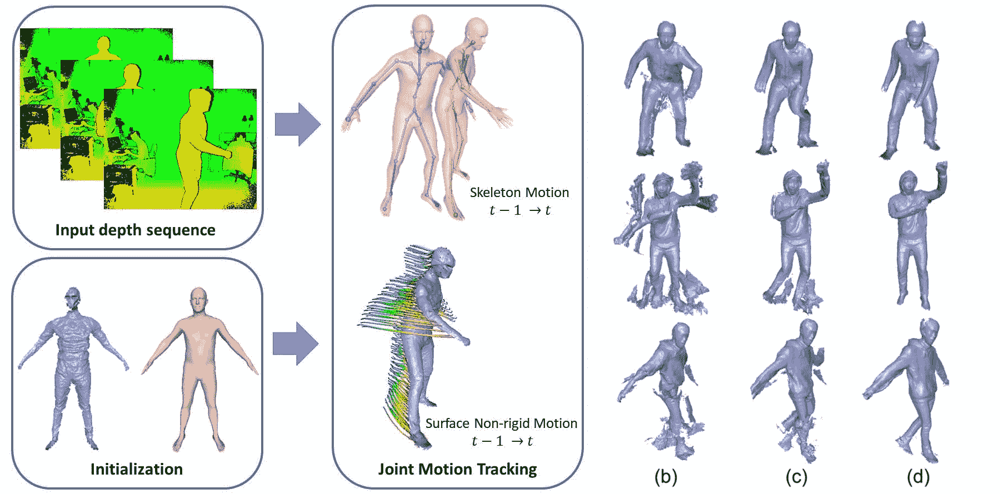

# 那些衣服下面是什么？这个系统可以实时追踪体形

> 原文：<https://web.archive.org/web/https://techcrunch.com/2018/06/18/whats-under-those-clothes-this-system-tracks-body-shapes-in-real-time/>

随着增强现实技术在旗舰手机上的热感和深度跟踪相机中的应用，是时候改善计算机跟踪他们看到的人的动作了——即使这意味着几乎要剥光他们的衣服。一种新的计算机视觉系统可以做到这一点，这听起来可能有点令人毛骨悚然，但它肯定有它的用途。

基本的问题是，如果你要捕捉一个运动中的人，比如说一部电影或一个增强现实游戏，衣服会给他们带来令人沮丧的模糊感。你认为动作捕捉演员为什么要穿紧身套装？因为他们的 JNCO 牛仔裤让系统很难准确说出他们的腿在哪里。把他们留在拖车里。

对任何穿裙子、背包、夹克的人来说都是一样的——除了最低限度，几乎任何东西都会干扰计算机很好地了解你的身体是如何定位的。

[这个多机构项目(PDF)](https://web.archive.org/web/20230304084432/http://openaccess.thecvf.com/content_cvpr_2018/papers/Yu_DoubleFusion_Real-Time_Capture_CVPR_2018_paper.pdf) ，将在盐湖城[CVPR](https://web.archive.org/web/20230304084432/http://cvpr2018.thecvf.com/)展示，结合深度数据和关于一个身体如何塑造和它能做什么的聪明假设。其结果是一种 X 射线视觉，揭示一个人在衣服下面的身体形状和位置，即使在像跳舞这样的快速运动中也能实时工作。

该论文建立在以前的两种方法上，即动态融合和体融合。第一种使用单个相机的深度数据来估计身体的姿态，但在快速移动或遮挡时效果不佳；第二种方法使用骨架来估计姿态，但同样在快速运动时会丢失轨迹。研究人员将这两种方法结合成“双重融合”，本质上是从深度数据中创建一个似乎合理的骨架，然后在距离核心适当的距离用皮肤进行收缩包装。

如上所述，来自相机的深度数据与人的一些基本参考图像相结合，以产生骨架并跟踪身体的关节和终端。在右边，你可以看到纯动态融合(b)，纯体融合(c)和组合方法(d)的结果。

结果比单独使用任何一种方法都要好得多，似乎可以从各种姿势和服装中制作出优秀的人体模型:

帽衫、耳机、宽松的衣服，没有任何东西可以阻挡 DoubleFusion 的全视之眼。

然而，一个缺点是，如果一个人穿了很多衣服，它往往会高估他的体型——它没有简单的方法来区分一个人是胖还是只穿了一件厚毛衣。当人与一个单独的物体互动时，比如桌子或游戏控制器，它就不能很好地工作——它可能会试图将这些解释为肢体的怪异延伸。处理这些异常是未来工作的计划。

这篇论文的第一作者是中国清华大学的陶宇，但来自北京航空航天大学、谷歌、南加州大学和马克斯·普朗克研究所的研究人员也参与了进来。

“我们相信我们方法的鲁棒性和准确性将使许多应用成为可能，特别是在 AR/VR、游戏、娱乐甚至虚拟试穿方面，因为我们还重建了潜在的身体形状，”作者在论文的结论中写道。"有了 DoubleFusion，用户第一次可以轻松地将自己数字化."

不可否认这项技术有很多有趣的应用。但是也没有用否认这种技术基本上是 X 射线 Spex。