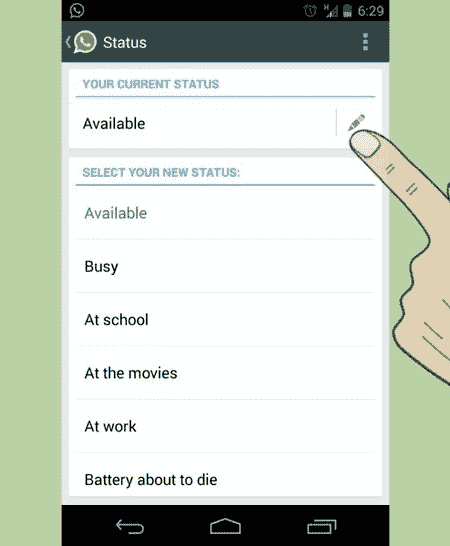
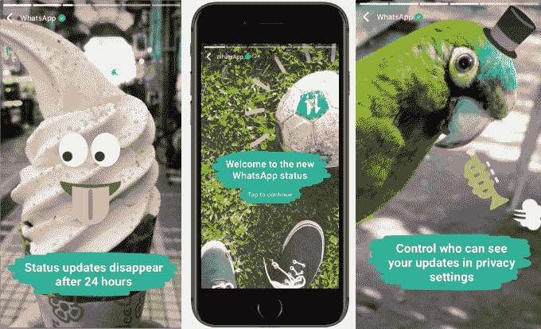

# WhatsApp 恢复了被故事取代的文本地位 

> 原文：<https://web.archive.org/web/https://techcrunch.com/2017/03/15/whatsapp-brings-back-status/>

# WhatsApp 恢复了被故事取代的文本地位

一切事物的快照化导致了 WhatsApp 的反弹，促使它恢复了文本状态选项，同时保留了基于图像的替代选项。此举表明，如果社交应用在适应视觉交流的现代化方面迈出了错误的一步，它们必须迅速对反馈做出反应。

2 月中旬，WhatsApp 取消了让你设置离开消息的功能，然后[将状态名称给了 Snapchat Stories 的克隆版本](https://web.archive.org/web/20230119083156/https://techcrunch.com/2017/02/20/whatsapp-status/)。但上周，文字状态再次出现在 WhatsApp 的[安卓测试版](https://web.archive.org/web/20230119083156/http://gadgets.ndtv.com/apps/news/whatsapp-text-status-feature-makes-a-return-in-android-beta-1668380)的个人资料的“关于”部分。

现在，WhatsApp 告诉 TechCrunch，About Status 将在下周向所有 Android 用户推出，并将很快推广到 iPhone。用户可以打开个人资料的“关于”部分，为[设置](https://web.archive.org/web/20230119083156/http://www.wikihow.com/Change-Your-Status-on-WhatsApp)文本状态，并在开始新的聊天主题或查看群聊信息时，通过打开联系人来查看其他人的信息。

如何通过 WikiHow 更改您的 WhatsApp 文本状态

WhatsApp 提供了这份声明:

“我们从用户那里听说，人们错过了在个人资料中设置持续纯文本更新的功能，因此我们将该功能集成到了个人资料设置中的“关于”部分。现在，每当您查看联系人时，例如创建新聊天或查看群信息时，更新将出现在个人资料名称旁边。与此同时，我们将继续开发新的状态功能，为人们提供一种有趣、有趣的方式来与朋友和家人分享照片、视频和 gif。”

WhatsApp 新推出的 Snapchat 风格的状态故事没有像 Facebook Messenger Day 那样受到用户的强烈反对，因为 WhatsApp 将该功能放在了一个单独的标签中，而不是活跃线程列表的顶部。但用异想天开的基于内容的功能取代功利主义的通信功能，打破了太多用户的行为模式，所以现在 WhatsApp 正在给他们两者。

WhatsApp 用这个 Snapchat Stories 克隆版取代了它的文本状态功能

WhatsApp 的新状态和 Messenger Day 都为这些聊天应用提供了一个明显的机会，通过在朋友的幻灯片之间插入广告来赚钱。他们还可能限制 Snapchat 的增长，并为未来更加注重视觉交流的产品做好准备。然而，这些产品的推出让一些人相信，这些功能更多的是为了满足脸书的需求，而不是用户的需求。对反馈的快速反应可以防止这些公司疏远他们的十几亿用户。