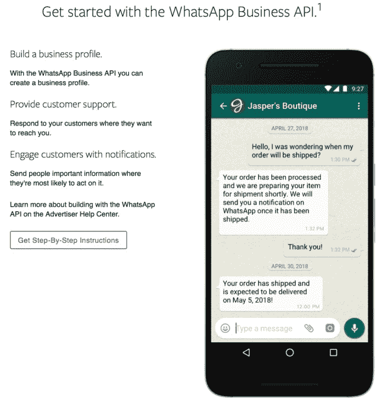

# WhatsApp 最终通过向回复缓慢的商家收费来赚钱

> 原文：<https://web.archive.org/web/https://techcrunch.com/2018/08/01/whatsapp-business-api/>

今天，WhatsApp 推出了其首款创收企业产品，这也是它目前直接从应用中赚钱的唯一方式。WhatsApp 商业应用编程接口[将推出](https://web.archive.org/web/20230307222546/https://blog.whatsapp.com/10000648/Growing-our-Tools-for-Business)，让企业在 24 小时内免费回复用户信息，但之后将按国家对发送的每条信息收取固定费用。

商家仍然只能给最先联系他们的人发信息，但 API 将帮助他们以编程方式发送运输确认、预约提醒或活动门票。客户也可以使用它通过自己的工具或应用程序(如 Zendesk、MessageBird 或 Twilio)手动回复客户服务查询。作为 WhatsApp For Business 应用的 300 万用户之一，小企业仍然可以使用它免费逐个发送迟到的回复。

在 2014 年被脸书以 190 亿美元收购后，拥有 15 亿用户的 WhatsApp 终于到了发挥其影响力并贡献一些收入的时候了。如果脸书能够将 WhatsApp 商业应用编程接口定位为客户服务呼叫中心的廉价替代品，异步聊天的便利性可能会迫使用户给公司发消息，而不是打电话。

只有在用户最后一条信息 24 小时后对缓慢回复收费，才是创造增长反馈循环的天才方式。如果用户通过 WhatsApp 获得快速答案，他们会比其他渠道更喜欢它。一旦企业和他们的客户对它上瘾，WhatsApp 最终可能会对所有回复或任何超过数量阈值的回复收费，或者减少免费窗口。与此同时，企业可能对他们的响应时间过于乐观，最终比他们预期的更频繁地支付费用，尤其是当消息在周末或假期到来时。

WhatsApp 去年 9 月首次宣布将最终对企业服务收费，当时它推出了免费的 WhatsApp For Business 应用程序,该应用程序目前拥有 300 万用户，所有回复都是免费的，即使是迟到的回复。

重要的是，WhatsApp 强调，用户和企业之间的所有消息传递，即使是通过 API，也将是端到端加密的。这与《华盛顿邮报》的报道形成了鲜明对比，该报道称，脸书推动削弱 WhatsApp 商业信息的加密，这在一定程度上是促使前首席执行官简·库姆在 4 月份退出 WhatsApp 和脸书董事会的[。他的联合创始人](https://web.archive.org/web/20230307222546/https://techcrunch.com/2018/04/30/jan-koum-quits-facebook/)[布莱恩·阿克顿早在 9 月份就离开了脸书](https://web.archive.org/web/20230307222546/https://techcrunch.com/2018/02/21/signal-expands-into-the-signal-foundation-with-50m-from-whatsapp-co-founder-brian-acton/)，并向加密信息应用 Signal 的基金会捐赠了 5000 万美元。

今天，WhatsApp 也正式在全球推出其新的展示广告产品。但是别担心，它们不会像 Facebook Messenger 那样被塞进你的聊天收件箱。相反，企业将能够在脸书的 News Feed 上购买广告，启动 WhatsApp 与他们的对话……从而允许他们使用新的商业应用编程接口进行回复。TechCrunch 在去年 9 月抢先一步发现了这一点，当时脸书广告管理器中的[代码显示了点击至 WhatsApp 的广告选项](https://web.archive.org/web/20230307222546/https://techcrunch.com/2017/09/08/whatsapp-ads/)，该公司证实了[广告正在测试中](https://web.archive.org/web/20230307222546/https://techcrunch.com/2017/12/13/click-to-whatsapp-messaging-buttons-are-now-rolling-out-in-facebook-ads/)。脸书早在 2015 年就推出了类似的点击发送广告。

最后，WhatsApp 还告诉 TechCrunch，它计划在其每日用户数为 4.5 亿的 Snapchat Stories 克隆版 Status 中投放广告。“WhatsApp 目前没有在 Status 上运行广告，尽管这代表着我们从 2019 年开始的未来目标。一位发言人告诉我们:“我们将缓慢而谨慎地前进，在我们发布任何广告之前提供更多细节。”。鉴于 WhatsApp 的地位是 Snapchat 的两倍多，它可以通过故事之间的[广告赚取大量收入，特别是如果它愿意制作一些不可错过的](https://web.archive.org/web/20230307222546/https://techcrunch.com/2018/07/27/unskippable-stories-ads/)。

这些广告和 API 将共同取代 WhatsApp 过去在一些国家收取的[每年 1 美元的订阅费](https://web.archive.org/web/20230307222546/https://techcrunch.com/2016/01/18/whatsapp-free-business/)，但该费用已于 2016 年下降。随着脸书自己的收入减速，[引发其股价下跌 20%，市值下降 1200 亿美元](https://web.archive.org/web/20230307222546/https://techcrunch.com/2018/07/25/fallbook/)，它需要展示它有新的赚钱方式——现在比以往任何时候都要多。