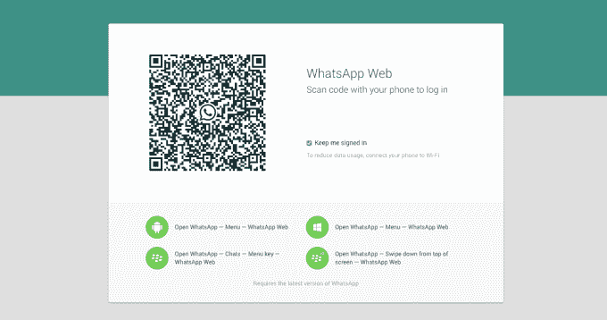
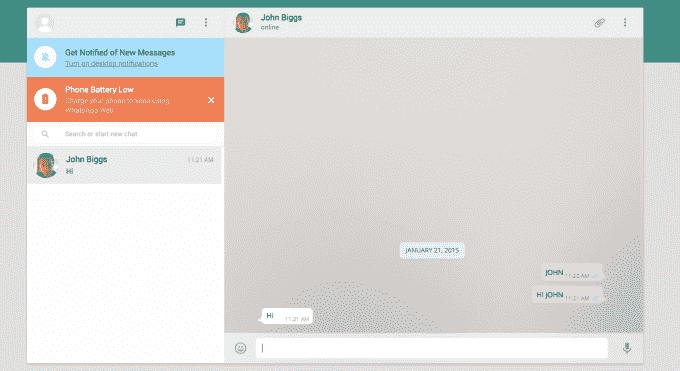

# WhatsApp 来到桌面 

> 原文：<https://web.archive.org/web/https://techcrunch.com/2015/01/21/whatsapp-comes-to-the-desktop/>

# WhatsApp 来到桌面

你是 WhatsApp 上 6 亿人中的一员吗？你是否厌倦了通过手机输入所有信息？好消息！

现在有了桌面版。

这是一个网络应用程序，而不是一个原生客户端——至少现在，它似乎只能与谷歌 Chrome 友好相处。

但是如果你准备好了，你可以在这里找到 WhatsApp [的新网络版……](https://web.archive.org/web/20230130225643/https://web.whatsapp.com/)

一个奇怪的问题是:要在桌面上登录，你必须通过手机上的 WhatsApp 拍摄一张二维码照片。这大概是必要的，因为 WhatsApp 使用的是你的电话号码和短信验证，而不是用户名/密码。这目前在 Android、Windows Phone 和黑莓上有效……但“由于苹果平台的限制”(WhatsApp 的话，在那里——我们不确定他们指的是什么限制)，iOS 用户受到了冷落。

然而，在它工作的平台上，它非常光滑。

奇怪的是，它似乎不仅仅在初次登录时使用你的手机；注意下面截图中的橙色警告。如果你的手机没电了，你的 WhatsApp 网络连接也会没电。

