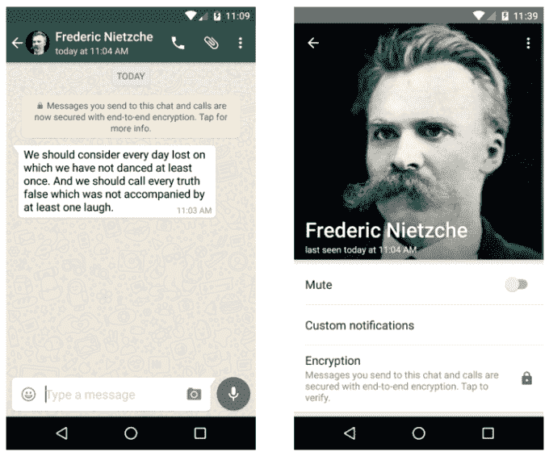

# WhatsApp 完成端到端加密部署

> 原文：<https://web.archive.org/web/https://techcrunch.com/2016/04/05/whatsapp-completes-end-to-end-encryption-rollout/>

这是一个需要大约一年半时间才能完成的安全项目，但通讯巨头 WhatsApp 现在已经在其平台上以及其提供应用程序的所有移动平台上全面实施了强大的端到端加密。

这意味着最新版本的消息应用程序的用户将在默认情况下对他们的通信和媒体进行端到端加密。而且 WhatsApp 用户很多；今年早些时候，这家脸书所有的公司宣布其活跃用户已经突破 10 亿。

据 WhatsApp 发言人称，确保跨平台视频通信是最后一块拼图。

端到端加密意味着通信内容不会以明文形式存储在 WhatsApp 的服务器上。该公司也不能解密用户的信息来访问它们，因为它没有加密密钥。因此，WhatsApp 将无法被迫交出信息数据——即使当局要求获得授权。

鉴于最近[苹果公司和联邦调查局](https://web.archive.org/web/20230315095314/https://techcrunch.com/tag/apple-vs-fbi/)就一部加密 iPhone 展开的高调斗争，WhatsApp 的新闻可能看起来很及时，但该公司实际上自 2013 年以来一直在实施加密，那年美国国家安全局举报者爱德华·斯诺登(Edward Snowden)因披露政府大规模监控项目的范围而引发了一场全球隐私风暴。

次年，WhatsApp 继续与 Open Whisper Systems 合作，并自 2014 年末以来，一直在整合其广受尊重的端到端加密信号协议，特别是[。在今天的一篇博客](https://web.archive.org/web/20230315095314/https://techcrunch.com/2014/11/18/end-to-end-for-everyone/)中，后者开源技术背后的非营利黑客集体证实了 WhatsApp 的实现现在已经完成。

“这包括 Android、iPhone、Windows Phone、诺基亚 S40、诺基亚 S60、黑莓和 BB10 上的聊天、群聊、附件、语音笔记和语音通话，”它写道。“现在，在任何平台上运行最新版本 WhatsApp 的用户，在相互通信时，他们发送的每条消息和拨打的每个 WhatsApp 电话都可以获得完整的端到端加密。”

尽管默认端到端加密的完成对于 WhatsApp 平台来说是一个非常重要的安全里程碑，但这并不意味着从此以后通过该应用发送的每一封通信都是端到端加密的，因为这依赖于所有用户都升级到该软件的最新版本。

但 WhatsApp 客户端现在将通知用户聊天的加密状态，包括在消息屏幕上显示通知，以帮助过渡阶段:

Open Whisper Systems 指出:“最终，所有前 e2e(端到端)功能的客户端都将过期，届时新版本的软件将不再传输或接受任何明文消息。”。

WhatsApp 用户还将能够通过扫描二维码或大声读出数字串来验证加密会话的真实性，从而确认他们正在聊天的人是他们认为的那个人，而不是进行中间人攻击的骗子。

就其本身而言，Open Whisper Systems 表示，它期待着更多的技术推出，并表示将在明年“继续与更多的信使合作”。

该集团还拥有自己的加密信息应用程序 [Signal](https://web.archive.org/web/20230315095314/https://techcrunch.com/2015/03/05/signal-keeps-your-iphone-calls-and-texts-safe-from-government-spies/) ，于去年 3 月推出。尽管如此，现在的问题是爱德华·斯诺登是否会转投 WhatsApp……