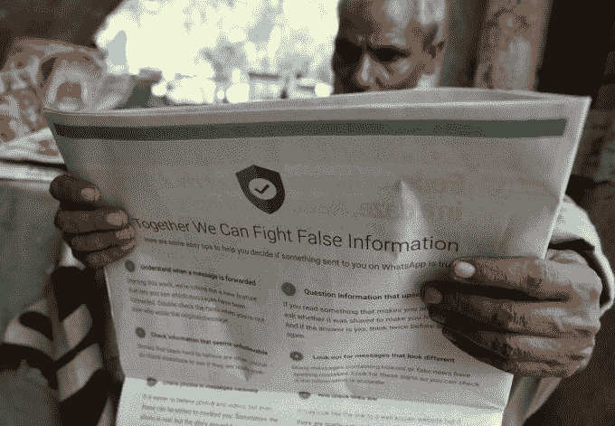

# WhatsApp 在假新闻暴力中冲击印度 Jio 功能手机 

> 原文：<https://web.archive.org/web/https://techcrunch.com/2018/09/10/whatsapp-for-jiophone/>

WhatsApp 上转发的虚假谣言导致愤怒的暴民在印度谋杀陌生人，但脸书拥有的聊天应用程序仍在印度竞相增加用户。今天，它为 JioPhone 1 和 2 的 KaiOS 发布了 WhatsApp 的功能手机版本，旨在支持印度众多本土语言中的 22 种。用户将能够通过端到端加密发送文本、照片、视频和语音信息，尽管它缺乏增强现实和 Snapchat Stories 风格的状态更新等高级功能。

WhatsApp 本应与上个月推出的价格约为 41 美元的 JioPhone 2 一起推出，但[被推迟了](https://web.archive.org/web/20221207071550/https://indianexpress.com/article/technology/mobile-tabs/whatsapp-youtube-will-be-rolled-out-slowly-to-reliance-jiophone-5316986/)。已经售出了 4000 万台 JioPhone 1s，据估计它控制了印度手机市场[27%的](https://web.archive.org/web/20221207071550/https://gadgets.ndtv.com/mobiles/news/jio-phone-sales-q2-2018-market-share-india-4g-feature-phone-1893885)和[47%的](https://web.archive.org/web/20221207071550/https://www.firstpost.com/tech/news-analysis/jiophone-now-leads-with-a-47-percent-market-share-among-feature-phones-report-4822621.html)功能手机市场。随着 WhatsApp 努力使其 15 亿用户数[朝着 20 亿的里程碑](https://web.archive.org/web/20221207071550/https://techcrunch.com/2018/01/31/whatsapp-hits-1-5-billion-monthly-users-19b-not-so-bad/)增长，加入 JioPhone 应该会为 WhatsApp 开辟一个新的巨大增长载体。与此同时，这可能会让信实集团旗下的 Jio 移动网络更具吸引力。它还可以增强 KaiOS 操作系统，该系统由圣地亚哥的一家同名初创公司开发，该公司最近从谷歌获得了 2200 万美元的投资。WhatsApp 今天在 JioPhone AppStore 上推出，应该会在 9 月 20 日对所有人开放。companu 没有透露该应用程序是否会应用到诺基亚和阿尔卡特生产的其他 KaiOS 设备上。

脸书已经开始挤压 WhatsApp，用克里斯丹尼尔斯(Chris Daniels)取代了离开的联合创始人，丹尼尔斯曾负责 Internet.org 和免费基础无障碍倡议(Free Basics accessibility initiative)，该倡议因网络中立性问题被踢出印度。这对于他现在负责 WhatsApp 在印度的高风险/高回报业务来说不是一个好兆头。这个庞大的国家是这款聊天应用增长战略的核心，但它引发的攻击已经让它失去了印度的民心。

WhatsApp 已紧急保护其应用程序，此前有大量报道称，其应用程序上流传的关于帮派和绑架儿童的谣言导致愤怒的暴徒在街上杀人。BuzzFeed 报道最近，五名游牧民在 Rainpada 农村被殴打致死，原因是当地居民观看了 WhatsApp 转发的关于绑架者可能在该地区出没的不准确视频。

这张照片说明了 2018 年 7 月 10 日在新德里，一名印度报纸供应商正在阅读一份报纸，上面有 WhatsApp 的完整封底广告，旨在反击虚假信息。–7 月 10 日，脸书旗下的消息服务 WhatsApp 在印度日报上刊登了整版广告，以反击引发全国民众私刑袭击的虚假信息。(图片由 Prakash SINGH / AFP 提供)(图片来源应为 PRAKASH SINGH/AFP/Getty Images)

WhatsApp 最近[限制了你可以向](https://web.archive.org/web/20221207071550/https://techcrunch.com/2018/07/19/whatsapp-limits-message-forwarding/)转发消息的人数，给转发的消息贴上标签，并在 46 个印度电台开始了一场[印地语的广播公益广告活动](https://web.archive.org/web/20221207071550/https://timesofindia.indiatimes.com/india/whatsapp-kicks-off-radio-campaigns-in-india-to-tackle-fake-news/articleshow/65596204.cms)，警告人们在采取行动之前核实他们在 WhatsApp 上听到的事情。

“暴徒暴力的挑战需要政府、公民社会和技术公司采取行动。这就是为什么 WhatsApp 在印度通过广播发起了广泛的用户教育活动，并与 Jio 合作，教育新用户了解错误信息，”WhatsApp 的一位发言人告诉我。“WhatsApp 是作为短信服务的替代品而开发的，我们认为人们应该能够跨境给自己的爱人发短信，而不必为此支付高昂的费用。”

但很明显，母公司脸书将推广 WhatsApp 视为其使命的一部分，以使世界更加紧密，即使这需要付出代价。政府已经敦促 WhatsApp 为其加密建立变通办法，以识别谣言和错误信息视频的来源。但 WhatsApp 的一位发言人告诉 BuzzFeed News，“我们认为，在 WhatsApp 中建立‘可追溯性’将破坏端到端加密和 WhatsApp 的私有性质，从而造成严重滥用的可能性。。。我们不会削弱我们提供的隐私保护。”

Jio 的“过渡”手机提供一些第三方应用程序，但不具备成熟的智能手机功能，加上其经济实惠的移动数据，大大降低了在印度上网的成本和摩擦。但随着这种访问而来的是新发现的危险，特别是如果不结合新闻素养和数字技能教育，可以帮助用户在引发暴力之前发现虚假信息。对 Jio 功能手机感兴趣的低收入用户可能更难接受教育，不要相信他们在 WhatsApp 上看到的一切。曾经是智能手机的问题正在变成每部手机的问题。

科技界越来越认识到，将人们连接到互联网也意味着将他们连接到人性中最糟糕的部分。这将需要新一波悲观主义者和愤世嫉俗者作为产品经理，以便预测和阻止滥用软件的方式，而不是允许理想主义者盲目地制造可以武器化的工具。