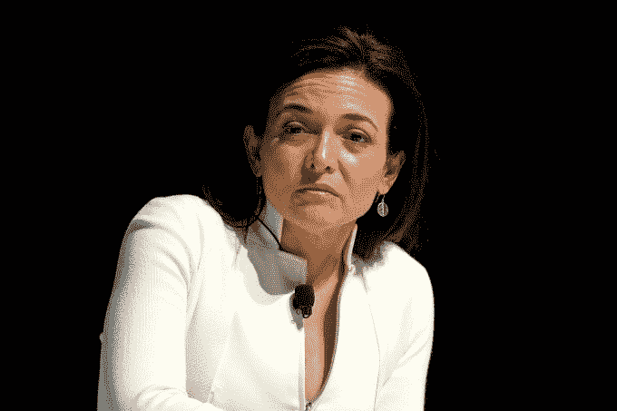

# WhatsApp 创始人 Brian Acton 表示，脸书利用他让其收购通过了欧盟监管机构 

> 原文：<https://web.archive.org/web/https://techcrunch.com/2018/09/26/whatsapp-founder-brian-acton-says-facebook-used-him-to-get-its-acquisition-past-eu-regulators/>

WhatsApp 创始人布莱恩·阿克顿(Brian Acton)一年前离开脸书，在公开表示支持[#删除 Facebook 运动](https://web.archive.org/web/20230210023010/https://techcrunch.com/2018/03/20/after-selling-his-company-to-facebook-for-19-billion-brian-acton-joins-deletefacebook/)(并捐赠[5000 万美元给替代加密消息应用 Signal](https://web.archive.org/web/20230210023010/https://techcrunch.com/2018/02/21/signal-expands-into-the-signal-foundation-with-50m-from-whatsapp-co-founder-brian-acton/) )之前，他在接受[福布斯](https://web.archive.org/web/20230210023010/https://www.forbes.com/sites/parmyolson/2018/09/26/exclusive-whatsapp-cofounder-brian-acton-gives-the-inside-story-on-deletefacebook-and-why-he-left-850-million-behind/)采访时深入探讨了他激烈离职背后的道德冲突。

以及没有像[联合创始人简·库姆](https://web.archive.org/web/20230210023010/https://techcrunch.com/2018/04/30/jan-koum-quits-facebook/)那样，将价值 8 . 5 亿美元的未归属股票留在桌面上，让它在扎克伯格的母舰里多呆几个月。(不过，收集气冷式保时捷肯定是一项昂贵的爱好。)

阿克顿还暗示，他被脸书利用，帮助其 2014 年收购 WhatsApp 的交易通过了欧盟监管机构的审查，欧盟监管机构曾担心该交易可能会将账户关联起来——正如它后来所做的那样。

## “你的意思是赚不了那么多钱”

WhatsApp 创始人离开脸书可以归结为一个分歧，即如何利用他们在门洛帕克的著名“反广告”信息平台赚钱。

尽管这两个人曾经想象过他们的平台在广告巨头脸书的控制下会是安全的，但这仍然是科技界最大的无法解释的脑残之一。或者他们只是在想脸书付给他们的数十亿美元。

阿克顿表示，他试图推动脸书为 WhatsApp 建立一个替代的、对隐私不那么敌对的商业模式——建议一种计量用户模式，比如在一定数量的免费信息用完之后，收取十分之一便士的费用。

但这个“非常简单的生意”的想法被脸书·首席运营官·雪莉·桑德伯格断然拒绝，他说他告诉他“它不会扩展”。

“有一次我叫她出去，”阿克顿还告诉福布斯。“我当时想，‘不，你不是说它不会扩展。“你的意思是它赚不了那么多钱……”她有点吞吞吐吐。我们继续前进。我想我已经表达了我的观点…他们是商人，他们是优秀的商人。它们只是代表了一套商业惯例、原则和道德，以及我不一定赞同的政策。”

法国戛纳——6 月 22 日:脸书首席运营官雪莉·桑德伯格出席 2017 年 6 月 22 日在法国戛纳举行的 2017 年戛纳国际电影节。(照片由 Antoine Antoniol/Getty Images 为戛纳国际电影节拍摄)

尽管如此，阿克顿和库姆似乎对脸书管理层在商业“原则和道德”上即将发生的冲突有很大的暗示，因为他们的合同中有一项条款，如果公司未经他们同意就开始“实施货币化计划”，他们可以立即获得所有股票。

因此，随着他的想法被积极拒绝，随着脸书加大对“产品组”的货币化压力(阿克顿说扎克伯格就是这样看待 WhatsApp 的)，他认为他看到了一条既能套现又能脱身的路线——通过在合同条款中打电话。

不过，脸书有其他想法。公司律师告诉他，该条款还不适用，因为它只是“探索”，还没有实施货币化。在一次关于这个问题的会议上，他说扎克伯格还告诉他:“这可能是你最后一次和我说话了。”所以事情大概变得很冷。

脸书最初以 190 亿美元收购 WhatsApp 的交易是在 2014 年的一个周末仓促完成的，阿克顿表示，当时几乎没有时间审查货币化条款等关键细节。

但没有对此进行尽职调查显然让他损失了第二笔可观的个人财富。

尽管如此，面对更多令人不安的冷场会议，以及为获得未归属股票而进行的法律斗争，阿克顿说，他决定拿着已经获得的奖金离开。

他甚至拒绝了另一个提议的解决方案(没有具体说明是什么)，称脸书管理层希望在其中加入一项保密协议，“这是我在试图与这些人解决问题时临阵退缩的部分原因”。

“最终，我卖掉了我的公司。我是个叛徒。我承认，”他还告诉福布斯，表明他不是没有意识到，一个人通过出卖自己的原则和用户，然后试图从他出售的广告技术巨头那里获得更多现金，变得非常非常富有的前景可能不会太好。

至少这样他可以说，他花了 8.5 亿美元理了个发，以示他“在乎”。

在[8 月](https://web.archive.org/web/20230210023010/https://www.wsj.com/articles/facebooks-new-message-to-whatsapp-make-money-1533139325?mod=rss_Technology)日，脸书证实，从明年开始，它将真正开始在 WhatsApp 的状态中注入广告——这是它从 Snapchat 克隆的多媒体蒙太奇故事格式被植入平台的地方。

因此，WhatsApp 的 15 亿多月用户在尝试向朋友和家人发送信息时，可能会受到不受欢迎的侵扰。

脸书到底会如何“鼓励”WhatsApp 用户关注它打算利用的营销噪音，还有待观察。但是调整使雕像更加突出/不可避免看起来很有可能。毕竟，脸书是设计[黑暗图案](https://web.archive.org/web/20230210023010/https://techcrunch.com/2018/07/01/wtf-is-dark-pattern-design/)的大师。

该公司还将向通过 WhatsApp 平台从潜在客户那里收到信息的企业收取费用——根据国家的不同，费用在 0.5 美分至 9 美分之间。

因此，在某种程度上，它采用了阿克顿的“计量模型”的建议——只是以一种方式“缩放”桑德伯格寻求的“loadsamoney”风格的底线。

当然，随着脸书将其广告模式强加到一个全新的不情愿的平台上，阿克顿和库姆都不会在股票上涨中获利。

## “我认为每个人都在赌博…因为足够的时间已经过去了”

在这次采访中，或许最能说明问题的是，阿克顿透露，甚至在 WhatsApp 的收购案获得批准之前，他就受到了脸书的精心指导，告诉欧洲监管机构，将 WhatsApp 和脸书的用户数据结合起来“真的很难”。

“有人指导我解释说，在两个系统之间合并或混合数据是非常困难的，”阿克顿说。

一个“不可能的结合”，脸书随后奇迹般地实现了，就在两年后[，它后来因在最初的申请中提供不正确或误导性的信息而被欧盟委员会](https://web.archive.org/web/20230210023010/https://techcrunch.com/2016/08/25/whatsapp-to-share-user-data-with-facebook-for-ad-targeting-heres-how-to-opt-out/)[罚款 1 . 22 亿美元。(脸书坚持认为是无意的“错误”造成的。)](https://web.archive.org/web/20230210023010/https://techcrunch.com/2017/05/18/facebook-fined-122m-in-europe-over-misleading-whatsapp-filing/)

收购获得批准后，阿克顿表示，他后来了解到，在脸书的其他地方，确实有“计划和技术来混合这两种服务之间的数据”——具体来说，它可以使用分配给每部手机的 128 位数字串来连接 WhatsApp 和脸书的用户账户。

电话号码匹配是另一种用于链接账户的方法——与母公司共享 WhatsApp 用户的电话号码是通过 2016 年更新 WhatsApp 的条款和条件推给用户的一项变化。

(尽管脸书出于广告定位目的将 WhatsApp 和脸书账户链接在欧洲仍处于暂停状态，但在监管推后之后。)

“我认为每个人都在赌博，因为他们认为欧盟可能已经忘记了，因为已经过去了足够长的时间，”他还在提到脸书推进账户匹配时表示，尽管他已经告诉欧洲监管机构这不可能做到。

监管者没有忘记。但是 1 . 22 亿美元的罚款对于像脸书这样收入巨大的公司来说并不是一个相称的抑制因素(它在 T2 赚了 132 . 3 亿美元，在 Q2 赚了 132 . 3 亿美元)。因此可以将罚款作为另一项标准业务成本。

阿克顿说，脸书还寻求在新的服务条款下对 WhatsApp 用户数据的“更广泛的权利”——并声称他和库姆进行了反击，并与脸书管理层达成了妥协。

“妥协”是关于“没有广告”的条款将会保留——但脸书将会把账户与脸书上的 power friend 建议联系起来，并为其广告合作伙伴在脸书上提供更好的广告目标。所以实际上他们只是为自己(和他们的用户)多争取了一点时间。

当然，现在两位创始人都离开了公司，脸书可以自由地删除无广告条款，并使用已经关联的账户进行双向广告定位(不仅仅是针对脸书用户)。

如果阿克顿和库姆真的认为他们可以阻止广告技术的终结，那他们就太天真了。同样，最有可能的是，他们只是平衡了他们得到的数十亿美元和那个结果，然后想了 2x(耸肩表情符号)。

脸书推动 WhatsApp 货币化的速度比其创始人完全满意的速度更快，这似乎与它自己的担忧有关，即需要通过能够显示持续增长来取悦投资者。

脸书最近的 [Q2](https://web.archive.org/web/20230210023010/https://techcrunch.com/2018/07/25/facebook-q2-2018-earnings/) 表现不佳，其股票受到用户增长放缓的影响。

收购 WhatsApp 三年后，阿克顿表示，扎克伯格越来越不耐烦了——他回忆道，他在一次 WhatsApp 员工全体会议上说，脸书需要 WhatsApp 的收入继续向华尔街显示增长。

在内部，阿克顿表示，脸书的目标是在 WhatsApp 货币化的五年内实现 100 亿美元的收入增长率——他认为这个数字听起来太高了，因此必须依赖广告。

因此，在一年左右的时间里，阿克顿就出局了——个人而言，他本可以成为超级富豪。但绝对不要为他哭泣。他做得很好。

在阿克顿现在工作的 Signal Foundation，他说目标是让“私人通信变得可及和无处不在”。

尽管另一个 e2e 加密应用只有数百万用户，而 WhatsApp 和脸书有数十亿用户。但至少它背后有阿克顿 5000 万美元的个人财富。