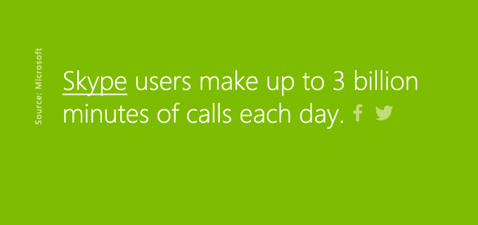

# WhatsApp 每天点击 1 亿次

> 原文：<https://web.archive.org/web/https://techcrunch.com/2016/06/24/whatsapp-hits-100-million-calls-per-day/>

# WhatsApp 每天点击 1 亿次

今年 2 月，脸书旗下的 WhatsApp 宣布其全球用户数已经达到 10 亿，本周，该公司又增加了一项指标来证明其持续的吸引力和增长。根据公司博客上[的一篇简短帖子](https://web.archive.org/web/20230302002041/https://blog.whatsapp.com/10000625/WhatsApp-Calling-100-million-conversations-every-day)，WhatsApp 声称其服务现在每天处理超过 1 亿次语音通话。

该帖子补充道，这相当于每秒钟超过 1100 个电话，暗示它将在未来几个月内使通话变得更好。(该公司在今年春天被[发现](https://web.archive.org/web/20230302002041/http://www.fonearena.com/blog/184795/whatsapp-video-call-starts-appearing-in-latest-beta-for-android.html)测试视频通话。)

值得注意的是，对于 WhatsApp 来说，语音通话仍然是一个相对较新的功能。该公司于 2015 年 3 月在 Android 上推出了这一功能，并在随后的一个月将其引入 iOS。当时，WhatsApp 拥有 8 亿月活跃用户，并称其处理的短信数量超过了全球每天发送的短信数量。

包括脸书即时通讯服务 Messenger 在内的竞争对手并没有以完全相同的方式公布语音通话的里程碑，这使得直接比较变得更加困难。

例如，微软 12 岁的 Skype 说，它的用户每天打 30 亿分钟的电话。这是一个更大的数字，但它是计算通话时间，而不是实际通话时间，就像 WhatsApp 正在做的那样。微软还在今年的 BUILD 大会上表示，该软件每月有超过 3 亿用户使用。

与此同时，脸书今年 4 月宣布其用户已经达到 9 亿。去年春天，它还指出 [Messenger 占*移动*全球 VOIP 的 10%。由于 Skype 用户也可以在桌面上打电话，因此将它的数据与 Skype 进行比较也很困难。](https://web.archive.org/web/20230302002041/https://techcrunch.com/2015/04/22/facebook-voip-not-facebook-phone/)

[公司最近表示](https://web.archive.org/web/20230302002041/https://techcrunch.com/2016/04/27/facediction/)用户每天花在脸书、Instagram 和 Messenger 上的时间加起来超过 50 分钟，但不包括 WhatsApp。