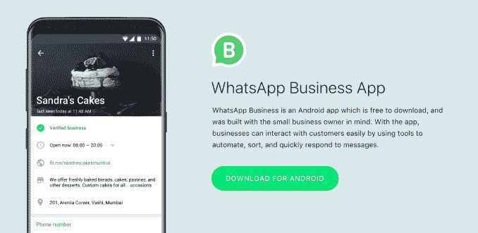
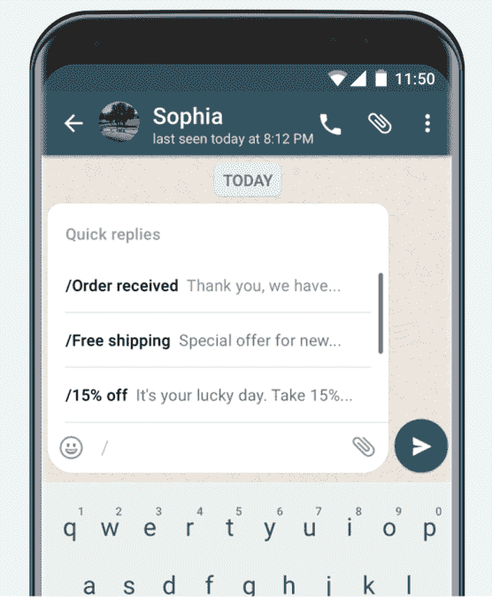

# WhatsApp 在特定市场正式推出其商业应用

> 原文：<https://web.archive.org/web/https://techcrunch.com/2018/01/18/whatsapp-officially-launches-its-app-for-businesses-in-select-markets/>

WhatsApp 今天正式[推出](https://web.archive.org/web/20230304205109/https://blog.whatsapp.com/)其新的 [WhatsApp 商业应用](https://web.archive.org/web/20230304205109/https://play.google.com/store/apps/details?id=com.whatsapp.w4b)在包括印尼、意大利、墨西哥、英国和美国在内的选定市场，先于其计划的全球推广。针对商业客户的业务简介和新消息工具的增加是该公司[更广泛计划的一部分，该计划通过向大型企业收取先进工具的费用来产生收入](https://web.archive.org/web/20230304205109/https://techcrunch.com/2017/09/05/whatsapp-business-app/)，这些工具用于在全球超过 10 亿人使用的平台上与客户沟通。

WhatsApp 商业应用是这个市场的最初入口。

这款免费应用面向小型企业，目前仅限于 Android，帮助企业更好地与客户联系，并在 WhatsApp 的服务上建立官方形象。本质上，它是脸书页面的 WhatsApp 版本。

该公司此前曾宣布该应用的到来，并在 2017 年 9 月开始验证商业账户，作为其 WhatsApp 商业试点计划[的一部分。经过验证的账户会被打上一个绿色的勾号，以证明其真实性。](https://web.archive.org/web/20230304205109/https://techcrunch.com/2017/09/05/whatsapp-business-app/)

随着新的 WhatsApp 商业应用程序今天发布，小公司可以通过填写业务描述、电子邮件、地址和网站等信息来建立自己的 WhatsApp 商业档案。

WhatsApp 表示，人们会知道他们在和一家企业交谈，因为这些账户将被列为“企业账户”。随着时间的推移，在 WhatsApp 验证其注册的账户电话号码与业务电话号码匹配后，其中一些账户将成为“确认账户”。

一旦在 WhatsApp 网络上建立起来，企业就可以使用该应用程序提供的一系列工具，比如智能通讯工具，这些工具提供的技术类似于你今天在 Facebook Messenger 中找到的技术。

例如，该应用程序提供“快速回复”，为客户的常见问题提供快速回答；向客户介绍业务的“问候信息”；和“离开信息”，让客户知道你很忙。

企业还将能够访问信息统计，如阅读的信息数量，他们可以通过 WhatsApp Web 从桌面发送和接收信息。

虽然企业将需要使用这款新应用与客户沟通，但对于普通 WhatsApp 用户来说，没有什么变化。他们将能够向企业发送消息，但可以通过阻止号码和企业以及报告垃圾邮件来控制他们的体验。

此外，企业将只能联系那些提供了电话号码并同意接收来自企业的信息的人，该公司[此前曾表示](https://web.archive.org/web/20230304205109/https://techcrunch.com/2017/09/05/whatsapp-business-app/)。

WhatsApp 去年秋天曾表示，该商业应用程序随后将加入一个针对拥有全球客户群的大型企业的企业解决方案——如航空公司、电子商务网站和银行。它今天没有宣布任何关于这个解决方案的消息，但在过去[该公司表示将对这些企业工具](https://web.archive.org/web/20230304205109/https://www.wsj.com/articles/facebook-tees-up-whatsapp-to-make-money-1504609201)收费。据推测，它们将建立在当前 WhatsApp 业务核心产品的基础上。

[gallery ids="1588259，1588260，1588258，1588257"]

该公司今天还表示，满足企业对其服务的需求是多么重要，其服务目前已有 13 亿用户。根据它从 Morning Consult 的研究中引用的数据，超过 80%的印度和巴西小企业表示，WhatsApp 帮助他们与客户沟通并发展业务。

当被问及 WhatsApp 目前有多少商家在其应用上活跃时，WhatsApp 拒绝透露。

发布时， [WhatsApp 业务](https://web.archive.org/web/20230304205109/https://www.whatsapp.com/business)在受支持的市场中可以在 Google Play 上免费下载。WhatsApp 没有透露这款商业应用将在“未来几周”之后向全球市场推出的预计时间，也没有透露 iOS 版本何时到来。

然而，该公司向我们证实，尽管在对 WhatsApp 使用频繁的企业进行研究后，它优先考虑了 Android，但它确实计划在未来支持其他平台。