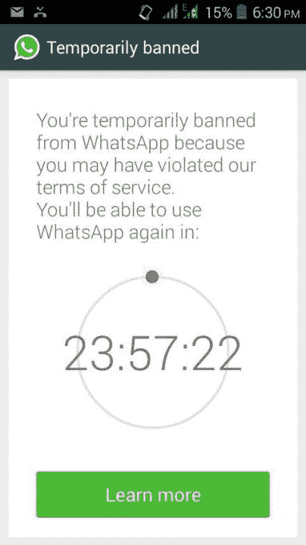

# WhatsApp 表示，不会“永久”禁止用户使用其服务，只是屏蔽第三方客户端

> 原文：<https://web.archive.org/web/https://techcrunch.com/2015/03/06/whatsapp-says-its-not-permanently-banning-users-from-its-service-just-blocking-third-party-clients/>

相当多的[少数](https://web.archive.org/web/20230109123438/http://www.cultofandroid.com/72184/use-third-party-whatsapp-client-banned-life/) [报道](https://web.archive.org/web/20230109123438/http://androidcommunity.com/whatsapp-issues-permanent-ban-on-users-with-3rd-party-apps-20150306/) [盘旋](https://web.archive.org/web/20230109123438/http://www.mobiflip.de/whatsapp-erste-dauersperren-nutzer-clients/)[网络](https://web.archive.org/web/20230109123438/http://www.theinquirer.net/inquirer/news/2391417/whatsapp-slaps-unoffical-app-users-with-24-hour-ban)本周似乎表明 WhatsApp 对使用第三方 WhatsApp 客户端应用的政策收紧。也就是说，有消息称，那些使用非官方应用的人将被终身禁止使用 WhatsApp。然而，WhatsApp 解释说，事实并非如此。事实上，自从今年早些时候我们上一次报道这家现已归脸书所有的公司打击第三方应用以来，并没有更大的政策转变。

你可能还记得，今年 1 月， [WhatsApp 开始禁止用户](https://web.archive.org/web/20230109123438/https://techcrunch.com/2015/01/21/whatsapp-cracks-down-on-third-party-apps-temporarily-bans-their-users-from-its-service/)使用其服务，因为他们被发现使用第三方(非官方)WhatsApp 移动应用。为了被允许重新进入 WhatsApp，用户被要求从手机上卸载违规应用，然后从应用商店下载 WhatsApp 的授权版本。该公司还通过其网站上的常见问题解答解释了这一政策。

当时，一个受欢迎的应用程序制造商甚至报告收到了 WhatsApp 关于其服务开发的停止令。

该公司解释说，镇压的原因与安全和隐私有关。鉴于 WhatsApp 并不控制这些应用的源代码，它根本不能保证这些应用是安全的。

这是当今许多移动应用程序制造商面临的挑战之一，因为未能限制第三方应用程序的使用可能会导致灾难性的后果——正如 Snapchat 去年发现其用户被黑客攻击一样。这一事件被称为“快照打开”，是由于第三方应用程序的不安全性造成的。

本周与 WhatsApp 对第三方客户端的政策有关的混乱似乎源于 WhatsApp+的开发者在[的一篇 Google+帖子，他在帖子中表示，WhatsApp 最近已经开始了*“永久账户禁用”*。这篇文章被一个德国博客](https://web.archive.org/web/20230109123438/https://plus.google.com/+OsmDroidNetT/posts/JWny1phevKZ)[转载，然后随着其他网站重复这个故事，细节(在某些情况下)变得模糊不清。](https://web.archive.org/web/20230109123438/http://www.mobiflip.de/whatsapp-erste-dauersperren-nutzer-clients/)

问题在于，围绕“终身禁令”这一术语存在混乱这听起来好像用户被永远禁止使用 WhatsApp，但事实并非如此。

相反，与之前相同的政策仍然有效:如果用户继续使用 WhatsApp+(或另一个第三方应用)，他们将无法再使用 WhatsApp，正如该公司此前解释的那样。

可能发生的变化是，以前该公司发布 24 小时“临时”禁令，并向受影响的用户显示倒计时定时器，但现在这些用户根本无法使用 WhatsApp 的服务，直到第三方应用程序被卸载。[ **更新**:已经提供了一些关于如何工作的额外确认。如果 WhatsApp 不止一次警告用户，他们可能看不到 24 小时时钟。但是在卸载 WhatsApp+之后，他们应该可以在几天之内使用 WhatsApp。]

“如果用户不卸载 WhatsApp+,那么他们将继续被禁止，直到他们停止使用它。但没有永久禁令，”WhatsApp 发言人证实。

换句话说，一旦用户从智能手机上移除 WhatsApp+、WhatsApp Reborn、OgWhatsapp 或任何其他第三方客户端，他们将再次能够使用 WhatsApp 官方应用程序——就像以前一样。他们的账户和相关的电话号码并没有被 WhatsApp“永久”或“终身”禁止。