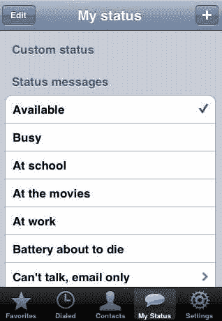
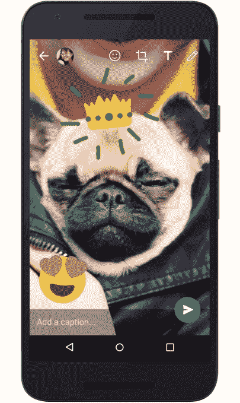

# WhatsApp 推出加密 Snapchat Stories 克隆版 Status 

> 原文：<https://web.archive.org/web/https://techcrunch.com/2017/02/20/whatsapp-status/>

WhatsApp 今天发布了 WhatsApp Status ，这可能会给 Snapchat 的国际增长踩刹车，这是一个用于分享装饰照片、视频和 gif 的新标签，这些照片、视频和 gif 会在 24 小时后消失。这是脸书旗下的 Snapchat Stories 的又一个翻版，但不同的是，它像 WhatsApp 消息一样是端到端加密的。

WhatsApp [在 11 月为 beta 用户](https://web.archive.org/web/20230317215258/https://techcrunch.com/2016/11/05/whatsapp-is-testing-a-clone-of-snapchat-stories-called-status/)测试了该功能，现在状态标签正在全球范围内在 [iOS](https://web.archive.org/web/20230317215258/https://itunes.apple.com/us/app/whatsapp-messenger/id310633997?mt=8) 、 [Android](https://web.archive.org/web/20230317215258/https://play.google.com/store/apps/details?id=com.whatsapp&hl=en) 和 [Windows Phone](https://web.archive.org/web/20230317215258/https://www.microsoft.com/en-us/store/p/whatsapp/9wzdncrdfwbs) 上推出。用户可以观看朋友的更新，私下回复，拍摄照片，用图片和说明装饰照片，并通过持久的隐私设置将他们的作品发送给他们选择的所有联系人。向特定的朋友发送媒体仍然是通过消息线程完成的。

地位也可能为 WhatsApp 打开新的广告机会。如果它效仿 Snap 和 Instagram，它可以在朋友状态之间插入全屏广告。

新的状态功能取代了 WhatsApp 旧的 AOL 即时通讯风格的离开消息。这实际上是 WhatsApp 在 8 年前推出时的唯一功能。

新的 WhatsApp 状态取代了旧的我的状态功能

首席执行官简·库姆写道:“这个项目背后的最初想法是建立一个应用程序，让你的朋友和其他联系人知道你在做什么。”。但该公司告诉我，它看到这么多人快速更新这些状态以进行实时交流，所以它转向聊天，但总是保持离开状态。

现在 WhatsApp 拥有 12 亿月活用户，用户每天发送 600 亿条消息，包括 33 亿张照片、7.6 亿段视频和 8000 万张 gif。WhatsApp 正在利用这一成功将消息传递带回广播社交媒体，这可能会给 Snapchat 带来麻烦。如果 WhatsApp 的地位起飞，可能会阻碍 Snap 在用户生成内容方面的全球增长机会，迫使它依赖于从现有用户身上榨取更多现金，或从硬件或专业内容中赚取更多收入。

WhatsApp 的新相机创意工具

Instagram Stories 现在拥有超过 1.5 亿的每日用户，它展示了一个足够好的 Snapchat 克隆可以多么吸引人。据分析提供商和社交名人经理称，TechCrunch 首先报道 Instagram Stories 正在[窃取 Snapchat 的使用量](https://web.archive.org/web/20230317215258/https://techcrunch.com/2017/01/30/attack-of-the-clone/)并降低其浏览量。Snap 的 IPO 文件显示，其用户增长率从 Instagram Stories 推出前的 2016 年 Q2 的 17.2%大幅下降到第四季度的 3.2%，下降了 82%。

Instagram 很大胆，把故事放在了它的主标签上，而 WhatsApp 把状态放在了一个单独的标签上。但 Status 有机会将故事幻灯片格式推广到南美、东欧和发展中国家的部分地区，Snapchat 在这些地区还没有强大的吸引力。如果这些用户不在 Snapchat 上，他们甚至不会看到克隆状态。

WhatsApp 被定位为简洁实用的聊天工具，而 Facebook Messenger 则展示了所有的花哨功能。但去年年底，WhatsApp 推出了额外的摄像头功能，以适应视觉通信时代。现在的问题是，WhatsApp 能否在不稀释其核心产品的情况下，在国外分一杯羹 Snapchat 的午餐。