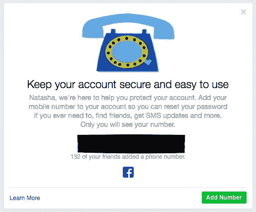
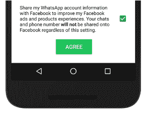

# WhatsApp 将与脸书分享用户数据，用于广告定位——以下是如何退出的方法

> 原文：<https://web.archive.org/web/https://techcrunch.com/2016/08/25/whatsapp-to-share-user-data-with-facebook-for-ad-targeting-heres-how-to-opt-out/>

脸书旗下的通讯巨头 WhatsApp 宣布对其隐私政策进行重大调整，一旦用户接受其新的隐私政策，WhatsApp 将开始与母公司分享一些用户数据，包括在后一项服务中用于广告定位目的。

“通过与脸书进行更多的协调，我们将能够做一些事情，比如跟踪人们使用我们服务的频率，并更好地打击 WhatsApp 上的垃圾邮件，”WhatsApp 今天在[博客](https://web.archive.org/web/20230403120046/https://blog.whatsapp.com/)中就这一变化写道。

“如果你有他们的账户，脸书可以提供更好的朋友推荐，并给你展示更多相关的广告。例如，你可能会看到一个已经合作过的公司的广告，而不是一个你从未听说过的公司的广告。

WhatsApp 还将与“脸书公司家族”共享数据——因此，据推测，其用户数据也可能被馈送给虚拟现实公司 Oculus Rift(Fb 的另一项收购)和照片共享网络 Instagram。

根据新的条款和条件，WhatsApp 的数据将被共享，包括用户用来验证其账户的电话号码，以及他们上次使用该服务的时间。

两个数据都在那里，令人毛骨悚然，这是“你不愿意交给数据挖掘技术巨头的个人情报”。

你可以在这里阅读 WhatsApp [隐私政策全文](https://web.archive.org/web/20230403120046/https://www.whatsapp.com/legal/#privacy-policy)。

有一个选项可以选择退出一些数据共享(特别是为了广告和产品目的)——更多细节请参见这篇文章的下部——尽管大多数用户只会点击“我同意”WhatsApp 的新条款和条件，而不会阅读它们，也不会意识到他们同意什么。

这就是为什么，正如我们之前所说的， [T & Cs 吸](https://web.archive.org/web/20230403120046/https://techcrunch.com/2015/08/21/agree-to-disagree/)。为什么用户同意像这样的大规模隐私转移当然不应该默认选择人们。

## **隐私 vs 数据**

对于一个通常以支持用户隐私为荣的服务来说，这无疑是一个巨大的进步，包括今年早些时候完成了整个服务的端到端加密部署，并继续与当局移交用户数据的要求作斗争。

但是，当 WhatsApp 同意被数据挖掘社交网络巨头脸书收购时，回到 2014 年 2 月(T0)日(T1)，任何支持隐私的立场都可以说是板上钉钉了。

脸书的业务是通过收集用户的个人数据，通过基于兴趣的广告来赚钱。WhatsApp 最初的商业模式是向用户收取小额的无广告信息服务年费，但在脸书接管这项服务后，这种模式被叫停了。

今年 1 月，1 美元的年费在[被取消，但是 WhatsApp 仍然没有替代的商业模式——考虑到其反广告的立场，尽管它正在为](https://web.archive.org/web/20230403120046/https://techcrunch.com/2016/01/18/whatsapp-free-business/)[开放商业账户](https://web.archive.org/web/20230403120046/https://techcrunch.com/2016/08/25/whatsapp-plans-to-let-businesses-on-to-its-service-before-the-end-of-the-year/)做准备。在新的 T & Cs 下，它将与脸书共享的英特尔技术可能会被用于推进其在那里的计划。

在收购时，脸书表示，尽管与自己的 Facebook Messenger 应用程序有一些明显的重叠，但它将保持这个消息巨头的独立。

而 WhatsApp 创始人简·库姆[声称](https://web.archive.org/web/20230403120046/https://blog.whatsapp.com/499/Facebook)不会有任何变化。“对你，我们的用户来说，什么都不会改变。他当时写道:“WhatsApp 将保持自主和独立运营，如果我们不得不在核心原则上妥协，我们两家公司之间就不会有合作伙伴关系，这些原则将永远定义我们的公司、我们的愿景和我们的产品。”

几年后，一个核心原则——隐私——如果不是完全妥协，至少也有所松动，因为脸书现在可以将自己的社交服务用户与 WhatsApp 用户联系起来。它还将能够跟踪其服务的相对使用情况与消息应用程序上的活动，因为 WhatsApp 通过“上次使用”信号向其提供参与信息。

从 WhatsApp 的博客文章中还不清楚其他用户数据是否会与脸书共享。措辞表明这是完全可能的，尽管如果用户已经更新到最新版本的应用程序，该应用程序对所有内容进行端到端加密，那么他们的消息内容至少不能被共享，只要他们发送消息的人也更新了。

WhatsApp 在其博客文章中也提出了这一点，指出:“当你的信息被端到端加密时，只有你与之通信的人才能阅读它们——而不是 WhatsApp、脸书或其他任何人。”

但这似乎忽略了让脸书对两个大型服务的用户进行三角测量的要点，每个服务都有超过 10 亿的活跃用户。两种不同服务之间边界的崩溃是否会引起欧洲数据保护监管机构的注意还有待观察，欧洲有更严格的隐私规则，脸书已经面临多项数据保护相关的调查和法律诉讼——而[继续这样做](https://web.archive.org/web/20230403120046/https://techcrunch.com/2016/06/13/us-government-wants-to-step-into-european-facebook-privacy-legal-challenge/)。

我们已经要求 WhatsApp 提供一份全面的清单，列出它打算与脸书分享的所有内容，以及脸书打算对它将收到的 WhatsApp 用户及其使用该服务的数据做的所有事情——我们将根据任何回应更新这篇帖子。

除了电话号码和最后看到的数据，TechCrunch 了解到脸书还将获得 WhatApp 用户的操作系统、移动国家代码、移动运营商代码、屏幕分辨率和设备标识符。所有这些都打开了大量的跟踪/广告定位的可能性。

但这看起来很像脸书试图通过更全面的 WhatsApp 通讯录来“填充”缺失的手机号码数据——鉴于后者要求用户提供一个号码来验证账户，而不提供你的手机号码也可以使用脸书(尽管脸书很可能通过你的朋友将他们的通讯录上传到该服务来获取你的号码……该服务会定期提醒那些没有添加手机号码的人……。

WhatsApp 表示，共享数据是为了“在我们的服务以及脸书和脸书家族的服务之间进行更多协调，改善体验”——接着列举了以下三个具体例子:

*   我们将能够更准确地统计独立用户
*   我们可以更好地打击垃圾邮件和滥用
*   如果你是脸书的用户，你可能会在脸书上看到更好的朋友推荐和更多相关的广告

在 WhatsApp 的隐私政策中，它对这一点进行了进一步充实，包括指出与脸书共享其用户数据的潜在营销和广告定位用例:

> 2014 年，我们加入了脸书公司家族。作为脸书公司家族的一员，WhatsApp 从这个公司家族接收信息，并与之共享信息。我们可以使用从他们那里获得的信息，他们也可以使用我们与他们分享的信息，来帮助运营、提供、改进、理解、定制、支持和**营销** **我们的服务和他们的产品**。这包括帮助改善基础设施和交付系统，了解我们或他们的服务是如何使用的，保护系统，以及打击垃圾邮件、滥用或侵权活动。脸书和脸书家族中的其他公司也可能使用我们的信息来改善您在他们服务中的体验，例如提出产品建议(例如，朋友或关系，或有趣的内容)和**显示相关优惠和广告**。但是，您的 WhatsApp 消息不会共享到脸书上供他人查看。事实上，除了协助我们运营和提供服务之外，脸书不会将您的 WhatsApp 信息用于任何其他目的。
> 
> [查看隐私政策，了解更多关于脸书公司及其隐私实践的信息](https://web.archive.org/web/20230403120046/https://www.facebook.com/help/111814505650678)。

脸书利用 WhatsApp 电话号码数据的一个营销案例是其[定制受众](https://web.archive.org/web/20230403120046/https://www.facebook.com/business/help/341425252616329)广告服务，使用其平台的企业可以根据他们现有的客户联系列表定向投放广告。

因此，任何 WhatsApp 用户，只要给了一家企业他们在该应用中使用的同一手机号码，就可以通过脸书获得同一家企业的定向广告。

而电话号码数据的一个脸书产品用例是扩大它可以发送的朋友推荐——通过将更多的人与手机号码联系起来，它能够识别更多的朋友网络。

## **部分退出**

完全退出数据共享似乎不太可能，但 WhatsApp 提供了部分退出服务——专门针对脸书广告定位和产品相关目的。

然而，它指出，数据仍将被共享“用于其他目的，如改善基础设施和交付系统，了解我们或他们的服务如何被使用，保护系统，以及打击垃圾邮件、滥用或侵权活动”。

因此，除非停止使用 WhatsApp，否则没有办法完全退出。

WhatsApp 的一名发言人拒绝评论为何不向用户提供完全选择不与脸书分享数据的机会，但在一份声明中，该发言人表示:“我们理解拥有 WhatsApp 账户的人可能希望选择不分享他们的账户信息，以改善他们在脸书的体验。他们在接受新条款后还有 30 天时间选择退出，这样他们就有时间考虑自己的选择。”

## **如何选择不分享针对脸书广告的数据**

WhatsApp 在其博客[上详细描述了两种选择不分享脸书广告数据的方式。](https://web.archive.org/web/20230403120046/https://www.whatsapp.com/faq/general/26000016)

首先，如果您尚未同意新的 T&Cs，您可以在同意新条款之前退出，方法是轻按以阅读完整的服务条款和隐私政策——并滚动到文档底部的控件——其中有一个共享数据的复选框选项，您可以在点击“同意”之前取消选中该选项……

 如果您已经接受了新的 T & Cs，并且没有取消选中与脸书共享信息的复选框，WhatsApp 还提供了 30 天的窗口来做出同样的选择——通过应用程序中的设置页面。

要在这种情况下选择退出，您需要前往应用程序中的**设置** > **账户** > **共享我的账户信息**并取消选中该框/切换显示的控制。并在 30 天期限内完成。据推测，在那之后，即使是这种部分选择退出也会到期。

*该帖子更新了更多的细节和评论*