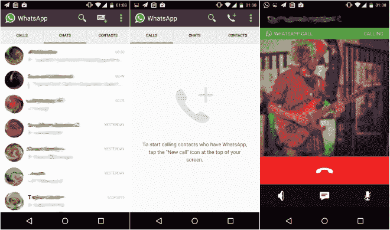

# 在野外发现的 WhatsApp 语音通话功能

> 原文：<https://web.archive.org/web/https://techcrunch.com/2015/02/02/whatsapp-voice-calling-feature-spotted-in-the-wild/>

部分 Android 用户报告称，他们在 WhatsApp 移动应用程序中发现了一项新的语音通话功能，这表明该公司正在测试这一功能，之后将扩展到目前由 Skype 和 Viber 等应用程序主导的领域。一名用户现在分享了语音通话功能的截图和视频，他说，当已经有这项功能的人打电话给他时，这项功能就被激活了。

最先报道此事的用户将他的截图和视频发布到了 Reddit 上。他也在印度工作，这表明该地区的用户可能是新功能的早期测试者。在他的帖子之后，其他人[和](https://web.archive.org/web/20230406203746/http://www.techtimes.com/articles/30222/20150202/whatsapp-tests-voice-calling-feature-for-select-android-users-in-india.htm)一起分享了他们的 WhatsApp 应用程序的截图，在聊天和联系人标签旁边显示了一个新的呼叫标签。

我们应该注意到，许多这些帖子现在已经从 Reddit 上撤下，因为它们包含个人信息。然而，该专题的视频仍在 YouTube 上直播。(见下文)。目前还不清楚推广的范围有多广，因为许多新闻报道都来自这篇最初的 Reddit 帖子。我们已经向 WhatsApp 寻求澄清，如果收到回复，我们会及时更新。

基于共享的视频，WhatsApp 语音通话提供了几个标准的呼叫处理选项，包括扬声器设置、静音按钮和在接听电话时继续发送消息的能力。

[YouTube https://www.youtube.com/watch?v=T5-UfVwoKf8]

据说，WhatsApp 客户端的最新版本 2.11.508 提供了更新。然而，这还不能在谷歌 Play 商店上公开下载。

有可能 WhatsApp 根本没有打算让这项功能上线，因为根据 Reddit 的早期报道，语音通话仍然存在问题，而且功能不全。例如，发帖人[说](https://web.archive.org/web/20230406203746/http://www.reddit.com/user/pradnesh07)其他人可以接到他的电话，但是他们不能给他回电话。

我们应该指出，这也不是用户第一次报告看到 WhatsApp 客户端弹出语音通话选项。12 月，一个荷兰博客[泄露了](https://web.archive.org/web/20230406203746/http://androidworld.nl/nieuws/whatsapp-bellen-whatsapp-call/)显示大部分相同内容的截图。那么，今天的新内容是如何将该功能传递给其他用户——这是第一次泄露时没有报告的事情。

语音通话在 WhatsApp 的路线图上已经有一段时间了。一年前，WhatsApp 首席执行官简·库姆[在世界移动通信大会上宣布](https://web.archive.org/web/20230406203746/https://techcrunch.com/2014/02/24/messaging-giant-whatsapp-with-465m-users-will-add-voice-services-in-q2-of-this-year/)该公司将扩展到语音通话领域，届时他的应用不仅将与 Skype 和 Viber 竞争，还将与其他竞争对手竞争，包括 KakaoTalk、LINE、BBM、Hike 等。

“我们使用最少的带宽，并充分利用它。我们将专注于简单，”库姆当时说。他还表示，语音通话将首先出现在 Android 和 iOS 上，然后再扩展到诺基亚和黑莓手机上。

在推出语音通话之前不久，WhatsApp 上个月将业务扩展到了网络领域，这使得桌面用户可以通过网络浏览器访问这项服务。要在桌面上登录，用户必须在手机上通过 WhatsApp 拍摄二维码照片，因为该服务依赖电话号码和短信验证，而不是用户名和密码。Android、Windows Phone 和 BlackBerry 用户可以使用登录选项，但 iOS 用户还不能使用。

WhatsApp，一家被脸书以 220 亿美元[收购的公司，也在最近](https://web.archive.org/web/20230406203746/https://techcrunch.com/2014/02/19/facebook-buying-whatsapp-for-16b-in-cash-and-stock-plus-3b-in-rsus/)[宣布其用户已经从 8 月份的 6 亿增长到 7 亿。在库姆发布到他的脸书个人资料上的公告中，他还承诺公司很高兴“在 2015 年继续打造一款伟大的产品”](https://web.archive.org/web/20230406203746/https://www.facebook.com/jan.koum/posts/10152994719980011?pnref=story)

我们已经联系了 WhatsApp 寻求官方对最新泄露的评论，如果他们有回应，我们会更新。**更新**:该公司表示正在检查是否能提供官方评论。敬请关注。美国东部时间下午 2: 4 更新，Whatsapp 尚未提供评论。