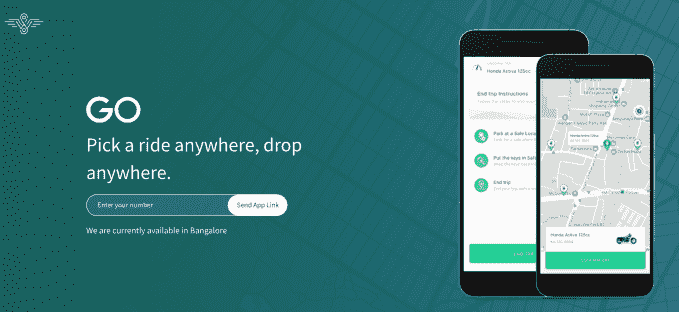
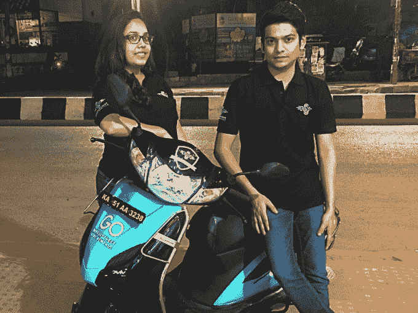

# WheelStreet 将无码头摩托车带入印度城市 

> 原文：<https://web.archive.org/web/https://techcrunch.com/2017/12/18/wheelstreet-is-bringing-dock-less-scooters-to-indias-cities/>

到目前为止，世界已经熟悉了按需自行车服务的兴起，[始于中国的摩拜单车和 Ofo](https://web.archive.org/web/20221025222331/https://beta.techcrunch.com/2017/07/12/chinese-bike-sharing-startup-mobike/)，但一家初创公司正在略微扭曲这一概念，将无码头摩托车带到印度的街道上。

[WheelStreet](https://web.archive.org/web/20221025222331/https://www.wheelstreet.com/) , [一家今年早些时候从美国的](https://web.archive.org/web/20221025222331/https://beta.techcrunch.com/2017/08/22/yc-demo-day-s17-day-2/)Y Combinator 项目毕业的公司，正通过试点服务率先在印度推广踏板车，该服务已经在班加罗尔运行了一个多月。

这项倡议名为 [WheelStreet Go](https://web.archive.org/web/20221025222331/https://www.wheelstreet.com/go) ，就像其专注于自行车的兄弟一样，它允许用户短期租赁一辆小型摩托车。这些滑板车可以被捡起来，放在任何地方，一旦扫描到自行车上的二维码，就可以通过输入应用程序内生成的密码进行租赁。这反过来又打开了车上的锁。一个专门的团队确保自行车正确停放，并且车辆通常是分散的。

与制造自己车队的自行车共享公司不同，WheelStreet 与自行车租赁店合作，使用他们的车辆提供服务。这意味着提供的范围有些变化。收入是共享的，每辆车都被赋予 WheelStreet 品牌和锁，并放在地图上供用户使用。未来，这家初创公司可能会探索自己的车队。

与租赁店的合作可以追溯到 WheelStreet 的创立历史。这家初创公司成立于 2014 年，是一个一站式市场，汇集所有自行车租赁，让消费者可以轻松找到要租赁的自行车。然而，今年它决定在班加罗尔试验无码头自行车，但它继续在印度 33 个城市提供市场服务。

到目前为止，Go 服务已经在班加罗尔的部分地区使用了 50 辆小型摩托车，全部是 100 毫升的小型摩托车。使用两个小时的价格不到 1 美元，但是没有时间限制。

WheelStreet CMO 公司联合创始人莫克沙·斯利瓦斯塔瓦(Moksha Srivastava)表示，早期的测试“非常漂亮”，每天平均有大约 28 名客户每天预订两到三次。

该计划是在本月将产能扩大到 100 辆，并慢慢发展这项业务，直到现在，这项业务还没有营销或推广。她补充说，到目前为止，该公司还没有遇到破坏行为的问题，这种问题阻碍了按需模式新市场中自行车共享服务的推出。这家初创公司表示，除非锁被打开，否则自行车上的 GPS 芯片会禁用引擎。

Srivastava 表示，用户往往是在城市中进行多次约会的人——会议、看房或只是通勤上班——但不想浪费时间等待优步、竞争对手服务 Ola 或其他交通工具的接站。她还认为，随着 Ola 项目在 T2 的开展，按需自行车在大学校园里越来越多，但对印度来说潜力有限。

“这是地位的象征，”她在接受 TechCrunch 采访时表示。“我想在车流中穿梭，保持健康，但我想拥有一辆车(所以摩托车是退而求其次的选择。]在大学或科技园区，骑自行车是一种非常好的模式，但除此之外，这个市场并不存在。”

“此外，如果你想骑自行车去办公室，你最终会浑身是汗，”斯利瓦斯塔瓦补充说，他是与朋友 Mrityunjay Jha 和 Pranay Shrivastava 一起开始公司的。

赌的是人们想要一种比租车更快捷的方式，比如 zoom car(T4)和出租车。斯利瓦斯塔瓦估计，奥拉和优步占据了一线运输的 60%。她认为 Go 可以达到 50 %,但准备花时间来确保产品与市场的匹配是正确的。

斯里瓦斯塔瓦说:“我们想先在班加罗尔进行实验并获得反馈，我们将在这里呆六个月，然后我们将在其他城市复制 Go 模式。”“就目前而言，我们关注的是大都市，那里的区域很广，人们去办公室或家需要走四五公里。”

目标是到 2018 年底达到 25，000 辆 Go 滑板车。将计划落实到位后，WheelStreet 已经开始与投资者进行初步对话，以期为 scale Go 筹集约 200 万美元的资金。

“WheelStreet(核心业务)几乎盈亏平衡，我们不需要资金。但如果我们不及早行动，那么其他人将会扰乱这个市场，”CMO 说。

斯利瓦斯塔瓦暗示，投资者可能包括来自中国和印度以外的风投，以及印度国内的风投。

*注意:本文的原始版本已更新，以更正 Go 定价*