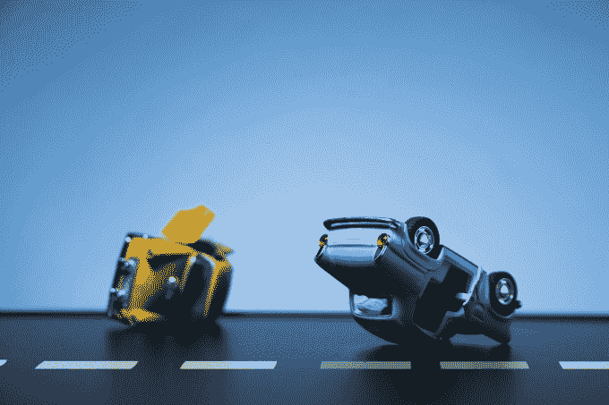
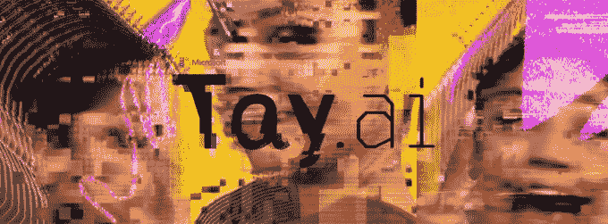

# 当产品设计中的偏见意味着生死的时候

> 原文：<https://web.archive.org/web/https://techcrunch.com/2016/11/16/when-bias-in-product-design-means-life-or-death/>

卡罗尔·雷里撰稿人

在我的博士研究期间，我使用微软的语音识别 API 为外科机器人系统开发了一个语音激活的人机界面。但是，因为 API 主要是由 20-30 岁的男性开发的，所以它不能识别我的声音。

我不得不降低我的音调来让它起作用。因此，我无法展示我自己的作品。

虽然我已经建立了接口，但当我们在大学向尊贵的访问者展示该系统时，一名男性毕业生总是必须领导演示，因为语音系统识别他们的声音，而不是我的声音。

自 21 世纪初以来，人工智能语音识别系统已经取得了巨大的进步，但仍然有许多人工智能产品存在这些设计缺陷。

当它影响到你的目标客户时，它就会成为一个问题——就像当你好芭比，美泰的人工智能芭比，[努力识别打算与它玩耍的孩子的声音(这是除了高度争议甚至](https://web.archive.org/web/20230330030852/http://www.wsj.com/articles/talking-toys-are-getting-smarter-should-we-be-worried-1450378215)[性别歧视内容](https://web.archive.org/web/20230330030852/http://fusion.net/story/253299/is-hello-barbie-sexist/)被编程到娃娃中之外)。

虽然你好芭比和我自己的人工智能体验都令人失望，但它们指出了更大范围内更深刻的问题。人工智能和整体产品开发缺乏多样性和包容性，这不仅仅是一个社会或文化问题。

开发过程中有一个盲点，影响到普通大众。当应用于安全是一个因素的产品时，它就成了一个生死攸关的问题。

这不仅仅是对工程领域缺乏多样性的抱怨。由于可怕的后果，这个行业必须改变，特别是当人工智能成为我们生活中越来越大的一部分。

## 汽车设计和安全中的偏见

每次你走进一辆车，你就把你的生命交到了那些在每一个功能背后做出设计和工程决策的人手中。当做决定的人不理解或不考虑你的需求时，你的生命就有危险了。

历史上，汽车产品的设计和开发在很大程度上是由男性决定的。在 20 世纪 60 年代，车辆碰撞测试协议要求使用假人进行测试，这些假人模仿平均身高、体重和身高在第 50 百分位的男性。这意味着安全带是为男性设计的，多年来，我们销售的汽车对女性，尤其是孕妇来说很不安全。

因此，女性司机在车祸中受重伤的可能性增加了 47%。令人欣慰的是，这种情况正在开始改变——2011 年，第一个女性碰撞测试假人被要求参加安全测试——但我们仍然建立在 50 多年的汽车危险设计实践基础上。

性别只是设计和工程中严重缺乏多样性的一个领域。当涉及到种族、民族、社会经济阶层、性取向等等时，设计偏见同样是个问题。例如，谷歌的计算机视觉系统将非裔美国人[标记为大猩猩](https://web.archive.org/web/20230330030852/http://blogs.wsj.com/digits/2015/07/01/google-mistakenly-tags-black-people-as-gorillas-showing-limits-of-algorithms/)，而据报道，微软的视觉系统未能识别[皮肤更黑的人](https://web.archive.org/web/20230330030852/http://www.pcworld.com/article/209708/Is_Microsoft_Kinect_Racist.html)。

今天，计算机视觉最突出的应用之一是自动驾驶汽车，它依靠这些系统来识别和理解周围的世界。如果这些系统不承认每个种族的人都是人类，将会有严重的安全隐患。

我希望我们永远不会生活在这样一个未来，无人驾驶汽车更有可能撞上一个种族群体，或者优先考虑一些种族的生活。不幸的是，当一个单一的同质群体在设计和制造绝大多数技术时，他们会有意识和无意识地传递自己的偏见。

## 更广泛的包容问题

除了交通，我们还依赖科技来满足食物、通讯、教育等基本需求。为了让我们生活在一个平等的社会中，我们的技术必须平等地服务和对待所有阶层。

让我们承认，今天人工智能存在广泛的多样性和包容性问题。只需在谷歌上快速搜索一下，就能发现一些令人失望的情况，我们看到人工智能公然歧视某个群体，包括:

*   [微软的 Tay](https://web.archive.org/web/20230330030852/https://medium.com/r/?url=http%3A%2F%2Fqz.com%2F653084%2Fmicrosofts-disastrous-tay-experiment-shows-the-hidden-dangers-of-ai%2F) ，一个从互动中学习的人工智能“青少年”聊天机器人。 在被暴露在公众面前的 24 小时内 ，泰呈现出种族主义、性别歧视、恐同的个性，不得不被无限期地带走。

*   苹果健康工具包(Apple HealthKit)，它实现了专门的跟踪，如硒和铜的摄入量，但在 iOS 9 之前忽略了包括女性经期跟踪器。

*   兰卡斯特大学进行的一项研究得出结论，谷歌的搜索引擎为种族、民族和性别方面的负面刻板印象创造了一个回音室。当你在谷歌上输入“女人是……”这个词时，它的自动完成选项是“……少数，”“……邪恶，”“……允许战斗”或者，最后但同样重要的是，“……被金钱所吸引。”

尽管最近出现了这些失误，硅谷已经从否认走向了接受。这还不够好。我们需要采取直接可行的措施来改变人工智能文化，创造对社会各阶层都安全的产品。那么我们该怎么做呢？

## 更安全的产品始于多样化的团队

Paysa 最近的一项研究发现，在过去六个月中，在自动驾驶汽车领域工作的人中有 68.4%是男性，只有 5.4%是女性(26.2%下落不明)。在同一群体中，42.1%是白人，36.2%是亚洲人，21.6%身份不明。即使有缺失的数据，这些数字也描绘了一幅严重缺乏多样性的画面，这将影响数百万人的安全。

虽然在为其他人开发产品时，一个细分市场可以有一定程度的同理心，但我们已经一次又一次地看到，拥有一个同质的团队会导致设计偏向于那个特定的群体。

人们很容易认为，现有数据的庞大规模可以绕过这个问题。不幸的是，事实并非如此。这些算法通过将一个数据模型与过去的类似数据模型进行比较来工作，并且需要适当的人类判断来找出特定数据模型的正确上下文。工程团队在定义这些模型以及由此产生的技术方面有很大的作用。

> 人工智能缺乏多样性不仅仅是一个社会或文化问题。真的是生死安全问题。

即使是最善意的开发人员也可能根本意识不到他们自己狭隘的视角，以及这可能如何无意识地影响他们创建的产品。例如，白人男性经常高估少数民族的存在和影响。

吉娜·戴维斯媒体性别研究所发现，白人男性看到 17%的女性时会认为男女比例是 50:50，而当女性比例为 33%时，他们会认为女性占多数。像这样一个简单的高估说明了从别人的角度看世界是多么困难。

软件工程，尤其是在新兴的自动驾驶汽车领域，是一条高薪职业道路，因此许多人都主张更多的少数群体应该有这些机会。然而，少数群体在自动驾驶领域工作还有一个更重要的原因——设计产品的机会，这些产品将平等地影响和改善数百万不同的生活。

我鼓励所有的科技公司首先意识到并诚实面对他们工程、产品和领导团队的多样性现状。然后，一个季度一个季度地设定可跟踪的指标和目标。重要的是从第一天开始就考虑包容性需求，并且随着公司和产品的发展，这是一个关键的考虑因素，如果不是一个优先事项的话。

人工智能缺乏多样性不仅仅是一个社会或文化问题。真的是生死安全问题。为了构建更安全的产品，承认所有人的平等价值和人性，我们必须首先拥有来自不同团队的不同观点和声音。我拒绝相信雇佣少数族裔候选人比制造自动驾驶汽车更难。