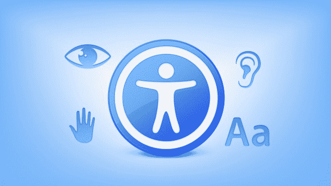
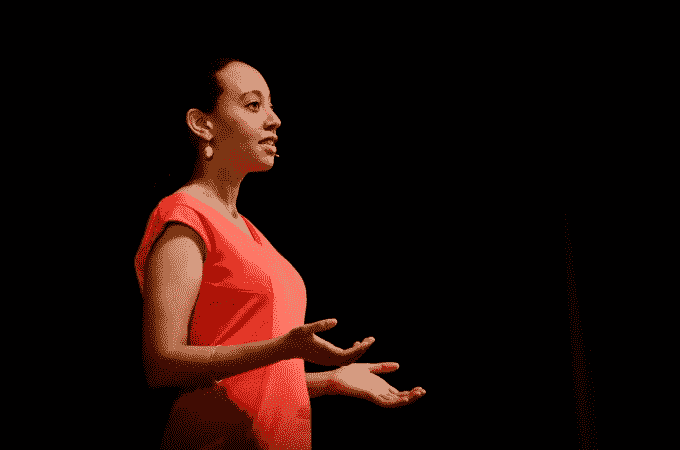
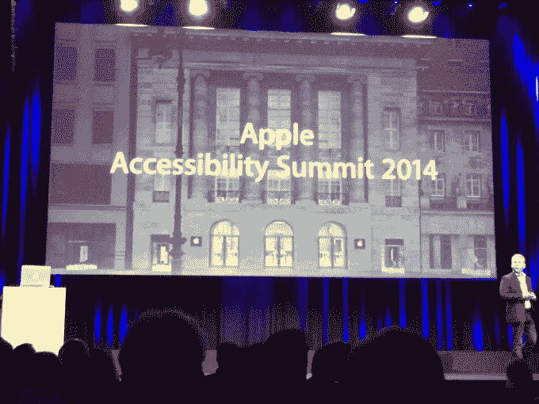

# 谈到可访问性，苹果继续在认知和创新方面领先

> 原文：<https://web.archive.org/web/https://techcrunch.com/2016/05/19/when-it-comes-to-accessibility-apple-continues-to-lead-in-awareness-and-innovation/>

史蒂文·阿基诺撰稿人

史蒂文·阿基诺是一名自由科技作家和 iOS 无障碍专家。

More posts by this contributor

苹果公司通常被誉为，它通过创造突破性的设备，颠覆和重新发明了产品类别，并在此后的几年里定义了各自的市场。

2001 年 iPod 的推出为 MP3 播放器和数字音乐带来了这种效果，但典型的例子无疑是 2007 年的第一代 iPhone。

凭借其多点触控用户界面和史蒂夫·乔布斯(Steve Jobs)所描述的“桌面级软件”，第一代 iPhone [为智能手机](https://web.archive.org/web/20230306050912/http://fortune.com/2007/11/01/time-magazine-names-ciphone-invention-of-the-year/)树立了标杆，确立了自己作为评判其他手机的标准。这是一场真正的革命。

科技作家和分析师倾向于将这些革命(下一个大事件)与硬件联系起来。iPhone 是这一点的缩影，但一个强有力的论点是，苹果也领导了一场同样具有变革性的软件革命，但在媒体报道方面没有那么轰动。通过 iOS，苹果为残疾人创造了一套丰富多样的工具，使他们能够像非残疾人一样轻松愉快地使用 iPhone。

正是因为这个原因，iOS 上的[辅助功能被广泛认为是业内](https://web.archive.org/web/20230306050912/http://www.apple.com/accessibility/ios/)[最好的](https://web.archive.org/web/20230306050912/http://www.afb.org/afbpress/pub.asp?DocID=aw160602)。这是一个不小的壮举，一个不应该被忽视的壮举，尤其是如果你还记得 iPhone 出现之前手机是什么样子的话。

考虑视力低下的人。他或她可能很难使用一个邮票大小的显示器和一个多击键盘。但后来他们买了 iPhone，他们的整个世界都变了。他们现在有一部带触摸屏和变焦等技术的手机，这些功能使得使用这款手机更容易。

突然间，他们与家人和朋友发短信，查找方向，前所未有地流畅。因此，毫不夸张地说，对于残疾人来说，iOS 的无障碍功能已经完全改变了游戏规则，就像 iPhone 对于大众手机市场一样。

苹果肯定意识到了它在这里的影响——顾客会告诉他们这件事。因此，正如它所涉及的一切一样，苹果[随着时间的推移，不断迭代和完善 iOS 的辅助功能。](https://web.archive.org/web/20230306050912/http://www.macworld.com/article/1151235/macs/apple-rolls.html)

该公司在这一领域的投资象征着其为所有人制造产品的精神；这也是蒂姆·库克反复强调的苹果努力创造“丰富人们生活”的产品的最好例子。

苹果所有平台上的无障碍软件使包括我在内的残疾人能够分享苹果为所有用户设计的体验。换句话说，苹果产品在设计上是包容性的**。**

 **“我们将无障碍视为一项基本人权，”苹果公司全球无障碍政策和倡议高级经理莎拉·赫林格说。

> 苹果所有平台上的无障碍软件使包括我在内的残疾人能够分享苹果为所有用户设计的体验。换句话说，苹果产品在设计上具有包容性。

Herrlinger 说:“构建我们产品的核心支持一个包容性世界的愿景，在这个世界中，机会和信息的获取是无障碍的，使残疾人能够实现他们的目标。

因此，让可访问性成为围绕苹果的对话中一个经常性的、引人入胜的部分是至关重要的。尽管残疾人只占苹果用户总数的一小部分，但这并不是一个无足轻重的群体。这就是为什么苹果在提高无障碍意识和倡导无障碍方面的工作如此值得关注和赞赏。

苹果的巨大影响力让无障碍社区得到认可并分享焦点，这是理所应当的。正是本着这种精神，苹果通过展示易访问性应用程序、电影、配件等来庆祝[全球易访问性意识日](https://web.archive.org/web/20230306050912/http://globalaccessibilityawarenessday.org/gaad.html)。

**iOS 上的盲文和 Meeting Haben Girma**

照片由 Flickr/TedXBaltimore 提供。

iOS 支持盲文已经好几年了。iOS 支持超过 25 种语言的盲文表，甚至内置了盲文键盘。

这消除了对用于文本输入的单独盲文键盘的需要。此外，iOS 兼容 50 多种型号的[可刷新盲文显示器](https://web.archive.org/web/20230306050912/http://www.apple.com/accessibility/ios/braille-display.html)。(同样值得注意的是，Apple now [销售](https://web.archive.org/web/20230306050912/http://www.apple.com/us/shop/accessories/all-accessories/accessibility)盲文显示器和其他关注辅助功能的第三方配件，如开关。)

概括地说，盲文显示器的工作原理是将普通文本转换成盲文字符，然后通常通过蓝牙将输出发送到显示器。可以将盲文显示器与 iOS 设备配对，然后能够使用 VoiceOver 来控制，比如说，你的 iPhone。=

我最近有机会会见了自己也是盲文显示器用户的 Haben Girma，讨论了苹果在无障碍方面的努力以及我们在设备上使用的工具。

Girma 是一名聋哑律师和残疾人权利倡导者。

她是哈佛法学院第一位聋哑毕业生，去年她在白宫举行的美国残疾人法案 25 周年纪念活动上介绍了奥巴马总统。

Girma 是苹果产品的超级粉丝，从 2009 年开始使用苹果产品。她说“它们真的很有趣”，并经常使用 Mac、iPhone 和 Apple Watch。

至于苹果的辅助功能，Girma 特别喜欢 VoiceOver。她说，VoiceOver“彻底改变了盲人群体获取信息的方式。”有了屏幕阅读技术，查找街道名称和与朋友发短信变得很容易。

“苹果对画外音的贡献对我在法学院和以后的成功起到了至关重要的作用，”吉尔马说。

**App Store 和 iTunes 中的辅助功能**

除了苹果现在在网上商店销售的无障碍配件，该公司最近还宣布了 App Store 和 iTunes Store 中为残疾人士提供的两个新功能。对于应用程序商店，苹果已经更新了其[应用程序的可访问性集合](https://web.archive.org/web/20230306050912/http://appstore.com/Accessibility)，增加了更多的应用程序，满足了广泛的需求。

应用程序根据需求进行分类，包括视觉、听觉、语音以及苹果所谓的“带 Siri 的无障碍家庭”和其他应用程序一样，苹果会定期更新 accessibility one。重要的是，这些更新有助于宣传那些提供优秀、专业应用的开发者。这个新系列的特色是由诸如[助手](https://web.archive.org/web/20230306050912/http://www.assistiveware.com/)和[语音梦想](https://web.archive.org/web/20230306050912/http://www.voicedream.com/)等公司开发的应用程序。

虽然这些应用程序很深奥，但它强化了一个想法，即 iPhone(和 iPad)的很大一部分价值主张是可访问性，这在一定程度上是由 App Store 生态系统实现的。关于 iTunes，有一个新的[部分](https://web.archive.org/web/20230306050912/http://itunes.com/audiodescription)，其中包含了许多支持[描述性音频](https://web.archive.org/web/20230306050912/https://en.m.wikipedia.org/wiki/Audio_description)的电影。(其实 iOS 对视频也是支持这个的。在辅助功能>媒体>音频描述下有一个开关来打开/关闭它。)片名包括*星球大战:原力觉醒*、*火星人*和*里外*。

**第三方开发者也有自己的角色**

尽管这篇文章赞扬了苹果在辅助技术方面的领先地位，但他们并不孤单。

事实上，在 App Store [中拥有应用的开发者同样有责任](https://web.archive.org/web/20230306050912/https://techcrunch.com/2014/08/02/reuters-rebuttal/)确保他们的软件对残疾人可用。幸运的是，在苹果工具的[帮助下，开发者可以确保他们的应用对任何人都是可访问的。](https://web.archive.org/web/20230306050912/https://techcrunch.com/2015/06/14/wwdc-puts-accessibility-on-the-radar-for-developers/)

和苹果的应用一样，开发者的应用应该从一开始就考虑到可访问性。这是一个高度可访问的应用程序的例子。我喜欢播客，我最喜欢听的应用程序是 Marco Arment 的[阴天](https://web.archive.org/web/20230306050912/https://overcast.fm/)。

是什么让《乌云背后》的可访问性如此之好，是因为它有强大的 VoiceOver 支持，动态类型，以及正在播放的屏幕上巨大的按钮。长久以来，Marco 一直是可访问性的支持者，这一点在 long 的设计中表现得非常明显。(完全披露:在 2014 年 1.0 发布之前，我就已经是测试版的一部分了。)

在三月中旬发布的 [2.5 更新](https://web.archive.org/web/20230306050912/https://marco.org/2016/03/14/overcast25)中，阴的可访问性变得更好。字幕功能是一个新的黑暗模式。我太喜欢黑暗模式了，一直在用。它看起来很棒，但对我来说它与众不同的是对比度的提升。文本跳出屏幕，让我轻松阅读标题，显示注释，甚至一集还剩多少时间。结合黑暗模式和动态类型，阴天为我的眼睛提供了一流的体验。令人愉快。

另一个很棒的应用商店应用是[做我的眼睛](https://web.archive.org/web/20230306050912/http://www.bemyeyes.org/)。

这个想法很简单:给盲人或弱视者另一双眼睛。想象这样一个场景:一个盲人走进厨房，想要一杯牛奶。这牛奶闻起来有点臭，但是没办法看清楚纸盒上的保质期。

这个人可以打开手机上的 Be My Eyes 应用程序，通过视频聊天与视力正常的志愿者联系，后者可以看到日期，并告诉这个人这是什么。这是一个非常聪明的解决方案。做我的眼睛

每个人都可以成为我的眼睛，因为希望提供帮助的视力正常的人可以在应用程序中注册成为志愿者。

当有人需要帮助时，该应用程序会发送推送通知，提醒帮助者。如果那个助手现在不在，应用程序会把电话转给另一个人。

**最后的想法**

倡导无障碍不仅仅是为需要住宿的人挺身而出。如果你退后一步，看看大局，提高认识之所以如此重要，是因为它教育了其他所有人。

这样做消除了对残疾人工作的误解，并增进了社会对我们的了解。这就是全球无障碍意识日存在的原因。

Haben Girma 说得好:“随着越来越多的社区努力实现包容，他们也在纠结这个问题，‘如何实现？’

一个失聪的家庭如何通过电话分享一段对话？应用程序开发人员如何确保盲人客户可以访问她的内容？

苹果公司提供的解决方案回答了许多这样的问题。从 FaceTime 到 VoiceOver 的工具创造了无数的机会。想象下一步是什么，真令人兴奋！不断探索，不断创新，不断推动我们走向一个人人机会均等的世界。"

就个人而言，苹果对易用性的执着是我成为该公司粉丝的一个重要原因。像 iPhone 这样的产品不仅很酷，而且作为一个残疾人，我很清楚苹果公司关心我的体验。

考虑到苹果作为世界上最大的公司的地位，坐在一个深不可测的战争资金箱上，他们不顾“血淋淋的投资回报率”做这项工作是真正令人钦佩的。在许多方面，苹果在可访问性方面的努力抓住了处于技术和人文艺术交汇点的本质。我认为史蒂夫·乔布斯会为苹果公司继续推动人类和技术进步而自豪。**