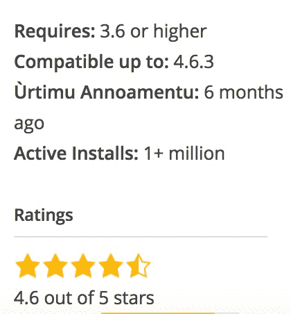

# 当双因素认证应用 Clef 在 6 月份关闭时，它的员工将加入 Authy 

> 原文：<https://web.archive.org/web/https://techcrunch.com/2017/03/17/when-two-factor-authentication-app-clef-shuts-down-in-june-its-staff-will-join-authy/>

# 当双因素认证应用 Clef 在 6 月份关闭时，它的员工将加入 Authy

C

lef 是一款移动认证应用，几年前我开始写博客的时候，我选择它来提高我自己的 WordPress 安全性——就像一百万个其他网站一样。然而，

[the app is officially and unexpectedly shutting down on June 6th](https://web.archive.org/web/20230329055842/https://blog.getclef.com/discontinuing-support-for-clef-6c89febef5f3#.1d14i36pb)

；前员工将继续在 Twilio 从事其他项目，包括 Authy 应用程序和 API。

> Byrne 说:“我们找不到一种能让我们的增长可持续的商业模式。

我与 Clef 的联合创始人 B . Byrne 进行了交谈，并问了几个问题，以了解是什么原因导致一个拥有庞大用户群的应用突然失败。2016 年 9 月的 SEC 文件表明 Clef 试图筹集资金，但未能完成这轮融资。Byrne 说，Clef 大约在那个时候成功地“筹集了额外的资金”，最近报道的总估值上限为 800 万美元，但情况从今年开始恶化，而不是去年。

首先，是什么导致了关闭？Byrne 说:“我们找不到能让我们的增长可持续的商业模式。”作为参考，Clef 提供了“高安全性”的企业包，但在所有其他情况下，它只是一个免费的应用程序和服务。

在谷歌上快速搜索官方插件页面的缓存版本得到的结果是:Clef 在 WordPress 网站上至少有 100 万活跃用户。

使用移动认证应用的人(包括我自己)会感受到它的损失，可能首先会感到不方便。然而，Clef 的关闭并不能反映 2FA 应用的整体增长。布莱恩也有同感，他说:

> “我认为，从短期来看，关闭 Clef 肯定是双因素市场的损失，但我相信，更好的事情正在到来，这个领域的势头正在增长。
> 
> 我认为 TOTP 目前是一个不错的选择，U2F 在很多使用案例中甚至更好，但我也知道有一些真正具有变革性的技术正在酝酿之中。"

双因素认证在 2015 年风靡一时(现在仍然如此)，但是 Clef 在推出时提供了一个独特的解决方案[:不仅保护您的用户凭证，还让它们更容易使用。设置完成后，整个过程只需几秒钟，只需您登录即可结束。](https://web.archive.org/web/20230329055842/https://techcrunch.com/2015/02/19/clef-offers-two-factor-authentication-without-all-the-codes/)

我们结束了谈话，讨论了克莱夫团队的剩余成员会发生什么。结果是，只要应用程序关闭，他们就会继续工作。Byrne 将是 Authy API 的主导产品，但将与他以前的 Clef 同事“密切合作”。