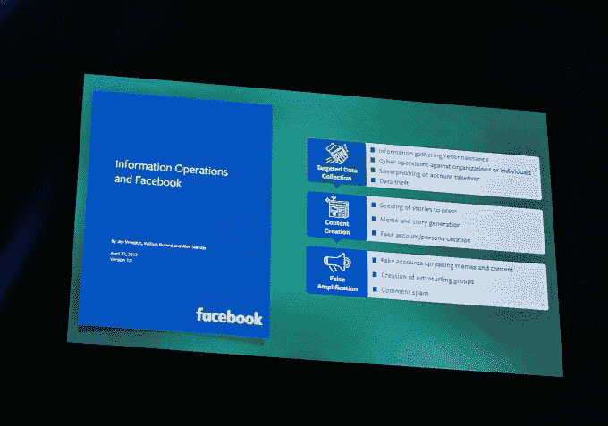

# 当斯诺登变得重要时 

> 原文：<https://web.archive.org/web/https://techcrunch.com/2017/07/30/where-are-the-snowdens-of-yesteryear/>

四年前，深州是敌人。爱德华·斯诺登刚刚揭露了它的阴谋。国家安全局的头头在他的黑帽主题演讲中遭到了愤怒的嘘声。“我们”——黑客、个人主义者和/或所有希望我们建设更美好未来的技术人员——已经准备好与监控资本主义和监控国家作战。我们大错特错了。

四年后，深州似乎更像是我们敌人的敌人。实际上已经发生的文化和政治斗争是一场反对——奇怪的、超现实的——19 世纪风格的种族民族主义的斗争；反对那些想要强行将数百万人从他们的家园驱逐出的人，反对那些想要压迫各种少数民族的人，尤其是彻头彻尾的白人民族主义者。世界各地愤怒、恐惧、缺乏安全感的男人和女人似乎对日益增加的复杂性和相互关联性做出了回应，他们诉诸于老式的种族主义、仇外心理、同性恋恐惧症、变性恐惧症、伊斯兰恐惧症和其他形式的仇恨。

嗯，我很抱歉这么说，但我知道在我们内心深处，我们都想象自己是真正的*真正的*打破传统的反叛英雄，勇敢无畏地站出来对抗这个男人，这是好莱坞多年来的功劳……在这场战斗中，另一方也以完全相同的方式看待自己。白人至上主义者中不乏黑客/偶像破坏者/个人主义者。想想[威夫](https://web.archive.org/web/20230130100805/https://en.wikipedia.org/wiki/Weev)，曾经因为他的钓鱼技巧而备受尊敬，曾经因为他增加网址的罪行(诚然是胡说八道)而成为黑客界的半英雄/烈士，现在是一个彻头彻尾的新纳粹。考虑一下[柯蒂斯·雅文](https://web.archive.org/web/20230130100805/https://en.wikipedia.org/wiki/Curtis_Yarvin)。想想前科技记者 Milo Yiannopolous 。

“我们”，或者至少是我们中的太多人，仍然带着同样的、错误的心态在运作。如果我们首先输掉这场新的战斗，那么与(监视)人的旧战斗将不会有多大帮助。对于街头警察暴行、移民禁令、兵役禁令和大规模驱逐形式的种族清洗，强加密并不是一种特别好的防御手段。与其说这是一场反对权威的战斗，不如说这是一场思想的战斗。(所以让我们记住，在思想的舞台上，当“我们”似乎反对言论自由时——即使所讨论的言论是卑鄙的，这看起来真的很糟糕。)

这种新的对抗仍然是一种非常技术性的对抗。你只需要浏览一下去年的头条新闻，就能意识到这在很大程度上是一场黑客和泄密之战，范围从个人到国家，也是一场“信息作战”之战。请看这张来自今年黑帽主题演讲的精彩幻灯片，由脸书 CSO Alex Stamos 提供:

因此，也许我们需要停止试图采用斯诺登时代的思维模式，即网络朋克坚持邪恶的政府和公司，以适应这个特朗普和英国退出欧盟的时代。他的战斗不是今天的战斗。也许我们需要少考虑一点加密、0-days 和监视，多考虑一点认识论、信息操作和赢得人心。最有争议的是，也许我们需要停止如此本能地反政府/反大公司，并对大型组织及其众多触角和分支采取更微妙的观点。随着越来越多的权力掌握在他们手中，他们可能会成为明天自由的敌人；但是今天的敌人是一个完全不同的，也是更危险的大众运动。