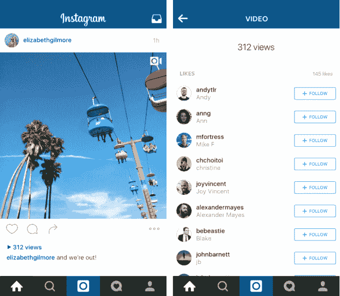

# Instagram 公布视频观看次数，为创作者和广告收入打分 

> 原文：<https://web.archive.org/web/https://techcrunch.com/2016/02/11/where-the-eyeballs-are/>

视频在 Instagram 上蓬勃发展，观看时间在 6 个月内增长了 40%，所以现在它试图从 Vine 和 YouTube 等竞争对手那里吸引最好的视频制作者和营销人员。在接下来的几周内，Instagram 将开始显示视频的浏览量，尽管你仍然可以点击查看心脏计数。和脸书一样， [3 秒](https://web.archive.org/web/20221217075119/http://blog.business.instagram.com/post/139121151489/videoviews)算一个视图。

Instagram 拥有 4 亿活跃用户，其点击率将令人印象深刻，他们将说服视频创作者，他们应该在这个平台上。它希望他们不只是发布，而是真正为其 15 秒的无声视频格式制作剪辑。

与此同时，看看他们能获得多少浏览量可能会吸引营销人员为 Instagram 拍摄视频，并购买广告来推广他们，而不仅仅是移植他们在 YouTube 上的片段或电视广告。广告买家已经可以看到他们的浏览量。但是，在 Instagram 上展示视频的标准化指标可能会让它向广告商证明这是一个机会，并向他们收取更多费用。

## 眼球在哪里

Instagram 已经在努力从其他平台赢得顶级创作者的艺术。它最近在探索标签上推出了 [Spotlight 汇编](https://web.archive.org/web/20221217075119/https://techcrunch.com/2016/01/06/too-lazy-to-scroll/)。他们打开一个自动推进的垂直视频卷轴，通常围绕一个主题，如可爱的动物二重奏或滑板技巧。

但 Instagram 也开始关注个体创作者，如 T2·扎克·金·T3，一位视频特效魔术师，因使用无缝切割将鸡蛋或橙子变成鸡肉或橙汁而闻名。Instagram 称 King 每天有 500 万的浏览量。该公司还提到，聚光灯下的定格动画制作人[雷切尔·赖尔](https://web.archive.org/web/20221217075119/https://techcrunch.com/2016/02/11/where-the-eyeballs-are/)每段视频的点击率高达数十万次。

[https://web.archive.org/web/20221217075119if_/https://www.youtube.com/embed/dyRfTMq0i9A?feature=oembed](https://web.archive.org/web/20221217075119if_/https://www.youtube.com/embed/dyRfTMq0i9A?feature=oembed)

视频

*以下是 Instagram 上视图计数和隐藏的喜欢计数的工作方式*

结合其用户数量、参与度和主要的推广位置，Instagram 有足够的杠杆来吸引创作者。

King 在 Vine 上也很出色，他的剪辑每个都有大约 300 万到 800 万个循环，但这需要几周或几个月的时间。他在 YouTube 上不太受欢迎，每月有 10 万到 20 万的浏览量。如果 Instagram 每天能给他带来 500 万的浏览量，他可能会成为其他创作者也应该关注 Instagram 的一个例子。这和脸书引诱名人订阅与 Twitter 竞争的产品是一样的。

*雷切尔·赖尔通过她的定格动画成为 Instagram 明星*

Instagram 引诱创作者和广告商的策略交织在一起。通过赞助视频内容进行影响者营销已经成为广告业最热门的事情。企业付钱给制作人，让他制作一个有趣的视频，展示品牌，并与广大观众分享。去年，Twitter 花费了消息来源所说的 5000 万美元收购了一家名为利基的初创公司，该公司促成了这些交易。[披露:我的堂兄达伦·拉赫曼是 Niche 的创始人之一]

通过聚光灯和其他促销活动，Instagram 可以在其平台上增加明星创作者的追随者，从而证明他们的内容将触及大量观众。这反过来鼓励广告商不仅付钱给创作者为他们制作和分享视频，还付钱给 Instagram，通过购买创作者制作的视频的广告空间来扩大他们的影响力。

扎克·金的神奇视频通常包括品牌赞助，就像 Xfinity 的这个

Instagram 告诉我，今年视频创作和消费体验也会有更多更新。一位发言人表示，目前没有制作自己原创内容的计划，对于 Instagram 是否会像其母公司脸书一样开始[向明星视频创作者提供广告收入分成](https://web.archive.org/web/20221217075119/https://techcrunch.com/2015/11/04/facebook-video-views/)，该公司也无可奉告。

除了看看朋友们做了什么之外，虚拟主机的创建者可以为人们不断回来添加另一个理由。多年来，业余日落照片和音乐会视频可能会变得无聊。但是这些卧室艺术大师总是想出一些新东西来取悦他们的粉丝，所以他们会让 Instagram 保持新鲜。