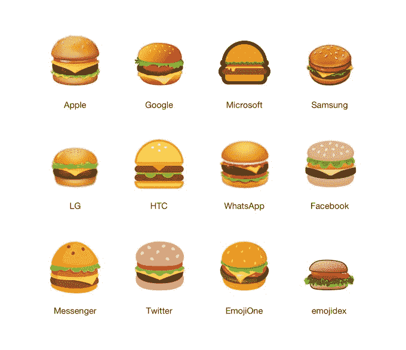

# 咻，谷歌在 Android 8.1 TechCrunch 中修复了汉堡表情符号

> 原文：<https://web.archive.org/web/https://techcrunch.com/2017/11/28/whew-google-fixed-the-burger-emoji-in-android-8-1/>

显然，在上个月网络崩溃之后，谷歌兑现了修复其糟糕的汉堡表情符号的承诺。如果你错过了，当[关于表情符号问题的推特](https://web.archive.org/web/20220926174236/https://twitter.com/baekdal/status/924312294439444480)在网上疯传时——*谷歌汉堡表情符号中的奶酪在汉堡下面！恐怖啊！谷歌首席执行官桑德尔·皮帅[回复](https://web.archive.org/web/20220926174236/https://twitter.com/sundarpichai/status/924487551372615680)他将“放下一切”来解决这个问题。根据 Emojipedia 的说法，这种情况现在已经发生了。Android 8.1 版本中的新汉堡设计将奶酪放在了正确的位置:汉堡肉饼的上面。*

关于这个问题的原始推文有超过 51，000 个赞和 25，000 个转发，这表明很多人确实关心这样的小细节，即使他们看起来很傻。

但由此引发的讨论确实引发了一些关于堆叠芝士汉堡配料的“正确”方式的争论。(这是一个有趣的[线程](https://web.archive.org/web/20220926174236/https://twitter.com/baekdal/status/924312294439444480)，如果你有时间的话。)

皮查伊的回应虽然有点开玩笑，但确实表示，如果人们能够就汉堡配料达成某种共识，谷歌将对表情符号进行修改。

在线辩论几天后，谷歌在他们的办公室提供了一顿午餐，菜单上有一个“安卓汉堡”，汉堡肉饼下面有奶酪。

现在，似乎大多数相信奶酪在汉堡上面的人赢了。

据跟踪表情世界及其所有变化的网站 [Emojipedia](https://web.archive.org/web/20220926174236/https://blog.emojipedia.org/google-fixes-burger-emoji/) 称，汉堡设计已在即将发布的 Android 8.1 版本中更新，[周一](https://web.archive.org/web/20220926174236/https://android-developers.googleblog.com/2017/11/final-preview-of-android-81-now.html)宣布。

新版安卓系统中新的谷歌汉堡表情符号现在与所有其他奶酪放在上面的表情符号相匹配。(尽管对于生菜在汉堡下面的位置还有一些争论？真的苹果？)

Emojipedia 指出，Android 的更新版本还包括其他一些表情符号的调整，包括一个现在装满啤酒的啤酒杯，用于啤酒和啤酒表情符号(而不是像以前那样半满)，以及一个对奶酪表情符号的调整，这样楔形物上的孔看起来不再是画上去的。

Android 用户可以立即访问新的汉堡表情符号，如果他们正在运行 [Android 8.1 开发者预览版](https://web.archive.org/web/20220926174236/https://android-developers.googleblog.com/2017/11/final-preview-of-android-81-now.html)；否则你将不得不等待今年晚些时候 8.1 的公开发布。

谷歌拒绝正式发表评论，但我们知道这一变化是永久性的。Android 8.1 将于 12 月推出，届时将推出 Pixel 2 和 Pixel 2 XL、Pixel、Pixel XL、Pixel C、Nexus 5X 和 Nexus 6P。

*图片来源:[表情百科](https://web.archive.org/web/20220926174236/https://blog.emojipedia.org/google-fixes-burger-emoji/)*