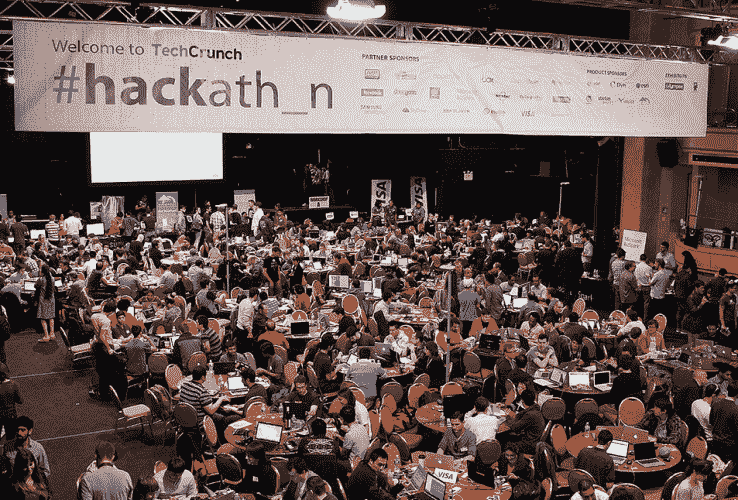
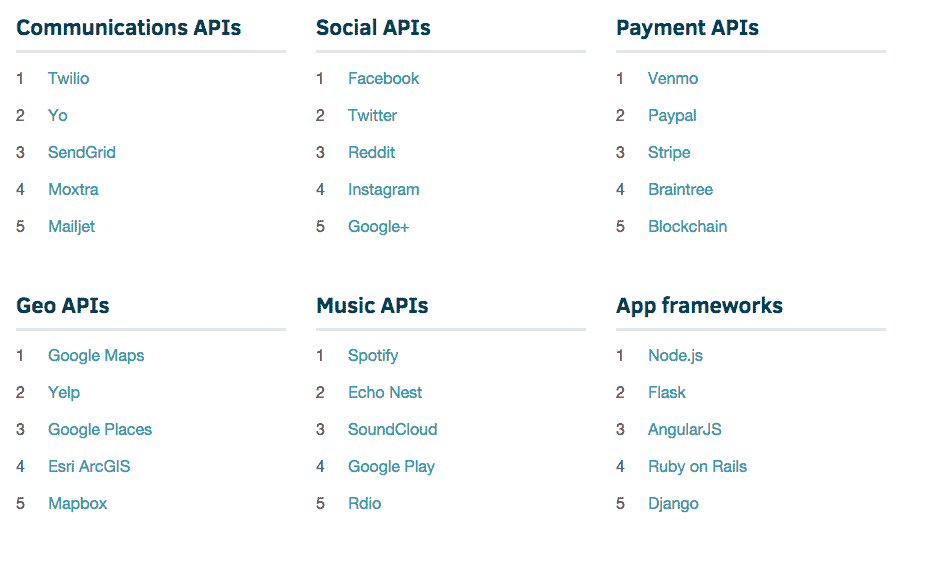

# 哪些编程语言在黑客马拉松中使用得最多？

> 原文：<https://web.archive.org/web/https://techcrunch.com/2015/07/28/which-programming-languages-get-used-most-at-hackathons/>

选择一种编程语言来学习可能是一项压力很大的任务。任何时候的流行语言都不一定会在一年内受到任何人的关注，更不一定会让你得到最好的工作。

那么，有趣的是，当程序员有了自己的选择时，他们会转向什么语言——当他们在编写代码时没有考虑到某些老板的愿望，但当他们只是为了好玩而开始一个项目时。

比如说在黑客马拉松上。

今天早上，challenge post——一个为相当多的黑客马拉松(包括我们在每次 TechCrunch 中断前举办的黑客马拉松)充当后端基础设施的工具——更名为 Devpost。为了庆祝这个新名字，他们发布了一个大的旧数据转储，里面有他们在过去一年里学到的一些东西。

黑客马拉松上出现最多的移动平台是什么？哪些编程语言最受欢迎？人们最常使用哪些 API？

在 13，281 名黑客参加了约 160 场涉及近 10，000 个项目的黑客马拉松后，他们找到了一些答案。你可以在这里找到他们的[完整报告，但是我在下面强调了一些最有趣的东西。](https://web.archive.org/web/20221225022403/http://studenthackers.devpost.com/)

粉丝最喜欢的移动平台？安卓 38.2%，iOS 22.7%，Windows Phone 遥遥领先 4.9%。剩下的 34.2%似乎没有标记出最喜欢的。

**Devpost 黑客马拉松上排名前 10 的语言:**

1.  HTML/CSS(参见下面的注释)
2.  Java Script 语言
3.  计算机编程语言
4.  Java 语言(一种计算机语言，尤用于创建网站)
5.  C/C++
6.  服务器端编程语言（Professional Hypertext Preprocessor 的缩写）
7.  目标-C
8.  C#
9.  迅速发生的
10.  JSON(它不是…真正的编程语言，但是由于某种原因在他们的列表中，所以我也包括#11)
11.  红宝石

位居榜首的 HTML/CSS 和 Javascript 似乎很容易预测(提示“脚本语言”与“编程语言”的争论)——它们宽容，不需要编译器，在浏览器而不是特定的操作系统中运行，并且往往是新程序员学习的第一门语言。如果你走进一个陌生人的房间，寻找一个团队(在黑客马拉松中经常出现这种情况)，这些语言将是非常通用的。

注意:HTML 不完全是一种“编程”语言——它是一种标记语言，意味着它是一种布局文档元素的方法。但是它仍然是一种“语言”,几乎每个 web 开发人员都在不断地使用它，所以我们将不再讨论语义。

不过，看到 Swift 已经在那里令人惊讶——苹果 13 个月前才推出它。

但是 API 呢？

Devpost 将它一个类别一个类别地分解，而不是将它们都放在一把伞下，但是每个部分的冠军都是非常优秀的工具。

根据他们的数据，最流行的通信 API 是什么？特维利奥。社交？脸书(咄。)然后推特(双咄。)付款？Venmo 击败了 Paypal，或许令人惊讶的是，两者都击败了 Stripe。正如大多数人可能认为的那样，谷歌地图在地理类别中占据主导地位。

如果仅仅因为 Twilio 是*所以*活跃在黑客马拉松现场，Twilio 在通信领域的统治地位就很有意义。我几乎在我去过的每个黑客马拉松上都见过他们，即使只是他们的一个传道者以非官方的身份出现。Twilio 要求每个新员工用他们的 API 一起破解一个项目。见鬼，他们的一个主要传播者与公司分道扬镳，只是为了创办[大联盟黑客](https://web.archive.org/web/20221225022403/https://mlh.io/about#team-section)，这是一家完全专注于全球领先学生黑客马拉松的公司。

在游戏引擎方面，Unity 似乎*主宰*其他一切，提交了超过 1000 个 Unity 项目。他们列表中的下一个工具 Pygame 只有不到 50 个。

看似试图开始某种圣战，Devpost 也收集了关于文本编辑器选择的数据。获胜者？崇高的文本——碰巧的是，这是我选择的编辑器。我在里面写这个帖子！

但是那些打破虚拟软件墙进入物理硬件世界的项目呢？

一点也不令人惊讶的硬件黑客舞会之王:Arduino。它足够灵活，可以被重新用作任何轻量级电子项目的大脑，而且足够便宜，如果你煎一个或三个电路板，你可能不会太累，这是补锅匠的首选。紧随其后的是一些虽然时髦，但用途更明确的名称 Myo 手势腕带、Pebble 智能手表、Leap motion 手势控制器和 Oculus Rift VR 耳机。奇怪的是，灵活而便宜的树莓派一直排在第六位。

记住:这些数据虽然很有趣，但不一定代表现实世界的实用性。当然，学习他们排名前五的语言中的任何一种都不会对造成伤害——但是不要仅仅根据这些数据做出任何职业选择。如果你想学习你的第一语言，选择一种看起来宽容的语言(JavaScript 是一种不错的入门语言)，思考编程的核心通用概念，*然后*开始担心所有的小差异。如果有人试图告诉你，你的第一语言是一个可怕的决定，你绝对必须学习 2015 年趋势语言，去他妈的。

请务必在这里查看 Devpost 的[完整数据转储。](https://web.archive.org/web/20221225022403/http://studenthackers.devpost.com/)

准备好参加你的第一次黑客马拉松了吗？你知道吗——再过几周，我们的[黑客马拉松就要开始了。](https://web.archive.org/web/20221225022403/https://techcrunch.com/events/disrupt-sf-hackathon-2015/event-home/)

*【为 dev post——前称 challenge post——发送这些数据干杯】*