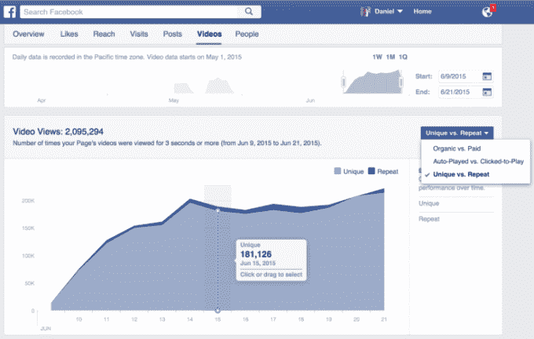
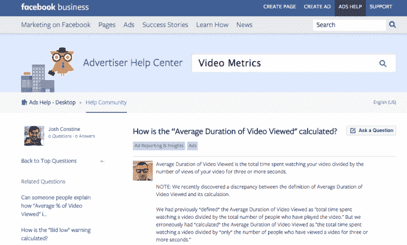
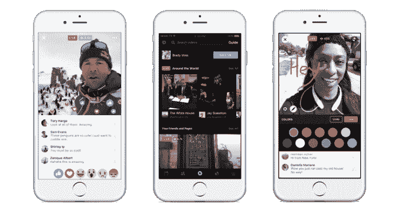

# 营销人员称脸书视频度量丑闻被夸大了

> 原文：<https://web.archive.org/web/https://techcrunch.com/2016/09/23/which-social-media-metrics-matter/>

“这个问题被过分夸大了。营销人员不关心它，它对支出没有任何影响。”这是拥有 250 名员工的社交营销机构[洗衣服务](https://web.archive.org/web/20221205110510/http://247laundryservice.com/)的创始人兼首席执行官杰森·斯坦对[华尔街日报](https://web.archive.org/web/20221205110510/http://www.wsj.com/articles/facebook-overestimated-key-video-metric-for-two-years-1474586951)一篇强烈批评脸书“平均视频观看时长”指标错误的报道的回应。

该报称这次误判为“脸书的尴尬”，这在媒体中激起了对[的猛烈批评。但 TechCrunch 与十几名直接处理这些指标的社交营销高管进行了交谈，他们的共识是，有更重要的衡量指标值得关注，如果营销人员更全面地看待分析，这个错误不一定会影响支出。](https://web.archive.org/web/20221205110510/http://www.techmeme.com/160922/p25#a160922p25)

脸书确实犯了一个错误，用不同的方式定义和计算这个指标，这一点本应该早点被发现和纠正。脸书的非标准选择将观看视频时长不超过三秒的人算作“视频观看”，多年来一直造成混乱。这个错误可能让脸书看起来比其他视频频道更受欢迎。

脸书的视频指标仪表板

脸书告诉 TechCrunch，“这个错误已经被修复，它不影响计费，我们已经通过我们的产品仪表板和销售和出版商外联通知了我们的合作伙伴。”

脸书的广告副总裁[为“平均视频观看时长”指标的错误向](https://web.archive.org/web/20221205110510/https://www.facebook.com/fischer/posts/10157497355045187?pnref=story.unseen-section)道歉，解释说“该指标应该反映观看视频的总时间除以播放视频的总人数。但事实并非如此——它反映的是观看一个视频的总时间除以该视频的“观看”次数(即该视频被观看了 3 秒或以上的时间)

然而，脸书确实在大约一个月前[向营销人员宣布了这个错误](https://web.archive.org/web/20221205110510/https://www.facebook.com/business/help/community/question/?id=10104227902985423)，发布了一个广告人帮助帖子来解释这个问题，并在视频指标仪表板上强调了这个错误，这样任何查看数据的人都会知道。它还用一个更清晰的“视频平均观看时间”指标取代了以前的指标，该指标除以所有播放次数，包括三秒钟以下的播放次数，以及一个新的“视频观看百分比”统计。

由于广告商是根据十秒钟的视频观看次数收费的[更正:十秒钟，而不是三秒钟的观看次数]，没有人会为没有发生的观看次数付费。脸书提供来自 Nielsen 和 Moat 的第三方视频验证选项，因此营销人员不必相信其测量结果。如果这个问题像《华尔街日报》报道暗示的那样严重，你可能会认为营销人员会立即提出抗议，而不是一个月后。

大约一个月前脸书公布错误的截图

“整件事都是愚蠢的”[在推特上写道](https://web.archive.org/web/20221205110510/https://twitter.com/jewelazania/status/779159828480528385)百威英博的数字连接高级总监 Azania Andrews。Stein 告诉 TechCrunch“如果一个用户浏览了你的视频而没有观看，你为什么要让他们平均观看时间？”

其他营销人员有更微妙的观点。分析提供商[parse . ly](https://web.archive.org/web/20221205110510/http://parse.ly/)CTO Andrew Montalenti 告诉我们,“我认为《华尔街日报》报道的度量标准问题是脸书方面的一个诚实的错误。如果有人至少三秒钟都没看，那就是偶然查看，不应该算。”

一位要求匿名的媒体品牌观众发展总监告诉 TechCrunch,“脸书的指标肯定有问题，但不会比整个电视行业所依赖的尼尔森收视率更有问题。代理和品牌都没问题，因为大视频通常对双方都有利。”

社交营销机构洗衣服务公司的首席执行官杰森·斯坦称脸书视频度量丑闻“言过其实”

社交媒体顾问公司[福克斯威尔数字公司](https://web.archive.org/web/20221205110510/http://foxwelldigital.com/)的创始人 Andrew 和 Gracie Foxwell 告诉 TechCrunch，“广告商可能更关心各种其他指标，如广告支出回报、用户在其网站上花费的时间、每次收购的成本等——换句话说，广告商和企业主最关心的是他们的整体活动目标，而不是从数百个指标中挑选一个。”

Foxwells 确实注意到“由于定义不正确，一些先进的脸书广告商肯定会转移预算”。蒙塔伦蒂还指出，“当营销人员试图(与 YouTube 等频道)进行比较时，这让脸书看起来更好”，但他补充说，“我怀疑这影响了日常的广告购买活动。我认为这只是为了评估渠道。”

独立的脸书营销策略师 Jon Loomer 的观点是“一方面，我们希望数字是准确的，我们需要数字是准确的。出于感知和信任的考虑，脸书需要准确的数字……也就是说，大多数广告商将触达和时间视为二级甚至三级指标。在确定某样东西是否有效时，我们通常会关注点击或转化等行为。”

Meredith Xcelerated Marketing 的战略总监 Joe Gizzi 说，这个错误“人为地扩大了脸书相对于其他平台和社交网络的优势。它没有做的是抬高成本；在这种类型的活动中，脸书对少于三秒钟的观看不收费。”该机构不会将支出转移到脸书以外的地方。“我们将脸书视为我们客户营销生态系统中强大而重要的一部分，并将继续利用它来锁定那些花费大量时间的目标消费者。"

社交媒体分析巨头 Simply Measured 的首席执行官 Sameer Kazi 告诉我们，“准确的数据总是很重要，但对于大多数营销人员和广告商来说，这样的指标并不是完整的画面，它们是更广泛的数据集的一部分……尽管报告这些视频指标的错误令人遗憾，但脸书自我报告并报告正确数字的事实值得称赞。”

尽管如此，不管丑闻的影响如何，它可能会动摇营销人员对脸书的信任，进而影响其广告收入，这可能是脸书股价今天下跌约 1.6%的原因。社交分析公司 Sysomos 的首席产品官 Erica Jenkins 说:“对准确性的怀疑可能会推动其他地方的内容和推广”。

脸书现在处境艰难。如果它对这份报告的质疑力度太大，可能会加剧人们的担忧，即脸书已经变得如此之大，以至于广告商或出版商无法对其负责。但它目前的道歉回应可能会给人留下这样的印象，即情况比当地营销人员想象的要糟糕。

像脸书这样的广告和营销平台应该从这里吸取教训，如果你使用非标准的度量标准，你必须尽可能清晰和具体地描述事物是如何被测量的。如果你经营一家公司，人们已经担心它在摧毁媒体的同时又声称自己不是一家媒体公司，那就没有犯错的余地了。