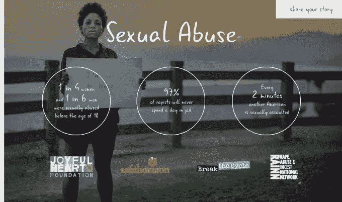
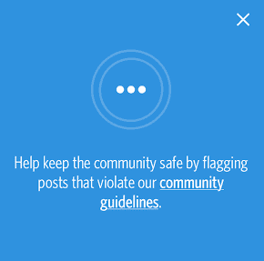
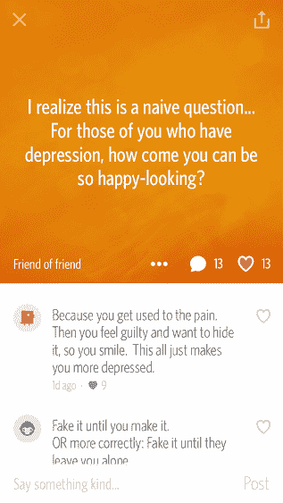

# Whisper 的非营利组织 Your Voice 现在是一个公开讨论抑郁症的数字平台 

> 原文：<https://web.archive.org/web/https://techcrunch.com/2014/08/14/whisper-switches-its-non-profit-your-voice-to-a-digital-platform-to-give-a-voice-to-those-who-suffer/>

# Whisper 的非营利组织“你的声音”现在是一个公开讨论抑郁症的数字平台

在过去一周所有关于抑郁症和自杀的讨论之后， [Whisper](https://web.archive.org/web/20230203063013/http://whisper.sh/stories/) 创始人[迈克尔·海沃德](https://web.archive.org/web/20230203063013/http://www.crunchbase.com/person/michael-heyward)和[布拉德·布鲁克斯](https://web.archive.org/web/20230203063013/http://www.crunchbase.com/person/brad-brooks)宣布他们将开始为 [Whisper 的](https://web.archive.org/web/20230203063013/http://www.crunchbase.com/organization/whisper)独立非营利实体[你的声音](https://web.archive.org/web/20230203063013/http://www.your-voice.org/)捐赠 100 万美元。Whisper 还宣布，你的声音今天变成了一个新的数字平台，供 Whisper 用户和其他人分享他们的斗争，希望让其他人知道他们并不孤独。

早在 2012 年，你的声音就作为一个预防抑郁症和自杀的信息网站推出了。关于自残和自杀想法的令人不安的消息不断在移动网络上弹出，以分享秘密。布鲁克斯对此非常担心，他说你的声音是 Whisper 对这类帖子的回应。

“拨打自杀预防热线的人更有可能获得帮助。他们可能会成功，”布鲁克斯说。“我们需要创造一种方式让其他人知道他们并不孤单，”他解释道。新平台将允许个人上传视频证明，讲述他们与一系列问题的斗争，包括焦虑、抑郁、自杀、压力管理、身体形象、饮食失调、性、欺凌和性虐待。

这与 Whisper 应用程序的性质有点奇怪。Whisper 上的所有内容都是匿名发布的。这个新平台要求人们公开他们的斗争。“我们相信分享和人际关系会带来很大的不同，但不幸的是，75%的年轻人从不寻求帮助，”你的语音指导和注册治疗师妮可·布鲁克斯说。她解释说，这就是为什么应用程序和非营利组织是分开的。“我们需要保持应用程序的完整性，”布鲁克斯告诉我。

另一款匿名社交应用 [Secret](https://web.archive.org/web/20230203063013/https://www.secret.ly/) ，虽然没有独立的非营利组织来指引其他人，但它确实鼓励人们标记危险的内容，并提醒社区“说些善意的话”，作为对帖子中潜在欺凌的解决方案。社区成员也不时发帖，要求人们拨打自杀热线或给朋友打电话。

[Secret 的社区指南](https://web.archive.org/web/20230203063013/https://www.secret.ly/community)也警告用户不要欺凌他人或发布鼓励自残的帖子。联合创始人 [David Byttow](https://web.archive.org/web/20230203063013/http://www.crunchbase.com/person/david-byttow) 告诉我，关于自杀的令人不安的帖子也已经被讨论过，这是一个领域秘密“…将继续投资，以及其他许多东西。”

其他社交媒体网站，如 Pinterest、Instagram 和 Tumblr，也都制定了处理令人不安的信息的政策。 [Pinterest](https://web.archive.org/web/20230203063013/http://www.crunchbase.com/organization/pinterest) 是一家在谈到暗示伤害风险或 proana/thinspo 性质的深色大头针时采取强硬路线的公司。一年前，[公司发布了](https://web.archive.org/web/20230203063013/http://www.nydailynews.com/life-style/health/pinterest-cracks-pro-anorexia-thinspiration-boards-updated-policies-article-1.1050976)一份修订后的[可接受使用政策](https://web.archive.org/web/20230203063013/http://about.pinterest.com/en/acceptable-use-policy)，以加强对鼓励危险行为的帖子的不容忍。

然而，制定政策和删除厌食症模特或自杀的照片与伸手到海报上获得他们需要的帮助是完全不同的。问题是，许多抑郁的人报告说他们对自己的抑郁感到羞愧。根据健康热线，80%以上的抑郁症患者没有寻求帮助。抑郁的人报告说感到羞愧，当他们不开心的时候，需要看起来开心。

虽然“耳语”和“你的声音”并没有确切地说明他们将如何让那些遭受痛苦的人公开分享他们的经历，但两人都表示，这是帮助人们认识到他们不必孤军奋战的重要一步。“我们的信息很简单，”布鲁克斯说。“你的声音就是我们的声音。”

[YouTube https://www.youtube.com/watch?v=jFSGPDwJR7U&w=560&h=315]