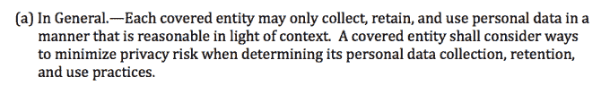

# 白宫放弃“消费者隐私权法案”草案 

> 原文：<https://web.archive.org/web/https://techcrunch.com/2015/02/27/white-house-drops-consumer-privacy-bill-of-rights-act-draft/>

# 白宫放弃“消费者隐私权利法案”草案

在周五晚些时候的新闻稿中，白宫公布了消费者隐私权利法案的草案。这里可以阅读全文[。用它自己的话说，该法案旨在“建立商业领域个人隐私的基本保护，并通过由不同利益相关者制定的可执行的行为准则，促进及时、灵活地实施这些保护。”](https://web.archive.org/web/20221208074847/http://www.whitehouse.gov/sites/default/files/omb/legislative/letters/cpbr-act-of-2015-discussion-draft.pdf)

该提案详细说明了个人应该能够从他们使用的服务中获得什么，包括如何管理安全性。它还处理数据删除和用户同意的撤销。服务将有 45 天的时间来满足删除请求。

还列举了对可以收集的信息种类的限制:

该提案还允许消费者请求第三方持有的私人数据。然而，如果个人的要求是“无聊或无理取闹”，那这一点就没有意义了。

对这一提议的反应毫不奇怪地迅速。TechFreedom 的总裁 Berin Szoka 是 FCC 基于标题 II 的网络中立规则的反对者，[说了下面的话](https://web.archive.org/web/20221208074847/http://techfreedom.org/post/112261952429/obama-escalates-crackdown-on-the-open-internet):

> “今天，白宫提出了关于互联网公司如何使用消费者数据的新规则，这将从根本上改变互联网企业的工作方式。] […]
> 
> 好消息是:这项法案已经被搁置了。从发布的时间来看，这一点应该是显而易见的:周五下午 4 点。由于其在隐私问题上的信誉已经支离破碎，政府显然放弃了为该法案寻找国会支持者。

这已经够刺耳了。

数字民主中心(Center for Digital Democracy)也投了反对票:“这项立法造成了一个巨大的漏洞，实际上剥夺了任何真正的隐私保护和消费者对其数据的控制。”

最后，参议员埃德·马基在 T2 的一份声明中称该法案不够充分:

> 我们需要公司必须遵守、消费者可以信赖的统一的、法律上可强制执行的规则，而不是由历来反对强有力的隐私措施的行业制定的行为准则。我们昨天并没有庆祝为美国消费者保护互联网的伟大胜利，只是为了扭转局面，让他们的在线信息成为试图窃取美国人个人信息的数字强盗的轻松猎物。

话又说回来，如果索卡先生是正确的，那就没有必要批评这件事了。