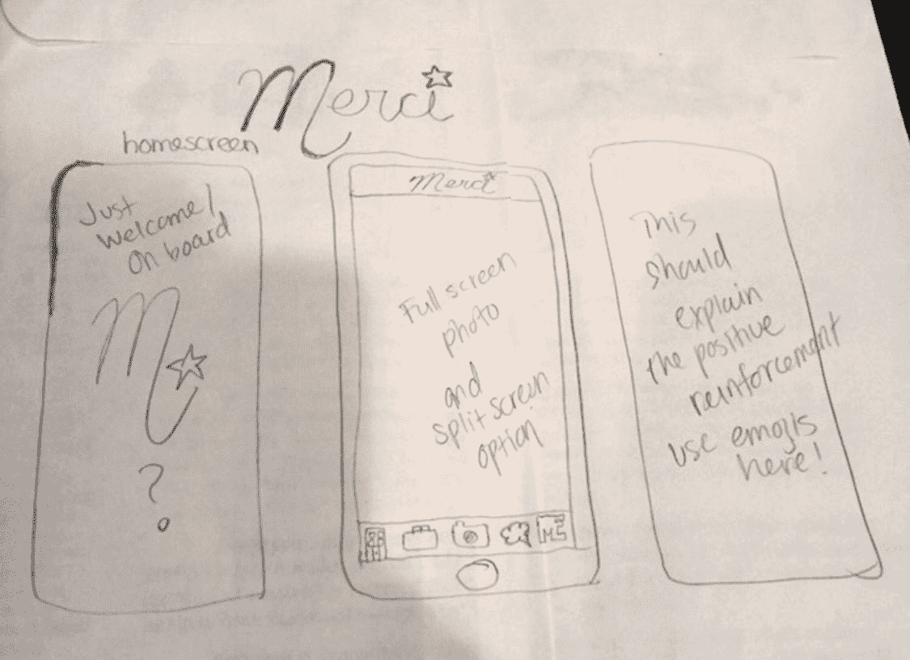
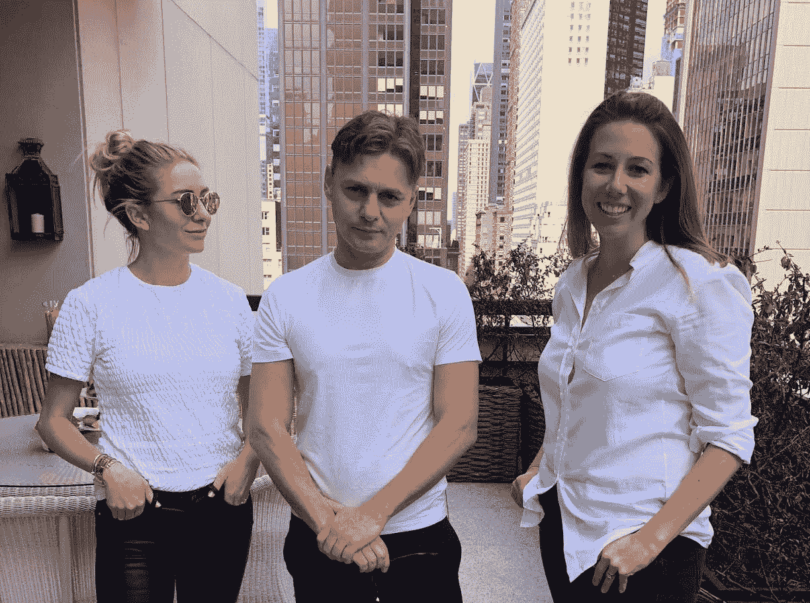
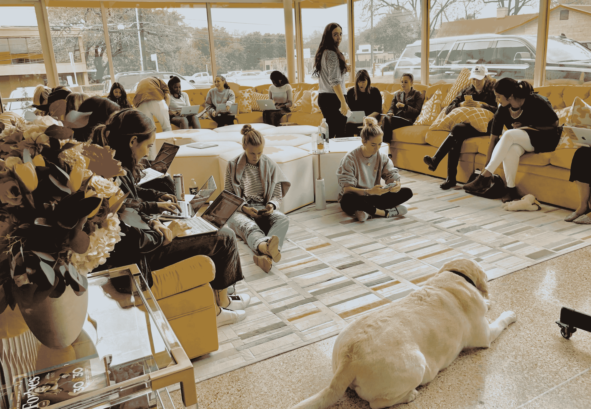
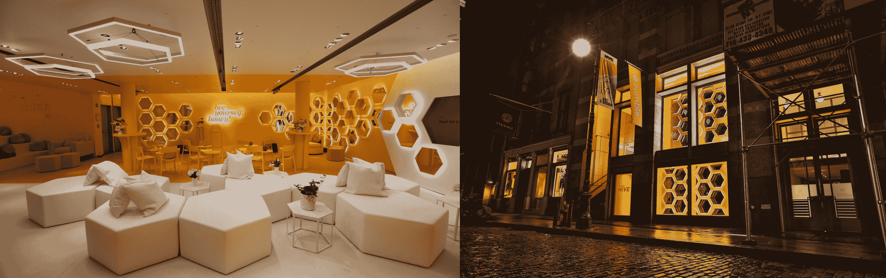
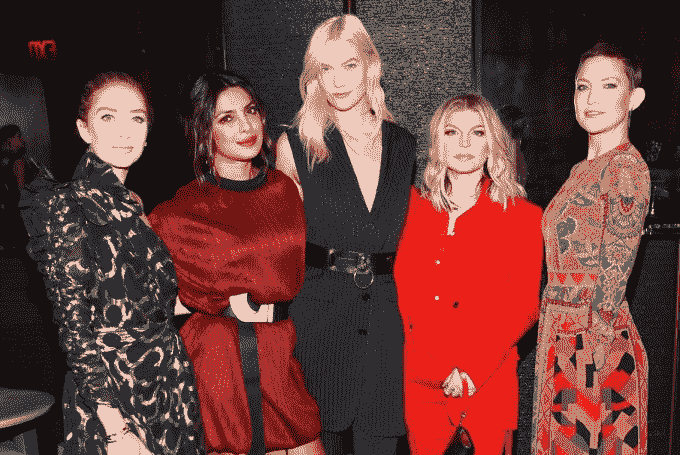

# 惠特尼·沃尔夫·赫德不在乎她应该做什么

> 原文：<https://web.archive.org/web/https://techcrunch.com/2018/05/13/whitney-wolfe-herd-bumbles-founder-doesnt-care-what-shes-supposed-to-do/>

现在是美国中部时间下午 4 点 55 分，周二，在德克萨斯州奥斯汀的 Bumble 总部。在我们坐下来交谈之前，28 岁的女性主导的约会应用程序的创始人兼首席执行官惠特尼·沃尔夫·赫德(Whitney Wolfe Herd)带我参观了这家成立近四年的初创公司的办公室。

我们的第一站是标准的创业水坑，有一些曲折。冰箱里放的是 Topo Chico，而不是 [La Croix](https://web.archive.org/web/20230328203127/http://www.chicagotribune.com/ct-la-croix-startups-bsi-photos-20160815-photogallery.html) ，内置水龙头纯粹是为了装饰。一名队员告诉我，也许有一天它们会装满康普茶或冰咖啡。但是没有提到啤酒。我们已经不在硅谷了。

当 Wolfe Herd 倒了两杯白葡萄酒，扑通一声倒入几块冰块时，她短暂地停顿了一下，问我对饮料的选择是否满意。她的问题很快让我的思绪回到了我 21 岁生日的时候，一个服务员告诉我男人不应该喝加冰块的白酒。

也许没有比这更好的方式来开始我与 Wolfe Herd 的时光了，它提醒我，无论在 Bumble 上有多少亿个由女性发起的配对，该公司仍然存在于一个性别刻板印象如此根深蒂固的世界中，以至于我们无法在第一个人抬起头来之前倒一杯酒。

幸运的是，对我和我单纯的味觉来说，我很快就知道惠特尼·乌尔夫·赫德并不在乎人们认为她或班布尔应该做什么，更不用说我们应该喝什么了。

## “我不是在开发一个约会应用”

Bumble 并不是 Wolfe Herd 第一次接触数字约会和网络世界。她于 2012 年搬到洛杉矶，并成为 Tinder 的早期联合创始人，但最终在对该公司另一名联合创始人的性骚扰和歧视指控中离开了该公司。这场 [的官司解决了](https://web.archive.org/web/20230328203127/https://techcrunch.com/2014/09/08/tinder-and-iac-settle-sexual-harassment-suit-with-early-employee-whitney-wolfe/) ，虽然过去的已经过去了，但历史确实有助于为最终会变成一场闹剧的想法搭建舞台。

“我只是噗的一声，不见了，不复存在了。这就像是抛弃了被抛弃的生活，逃离了风暴或其他什么，”沃尔夫·赫德在谈到离开 Tinder 后离开洛杉矶时解释道。“我正在经历这一切，然后 Twitterverse 和 Instagram 世界以及在线领域开始攻击我。我从来没有真正理解网络欺凌。我甚至不知道那是什么意思，也不知道那是什么感觉。这让我真的很沮丧。”

众所周知，成功的企业家都是这样做的，Wolfe Herd 很快就开始想办法将这些私密的个人经历融入到新产品中。她的解决方案是 Merci，一个女性专用的社交网络，“植根于赞美、善良和良好行为。”

Bumble 的原始模型，当时被称为 Merci

当她正在构思的时候，世界上最大的交友平台 Badoo 的创始人兼首席执行官安德烈·安德雷耶夫联系了她。Wolfe Herd 对此一无所知，但安德雷耶夫将她离开 Tinder 视为一个机会，邀请她在伦敦会见 Badoo 团队，该团队已在那里工作了 10 多年。沃尔夫·赫德有些不情愿，但她决定放手一搏。毕竟，她在寻找对她 Merci 想法的反馈，最糟糕的情况下，她至少会带着一个更好的想法离开，她下一步想做什么。

但是安德雷耶夫有其他的计划。在他们第一次见面时，他坦率地要求 Wolfe Herd 成为 Badoo 的首席营销官。

她甚至没有考虑这个提议。首先，这将要求她搬到伦敦，更重要的是，她坚决不再在约会界工作。随着 CMO 的提议在会议的后视镜中出现，Wolfe Herd 将话题转移到 Merci，并让安德雷耶夫深入了解了她对基于赞美和积极反馈的女性专属社交网络的想法。

“我喜欢它，”安德雷耶夫说。"我们将把这个约会应用程序命名为 Merci . "

她被吓呆了，甚至在她复述这个故事的时候。

“那个什么？你在说什么？你听到我说的了吗？我不是在建一个约会应用。Merci 是我的女性专用社交网络的名字。”

安德雷耶夫澄清道:“我喜欢你的女性优先平台的愿景，但你需要在约会中做到这一点。”

实际上，他向她提供了启动这款应用所需的资金，或许更重要的是，他可以完全接触 Badoo 的技术团队来构建和发布这款应用。此外，对新公司的发展方向有充分的创造性控制和决策能力。

来自 L-R:惠特尼沃尔夫赫德，安德烈安德雷耶夫和莎拉·琼斯煨，邦布尔的首席运营官

但是 Wolfe Herd 没有兴趣开发这样一个应用程序，安德雷耶夫也没有兴趣参与一个新的社交网络。所以她回家了，更加坚定了让 Merci 成为下一件大事的决心。但是安德雷耶夫的提议仍然萦绕在她的脑海里。

“我的丈夫，男朋友，不管你想叫他什么——迈克尔，我们就叫他迈克尔，”沃尔夫·赫德告诉我。“迈克尔说，‘惠特，这个机会不会有第二次。你现在就要试着筹集资金？根据风投界的说法，你简直就是一个被鄙视的狐狸精。我祝你好运。我知道你现在没有勇气，因为我已经筋疲力尽了，我对自己很失望。

在她当时的男友(现在的丈夫)迈克尔·赫德的鼓励下，她觉得安德雷耶夫的提议太好了，不能拒绝，于是她回到了伦敦，在那里她和他达成了一个握手协议，开发了这个新的女性优先的约会应用。

## 邦布尔出生了

该公司将作为一个新的实体存在，20%的所有权属于 Wolfe Herd，79%属于 Badoo，1%由 Christopher Gulczynski 和 Sarah Mick 分享，这两位早期顾问在公司成立并运营后全职加入。在商标搜索出现冲突后，这个小组决定选择“邦布尔”,简称“莫邪”。

Bumble 将从得克萨斯州的奥斯丁独立出来运营，在需要的时候可以利用安德雷耶夫和 Badoo 在约会行业的多年经验。这当然不是一种典型的安排，尤其是在科技初创公司的世界里，为了建立一家成功的公司，你应该召集两到三名联合创始人，筹集种子资金，然后进行首轮融资等等。

但是现在，四年过去了，已经有了 3000 万用户，Bumble 的工资表看起来和公司成立时一模一样。Wolfe Herd 的 20%未稀释的创始人股份证明了一条非典型的道路对 Bumble 是正确的。

## 没有工程师的创业办公室

作为一名科技作家，当我走过 Bumble 在奥斯汀的总部时，我很快意识到这不是一个典型的创业办公室。它看起来和感觉上更像一个起居室，而不是任何一种标准的科技办公环境。

对于一个现在挤满了 50 多名员工的小空间来说，只有大约 25 张桌子，而且在我两天的访问中，大多数桌子都是空的。每个人似乎都更喜欢在会议室、柜台、咖啡桌、地板和我见过的最大的沙发上轮流，如果需要的话，这个沙发可以容纳 30 人以上。

“我相信把人们从他们的办公桌前带走，让他们感受到协作和相互激励，而不是被孤立，”她解释道。

虽然这种设置可能对某些公司不起作用，但对 Bumble 肯定有效。但这并不意味着每个人都同意。Wolfe Herd 解释说，在选定一个与她的愿景一致的设计师之前，他们不得不轮换多个设计师。

她告诉我，“很多人都想把它变得超级实用、简约、鲜明……近乎冷酷。”。“我不想让它有那种感觉。我想让它感觉热情和温暖，并以不同的方式来做。”

走过邦布尔的办公室时，设计并不是唯一引人注目的东西。它也没有一个工程师。

正如安德雷耶夫在 Wolfe Herd 最初决定建造 Bumble 时所承诺的那样，所有的工程仍然由 Badoo 的伦敦办公室负责。虽然一些技术资深人士可能会抨击 Bumble 将他们的工程任务交给母公司，但她对这种安排的好处和实用性并不感到抱歉。

“如果我出去尝试在没有技术支持的情况下独自完成这项工作，Bumble 将会落后一年半。想想我们[在那段时间]结的所有的婚、生的孩子和建立的联系，”沃尔夫·赫德解释道。

她继续说道:“这就像是在修路。如果你能更快地从某人那里获得材料，让人们的生活变得更轻松，你为什么会说，‘不，我想用我自己的双手建造它’，只是为了能够说我做到了？”

我问 Wolfe Herd，他们的团队是否曾经希望他们的开发人员坐在隔壁房间，准备参加产品咨询或路线图会议。

但是 Wolfe Herd 实际上将 Bumble 的成功归功于在一个缺乏开发团队的环境中工作。具体来说，她解释说，这给了她的团队创作的自由，让 Bumble 的信息和品牌来驱动产品，而不是相反。通过让品牌取代产品，Bumble 跨越了“连接应用”阶段，成为了一个生活方式品牌。

“你在一个用户的生活中有哪些不同的接触点？你如何在他们下班回家的路上找到他们？你如何在社交媒体上与他们交谈？你如何让他们觉得自己很特别？你如何将你的品牌加入他们不同的接触点？”沃尔夫·赫德说。她最初的愿景是建立一个植根于积极和肯定的社交网络，但问(和回答)这些问题让她能够帮助 Bumble 用户建立一个植根于积极和肯定的世界。

## 范思哲、巴黎世家、邦布尔

去年夏天，如果你碰巧走过纽约时髦的 Soho 街区，你可能会注意到在 Mercer 街上一个夹在 Versace 和 Balenciaga 之间的新房客。

在第一个约会应用和几乎所有社交应用中， [Bumble 开放了一个物理空间](https://web.archive.org/web/20230328203127/https://techcrunch.com/2017/06/01/bumble-is-opening-a-physical-space-in-new-york-for-dates-to-meet-up/) ，试图将周围自然形成的社区正式化。当时她告诉我，开业之际，Bumble 的品牌正成为人们在现实生活中引以为豪的东西。

班布尔的纽约蜂巢

【Wolfe Herd 周围的其他人反复向我传达这一信息，这似乎是该公司用来跟踪其成功的内部晴雨表之一。Samantha Fulgham 是 Bumble 的第二名员工，现在负责校园营销和外联，她解释了男大学生现在如何申请成为大使、实习生甚至全职员工。

大概两年前，我们在美国尝试过让男生成为校园大使。他们不是真的想做，因为他们认为这是女孩的事情。现在我们在加拿大再次尝试，已经有很多人问他们如何为邦布尔工作……他们说，“我想成为这家公司的一部分。””

不仅仅是大学生渴望与这个品牌建立联系。当 Bumble 去年秋天推出其商业网络产品时，这家初创公司的纽约发布会有朴雅卡·乔普拉、凯特·哈德森和卡莉·克劳斯参加，而洛杉矶的发布会则有格温妮丝·帕特洛、詹妮弗·加纳和金·卡戴珊·韦斯特参加。

邦布尔·比兹的纽约发布会。来自 L-R:惠特尼沃尔夫赫德，朴雅卡·乔普拉，卡莉·克劳斯，菲姬和凯特·哈德森。尼尔·拉斯莫斯/BFA.com

## 对真实问题的数字响应

Bumble 之所以能够成长为今天的公司，是因为它建立在对争议问题表明立场的基本原则上:女性从来就不应该采取主动。但 Bumble 并没有就此止步，在 Wolfe Herd 的领导下，这家初创公司一直非常积极地确保他们用自己的声音来解决其他公司被教导要避免采取立场的问题。

在斯通曼·道格拉斯学校枪击案发生后，邦布尔做了一件几乎打破了市场营销和公共关系 101 中所有规则的事情:这款约会应用非常公开地决定通过禁止其平台上的枪支图片，将自己插入到我们国家正在进行的枪支辩论中。

“我们只是想创造一个让人们感到轻松的社区，在那里他们不会感到威胁，我们只是不认为枪支符合那个等式，”Wolfe Herd [在禁令后告诉纽约时报](https://web.archive.org/web/20230328203127/https://www.nytimes.com/2018/03/05/business/bumble-dating-app-gun-images.html) 。

她 [当时告诉我](https://web.archive.org/web/20230328203127/https://techcrunch.com/2018/03/05/bumble-is-banning-guns-from-profile-pictures/) 此举不应该被视为 Bumble 对枪支或枪支所有者采取强硬立场，而是对他们平台上的暴力正常化采取强硬立场。

虽然一个局外人可能会惊讶地看到这样一个快速发展的公司打破现状，决定在一个政治问题上表明立场，但了解 Wolfe Herd 的人会说，这样做正是 Bumble 在如此短的时间内如此成功的原因。

## 下一步是什么？

对于一个有史以来就存在的行业来说，婚介确实有它的时代。甚至大玩家也想分一杯羹；脸书宣布它正在向约会领域扩展。那么，Bumble，一家刚刚成立四年的非风险投资公司，如何利用所有这些关注，同时保护自己免受大公司进入该领域的威胁呢？

今年夏天，我们报道了 Tinder 的母公司 Match 着手收购 Bumble、 [的消息，先是估值 4.5 亿美元的](https://web.archive.org/web/20230328203127/https://techcrunch.com/2017/08/23/match-group-tried-to-acquire-bumble-for-450-million/?_ga=2.175231905.2015969044.1525558313-1042603733.1484962843) 、，然后几个月后的 [、【远远超过】10 亿美元的](https://web.archive.org/web/20230328203127/https://techcrunch.com/2017/11/14/match-group-is-still-in-talks-to-acquire-bumble-with-a-valuation-over-1b/) 。对于一家至少部分是因为 Wolfe Herd 在 Tinder and Match 的负面经历而成立的公司来说，这将是一个具有讽刺意味的结局。

两家公司之间的谈判最终失败了，从此事情迅速升级。今年 3 月，Match 起诉 Bumble“侵犯专利和滥用知识产权”，几周后，Bumble 起诉 Match 在收购过程中以欺诈手段获取商业机密。这两起诉讼仍在法庭上进行，但可以肯定地说，在可预见的未来，两者之间的交易是不可能的。

那么，邦布尔的下一步是什么？该公司是盈利和自我维持的，不需要投入资本或出售自己。但 Wolfe Herd 承认，合适的收购者可能会让他们以更快的速度实现“重新调整性别规范，赋予人们全球联系的权力”的目标。

Wolfe Herd 解释道:“如果有合适的机会出现，我们绝对会去探索，我们绝对会一直探索最好的方式去做我们想做的事情，我们的使命是什么，我们的价值观是什么。如果我们能够被收购，这将帮助我们以 10 倍的速度扩大规模，这是我们感兴趣的事情，对吗？”

但是她也清楚现金不是他们想要的。“我们只会考虑那些能够带来战略知识资本、我们尚未涉足的新市场的战略知识，并以取代直接现金的方式增加价值的收购，”Wolfe Herd 说。

对于不经意的观察者来说，这听起来很像脸书及其 20 多亿活跃用户能够很好地帮助 Bumble 迅速将其信息传播到世界各地。

邦布尔似乎也同意这一点。在脸书宣布其约会剧后，邦布尔发表了一份声明说:“当我们看到今天的新闻时，我们很激动。我们的管理团队已经联系了脸书，寻求合作的方式。或许邦布尔和脸书可以联手，让互联空间变得更加安全、更有力量。”

在宣布之后的一次谈话中，Wolfe Herd 说，脸书在约会领域的扩张“实际上对这个行业来说是非常令人兴奋的，因为如果你看看脸书的历史，当谈到建立自己的产品和收购时，他们经常试图建立自己的产品。如果这些产品没有成功上市，通常会有一个收购的过渡。谁知道会发生什么？”

所以如果脸书来敲门，如果邦布尔开门也不要惊讶……而且要快。 但如果他们不这样做，那么目前的指标是，邦布尔将刚刚好。

仅仅四年时间，该公司就打开了基于应用程序的约会开关，将曾经是禁忌的东西变成了用户引以为豪的东西。所以幸运的是，超过 3000 万女性(和男性)使用 Bumble 打破性别陈规，根据自己的条件进行了超过 20 亿次配对，Whitney Wolfe Herd 并不关心她或她的公司应该做什么。