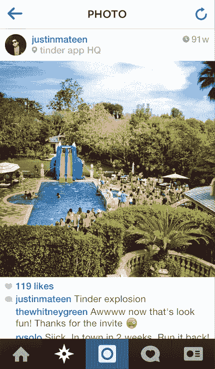
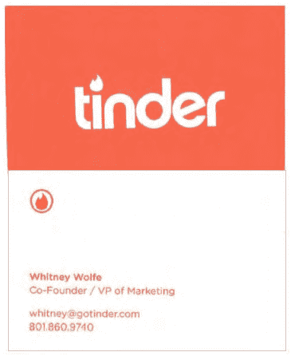
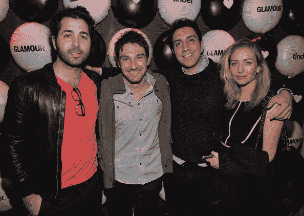

# 惠特尼·沃尔夫对廷德尔的故事

> 原文：<https://web.archive.org/web/https://techcrunch.com/2014/07/09/whitney-wolfe-vs-tinder/>

没有主角的故事是很难写的，但还是来了。在过去的一周，Tinder 的前营销副总裁 Whitney Wolfe 向加州法院提交了[诉状](https://web.archive.org/web/20230228044153/http://www.rezlaw.com/News-Events/06-30-14_Complaint_with_Exhibits-1.pdf)，声称她在工作中受到性骚扰和歧视，被剥夺了联合创始人的头衔，并被不公平地赶出了公司。

讲述这个故事的挑战，就像创业故事中常见的一样，是事实可能比看起来要模糊得多。

诉状中的短信证据似乎显示了 Tinder 联合创始人 CMO·贾斯汀·马丁令人憎恶的行为，他已经被[无限期停职](https://web.archive.org/web/20230228044153/https://techcrunch.com/2014/06/30/tinder-suspends-co-founder-in-wake-of-sexual-harassment-lawsuit/)。马丁拒绝就此事与 TechCrunch 合作。

贾斯汀和惠特尼是恋爱关系、朋友关系、分手关系还是仅仅是同事关系，对我来说并不重要；贾斯汀在那些短信里说的事情绝对没有任何借口。这不是我们唯一一次看到他的不良行为。

但在不为他的行为辩护的情况下，看看这个拼图的不同部分是很重要的，特别是因为这个案件不仅涉及对贾斯汀的指控，还涉及对 Tinder 公司及其大股东 IAC 的指控。

我曾与 Tinder 初创阶段的众多消息人士交谈过，他们中的大多数人因为诉讼而希望匿名。(Tinder 官方拒绝对这个故事发表评论。)

## 点火

2011 年底，肖恩·拉德(Sean Rad)刚刚离开 Adly，开始思考自己接下来要做什么。他和他最好的朋友马丁打电话给当时的 Adly 首席执行官(肖恩的前合伙人)和现在的 Polyvore CRO 阿尼古洛夫-辛格，讨论他们下一次创业的各种选择。他们向古洛夫-辛格咨询不同创意的营销策略。

2012 年 1 月下旬，Sean 被聘为孵化实验室孵化器(部分由 IAC 资助，部分由 Xtreme Labs 资助)的总经理，隶属首席执行官 Dinesh Moorjani。他的任务是开发一款忠诚度应用 [Cardify](//web.archive.org/web/20230228044153/https://www.crunchbase.com/organization/cardify) ，该应用奖励用户刷信用卡的积分。当时，贾斯汀正在出售自己的公司 SiteCanvas，并自己寻找新的项目。

Sean 开始工作大约两周后，他参加了 Hatch 内部的一次黑客马拉松，Moorjani 将 Sean 与 Joe muoz 配对，Joe muoz 是一名也在 Hatch 工作的开发人员。

穆尼奥斯正在开发一个兴趣图后端，帮助根据兴趣匹配人和当地商店。与此同时，肖恩已经谈论了一段时间可能建立一个约会产品，所以两人根据他们两个激情项目的兼容性配对在一起。在二月份的黑客马拉松中，他们制作了 Tinder 的第一个原型。

TechCrunch 已经从该演示中获得了原始的推介资料，Tinder(当时称为火柴盒)是在该项目中向 Hatch Labs 高管和企业家展示的。日期是 2012 年 2 月 16 日。

火柴盒牌(2012 年 2 月 16 日)

演示文稿中的男子是肖恩的密友，演示文稿中的女子是贾斯汀的密友。

根据我的消息来源，Whitney Wolfe 要到 5 月份才会被 Hatch Labs 聘用，而且她直到 2012 年 9 月才被分配到任何*官方*职位从事火柴盒或火绒的工作。

在二月份的黑客马拉松之后，Cardify/MatchBox 团队壮大了。乔纳森·巴丁(Jonathan Badeen)在 3 月份被聘用承担前端职责，克里斯·古尔琴斯基(Chris Gulczynski)大约一周后加入，帮助设计。这四个人当时都在开发 Cardify 忠诚度应用程序。像 Tinder 一样——尤其是它的第一个原型火柴盒——Cardify 的设计灵感主要来自一副纸牌。然而，还是没有刷卡。

从 3 月到 4 月，团队经常在贾斯汀的个人办公室工作，因为洛杉矶的 Hatch 办公室没有提供与纽约同行相同水平的资源。贾斯汀不是卡迪夫队的一员；他只是提供了工作空间。

到 2012 年 5 月，Cardify 已经准备好展示了。哈奇和肖恩正在招募销售团队，让商家和供应商加入进来，肖恩在 2012 年纽约科技博客 TechCrunch Disrupt 上登上[的舞台，向全世界发布这款应用](https://web.archive.org/web/20230228044153/https://www.youtube.com/watch?v=AX6yTvh-8Ig)。

有一个问题:苹果对 Cardify 并不热衷，它花了大约三周的时间才批准了这款应用。

“他们不想无所事事，无所事事，”一位当时与肖恩交谈过的消息人士说。“他想继续工作，并一直试图找到时间来构建火柴盒，所以他和 Dinesh 和 Adam 决定让开发团队参与其中。”

在 5 月的等待期间，穆尼奥斯、古尔琴斯基、巴丁和拉德都埋头搭建火柴盒。然而，他们仍然需要营销承包商在 Cardify 最终获得批准时向商家销售 Cardify。

## 火花

就在这个时候，贾斯汀遇到了惠特尼。惠特尼的一个朋友告诉我，“她和贾斯汀交往过的一个女孩是朋友。”。惠特尼与贾斯汀的妹妹亚历克莎·马丁(Alexa Mateen)有着长期的友谊，她也认识肖恩，并参加了面试，以帮助 Cardify 的销售。

据一位消息人士称，贾斯汀决定将惠特尼介绍给肖恩，并让惠特尼和 Alexa 担任 Cardify 销售代表，这是他作为公司领导者的第一步行动，尽管他并没有正式参与这个项目。

当 Whitney 和 Alexa 去现场向商家展示 Cardify 时，Rad、Badeen、Gulczynski 和 muoz 专注于火柴盒。

惠特尼声称，在 2012 年 5 月开始工作后，她的职责是专注于 Tinder 的大学校园营销。然而，Hatch 的早期员工声称，她甚至很少在 Tinder 工作的办公室，而是在专注于 Cardify 销售的领域。

据知情人士透露，与提交给法院的诉状相反，肖恩和巴丁看好火柴盒。

从六月到七月，Tinder 开始成形。由于火柴盒与投资者 IAC 的 MatchBox 命名法过于相似，该团队开始想出一个新名字。这是一个全舱口的项目，这意味着每个在洛杉矶舱口工作的人都参与了这次演习。其中包括 Hatch Labs 工程经理 Ryan Ogle、Hatch 联合创始人 Adam Huie、联合创始人兼 Hatch 首席执行官 Moorjani 和 Cardify 销售团队。

Tinder 火焰已经由 Gulczynski 设计出来了，所以关键是保持对火焰的关注。FLRT 是一个选择，火柴盒仍然是一个备份。多个来源对谁想出这个名字有不同意见，Munõ、Wolfe 和 Badeen 都被列为可能的名字。

8 月 2 日，该应用程序已准备好黄金时间。Tinder 在 App Store 中试运行，Sean 开始正式启用 Justin。起初，他是临时签约，领导为期两个月的上市营销工作。

作为他的第一步行动，他游说惠特尼和 Alexa 将注意力从 Cardify 转移，并帮助他制定大学校园营销计划。他们目前向 Yvonne Orillac 汇报，她是 Cardify 的销售主管，也拒绝对此事发表评论。

在诉状中，惠特尼声称她随后前往母校 SMU 和她长大的犹他州进行营销之旅，以“揭开”Tinder 应用程序的面纱。她当时的一个朋友告诉我们，这次旅行主要是为了拜访惠特尼一直感兴趣的人，而不是为了推销 Tinder。

不管是哪种情况，惠特尼声称，刚刚被雇用的贾斯汀在她出差离开前撞了她一下，并宣布他最近加入了团队。然而，根据我们的消息来源，贾斯汀已经在 Tinder 的营销工作，其中包括惠特尼本人的重新分配。

“9 月初，我和贾斯汀就 Tinder 营销的问题发了一长串电子邮件，”古洛夫-辛格说，甚至在 Cardify 存在之前，肖恩和贾斯汀也曾向他寻求建议。“他对围绕游击营销和到大学校园参加活动实施计划感到兴奋，就像他在大学里做的那样。”

当肖恩和贾斯汀在南加州大学上学时，贾斯汀经营着一家名为 MW 娱乐公司。他和搭档贾斯帕·韦尔(Jaspar Weir)开派对，预定娱乐项目，获得品牌赞助商，收取门票；这最终成了一项非常有利可图的生意。

“贾斯汀和我是大学推广业务的合作伙伴，在洛杉矶为南加州大学的学生举办活动，”韦尔说。“Justin 开发并执行了一项营销战略，该战略旨在锁定并吸引有影响力的人。对我们来说，这意味着单独接近南加州大学的兄弟会和姐妹会，宣布每个事件，并亲自接触任何我们认为“有影响力”的人。这样做的目的是为了在我们认为是“早期采用者”的人群中获得曝光率和知名度，他们会把其他人带到活动中来。"

“从我们大二到大四，贾斯汀都会举办这些大型派对，这真的令人印象深刻，”贾斯汀在大学的一位老朋友说。"他也因此赚了很多钱。"

贾斯汀的姐姐 Alexa 告诉他惠特尼的旅行后，他建议她采用他在大学时用过的策略。根据朋友们的说法，贾斯汀给了惠特尼关于 SMU 营销闪电战的明确指示:在去姐妹会之前，让 10 个女孩上应用程序，这样他们就可以看到其他有吸引力的人也在平台上。

据当时非常了解 Tinder 的一位消息人士称，由于贾斯汀攻击他的朋友，Tinder 已经有了几千名用户。

贾斯汀的一位朋友说:“我记得在 Tinder 的南加州大学大型发布会前几周的一个晚上，他在一个晚上给他的三百个朋友发短信，告诉他们下载 Tinder。

《GQ》的一篇文章证实了这一点:“贾斯汀开展了个人活动，鼓励人们注册。他会亲自给每个人发短信。他瞄准了他所谓的“社会影响者”，避开了那些可能最需要新的交友方式的“尴尬人群”。

从 SMU 和犹他州旅行回来后，Whitney 参加了上面提到的 Tinder 官方发布会。这是贾斯汀策划的，9 月 29 日在他父母家举行。他的弟弟，泰勒，仍然在南加州大学出席，并帮助了一个大团体出现。成百上千的人聚集在泳池派对上，包括充气滑水道和悬挂在屋顶的巨大易燃物标志。他们都配备了 Tinder 应用程序。那是进去的唯一方法。

一位在场的消息人士告诉我们，惠特尼“中途”离开了。

## 火焰

与惠特尼的说法类似，多个消息来源都认为她与贾斯汀的关系始于 2012 年假期前后。到 2012 年底，Hatch 按计划关闭，Tinder 开始自立门户。该公司成立于 2013 年 4 月，当时股权在员工之间进行了分割，正如惠特尼在她的声明中所述。

“他们相爱了，”一位熟悉这对夫妇的消息人士说。"甚至在早期，她就在谈论想和他终成眷属。"

在诉状中，惠特尼声称贾斯汀追求与她发生关系。然而，多个消息来源表明，在他们开始约会之前，她就对与贾斯汀的关系表示了兴趣。

显然，该公司继续增长。也要快。各地的媒体都对名为 Tinder 的热门约会游戏感兴趣。肖恩和贾斯汀接受了大量的采访。惠特尼也是。

在最近发表的一次采访中[(上文引用的同一篇 GQ 文章)](https://web.archive.org/web/20230228044153/http://www.gq.com/life/relationships/201402/tinder-online-dating-sex-app?currentPage=2)，惠特尼·沃尔夫和贾斯汀·马丁一起讨论了 Tinder 的起源，从文章本身来看，似乎他们两人在 Tinder 在大学校园的营销中发挥了重要作用。这就好像他们是一个标签队。尽管如此，同一篇文章赞扬贾斯汀在校园活动营销方面的经验和知识，以及从当地招聘代表。

> 部分受到首先在精英大学启动的脸书之路的启发，贾斯汀不仅转向常春藤联盟，还转向以派对闻名的学校。在南加州大学播种后，贾斯汀和惠特尼前往学校，如达拉斯的 SMU。惠特尼可能会站在兄弟会的桌子上，宣布应用程序上有 200 名性感的姐妹会女孩在等待男性注册，然后跑到姐妹会，告诉他们相反的情况。他们在身后留下了一串贴纸——在最好的校园酒吧，在最高级的夜总会。

一名 Tinder 员工告诉我，贾斯汀和肖恩经常提到项目的联合创始人克里斯·古尔琴斯基(Chris Gulczynski)和乔恩·巴丁(Jon Badeen)——穆尼奥斯(他没有回复置评请求)已经离开公司去做其他事情了。

据办公室的人说，惠特尼接受采访时，她反复要求肖恩让她以“联合创始人”的身份离开，声称如果她有这个头衔，媒体会更认真地对待她。

根据我的消息来源，肖恩和惠特尼是非常亲密的朋友(毕竟，她在和他最好的朋友约会，他们都在一起工作),事实上，他确实做出了很多次让步。

“肖恩知道她不是创始人……我们都知道她不是创始人，”一位消息人士在电话中说。“但他想帮助她的事业，他知道媒体中有女性代表对公司来说是件好事。”

我个人看到了惠特尼在 6 月份发给一位同事的一条信息，她说她将在名片上使用营销副总裁，但没有提到联合创始人这个头衔。

尽管如此，惠特尼的声明包括一张名片，上面有联合创始人的头衔。据消息人士透露，这些名片是由初级设计师莎拉·米克处理的，她给公司发邮件询问每个人的头衔。Tinder 的一名员工告诉我，除了 Chris Gulczynski，所有人都直接回复了 Sarah Mick(没有抄送给其他员工),给出了他们的职位信息。

一名员工甚至讲述了一个例子，惠特尼说她知道自己不应该在电子邮件签名中使用“联合创始人”，但会继续这样做，直到肖恩发现。

不久之后，早期 Tinder 团队的其他成员也想要联合创始人头衔。据一位不愿透露姓名的早期 Tinder 员工透露，像克里斯·古尔琴斯基(Chris Gulczynski)和亚历克莎·马丁(Alexa Mateen)这样的人，他们在那里的时间即使不比惠特尼长，也和惠特尼一样长，但他们想知道为什么没有相同的头衔。

蛋糕上的糖衣是惠特尼在她的声明中引用的实际文章，在那里《时尚芭莎》称她为“发明火绒的女人”据 Tinder 公关团队的多名人士称，Whitney ~~独自获得了那篇文章的报道，而~~误导了记者，以至于公关团队不得不反复要求对文章进行更正。据证实，惠特尼背着公司其他领导发表了这篇报道。

**更正:在就此事与我的消息来源快速通话后，惠特尼并没有独自获得《时尚芭莎》的报道，尽管她确实推动了 Tinder 的公关，让她与媒体渠道取得了联系。**

与此同时，员工们回忆起乔纳森·巴登，他从一开始就在那里，很少被媒体提及，似乎对这篇文章明显感到沮丧。

一名员工参加了肖恩和惠特尼的会面，他说，在《时尚芭莎》的文章和其他几篇类似的文章发表后，肖恩解释说，惠特尼不应该在媒体上使用联合创始人这个词，因为这会给媒体和 Tinder 内部造成混乱。

“这从来就不是她在公司的实际头衔的一部分，无论是在名片上还是在电子邮件签名上，”与会的证人说。“至少不应该是这样。他认为这对惠特尼和 Tinder 都有好处，但一旦它开始给这么多人带来问题，我想他意识到他一开始就不应该让它发生。哪怕只是给媒体看。”

这位证人说，文章发表后不久，惠特尼给肖恩发了一系列信息，她在信息中表示，她知道自己不应该被这篇文章的联合创始人提及。

## 火焰

在 2013 年的大部分时间里，惠特尼和贾斯汀在约会，这款应用像野火一样迅速发展。起初，这种关系对公司的大多数人来说是一个秘密，但员工们在 6 月份的一次公司活动中正式发现了这一点。

贾斯汀的一位密友说:“我有点担心贾斯汀和惠特尼，因为我不太确定他们在一起工作时是否应该约会。”“但是贾斯汀很开心，惠特尼告诉我她有多爱他，她想和他在一起，和他生孩子。他们看起来很开心，所以我就不管了。”

正如惠特尼在诉状中所说，这段关系在 2013 年秋天陷入了动荡。

惠特尼和贾斯汀的朋友都表示，这对夫妇对贾斯汀花在 Tinder 上的时间有问题。10 月份，在 Tinder 办公室附近的一次午餐会上，一名员工听到贾斯汀对惠特尼说，Tinder 永远是第一位的。

尽管如此，官方分手的细节仍不清楚。惠特尼的诉状称，他们在 2013 年 12 月 12 日彻底结束了，尽管惠特尼的朋友告诉我，他们继续发送浪漫的信息和仇恨的信息(与你在诉状中看到的类型相同)。据贾斯汀的一个朋友说，他们在 2014 年 2 月一直保持着相当规律的性生活。

据一位朋友说，惠特尼通过短信说她爱贾斯汀，无法停止对他的思念。这也是在 12 月。

我的消息来源，贾斯汀和惠特尼的一些朋友以及 Tinder 的员工，甚至不能同意贾斯汀和惠特尼分手的大致时间。一名媒体成员为了一个故事采访了惠特尼，记得惠特尼反复说贾斯汀在 2013 年秋天和她分手了。一些人同意在 12 月或 1 月左右的一段时间他们没有在一起，一个人甚至回忆起在惠特尼去阿斯彭过圣诞节的时候和她聊天。

这位朋友说，她很兴奋惠特尼正在离开贾斯汀，因为她在阿斯彭遇到了一个新的人，一个名叫迈克尔·赫德的人，他们继续保持着浪漫的关系。迈克尔·赫德是鲍勃·赫德的孙子，也是赫德生产公司的副总裁，该石油公司在路易斯安那州和东得克萨斯州拥有并经营着 400 多口油井。

贾斯汀·马丁、乔纳森·巴丁、肖恩·拉德和惠特尼·沃尔夫在《魅力》杂志为 Tinder 举办的派对上。

虽然很少有消息来源同意确切的分手日期，但许多人都同意贾斯汀和惠特尼最后一次做爱是在 2 月 3 日，在《魅力》杂志举办的一场派对之后。聚会上的目击者称，惠特尼喝得酩酊大醉，特别是对贾斯汀感兴趣，甚至大声说:“贾斯汀，今晚我要上你。”

贾斯汀的一个朋友开车送他回家，他向我讲述了这个故事:

> 惠特尼打电话给贾斯汀说有人骚扰她或者抢劫她的公寓什么的。她说她需要帮助，所以贾斯汀让我一路开车去她家看看发生了什么事。当我们到达那里时，一切正常。她不知道我在那里，她光着身子开门等贾斯汀。那天晚上他呆在那里。

在二月和三月下旬之间，惠特尼和贾斯汀之间的关系还不太明朗。一名员工记得有一次惠特尼以非常激烈的方式接近贾斯汀，并开始在办公室讨论个人问题。

“贾斯汀一直告诉她不要在办公室这样做，但她就是不松口，”这位员工说。”最终，亚历克莎·马丁站了起来，告诉惠特尼不要在办公室讨论个人私事。惠特尼告诉她，如果她再卷进来，就杀了她。”

在此期间的另一个例子中，Whitney 声称她在新任营销经理 Josh Metz 面前经历了 Justin 的不当对待。据该公司的员工称，惠特尼后来在一次营销会议上当着乔希、贾斯汀、肖恩和其他几名员工的面被问及该事件，并向他们所有人承认，她完全撒谎了，意识到梅斯不会证实她的故事。

惠特尼是否真的在这件事上撒了谎，或者只是迫于压力才这么说，还不清楚。

在二月和三月之间，两个独立的消息来源说惠特尼正在考虑采取法律行动。惠特尼的律师大卫·洛不愿评论迈克尔·赫德是否是他的客户之一，但他明确表示赫德不会支付惠特尼的法律费用。

## 余烬

在 4 月 6 日 Tinder Malibu 派对的晚上，贾斯汀的朋友们说，他刚刚发现惠特尼据称在他们在一起时与另一名男子有染。据惠特尼的一位密友说，惠特尼知道他已经发现了，并急于参加派对。

另一名目击者说:“当惠特尼到达派对时，她挥舞着双臂在房子里走来走去，非常喧闹。”“她在里面，我在外面，所以我听不到她，但有很大的玻璃墙，所以我可以看到她走过来。她一到外面，就尖叫着说他们都在密谋反对她，说她坏话。”

这位证人所说的“他们”指的是在后院的草地上说话的一小群人，包括肖恩、贾斯汀、亚历克莎·戴尔(肖恩的女朋友)和亚历克莎·马丁。

“亚历克莎·戴尔和亚历克莎·马丁走进去，然后惠特尼开始对贾斯汀动手动脚，”一名目击了这场打斗的独立消息人士说。"她大喊大叫，最后肖恩试图分开他们。"

目击现场的四名消息人士都没有看到或听到贾斯汀称惠特尼为“妓女”，就像她在诉状中声称的那样。如果是他干的，他也是悄悄地干的。最终，在贾斯汀离开后，肖恩要求惠特尼离开派对，当惠特尼离开时，她在厨房停了下来。

没有人清楚这场争吵是如何升级的，但一名目击者告诉我，惠特尼最终揪了肖恩女友的头发和衣服，为了“摆脱惠特尼”，她朝她吐口水。

“惠特尼不停地说‘我受够这一切了’和‘我受够你们了’，”派对上的另一名目击者说。

从各方面来看，大多数 Tinder 员工都记得惠特尼辞职的那个晚上。在她的诉状中，她声称自己是被首席执行官肖恩·拉德(Sean Rad)赶出来的，尽管她在 4 月派对当晚的行为似乎被视为辞职。

## 烟

正如我在这个长篇故事的开头所说，我们没有真正的主角。

诉状中那些短信中贾斯汀使用的语言是没有任何理由的。不管他们的关系在整个过程中处于什么样的状态，我的观点是，与下属约会是不负责任的，让这种关系破裂的戏剧性发展演变成他们共同创建的公司，更是不负责任的。

不管惠特尼可能煽动了什么，我相信，作为职业关系中的上司，处理他们个人的情况是他的责任。

从过去一周我听到的几十个故事来看，惠特尼·沃尔夫和贾斯汀·马丁的私人关系似乎很混乱，充满感情和戏剧性。无论她是在欺骗他，激怒他还是其他，我个人都不能容忍贾斯汀让这种关系潜在地影响到工作场所。毕竟，他是上级。

与此同时，肖恩·拉德似乎也犯了自己的错误。他似乎在很多层面上与员工走得太近了。穆尼奥斯等早期员工的一些陈述表明，肖恩与贾斯汀的友谊影响了后者在公司的角色。但多个消息来源表示，尽管他们是朋友，但马丁在该应用的早期成功中发挥了重要作用。

尽管如此，让惠特尼在媒体上使用联合创始人这个词的决定可能是一个错误的决定。惠特尼在她的诉状中说，取消它的决定可能会更糟。如上所述，来自多个渠道的信息表明，她对 Tinder 早期成功的贡献可能没有她所说的那么大。还有证据表明，她可能背着其他创始人并违背他们的意愿使用了联合创始人这个词，这让情况更加扑朔迷离。

授予这个头衔并再次取消它(以任何身份)可能是肖恩出于天真甚至善意而犯的错误，也许是为了让公司的女性代表出现在媒体上或帮助促进惠特尼的职业生涯，但这似乎是一个新手的错误，可能会产生非常成熟的后果。

惠特尼对 Tinder 的另一个核心投诉是肖恩·拉德在回应对马丁行为的投诉时的不作为。Whitney 在投诉中没有提供实际证据证明 Rad 的不作为。事实上，在投诉中，她在 4 月 1 日对一个朋友提到，她还没有和肖恩谈论贾斯汀的问题。那是在马里布派对的五天前。

惠特尼·沃尔夫的投诉描绘了一幅由性别歧视者领导的公司的画面，他们从来不希望她成功。根据我所听到的说法，事实并非如此。

为了这个故事，我采访了十几个消息来源。没人告诉我，惠特尼带头发起了一场运动，将重心从卡迪夫转移到火绒上。没有人能确切地说出是谁想出了这个名字。从来没有人告诉我，他们看到肖恩·拉德(或贾斯汀·马丁，就此而言)在办公室里对她不恰当或不尊重。最重要的是，没有一个人告诉我，她应该被视为 Tinder 的联合创始人。

对于这位联合创始人来说，需要考虑的事情很多。在很多方面，联合创始人这个词并没有太大的意义。提出想法的人并不总是能够实现它。问问雷吉·布朗或温克里维就知道了。在 Tinder 的例子中，Sean Rad 确实想出了这个主意。联合创始人不是一个法律术语，也不总是包含在条款清单和股权文件中。本质上，这是一个营销术语。

然而，从法律上来说，如果惠特尼是一个合法的联合创始人，却无缘无故地被剥夺了这个头衔，那么 Tinder 可能会受到伤害。

“这不是关于联合创始人职位的有效性，而是关于她可能被降职的看法，”艾布拉姆斯·芬斯特曼律师事务所的律师埃里克·布劳特曼告诉 TechCrunch。“联合创始人这个词带来了更高的声望，所以如果这个词是不公平地从她那里拿走的，那么这个说法可能是有效的。”

然而，惠特尼似乎很清楚，她使用“联合创始人”这个词是为了给公司做宣传，而不是因为她实际上是公司的联合创始人。否则，她为什么会在 2013 年 1 月要求使用“联合创始人”这个头衔(正如诉状中所附的证据所示)，然后在 6 月 iOS 7 发布后的某个时候再次要求使用这个头衔？

这并不是说她早期与贾斯汀(Justin)和亚历克斯·马丁(Alexa Mateen)一起营销 Tinder 的贡献对 Tinder 的成功不重要，而是这些对话的事实给她是否被不公平地剥夺了头衔的问题增加了一些灰色地带。

很容易将惠特尼·沃尔夫诉 Tinder 的故事视为另一个在工作场所涉嫌性骚扰和歧视的既定案例。但它远比这更微妙。

该案件合并了两个相对独立的问题——对马丁的歧视和骚扰指控，以及对 Tinder 的不公平解雇和歧视指控——这使得解开所发生事情的真相变得更加困难。

但据我所知，有几件事是非常清楚的:从一开始，Tinder 似乎就培养了一种公司文化，让员工保持极其密切的私人关系。在这种文化中，职业和个人之间的界限明显变得越来越模糊，而不是随着公司的成长而变得成熟。

抛开任何一方的不良行为不谈，仅此一点就能毁掉一个公司。在 Tinder 的案例中，还不清楚这场大火最终是否会将它烧毁。

**编者按:**惠特尼·乌尔夫·赫德在最初的报道中多次拒绝对此事发表评论，并在文章发表后的过去 3 年里拒绝了多次这样做的请求。TechCrunch 坚持自己的报道。

2017 年 11 月 15 日，Wolfe Herd 向 TechCrunch 提供了评论，但拒绝提供额外的记录在案的评论或证据来回应这个故事。

> Whitney Wolfe Herd 断然否认这篇文章中对她的许多指控，这篇文章中与 Wolfe Herd 相关的一些内容是不准确的。她现在是，过去是，将来也永远是 Tinder 的联合创始人，这一点无可争议。匿名来源的声明对她作为一名女性和一名专业人士的行为提出的负面指控是完全没有根据的，是令人不快的厌恶女性者。此外，时间表和所谓的报价包含多处不准确之处。Wolfe Herd 没有参与本文，她关于这些事件的声明在 2017 年 11 月 15 日之前没有得到解释。

**[编者按](https://web.archive.org/web/20230228044153/http://www.alexiatsotsis.com/post/91366161596/a-note-on-tinder)**