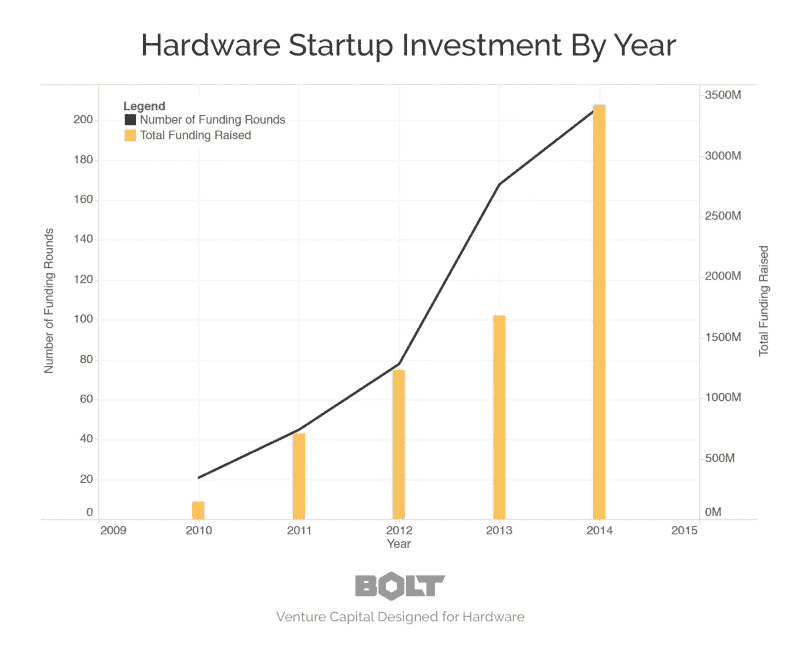
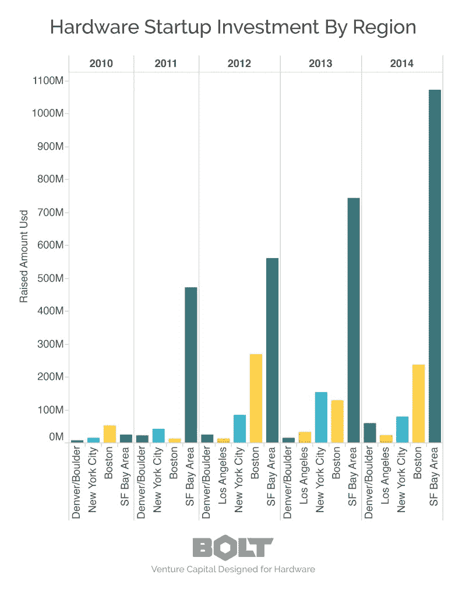
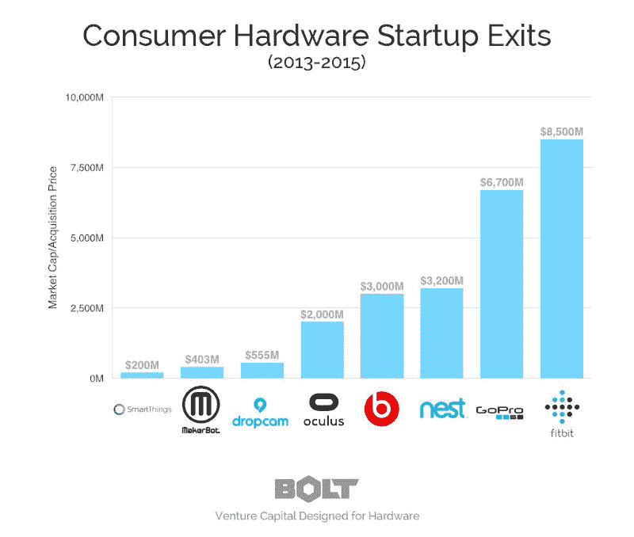

# 谁投资硬件创业公司？

> 原文：<https://web.archive.org/web/https://techcrunch.com/2015/09/12/who-invests-in-hardware-startups/>

# 谁投资硬件创业公司？

克里斯·金特罗撰稿人

克里斯·金特罗是

[Bolt](https://web.archive.org/web/20221206151824/https://www.bolt.io/)

是一只种子期基金，向硬件和软件交叉领域的初创公司投资资金、员工、原型制作设施和专业知识。

More posts by this contributor

虽然许多天使和风投仍然对硬件 初创公司感到不安，但在过去几年里硬件- 融资生态系统已经出现了大规模复兴。自 2010 年以来，风险投资对硬件 初创企业的投资增长了 30 多倍。

从机构风投或天使投资人那里公开融资 100 万美元或以上的硬件/互联设备公司。

随着硬件资金的爆炸式增长，我们一直收到的一个问题是，[“还有谁在投资T21 的硬件？”](https://web.archive.org/web/20221206151824/http://www.bolt.io/who)我们通常将私人硬件投资者分为三类:

*   **硬件——仅限风投。**有少数小基金([和我们](https://web.archive.org/web/20221206151824/http://www.bolt.io/)一样)只和硬件公司合作。我们通常是第一笔资金，可以跟进，但不会引领未来的轮投资轮。
*   **硬件-友好的微型风投。**还有许多其他的[微型风投在种子阶段](https://web.archive.org/web/20221206151824/https://www.cbinsights.com/blog/past-present-future-micro-vc/)投资，但并不专注于硬件。他们一般管理不到 1 亿美元，投资5-50 万美元，并填写种子轮，但往往不领投。
*   **硬件-友好的传统风投。**一般来说，硬件 投资中的大部分资本由传统风投组成，少数特别活跃。对于消费类硬件公司来说尤其如此。

## 这些活动都在哪里？

据我统计，湾区目前有大约 110 家获得资助、联网的硬件 初创公司(已经公开融资 100 万美元或更多)。波士顿和纽约(大致相当)是那个的三分之一。洛杉矶和博尔德/丹佛是波士顿和纽约的三分之一。然而，从筹集的资金总额来看，旧金山完全占据主导地位；2014 年，它几乎是波士顿的 5 倍，是纽约和博尔德的 10 倍以上。其他地方(包括国际市场)都是一个舍入误差，只有几个非常明显的例外(特别是小米、DJI 和 Magic Leap)。

## 为什么是现在？

三个主要的动力驱使私人投资者寻找硬件公司。

**强势退出**

一些突破性的公司已经铺平了道路，证明硬件公司可以获得巨大利润。分销和制造仍然很困难，但 GoPro 和 Fitbit 已经表明，与纯软件的同行相比，硬件可以[有更强的增长指标](https://web.archive.org/web/20221206151824/http://tomtunguz.com/gopro-s1/)和成果。

**类似 SaaS 的指标**

传统的硬件公司除了收入和回报之外几乎没有反馈回路，而联网的硬件 初创公司则不断获得关于产品使用、保留和流失的反馈。这加快了迭代周期，并帮助投资者(他们已经习惯了 SaaS)理解年轻的没有太多销售动力的硬件公司。

**硬件 +软件=商品化程度降低**

随着时间的推移，大多数硬件产品都在商品化和低利润中挣扎。如今的互联硬件产品往往是软件的木马。更难复制的软件会增加转换成本，并提供更多与客户互动和建立品牌的机会。结果是更高的客户终身价值，无论是通过经常性收入( [Dropcam](https://web.archive.org/web/20221206151824/http://www.dropcam.com/) )还是消耗品( [Kindle](https://web.archive.org/web/20221206151824/http://www.kindle.com/) )。

虽然过去几年是风险投资投资的辉煌之年，但互联硬件生态系统已经见证了创业公司和风险投资公司对资助它们的接受度的爆炸性增长。这是由开发成本降低、上市时间缩短以及硬件商业模式从商品化消费电子产品向经常性收入和软件服务的转变所推动的。

今年在融资轮数和总投资方面都有望超过 2014 年，尽管随着许多硬件类别变得饱和，生态系统找出谁是赢家，增长趋于平稳。随着硬件社区的发展，我们希望看到更多硬件 创业工作的[行业。](https://web.archive.org/web/20221206151824/https://medium.com/bolt-blog/hardware-startups-we-d-like-to-fund-1db916af2e04)