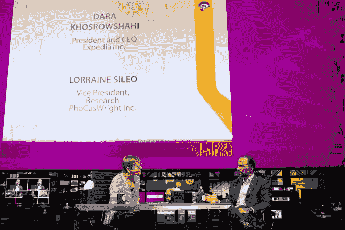

# 谁是优步新任首席执行官达拉·科斯罗萨西？

> 原文：<https://web.archive.org/web/https://techcrunch.com/2017/08/28/who-is-new-uber-ceo-dara-khosrowshahi/>

优步寻找前联合创始人兼首席执行官特拉维斯·卡兰尼克的接班人一事似乎已经有了定论。

Expedia 现任首席执行官 Dara Khosrowshahi 已经正式获得这份工作，[多位接近该公司的消息人士向 TechCrunch](https://web.archive.org/web/20221003191407/https://beta.techcrunch.com/2017/08/27/breaking-uber-has-selected-a-ceo/) 证实。

与更高调的优步首席执行官候选人惠普公司的梅格·惠特曼和通用电气公司的杰夫·伊梅尔特不同，科斯罗萨西相当低调。这很可能是因为 Expedia 的总部不在硅谷，而是在华盛顿州的贝尔维尤，这也让人们对选择 Khosrowshahi 作为优步下一任领导人的决定感到有些意外。当然，前提是他接受这个角色。

## 从移民到上市公司 CEO

那么达拉·科斯罗萨西是谁？

Khosrowshahi 于 1969 年出生在伊朗，但在 1978 年伊朗革命后，他还是个孩子时就移民到了美国。他的父亲在 Khosrowshahi 13 岁时回国照顾父亲，被伊朗当局拘留了 6 年。Khosrowshahi 与他的母亲和两个兄弟在纽约州长大。

从布朗大学获得电子工程学位后，Khosrowshahi 于 1991 年加入 Allen and Co，担任分析师。1998 年，他加入了美国网络公司(现在的 IAC ),随后该公司于 2001 年以 20 亿美元的估值收购了 Expedia(当时是微软的子公司)的大部分股份。

Khosrowshahi 于 2005 年接管 Expedia，当时 Expedia 从 IAC 分离出来，他之前在 IAC 领导旅游业务部门。在他的领导下，Expedia 已经成长为一个 230 亿美元的巨头，业务遍及全球。收入从 2005 年的 21 亿美元跃升至 2016 年的 87 亿美元。

这一发展为 Expedia 的老板带来了丰厚的薪酬，两年前，由于股票激励，他的薪酬接近 9500 万美元，是标准普尔 500 薪酬最高的首席执行官。去年，他的薪酬回到了 250 万美元。

交易是 Expedia 增长的关键组成部分，该公司通过 20 多项收购和投资将其业务扩展到新的垂直行业和地理区域。除了在 Expedia.com 的业务，它还拥有一批访问量很大的旅游和租赁网站，包括 Hotels.com、HomeAway、Travelocity、Orbitz 和 Trivago。

Khosrowshahi 主持的一些主要 M&A 包括过去两年对 home away(39 亿美元)、Travelocity(2.8 亿美元)和 Orbitz(16 亿美元)的收购。

有趣的是，和优步一样，Expedia 也因为咄咄逼人的本土竞争对手而退出了中国市场。2015 年，它出售了长期合作伙伴鳄龙的股份。

[在 2016 年](https://web.archive.org/web/20221003191407/https://www.youtube.com/watch?v=MgX3_ZWDSqU)的演讲中，科斯罗萨西承认，Expedia 在中国的业务和收入都不错，但在竞争“变得具有价格破坏性”后，它选择了退出市场 Expedia 今天仍然活跃，因为它的目标是中国出境游客，但 Khosrowshahi 说，它不再专注于国内市场，因为它的竞争对手更了解这个领域。

这与去年[优步将其中国业务出售给本土竞争对手滴滴](https://web.archive.org/web/20221003191407/https://beta.techcrunch.com/2016/08/01/didi-chuxing-confirms-it-is-buying-ubers-business-in-china/)的原因并无二致。

> Khosrowshahi 在 2012 年的一次活动中接受采访

## 政治

谈到政治——这是一个在科技行业越来越受关注的话题——Khosrowshahi 因公开反对美国总统特朗普的举措而闻名。

Expedia——以及微软和亚马逊——是首批支持宣布特朗普关于移民的行政命令违宪的科技公司之一。Khosrowshahi 本人批评了包括伊朗在内的几个穆斯林占多数的国家实施的旅行禁令，考虑到他的背景，这并不奇怪。

“我相信，有了这个行政命令，我们的总统又回到了短线游戏。他在给员工的一封电子邮件中写道:“作为一个居住地，美国可能会稍微不那么危险，但它肯定会被视为一个更小的国家，一个向内看与前瞻性思维、保守与远见的国家，”[。](https://web.archive.org/web/20221003191407/http://money.cnn.com/2017/01/30/news/companies/travel-ban-executives-business-reactions/index.html)

早在 2 月份，旅行禁令宣布后，他在结束与分析师的电话会议时说:“希望我们都能活着看到明年年底。”

作为一家上市公司的首席执行官，Khosrowshahi 在 Twitter 上相当活跃，他发表了一些针对特朗普政府的言论。

这一次是在特朗普去年大选获胜后:

特朗普上任第一天，他就鼓励人们去旅行，更多地了解他人:

最近，他批评了总统对夏洛茨维尔暴力事件的反应:

他的公开立场标志着与优步截然不同的立场，后者因早期与总统的关系而受损。

[卡兰尼克在受到公众的严格审查后，于二月份退出了总统的商业顾问委员会](https://web.archive.org/web/20221003191407/https://beta.techcrunch.com/2017/02/02/uber-ceo-travis-kalanick-quits-donald-trumps-business-advisory-council/)——该委员会已经被彻底废除。这位时任优步首席执行官曾计划与总统讨论特朗普的旅行禁令，以扭转这一禁令，但直接与特朗普合作且不从委员会辞职的决定带来的负面影响开始影响优步的业务。

卡兰尼克与政府的联系至少是社交媒体上#DeleteUber 运动的部分原因，这场运动导致竞争对手 Lyft 的受欢迎程度首次超过优步的应用。

当[前工程师 Susan Fowler 揭露了她在公司任职期间的多次性骚扰问题](https://web.archive.org/web/20221003191407/https://beta.techcrunch.com/2017/02/19/former-uber-engineer-says-company-ignored-repeated-reports-of-harassment/)时，公司周围的#DeleteUber 和负面情绪又回来了。虽然优步通常以“科技兄弟”文化而闻名，但福勒的说法导致了一份更广泛的报告，最终以许多高管被撤职而告终，[包括 SVP·艾米尔·迈克尔斯](https://web.archive.org/web/20221003191407/https://beta.techcrunch.com/2017/06/12/emil-michael-ubers-svp-of-business-has-left-the-company/)，以及[实施旨在改善优步文化的改革](https://web.archive.org/web/20221003191407/https://beta.techcrunch.com/2017/06/11/ubers-board-votes-unanimously-to-adopt-all-recommendations-of-holder-report/)。

与此同时，Expedia 在性别平衡方面的声誉要好得多。去年夏天，[该公司透露，超过一半的员工是女性，公司雇佣的男性和女性的平均工资是相等的。](https://web.archive.org/web/20221003191407/http://www.prnewswire.com/news-releases/expedia-inc-discloses-pay-and-representation-data-across-gender-lines-300285758.html)

尽管 Khosrowshahi 的立场是进步的，但他选择关注这样一个事实，即他的公司只有三分之一的高级管理层是女性。

“虽然我们与许多技术同行相比表现不俗，但要让更多女性担任领导职务，我们还有很长的路要走。他在当时的一份声明中说:“我们需要吸引、雇佣、聘用和提升全球各种类型的人才，我们相信，通过丰富包括性别在内的所有维度的劳动力多样性，我们可以取得最丰富的成果。”。

## 对抗谷歌

除了总统政治和多元化问题，优步和科斯罗萨西有一个共同的敌人:谷歌。

优步目前正与谷歌陷入一场战争，原因是谷歌窃取了这家搜索巨头的自动驾驶汽车技术。该案将于 10 月开庭审理

Khosrowshahi 长期以来一直通过 Expedia 与谷歌发生纠纷，据称谷歌利用其搜索引擎以牺牲竞争对手的利益为自己的业务部门谋利。

Expedia 是提出正式投诉的公司之一，这导致欧盟委员会对谷歌处以 27 亿美元的罚款，这是自 2004 年微软在 T2 做出决定以来欧洲最重大的反垄断裁决之一。

谷歌长期以来一直是 Expedia 的威胁，这解释了这种尴尬的关系。[这家旅游公司的搜索知名度和流量](https://web.archive.org/web/20221003191407/http://searchengineland.com/expedia-loses-25-of-their-search-visibility-in-google-possibly-over-unnatural-links-182113)都被谷歌算法抢走了，而谷歌自己的旅游业务已经增长到 Expedia 的两倍，根据一些报道。

除了工作，还有一些更有趣的事实:

*   科斯罗萨西是《纽约时报》的董事
*   Code.org 创始人和连续企业家哈迪和阿里·帕托维是他的堂兄弟
*   他认为亿万富翁 IAC 主席巴里·迪勒是一个关键的影响因素
*   他于 2012 年 12 月与妻子悉尼·夏皮罗结婚，他们育有四个孩子

关于 Khosrowshahi 的总体风格，这里有一个 2016 年初对分析公司 Phocuswright 的采访。

[https://web.archive.org/web/20221003191407if_/https://www.youtube.com/embed/MgX3_ZWDSqU?feature=oembed](https://web.archive.org/web/20221003191407if_/https://www.youtube.com/embed/MgX3_ZWDSqU?feature=oembed)

视频

你很可能会看到更多的这个名字和面孔。