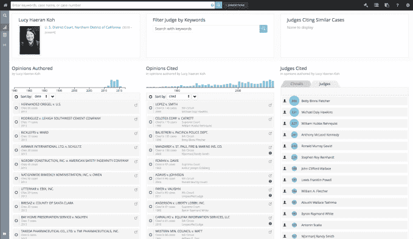

# 通过法官分析，Ravel Law 开始评判法官 

> 原文：<https://web.archive.org/web/https://techcrunch.com/2015/04/16/who-judges-the-judges/>

从谋杀和恐怖主义到专利冲突和性别歧视诉讼，法庭是我们社会中一些最重要的戏剧的家。虽然我们的顶级零售商甚至可以在消费者意识到怀孕前几周就能识别出怀孕的人，但律师们仍在法官面前用基于其他律师的一些轶事的数据来辩论案件。

[Ravel Law](https://web.archive.org/web/20221002064908/https://www.ravellaw.com/) 希望给法庭带来一些大数据魔法，或许还能改善我们的司法系统。

这家初创公司今天发布了他们的法官分析平台。这一想法是为了提供对该国每一位法官的全面了解，让律师在提起诉讼或在法官面前辩论动议之前，为他们的客户研究最佳策略。有了更好的洞察力，律师就能以更低的成本为客户提供更好的服务。

虽然法官通常被认为是真理的客观仲裁者，但事实是每个法官都是人，是他们自身经历和偏见的产物。“没有两个法官是完全一样的，”Ravel Law 的联合创始人兼首席执行官 Nicholas Reed 说。具体的法官甚至审判的具体时间可能对审判的结果产生不成比例的影响。

一些一般性的见解在业内已经众所周知。例如，专利钓鱼者[经常在东德克萨斯](https://web.archive.org/web/20221002064908/http://arstechnica.com/tech-policy/2013/01/east-texas-courts-are-back-on-top-for-patent-lawsuits/)提起诉讼，因为那些法院已经被证明对这类案件相当负责。另一个例子，一项对以色列假释听证会的研究发现，与午饭前举行的案件相比，当天早些时候举行的案件在获得有利裁决方面有很大优势。

但是这类见解通常过于笼统，不能提供真正有助于案件的具体见解。Ravel Law 的另一位联合创始人兼首席执行官丹尼尔·刘易斯解释说，律师的日常工作往往更加专注。“我们应该费心向法官申请一个特定的动议吗？法官什么时候会为处于我们地位的人做出有利的判决？”

Ravel Law 法官 Lucy Koh 的法官分析仪表板，她参与了几起著名的硅谷诉讼

通过其法官分析仪表板，Ravel Law 突出显示了法官过去引用的顶级案件和联邦巡回法院，这些案件可能对法官更熟悉，因此更有可能获得有利的裁决。例如，在专利诉讼中，一名律师可能会发现，分配给他们案件的法官更有可能引用第三巡回法院的案件，而不是他所在的第九巡回法院的案件，因为他在宾夕法尼亚州上过法学院，做过书记员，对第三巡回法院的判例记忆更好。该公司将于太平洋时间今天上午 11 点举办一场展示新平台的网络研讨会。

这种深入的法律研究在今天是可能的，但需要一支只有高薪客户才能负担得起的律师队伍。这是法院的系统性偏见，因为可以帮助律师改善动议或上诉的数据洞察力需要数十万美元，如果不是数百万美元的话。有了拉威尔定律，这些见解将有望变得更便宜、更容易获得。

该团队在对法庭裁决进行自然语言处理时，部分构思了法官分析的想法。刘易斯说，当团队分析意见时，来自个别法官的判决一次又一次地出现。他说，我们认为“系统中可能有一个错误”，但该团队发现法官们“在写他们的意见时只是在复制句子。”有了这些信息，在法官面前辩论的律师肯定会提到这样的案件。

尽管这些见解听起来显而易见，但法律行业基本上不受大数据变化的影响，这些变化已经改变了其他行业。营销人员比以往任何时候都更了解他们的潜在客户，然而，在法庭上代表我们的人可能对法官及其思维的具体了解有限。

这样的见解不仅对执业律师有价值，对法律学生也有价值。就拿[最近发表的一篇文章来说吧，这篇文章是关于最近被任命的顶级“新星”评委](https://web.archive.org/web/20221002064908/http://blog.ravellaw.com/7-rising-star-judges-you-want-to-clerk-for)的。利用引用数据，该公司调查了哪些法官已经对其他法官的判决产生了不相称的影响。对于试图寻找潜在职员角色的学生来说，这些信息可能会改变他们的职业生涯。

Ravel Law 的想法是使用数据可视化、自然语言处理和机器学习的结合，使法律更容易为律师理解，提高法律研究的质量，同时提高效率。该团队来自斯坦福的 CodeX 项目，这是一个计算机科学、法律和设计的跨学科中心。

刘易斯认为，现在是改善法律职业的时候了。他说:“作为法律专业的学生，你必须做的研究占用了你三分之一的实践时间，而且压力非常大，因为信息太多，工具又太过时了。”。那些工具“和我多年前在我父亲的公司里看到的一样。”

随着民权和司法问题越来越受到美国人的关注，司法系统正面临严峻的考验。有了更好的数据，系统中的每个人都可能有更好的机会，不仅让他们的案子被审理，而且让他们最好的案子被最好的人审理。