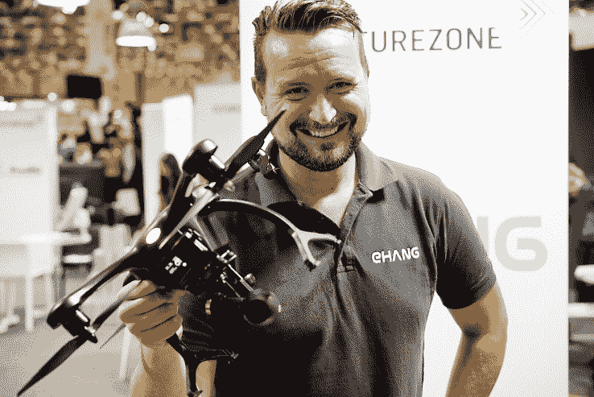

# Ghostdrone 有一年的笨手笨脚保险和初学者友好的控制技术

> 原文：<https://web.archive.org/web/https://techcrunch.com/2016/09/22/who-you-gonna-call-ghostdrone/>

来自[亿航](https://web.archive.org/web/20221025223245/http://ehang.com/)的 [Ghostdrone 2.0 VR](https://web.archive.org/web/20221025223245/http://www.ehang.com/ghost2.0.html) 并不是一个自我意识强的人，它为无人机飞行增添了一个新的亮点。为了驾驶 Ghostdrone VR，用户不再使用传统的控制器，而是戴上一个耳机，以获得无人机所看到的视角。

无人机由手势、触摸命令和智能手机的倾斜来控制，而相机由耳机控制。如果你设法让它飞到树上，不用担心:该公司承诺免费维修你的无人机一年，同时你想办法避免撞到东西。

## 无人机飞行 101

“驾驶无人机太难了，”该公司欧洲营销总监马蒂亚斯·哈格多恩(Matthias Hagedorn)说。“我们希望让事情变得更简单、更有趣。Ghostdrone 2.0 是体验无人机飞行的新方式。”

马蒂亚斯·哈格多恩展示了 EHang 的 Ghostdrone 2.0 VR。

在 2014 年为[筹集了一个稳定的 A 轮](https://web.archive.org/web/20221025223245/https://beta.techcrunch.com/2014/12/30/ehang-seriesa/)，随后在大约一年前[筹集了一个更大的 B 轮](https://web.archive.org/web/20221025223245/https://beta.techcrunch.com/2015/08/25/ghost-drone-maker-ehang-lands-42m-series-b-fills-key-executive-roles/)之后，该公司于今年早些时候在美国推出了 Ghostdrone 2.0 产品，并自那以后将发行范围扩大到了德国和欧洲其他国家。

对于初学者来说，避开传统的控制器只是旅程中的一步。该公司声称，其基于智能手机的控制结合一副虚拟现实护目镜是一种更自然的飞行方式。对于紧张的飞行员，控制应用程序也包括一个教程，所以你知道当你在上帝的绿色地球上空盘旋时会遇到什么。

聪明的是，智能手机用来控制无人机本身，耳机用来控制摄像头。上下看可以上下倾斜相机——优雅！

## 咿咿咿…砰

无人机寻求陪伴。喜欢在山里散步和电影《飞机》!

n00b 飞行员介绍计划的第二部分是无人机不可接地。不是因为它坚不可摧(没有无人机是)，而是因为如果你设法把它砸到什么东西上，EHang 有一年的无忧保修。全方位免费维修(最多三次)，无论损坏是由无人机还是飞行员故障造成的。

这也不仅仅是四处闲逛取乐。当你一次巡航 25 分钟时，无人机可以记录 4K 视频。当然，飞行时间受到监控，如果飞行员接近极限，视觉和听觉提示将提醒他们小心地将飞行器放在地面上。

这些无人机可以在各种商店买到，或者直接从制造商处购买。在欧洲，Ghostdrone 2.0 VR 在€的零售价为 989 英镑。在美国，它的标价是 1100 美元。

https://www.youtube.com/watch?v=1hkQos9kayw