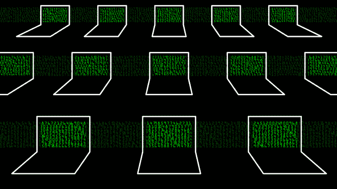

# 为什么全球威胁共享计划对保护全球基础设施至关重要 

> 原文：<https://web.archive.org/web/https://techcrunch.com/2016/06/19/why-a-global-threat-sharing-program-is-vital-to-protect-global-infrastructure/>

丹尼尔·里德尔撰稿人

丹尼尔·里德尔是安全咨询公司的首席执行官

[New Context](https://web.archive.org/web/20221208075421/https://www.newcontext.com/)

也是即将出版的书的作者

[Lean Security](https://web.archive.org/web/20221208075421/https://leansecurity.com/)

.

我们生活在这样一个时代，全球共享威胁情报不仅是可能的；这对我们全球基础设施的安全至关重要，公共和私营部门一直在不知疲倦地创建这些项目。

到目前为止，最大的挑战围绕着技术、法律和成本，但在过去的一年里，仍然有一个主要的推动力使这一过程变得更容易接近和具有全球影响力。

许多组织，如 IBM、Soltra、洛克希德·马丁、Splunk 和 Bluecoat，都是这些努力的先锋。

今天，由于 2015 年 (CISA)的[网络安全信息共享法案，企业现在有能力在保护好心人的法律框架内与国土安全部共享威胁数据。](https://web.archive.org/web/20221208075421/https://www.congress.gov/bill/114th-congress/senate-bill/754)

为了满足这一努力的高层次技术需求，DHS 最近[与 OASIS](https://web.archive.org/web/20221208075421/https://www.oasis-open.org/news/pr/oasis-advances-automated-cyber-threat-intelligence-sharing-with-stix-taxii-cybox) 合作，对 [STIX 和 taxi](https://web.archive.org/web/20221208075421/https://www.us-cert.gov/Information-Sharing-Specifications-Cybersecurity)进行改造、标准化、降低成本并扩大覆盖范围——数据共享框架现在允许人类和机器以自动化的方式跨境交换威胁情报。

此外，美国政府还呼吁发展更多的信息共享和分析组织(isao)——私营公司的多样化社区，它们合作共享情报，帮助挫败网络攻击。

全球威胁共享计划的势头正在形成。全球越来越多的企业和政府看到了这种合作方式的价值，整个工业世界使用这种方式只是时间问题。

**为什么我们需要全球威胁共享计划**

随着[工业互联网](https://web.archive.org/web/20221208075421/http://readwrite.com/2016/05/09/blockhain-new-ir/)——或“工业 4.0”——的快速推进，创新和互联就像一列货运列车一样席卷全球。各行各业都在努力连接每一个可以连接的对象，收集尽可能多的数据，从而提高他们的运营智能。

这是一个没有减缓迹象的趋势。因此，我们不应该因为害怕变化而逃避现实，而是需要将我们的智慧投入到创造尽可能安全地建设和维持这个新世界的方法上来。

*全球威胁共享计划将会做到这一点。*

网络攻击对社会构成真正的物理威胁；我们不只是在谈论个人的信用卡被黑。我们谈论的更多的是类似于[电网](https://web.archive.org/web/20221208075421/https://www.wired.com/2016/03/inside-cunning-unprecedented-hack-ukraines-power-grid/)被关闭、[金融机构](https://web.archive.org/web/20221208075421/http://www.insurancejournal.com/news/international/2016/03/11/401598.htm)被抢走数百万美元、[工厂](https://web.archive.org/web/20221208075421/https://www.wired.com/2015/01/german-steel-mill-hack-destruction/)甚至[智能汽车](https://web.archive.org/web/20221208075421/http://www.washingtonpost.com/sf/business/2015/07/22/hacks-on-the-highway/)被远程征用。

主动防范此类威胁一直是重中之重，但直到现在，这还是一个相当繁琐的过程。

对任何人或机器来说，从传统的威胁分析报告(通常是使用令人困惑的代码和符号的巨大 PDF 文件)中有效地提取情报几乎是不可能的任务。因此，一般公司大约需要 [146 天](https://web.archive.org/web/20221208075421/https://www2.fireeye.com/rs/848-DID-242/images/Mtrends2016.pdf)才能发现其数据遭到破坏。到那时，黑客可能已经对其他实体造成了进一步的损害。

Soltra 的[首席执行官马克·克兰西(Mark Clancy)在 2016 年 6 月 15 日对美国众议院国土安全委员会发表讲话时表示:“CISA 签署成为法律才六个月，尽管在这段时间里活动频繁，但肯定还有更多工作要做。”。](https://web.archive.org/web/20221208075421/https://soltra.com/)

他提到的一些“更多工作”包括提高威胁共享平台的整体可访问性。所有行业和部门的广泛参与是该计划成功的关键。

克兰西在同一个演讲中说:“从历史上看，各部门只在本部门内共享信息。”。“虽然这样做很重要，也很有效，但它也掩盖了一个事实，即攻击者正在对[其他]部门使用相同的战术、技术和程序。”

新兴的跨部门平台和解决方案，如 Clancy 自己的 [Soltra Edge](https://web.archive.org/web/20221208075421/http://www.dtcc.com/news/2014/december/03/soltra) ，不仅仅是自动化威胁发现过程；它们是免费提供的，并且很容易集成到现有的 IT 基础架构中。

“Soltra Edge 平台以标准化的方式发送、接收和存储网络威胁情报的信息，”他说。“它隐藏了底层技术规范的复杂性，因此在大多数情况下，最终用户可以在不到 15 分钟的时间内设置并开始接收威胁信息，改变了如果公司想要自行改变内部系统可能需要数月或数百万美元的模式。”

由于软件产品简化了共享流程并减少了通常伴随而来的财务和时间负担，我们正在向多部门全球威胁共享计划迈进，该计划激发了前所未有的安全主动性。

**全球共享计划的好处**

一旦一个全球共享项目取得进展，公司可以放心，黑客将面临前所未有的阻力。例如，如果耐克遭遇了一次企图入侵，它可以使用 STIX 和 TAXII 立即向共享生态系统的其他部分报告所有相关细节，全球各地的企业将立即有能力加强他们的防御。如果这些黑客稍后在另一个地方再次尝试，他们就没有这样的运气了。

此外，全球共享计划为整个世界提供了明显的安全利益。除了可以通过限制身体伤害来挽救直接生命之外，还有全球范围的间接安全影响。

工业互联网有潜力在所有行业创造更好、更强、更具创新性的公司——不可否认，这将改善整个世界。但是，只有当企业确信他们的数据是安全的，工业 4.0 才能实现这一崇高的潜力，而实现这一点的关键部分是鼓励广泛参与全球威胁共享计划。

今天就加入 [ISAO 工作组](https://web.archive.org/web/20221208075421/https://www.isao.org/standards-working-groups/),关注这一重要工作的最新进展。