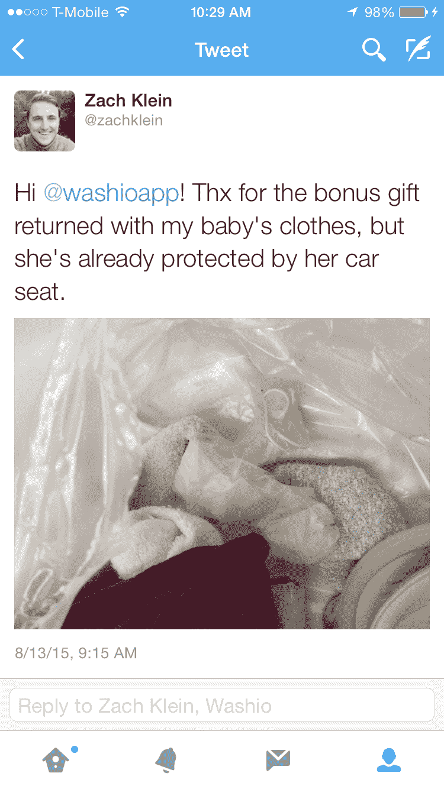

# 为什么一个高调的 Washio 客户发了推特，然后删除了他洗衣袋里看起来像用过的避孕套 

> 原文：<https://web.archive.org/web/https://techcrunch.com/2015/08/13/why-a-high-profile-washio-customer-tweeted-then-deleted-what-looked-like-a-used-condom-in-his-laundry-bag/>

Vimeo 联合创始人[扎克·克莱恩](https://web.archive.org/web/20221007230821/https://www.crunchbase.com/person/zach-klein)今天早上在推特上称，他在洗衣初创公司 [Washio](https://web.archive.org/web/20221007230821/http://www.getwashio.com/) 一袋刚清洗过的婴儿衣服中发现了一个看起来像用过的避孕套。

“嗨@washioapp，”Klein 写道，“谢谢你把我宝宝的衣服作为额外礼物送回来，但她已经被她的汽车座椅保护起来了。”

Washio 洗衣店的工作人员在照看顾客的衣服时做了些手脚，这种想法足以让相当多的人感到恶心。我甚至[发推特](https://web.archive.org/web/20221007230821/https://twitter.com/sarahbuhr/status/631870994710327296)给 Washio 询问发生了什么事。Washio 仍然没有回复。

有问题的避孕套可能是一个工人留下的橡胶手套。

*Washio 就此事回复我们如下声明:*

> Washio 团队成员佩戴乳胶手套来保护自己和顾客服装的完整性。一位 Washio 顾客在网上分享的照片显示，他的洗衣袋里有一副这样的手套。我们确信这是一个孤立的事件，并已采取一切适当的措施，以确保它不会再次发生。我们对这个错误感到抱歉，并向所有 Washio 客户保证，安全、卫生和质量是我们的首要任务。

几个“恶”的反应之后，克莱恩删除了这条推文。我们将该推文保存在截图中，以便您可以亲自检查该包:

克莱恩告诉 TechCrunch，他现在认为婴儿洗衣袋中的橡胶物体可能是一只乳胶手套。

“有人怀疑这是避孕套，”克莱恩说。Washio 最初并没有联系 TechCrunch，但在这篇文章发表后确实发送了上述声明。Washio 还私下接触了 Klein，并告诉他这个物体是一只手套。然而，克莱恩仍然不确定那是什么。

“我以为是用过的避孕套。我不想靠近它。他在一封电子邮件中告诉 TechCrunch 说:“我把它放在洗衣袋里，然后扔了出去。

老实说，它看起来确实是那样的——一只橡胶手套。克莱恩同意。他说:“我不再能接触到这个物体，但是我检查了照片，看起来它可能是一只手套。”。"我宁愿假定瓦希欧是无辜的。"

在数次试图获得对该事件的评论~~后，Washio 仍未回复我们。~~ *Washio 发了一份关于事件的声明。*

Washio 也没有回答其他 Twitter 用户关于其他事件的问题。@mf_stumbles [上周在 Twitter 上指责该公司两次毁了他的衣服。一天后，同一个 Twitter 用户发了几条推文，但似乎没有帮助。](https://web.archive.org/web/20221007230821/https://twitter.com/mf_stumbles/status/628707619180380161)

“@WashioApp 你还是把你毁掉的文章的每一条推都藏起来了。@mf_stumbles 写道。

然而，该公司确实在一小时前向@mf_stumbles 发了一条推文(整整一周前，同一名 Twitter 用户在该公司发了关于他自己问题的推文)，称它“永远不会危及我们客户的健康。我们的团队成员在工作时会戴手套保护自己。”

Washio 告诉 TechCrunch ,@ MF _ stumbles 的推文是指今天的事件，而不是单独的袋子里的手套事件。