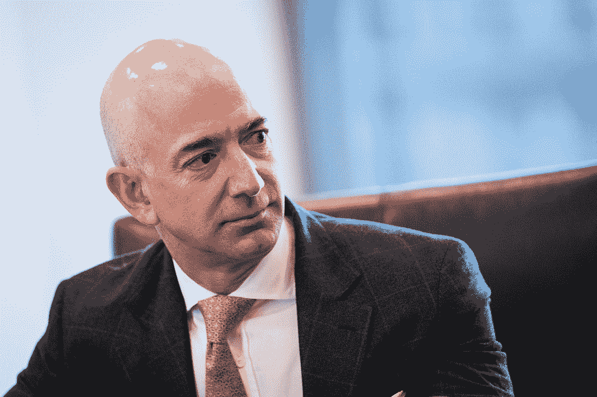
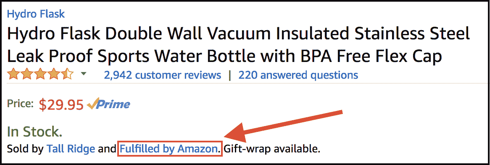

# 为什么亚马逊正在吞噬世界 

> 原文：<https://web.archive.org/web/https://techcrunch.com/2017/05/14/why-amazon-is-eating-the-world/>

扎克·坎特是

[Stedi](https://web.archive.org/web/20230109104736/http://www.stedi.com/)

.

More posts by this contributor

去年 12 月，我与人合伙创办了一家软件初创公司。每个月，我都会向投资者发送一份更新信息，让他们了解我们的最新进展。但过去的一个月有些不同——我们的行业(零售业)正在经历转型。

我不再只是写我们的“内部”新闻，而是写了更广阔的零售业世界即将到来的末日。更具体地说，我写了一些关于亚马逊的想法，以及为什么他们的领先优势只会越来越大。亚马逊是地球上最令人印象深刻的公司，我认为它是最不为人所知的公司之一。一些人建议我公开发布这个，所以我来了。

我的第一家公司是一家汽车零部件制造商，以供应商(亚马逊为大宗产品发出采购订单)和“市场卖家”(亚马逊从第三方卖家在 Amazon.com 销售的产品中提成)的身份卖给了亚马逊——所以我对亚马逊的内部运营和举措有一些了解，但不经常公开讨论。

我关注 AWS 和亚马逊的其他各种产品也有一段时间了，亚马逊作为一家公司已经成为我个人痴迷的东西。我对亚马逊和即将到来的零售业末日有一些进一步的想法，我想与那些对零售业的整体未来感兴趣的人分享。

人们一致认为，我们已经达到了一个临界点，零售业终于看到了亚马逊的巨大增长带来的一些重大附带损害——主流/非科技新闻已经开始对此进行大量报道。关于亚马逊的优势是否可持续，或者其他零售商(即沃尔玛)是否能够在开始复制亚马逊的模式时削弱亚马逊的主导地位，有很多讨论。

我阅读的大多数分析都集中在亚马逊的广泛优势上——我称之为“要点护城河”——然后评估每个项目是否可以被像沃尔玛这样的竞争零售商复制。这些程序在科技界广为人知；例子包括亚马逊 Prime 2 天(或 1 小时)送货服务、亚马逊市场(第三方卖家可以在亚马逊自己的商品旁边销售商品)、亚马逊 Go 商店(亚马逊的实体、无收银员零售点)和亚马逊的无人机计划。

事实是，对于一个大型竞争对手来说，这些都是可行的，可以合理地认为沃尔玛可以在未来几年内建立或收购这些能力。有利可图的 2 天(或 1 小时)送货的关键因素是客户离配送中心的距离。沃尔玛已经有 150 多个配送中心，总占地面积比亚马逊的履行中心大得多，尽管它们是为重新进货而优化的(11，500！)通过沃尔玛的网络(6000 家！！+)卡车。

沃尔玛已经证明有能力扩大配送能力，他们应该能够在没有太大困难的情况下重新配置他们的网络来实现电子商务。虽然亚马逊正在建立一整套关键的最后一英里送货解决方案(无人机、送货机器人和一个名为 Amazon Flex 的按需人工送货网络)，但在这些领域都有大量“第三方”创业公司可以为沃尔玛提供合理程度的平等。

这一切都说明，我相信亚马逊是地球上最容易防守的公司，我们甚至还没有开始掌握它对竞争对手的统治程度。亚马逊的领先优势在未来十年只会越来越大，我不认为其他零售商能阻止它。

原因不是头条新闻中提到的要点护城河，也不是创新文化或贝佐斯作为首席执行官的愿景(尽管我确实认为亚马逊的文化令人难以置信，贝佐斯是最令人印象深刻的首席执行官)。事实上，亚马逊的每一部分都是用面向服务的架构构建的，亚马逊正在使用这种架构将公司的每一部分都变成一个独立的平台，从而将每一部分都向外部竞争开放。

我记得在学校的时候读过关于垂直整合公司的常见陷阱。虽然垂直整合通常会带来一些引人注目的成本节约(通过内包服务或收购供应商/客户)，但随着时间的推移，增加的利润通常会蒸发，因为“供应商”对一个受控制的内部“客户”变得自满

汽车行业有很多这样的例子，随着零部件成本飙升，汽车制造商经历了供应商收购和随后剥离的交替时期。没有外部竞争，部门会变得臃肿低效。试图通过竞争性/外部投标比较、详细的成本核算和配额来缓解这种情况，通常只会导致官僚主义增加，对实际成本结构几乎没有影响。

亚马逊的 SOA 结构最明显的例子是亚马逊网络服务(史蒂夫·耶格在 2011 年写了一篇关于这一点的长篇大论。由于亚马逊无与伦比的扩展时机——在 21 世纪初，企业级 SaaS 广泛可用之前的超高速增长——亚马逊必须建立自己的技术基础设施。将这种基础设施转化为外部产品(AWS)的金融天才已经广为人知——横财是巨大的，每年高达 140 亿美元。但与亚马逊发现的被忽视的组织洞察力相比，收入的繁荣只是一个脚注:通过将公司的运营部分作为一个平台，他们可以让公司免受低效率和技术停滞的影响。

(图片来自德鲁·安格雷尔/盖蒂图片社)

自 AWS 首次亮相以来的 10 多年里，亚马逊一直在系统地将它的每个内部工具重建为外部可消费的服务。最近的一个例子是 AWS 的 Amazon Connect，这是一个自助式的基于云的联络中心平台，基于亚马逊自己的呼叫中心使用的相同技术。再说一次，这里的“额外收入”很大——但真正的价值在于磨练亚马逊的内部工具。

如果 Amazon Connect 是一个完全的商业失败，亚马逊的管理层将有一个可量化的指标(收入，或缺乏收入)，表明他们的内部工具明显落后于竞争对手。亚马逊已经用一个反馈环取代了内部调查和审计等无用、耗时的官僚机构，这个反馈环在工作时产生现金，在不工作时迅速识别问题。他们说，赚到的钱是你为世界创造的价值的合理近似值，亚马逊已经找到了一种方法来衡量自己在几十个以前看不见的领域的价值。

但是这是显而易见的——我们都知道 AWS。令人难以置信的是，这一战略——现代企业历史上最艰巨的努力之一——已经渗透到亚马逊的各个层面。亚马逊已经悄悄地在他们整个生态系统的角落和缝隙中推出了外部访问，我认为这是外部服务可用性的长尾，几乎不可能复制。

这方面最广泛的例子是亚马逊(FBA)的履行计划。如果你曾经从亚马逊订购过一件商品，上面写着“由{Company}出售，由亚马逊履行”，你就已经看到了 FBA 的作用。

通过 FBA，亚马逊允许第三方卖家向亚马逊运送大宗库存——亚马逊将这些库存(卖家仍拥有这些库存)存储在亚马逊的履行中心，在订单下达时将产品运送给亚马逊客户，甚至处理所有的退货和客户服务。价格极具竞争力。FBA 不仅限于亚马逊上销售的商品，卖家也可以使用亚马逊的“多渠道履行”选项将非亚马逊订单运送给卖家的客户。这方面的一个例子是，如果 Hydro Flask 在 Shopify 上运营自己单独的电子商务商店，当客户在 Shopify 商店下单时，Hydro Flask 可以将订单发送给 FBA(你猜对了——通过外部 API ), FBA 将直接将订单发送给客户。

对 Hydro 烧瓶的好处是显而易见的。他们可以在中国制造产品，并使用像 Flexport 这样的货运代理将产品从工厂直接运送到亚马逊的仓库，从而避免运营自己的仓库的麻烦(和开销)。对于亚马逊来说，表面上的好处是多方面的:a)更好地利用过剩的产能，b)通过 UPS/FedEx 增加货运量/杠杆，以及 c)来自履行服务的收入(加上市场佣金和“其他第三方卖家服务”，2017 年 Q1 的总收入高达 64 亿美元，占亚马逊总收入的 25%)。

但是，这里的持久利益是来自向外部用户开放亚马逊内部履行操作的改进。履行和运输是亚马逊最大的成本中心，有着巨大的人力成本，也是最容易膨胀的成本中心。

运营像 FBA 这样的多租户、面向外部的服务所需的纪律水平给亚马逊的内部运营带来了巨大的好处——这不是一些拼凑起来的、根据亚马逊自己的需求硬编码的自制工具，因此几乎不可能改进。

xIt 是一个相对干净、抽象、基于服务的接口，由一个独立的团队“拥有”——一个对外部客户负责的团队。贝佐斯在亚马逊(“地球上最以客户为中心的公司”)内部灌输了一种客户崇拜感，亚马逊有三个不同的客户群体需要崇拜:电子商务购物者(Amazon.com)、开发者(AWS)和卖家(Amazon Marketplace/FBA)。

顺便提一下，我认为 FBA 对于另一家零售商来说非常难以复制。从成千上万的卖家那里混合库存的技术和组织复杂性令人难以置信——特别是当你考虑到不同卖家的不同设置所导致的排列时。

他们的自动化系统用于将入境货物发送和分割到最佳履行中心(基于容量、客户的历史地理分布以及谁知道的其他因素),这本身就是一项艰巨的任务。亚马逊在这方面已经做了 10 多年(FBA 于 2006 年推出)，我认为对 FBA 的投资是他们在过去十年的大部分时间里未能盈利(或者说，他们选择不盈利)的重要原因。

一开始错误率必须非常高——我个人知道有几个卖家因为亚马逊丢失了数万美元的库存而得到了补偿，没有问任何问题。抛开巨大的技术挑战不谈，还有哪家零售商有胆量在一个项目上承受这么多年如此难以置信的损失？

在我看来，很明显，亚马逊将在未来五年内进军小包裹运输(UPS/FedEx/USPS)。他们翻阅着他们的损益表，挑选出最大的类别来“产品化”——首先是技术(AWS)，然后是履行(FBA)，然后是 COGS(通过亚马逊的各种自有品牌计划的实际产品本身)，以及 next shipping。他们已经开始运营自己的 40 架货机和数千辆拖车。他们已经建立了几十个包裹分拣中心，以减少支付给现有小型包裹承运商的费用。这非常适合他们的服务模式—他们有巨大的内部需求，他们现有的服务客户是完美的早期采用者。

亚马逊相对于任何其他企业服务提供商(从 UPS 和联邦快递到 Rackspace)的关键优势在于，他们被迫使用自己的服务。UPS 是从由于包裹丢失/毁坏、运输延迟、糟糕的软件和糟糕的假期容量规划而引起的反弹中走出来的一步。愤怒的顾客责怪零售商，零售商反过来对 UPS 破口大骂。当亚马逊是服务提供商时，他们永远都在吃狗粮。糟糕的表现无处可藏。亚马逊建立了一个反馈回路作为护城河，看着飞轮开始提速，真是不可思议。

亚马逊致力于这一理念。即使是卖不出去的服务，亚马逊仍然在努力对外公开这些服务。这方面最完美的例子是亚马逊的市场网络服务(MWS)API——这是亚马逊市场卖家可以用来以编程方式与亚马逊交换数据的一组服务。亚马逊建立了一项他们称之为“订阅 API”的服务，它可以向卖家即时通知任何竞争对手的任何价格变化——包括亚马逊自己！

亚马逊对外公开它用来设定自己价格的工具，以保证亚马逊上列出的价格对客户来说尽可能低。这催生了一个名为“再定价器”的第三方价格优化工具的完整生态系统，这些工具使用 MWS API 来自动响应价格变化，以便最大限度地提高市场卖家的销售额(《华尔街日报》在 3 月份就此发表了一篇很棒的文章，恰如其分地将其比作高频交易)。这里的美妙之处在于，亚马逊并不在乎卖家是否降价——不管怎样，亚马逊都会从销售额中抽取 12%至 15%的佣金，然后收取 FBA 费用。

我可以举很多例子。我在 AWS、亚马逊市场、亚马逊的供应商计划和少数面向客户的计划的更新电子邮件列表中——他们正在系统地将整个公司产品化，磨练什么可行，修复什么不可行，扼杀其他一切。所有这些让我想起了贝佐斯的一句名言:

> “我经常被问到这样的问题:‘未来 10 年将会发生什么变化？’这是一个非常有趣的问题。很常见的一种。我几乎从来没有得到过这样的问题:‘未来 10 年什么不会改变？我认为第二个问题实际上是两个问题中更重要的一个——因为你可以围绕那些在时间上稳定的东西建立一个商业战略。…[I]在我们的零售业务中，我们知道客户想要低价，我知道这将在 10 年后成为现实。他们想要快速交货；他们想要大量的选择。很难想象 10 年后的未来会有一个顾客走过来说，‘杰夫，我爱亚马逊；我只是希望价格能高一点，'[或]'我爱亚马逊；我只希望你能说得慢一点。

产品分类、低价和快速交货是亚马逊赢得零售游戏的关键。有了亚马逊市场，卖家可以列出数百万最热门的新产品，速度远远快于亚马逊的供应商团队希望发现它们的速度。它建立了一个高频交易平台，保证了价格竞争力，并为亚马逊提供了最低 12%的保证利润率。快速交付归结于卓越的运营和极低的运输成本，这两者都是通过向外部客户开放 FBA 来实现的。我认为没有人比亚马逊更了解*创新者的困境*，他们已经实施了一个系统性的解决方案，将保持对竞争零售商的无与伦比的优势。

所以，我的看法是，亚马逊是不可企及的。亚马逊花了 10 年时间完善 FBA。即使沃尔玛能在 5 年内做到这一点，亚马逊在推出它的时候会在哪里呢？我甚至还没有开始接触亚马逊的鲜为人知的，行业性的项目，如卖方履行主要和直接履行。我不确定在我的有生之年，我们是否会看到一家大众市场零售商成功地与亚马逊竞争——尽管我仍然认为，像 Chewy.com 这样的垂直零售商有很大的机会发展壮大，并在短期内取得一些进展。

亚马逊只会被反垄断案拖垮(尽管那还有很长的路要走，因为他们今天只占总零售量的一小部分)，或者我们消费实体产品的模式转变——我想到的场景是大规模沉浸式虚拟现实结合静脉营养(20 年后的 Soylent)和普遍基本收入的广泛采用，这将完全消除对实体产品的需求。但那也是一种方式。