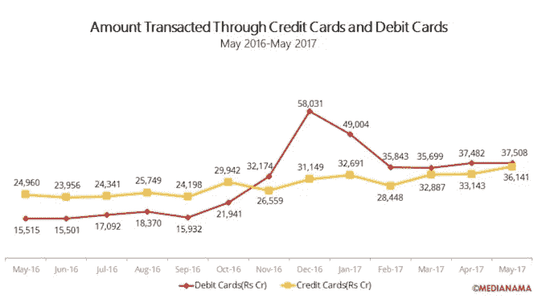
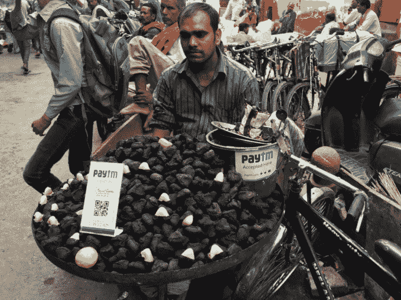

# 为什么美国会错过印度金融科技革命的大好时机

> 原文：<https://web.archive.org/web/https://techcrunch.com/2017/12/05/why-america-could-miss-out-big-time-on-indias-fintech-revolution/>

普拉纳夫·德什潘德撰稿人

[Pranav Deshpande](https://web.archive.org/web/20221207090932/https://www.linkedin.com/in/pranav808/)

是旧金山的产品营销人员，也是

[Startup Bridge](https://web.archive.org/web/20221207090932/https://startupbridgeindia.com/)

在斯坦福。Startup Bridge 连接美国和印度的领先技术创新者，为未来的登月计划建立新的关系。

西方有一个古老的比喻，印度就像印度的火车——充满异国情调，颠簸而缓慢。

但是比喻作为一种商业策略可能是不好的——这种比喻正导致美国公司错过印度的登月计划和数万亿美元的机会。

在本文中，我将重点关注金融科技，这是传统银行业从未有过的飞跃。[摩根士丹利](https://web.archive.org/web/20221207090932/https://www.morganstanley.com/ideas/digital-india)预计，到 2027 年，印度的数字支付渗透率将从目前的 5%增加到 20%，电子商务市场将达到 2000 亿美元，拥有 4.75 亿电子商务购物者，总计超过 6 万亿美元的 GDP。

就像印度的移动革命一样。大多数印度人从零连接到移动互联网，却从未见过一台个人电脑，甚至一部固定电话。印度现在有 8 亿手机用户，其中 4.3 亿拥有互联网连接。根据摩根斯坦利的数据，互联网用户的数量预计到 2027 年将增长到 9 . 15 亿。

同样的跨越正在支付领域展开。虽然互联网改变了印度人交流、阅读新闻和娱乐的方式，但它没有改变他们的交易方式。如图所示，印度的信用卡和借记卡数量只是在递增。即使是政府自上而下的举措，如有争议的去货币化决定，也难以减少对现金的依赖。

去货币化后，借记卡的使用在 2016 年 11 月和 12 月激增。但看起来它又回到了低于信用卡交易的水平。

这跟美国有什么关系？美国会输给谁呢？

中国。因为中国已经解决了数字支付的两个最大障碍——在自家后院和前院建设基础设施和改变消费者行为。通过发展丰富的生态系统和强大的网络效应，微信已经成为中国的操作系统。支付宝在商业支付方面也做了同样的事情。2016 年，中国的数字支付已经是美国的 50 倍。阿里巴巴和腾讯比世界上任何人都更了解生态系统，包括美国公司。

现在，中国正显示出利用新一代支付基础设施的勇气和赢得印度消费者芳心的耐心。

> 在这一切中，美国在哪里？

印度的支付基础设施着火了。银行账户是金融普惠的基石，在短短三年内，通过 JAM 计划增加了 2 . 85 亿个银行账户。UPI，即联合支付接口，也已经成熟。合众国际社允许任何一个拥有与银行账户关联的手机号码的印度人即时收发钱款。由 NPCI(一个非盈利组织)管理，它还拥有 API，允许任何应用程序轻松嵌入即时支付。谷歌和 Flipkart 等科技公司已经在 Tez 和 PhonePe 中推出了基于 UPI 的支付应用。主要的印度银行也在他们的应用程序中加入了 UPI。WhatsApp 还计划向印度用户推出这项服务。

没有便捷的体验，支付基础设施就毫无意义。新一代手机钱包应用正在解决这个问题。PayTM 规模最大，拥有 2 亿用户。 [PhonePe](https://web.archive.org/web/20221207090932/http://www.phonepe.com/) 也有钱包功能。通过这些应用，用户可以连接他们的银行账户或借记卡，将资金转移到钱包，用于点对点支付，与小企业交易或购买手机通话时间。去货币化后，PayTM 取得了重大进展，街头小贩、保姆和司机也接受了它。

阿里巴巴是 PayTM 母公司 One97 Communications 的单一最大股东，投资额超过 12 亿美元。阿里巴巴不仅仅寻求风险投资的回报。这是一个不同于印度其他任何战略伙伴关系。他们已经公开表示，他们将 PayTM 视为本地合作伙伴，将与他们分享他们在电子商务和支付方面的专业知识。两家公司的战略也有很大的相似之处，都专注于通过支付来拥有消费者。阿里巴巴希望到 2036 年[的用户达到 20 亿](https://web.archive.org/web/20221207090932/http://www.chinadaily.com.cn/business/tech/2016-06/15/content_25717718.htm)。如果没有在印度的巨大市场份额，他们是不会成功的。

第二个难题是改变消费者心理。印度消费者有价值意识。他们对新产品很警惕，在尝试之前需要大量的社会证据。在产品被采用之前，还需要克服很高的信任门槛。面对现实吧。理解数字支付对我们大多数人来说很难理解。这解释了为什么借记卡使用率如此之低。大多数人甚至不信任借记卡，即使它们是由他们信任的银行发行的！

中国解决这个问题的方式与美国公司不同。

中国不仅仅关注 6000 万到 1 亿富裕的印度人和使用信用卡的零售店。他们也不会被不太富裕的 300-500 名“印度中产”消费者绊倒，这些人并不真正使用借记卡或信任数字支付。他们通过研究和投资这些消费者花时间的地方来解决这些问题。

腾讯在中国已经有 10 亿用户，他们每天使用他们的产品订餐、买票、玩游戏和其他数百种活动。腾讯转而投资相邻行业。因此，他们参与了印度最大的拼车公司 Ola 的 11 亿美元融资，以及最大的电子商务公司 Flipkart 的 14 亿美元融资。

在这一切中，美国在哪里？美国公司在很大程度上仍然认为印度金融业沉闷乏味，而且关注的是城市富裕消费者，而不是整个国家。

迄今为止，按照中国的标准，美国在印度蓬勃发展的支付领域的投资微不足道。游戏中唯一有皮肤的公司是亚马逊。他们承诺向印度投资 50 亿美元，并购买印度零售商的股份。但是我们没有看到同样水平的战略投资和与当地公司的伙伴关系。

尽管美国和印度之间有着深厚的经济和军事联系，但目前中国在投资印度金融科技前沿领域方面已经领先美国一步。美国公司真的有被甩在后面的风险。