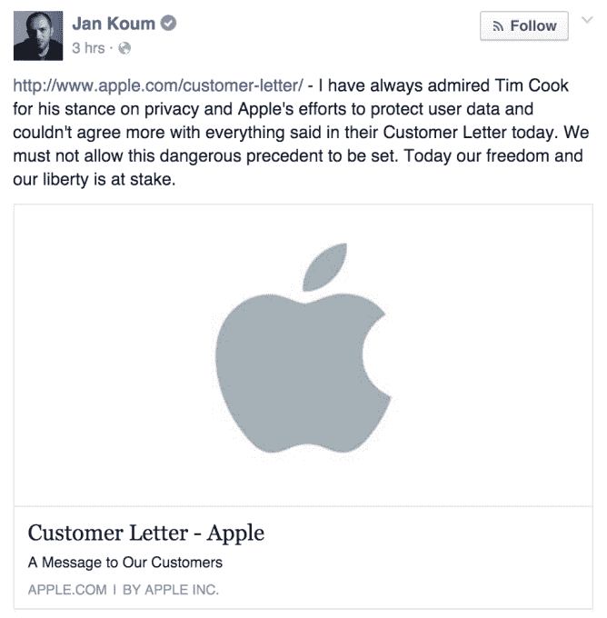

# 苹果在 iPhone 解锁案中争取优先权

> 原文：<https://web.archive.org/web/https://techcrunch.com/2016/02/17/why-apple-is-fighting-not-to-unlock-iphones-for-the-government/>

昨天，美国联邦调查局提交了一份命令，强制苹果解锁去年年底圣贝纳迪诺枪击事件袭击者之一 Syed Farook 使用的 iPhone，那次事件造成 14 人死亡。

此后不久，苹果公司首席执行官蒂姆·库克[发表了一份大胆的声明](https://web.archive.org/web/20221217202737/https://techcrunch.com/2016/02/17/tim-cook-apple-wont-create-backdoor-to-unlock-san-bernardino-attackers-iphone/)，表示苹果公司计划对抗该订单。电子前沿基金会也加入了苹果的行列，该基金会表示将在这场斗争中提供援助。

我们已经讨论了该请求的具体细节，以及库克的回应和白宫对该回应的回应。你可以先阅读这些内容。已经洒了很多墨水，可能还会有更多，但我认为有几个问题值得仔细研究——还有一个更广泛的观点可能会被追求技术细节而不是含义的人混淆。

目前的命令是关于苹果拒绝为联邦调查局解锁任何设备。不要把它与相关的、但更大的、围绕政府迫使科技公司通过引入只有它们拥有的“秘密”密钥来削弱加密的斗争混为一谈。

今天的关键问题是:为什么苹果不去解锁一个恐怖分子的 iPhone，而是等待他们的加密后门大战？我们来解剖一下。

### 该问

政府希望苹果创造一个“一次性”的 iOS 版本，它可以通过三个关键的改变安装在这款设备上:

1.  禁用或绕过 iOS 的自动抹掉功能。如果输入了太多错误的密码，你的手机就会被删除。公司手机上的一个常见设置是——法鲁克工作的政府机构拥有的 iPhone 5c。
2.  消除密码输入的延迟，以便 FBI 可以更快地“猜测”手机上的密码，而不会将其锁定几分钟或几小时，这是 iOS 为阻止任何随机小偷做这种事情而做的事情。输入时间将被降低到 80 毫秒左右，如果密码是 4 位数，这将允许在一个小时内猜出密码，如果是更多位数，时间将明显更长。
3.  允许联邦调查局通过手机上的物理端口或蓝牙或 WiFi 等无线协议提交密码。

最后一个条件是最可怕的，也是苹果最反对的。不要误解我。库克的信中明确指出，苹果反对所有的条件，但最后一条是不同的。它要求苹果公司为其软件和设备增加一个漏洞，而不仅仅是“移除”一个路障。

苹果有可能会与联邦调查局就此事拖很长时间，争论合理的要求或苹果为此付出的成本(这可能会令人望而却步，因为签署固件是一个非常重要的过程)。一个结果可能是，苹果公司会仔细研究这些问题，直到他们禁用自动擦除功能，这是一个已经存在的操作系统选项，并将剩下的问题留给联邦调查局来解决。

但最后一个问题是，整个反对的依据是什么。1789 年通过的[所有令状法案](https://web.archive.org/web/20221217202737/https://en.wikipedia.org/wiki/All_Writs_Act)(是的，一项有 200 年历史的法律)正被用来迫使苹果遵守。该法案被用来试图让苹果做大量工作来修改 iOS *和*到*添加功能，这将大大削弱其产品*的功能，当这进入法庭时，它们的安全性很可能是苹果辩护的核心。这是 AWA 范围的巨大扩张，它开创了一个先例，允许政府强迫苹果或其他公司修改他们的系统，以允许访问你的私人数据。

这就是症结所在。已经有一些关于这些变化是否会在苹果的新设备上实现的传言。这些设备配备了苹果专有的 Secure Enclave，这是核心处理芯片的一部分，其中存储了私人加密密钥，用于保护数据和实现触控 ID 等功能。苹果表示，联邦调查局要求的东西也可以在带有 Secure Enclave 的新设备上实现。对这些问题的技术解决方案将与 iPhone 5c(和其他老款 iPhone)不同(没有提供具体细节)，但并非不可能。

如果要我打赌的话，苹果可能正在加倍努力把它锁得更紧。它对这种类型的下一个订单的回复可能是两个字长。你挑两个。

重点是 FBI 要求苹果破解自己的保险箱。如果你在安装后将锁修改为脆弱的，那么锁再好也没有用。一旦开了先例，那么就有机会向大约 10 亿台活跃的 iOS 设备发出类似的请求。因此，这场斗争对苹果来说非常重要。

这就是为什么围绕这一特定秩序的辩论不应该过多地关注技术方面，而是应该关注这样一个事实，即政府会削弱私营公司产品的安全性，可能会影响使用这些产品的美国公民和外国公民的公民自由。

### 合理的顺从

苹果多年来一直遵从政府的信息要求，在本案中也很可能如此。例如，从设备的 iCloud 备份中检索数据在技术上是可能的。法鲁克的设备最后一次备份是在 2015 年 10 月 19 日，这意味着联邦调查局已经有权访问这些数据。例如，该机构可以通过向手机运营商发出信息请求的方式，利用其他途径(很可能已经这样做了)来收集通话数据。

“根据我过去对 iPhone 5 的粗略测试，一个四位数的密码应该可以在不到一个小时内被暴力破解。移动安全公司 [Sudo Security Group](https://web.archive.org/web/20221217202737/http://sudosecuritygroup.com/) 的前越狱犯兼首席执行官威尔·斯特拉法奇说:“一个六位数的密码应该可以在不到一天的时间内被暴力破解。”。“我没有测试过包含数字、字母或符号的密码的时间，但很容易理解为什么会花很长时间。对于数字密码，如果是四位数，有 10，000 种可能性，如果是六位数，有 1，000，000 种可能性。但是引入符号和字母会大大增加可能性，考虑到你甚至可以使用多个键盘(例如:一个英语短语，一个阿拉伯语短语，然后。一些数字和符号)。”

法律上也已经有一些工具可以用来访问密码锁定的 iPhones。这些工具中有许多是利用越狱漏洞来访问 iPhone 内存的程序包，然后是一套访问和分析数据的工具。这些工具然后被打上安全公司的橡皮图章，并出售给执法部门。当漏洞被 iOS 更新或补丁修复后，工具就会失效。

https://twitter.com/JZdziarski/status/700085957643657220

联邦调查局称法鲁克用来与同事通话的政府发放的电话将被用来公开促进恐怖主义行动，这种想法有些牵强。

相反，它被用作撬棍，从本质上迫使苹果反对这一命令。无论结果如何，这一案件很可能会被用来支持国会立法的呼吁，迫使美国公司通过为政府安装“后门”来削弱他们的加密技术。

这又把我们带回了一个哲学问题。

### 沙滩上的两条线

这场战斗中还有其他的战斗。例如，iPhones 上的数据加密是另一个完整的技术策略，苹果公司已经做出巨大努力，通过使他们无法解密客户数据，即使有人提出请求，来消除这一策略。

这将要求苹果修改其设备上的软件和固件，以使政府机构能够绕过加密。一旦这种方法存在，就绝对没有办法让它只为政府所用。这也提出了一个问题，即 iPhone 的任何国际用户将如何感到安全——特别是考虑到我们现在对政府的电子监控能力及其使用意愿的了解。

苹果选择现在打这场仗，而不是以后。库克的信在海滩上划出了一条线，在那里我们仍然在谈论允许暴力破解 iPhone 密码——而不是在堡垒上，我们将为我们的安全加密权利而斗争。

毫无疑问，这是一个有风险的策略，本·汤普森对此做了很好的描述。如果苹果输掉了这场战斗，因为法院认为恐怖分子解锁 iPhone 的请求是合理的，那么以后打加密战将会更加困难。但苹果认为这是底线——修改其产品以削弱其安全性。对苹果来说，*任何*后门依然是后门，是不可接受的条件。对于苹果来说，这场斗争是围绕密码还是加密展开的并不重要。就像我说的，这是一个风险，但这是苹果觉得必须承担的风险。

### 重大案件

这种情况的所有各种结果都改变了比赛场地。

政府让苹果公司给产品添加一个弱点？削弱所有安全的先例。

苹果反击成功？这可能是保护所有智能手机用户的先例。

法庭上的潜在胜利？保护安全的先例，但也可能迫使国会摧毁美国的加密技术。

苹果在这方面采取了大胆的立场，但目前在同行中显得有些孤独。WhatsApp 的简·库姆——谁有过

[his own run-ins with information requests](https://web.archive.org/web/20221217202737/http://www.nytimes.com/2015/12/18/world/americas/brazil-whatsapp-facebook.html)

— 

[posted](https://web.archive.org/web/20221217202737/https://www.facebook.com/jan.koum/posts/10153907267490011)

支持库克的信。和

[the EFF](https://web.archive.org/web/20221217202737/https://www.eff.org/deeplinks/2016/02/eff-support-apple-encryption-battle)

和

[the ACLU](https://web.archive.org/web/20221217202737/https://www.aclu.org/news/aclu-comment-fbi-effort-force-apple-unlock-iphone)

都站在苹果一边。就在这篇文章发表之前，谷歌首席执行官桑德尔·皮帅

[tweeted](https://web.archive.org/web/20221217202737/https://twitter.com/sundarpichai/status/700104298600886272)

，支持苹果的立场。

亚马逊、脸书和微软等其他科技巨头尚未加入进来——尽管它们可能会失去或得到同样多的东西。这是否是因为他们不战而屈人之兵，谁知道呢？对于苹果来说，这不是库克第一次在安全和隐私问题上采取强硬立场，[他去年的演讲](https://web.archive.org/web/20221217202737/https://techcrunch.com/2015/06/02/apples-tim-cook-delivers-blistering-speech-on-encryption-privacy/)总结了苹果之前和之后是如何利用这一点作为差异化点的。

这是地球上最大的科技公司和地球上最强大的政府之间的一场开创性的战斗。这就是为什么我们不能陷入技术细节的原因。对苹果和我们来说，这不是一个*我们能不能、*的问题，而是一个*我们应该不应该的问题。这个问题会影响到每个人，从记者到国家元首，再到所有国家的普通公民。*

*文章更新，以正确识别手机主人 Syed Farook。*

【T2