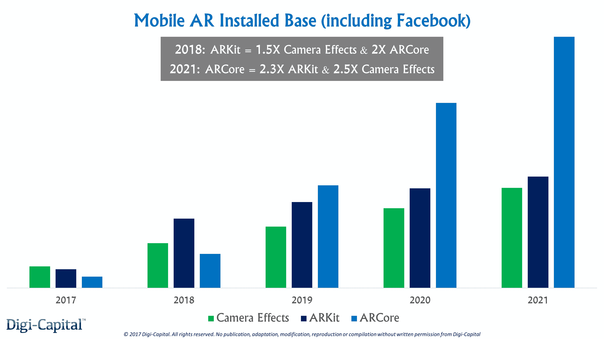
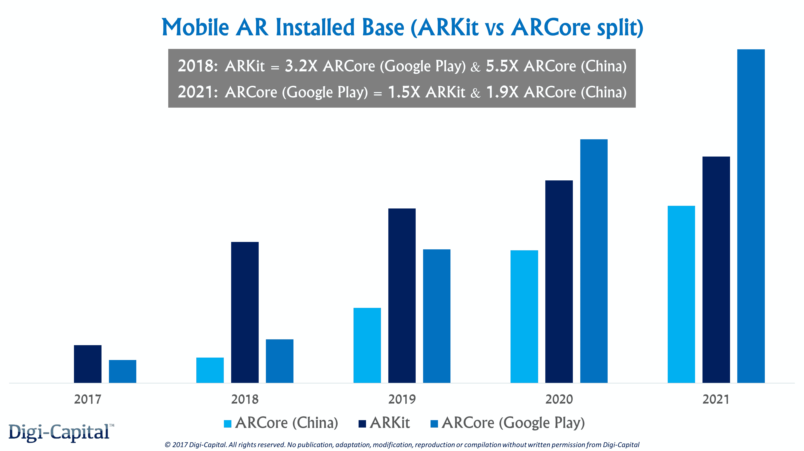
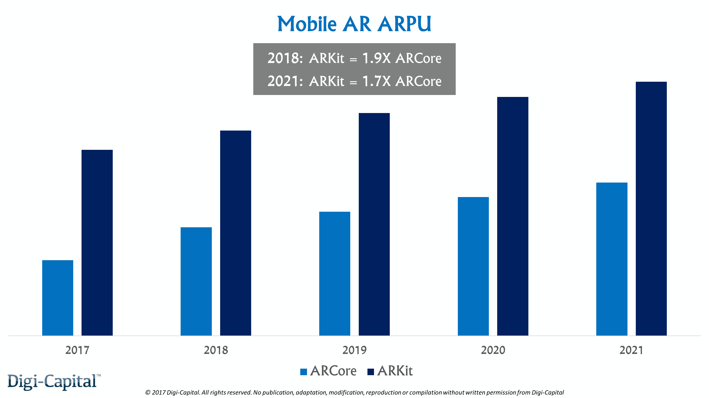
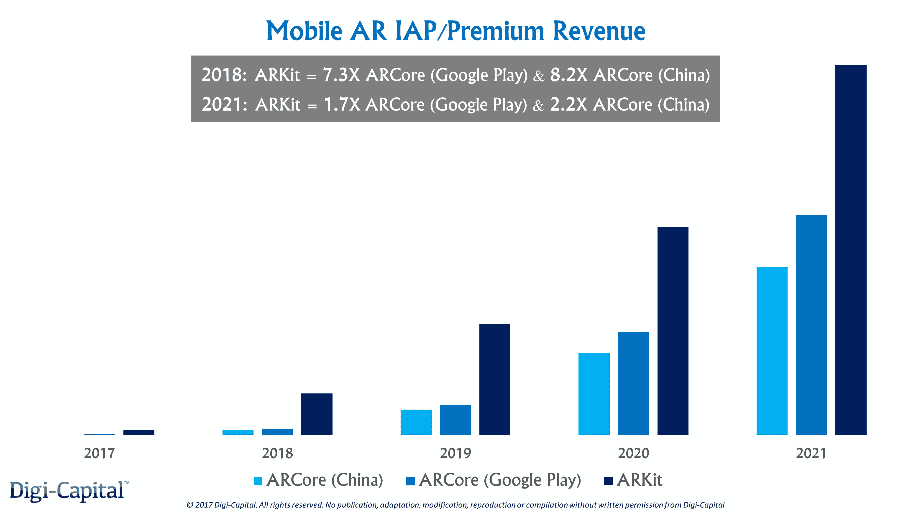
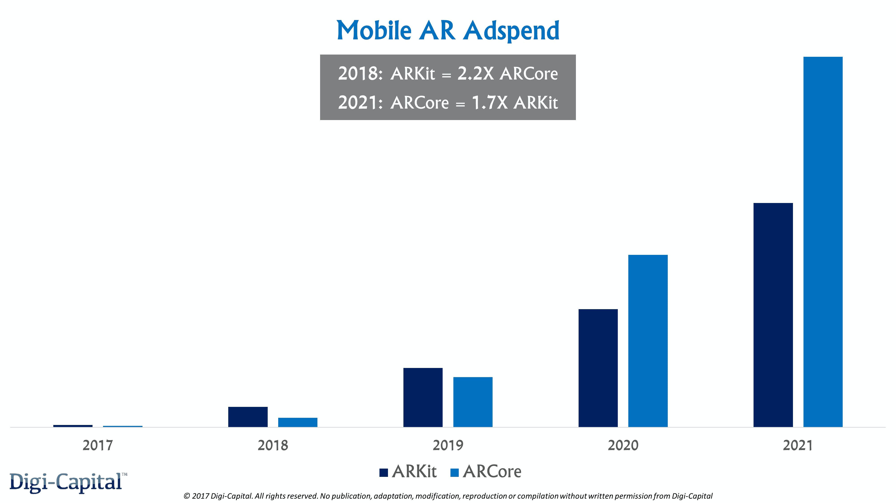
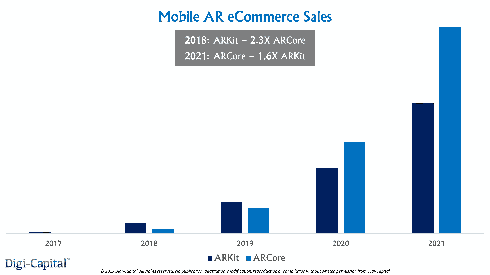
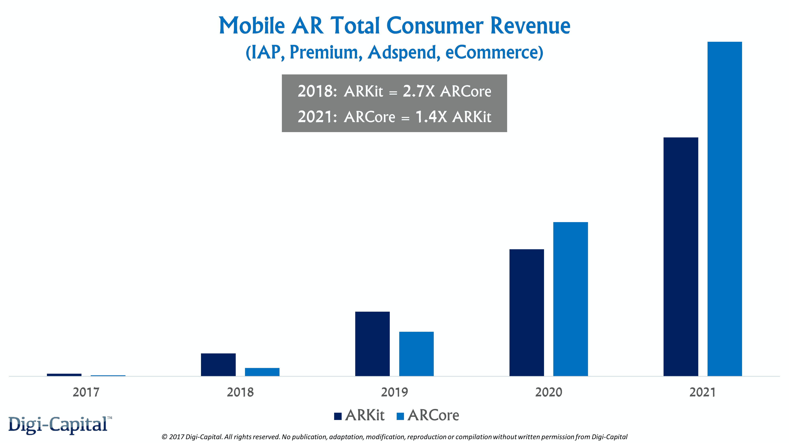

# ARKit 将如何比 ARCore 或 Camera Effects 赚更多的钱(就目前而言)

> 原文：<https://web.archive.org/web/https://techcrunch.com/2017/10/07/why-arkit-will-make-more-money-than-arcore-or-camera-effects-for-now/>

More posts by this contributor

在 [iPhone X](https://web.archive.org/web/20230316161151/https://techcrunch.com/2017/09/12/iphone-x/) 、 [iPhone 8](https://web.archive.org/web/20230316161151/https://techcrunch.com/2017/09/12/the-new-iphone-8-has-a-custom-gpu-designed-by-apple-with-its-new-a11-bionic-chip/) 和 [ARKit](https://web.archive.org/web/20230316161151/https://techcrunch.com/2017/06/05/apple-enters-the-augmented-reality-fray-with-arkit-for-ios/) 发布后，比以往任何时候都更清楚的是[苹果拥有增强现实的四波](https://web.archive.org/web/20230316161151/https://techcrunch.com/2017/07/18/the-four-waves-of-augmented-reality-that-apple-owns/)。但是[谷歌推出 ARCore](https://web.archive.org/web/20230316161151/https://techcrunch.com/2017/08/29/google-shows-off-arcore-its-answer-to-apples-arkit/?ncid=mobilenavtrend) 让 Digi-Capital 与之合作的初创公司 CEO、企业和风投们感到困惑(更不用说[脸书相机特效](https://web.archive.org/web/20230316161151/https://techcrunch.com/2017/04/18/facebook-camera-effects-platform/))。

尽管这两个平台在技术/性能上存在差异，但从 UX 的角度来看，它们的相似之处多于不同之处。但是他们能赚多少钱(以及如何赚)可能会大相径庭。

为了了解这些差异，我们将深入研究每个移动 AR 平台的可寻址市场、采用率、用户群、ARPUs、应用内购买(“IAP”)、高级应用、广告支出和电子商务销售(以及 ROW 与中国)。

## 关于那个基地的一切

使用来自操作系统/消息功能采用的硬数据作为指南，起点是安装基数*(注:这是 ARKit/ARCore 设备的安装基数和相机特效的唯一用户)*。明年，ARKit 可能会有 1.5 倍的相机效果和 2 倍的 ARCore 安装基数。造成这种差异的简单原因是苹果巨大的 iOS 采用率，加上新设备的销售，到 2018 年底，使用 iOS11/ARKit 的 iOS 设备可能会超过 6 亿台。

但是，Android 和脸书的 Messenger、Instagram 和 WhatsApp 的不同采用曲线可能会在 2021 年之前给 ARCore 带来 2.3 倍的 ARKit 和 2.5 倍的 Camera Effects 安装基数。只有到了那个阶段，我们才会看到 ARCore 在全球的安装量超过 20 亿。因此，那些对桑德尔·皮帅明年将有 20 亿部活跃的 Android 设备搭载 ARCore 感到兴奋的人，就是这么兴奋。ARCore 的潜在市场如今小了一个数量级，因为不同版本的 Android 在其安装基础上存在碎片化。

让我们暂时离开相机效果(我们会回来)，并专注于 ARKit 和支离破碎的 ARCore 市场。 [ARCore 兼容 Android 7.0 牛轧糖](https://web.archive.org/web/20230316161151/https://www.blog.google/products/google-vr/arcore-augmented-reality-android-scale/)及以上版本，将依赖 Android OS 采用率。与 iOS 相比，新 Android 操作系统的采用要慢得多，渗透率也低得多。

这意味着在 2019 年之前，牛轧糖、奥利奥和后续的 Android 操作系统版本(兼容 ARCore)可能不会出现在所有活跃的 Android 上。那么，由于自然设备损耗和新设备销售，ARCore 兼容 Android 操作系统的采用应该会达到一个拐点。

但兼容的机器人也需要校准，以确保“质量和高性能的一致标准”，Android 手机制造商可能只会这样做，以销售优质的“ARCore-ready”手机。

今天，ARCore Preview 可以在谷歌 Pixel 和三星 S8 上使用，谷歌有一项工作要与华为、Oppo、Vivo 和其他公司合作，让他们校准他们的套件。虽然这可能比 Tango 发生的事情更有效，但考虑到中国市场，将 ARCore 与谷歌移动服务脱钩是一个问题。腾讯、阿里巴巴或百度可以与中国国内手机制造商合作，创建他们自己的“ARCore(中国)”并排挤谷歌，因此谷歌将希望[力量与 Clay Bavor](https://web.archive.org/web/20230316161151/https://www.youtube.com/watch?v=OpX-a5oxOL8&list=PL7Ynrvd8NB_cu28xIubhthaQL4bmaky5A&index=6) 同在。

ARKit 应该是明年最大的单一移动 AR 平台，拥有 3.2 倍的 ARCore(Google Play—*so ROW outside China*)和 5.5 倍的 ARCore(中国)装机量。但到 2021 年，超过 14 亿的 ARCore (Google Play)装机量可能是 1.5 倍的 ARKit 和 1.9 倍的 ARCore(中国)。

## 给我看看 ARPU

虽然在个别国家层面会有更大的差异，但全球 ARKit ARPU 明年可能是 1.9 倍 ARCore。即使 ARCore 由于一系列因素在货币化方面迎头赶上，到 2021 年，ARKit ARPU 仍可能是 ARCore ARPU 的 1.7 倍。实际上，这意味着开发者需要获得两个 ARCore 用户才能赚到和一个 ARKit 用户一样多的钱。

这种 ARPU 差异的影响是，拥有最具粘性的移动 AR 应用的最佳移动 AR 开发者可能会在 ARCore 之前在 ARKit 上推出。有些可以完全绕过 ARCore*(参见早期 ARKit/ARCore/Camera Effects ratio 中我们的* [*综合收集的数百个移动 AR 应用*](https://web.archive.org/web/20230316161151/http://www.tinyurl.com/digicapitalist) *)* 。

这种动态的连锁效应可能是 iOS 上每个用户的活跃 ARKit 应用数量高于他们的 ARCore Android 表兄弟。这是一件大事，因为每个用户的活跃移动 AR 应用数量将像装机量和 ARPU 一样推动货币化。

综合所有收入驱动因素，ARKit 明年的 IAP/premium 收入将达到 ARCore (Google Play)的 7.3 倍和 ARCore(中国)的 8.2 倍。即使到 2021 年安装基础优势被逆转，ARKit 仍然可以提供 1.7 倍的 ARCore (Google Play)和 2.2 倍的 ARCore(中国)IAP/高级应用收入。*(注:ARCore(中国)可能会在中国国内市场主导 ARKit(中国)*

## 广告是完全没有必要的，除非你希望赚钱

ARKit 较大的安装基数和较小的广告溢价将在明年带来 2.2 倍的 ARCore 移动 AR 广告支出。但从长远来看，数字的重量可能会打破平衡，到 2021 年，ARCore ad 的支出将是 ARKit 的 1.7 倍。从 2018 年的较低基数开始，到 2021 年，Camera Effects 可能会成为全球最大的单一移动 AR 广告平台。

## 移动 AR 是电子商务的秘密武器

上述安装基础动态同样有助于电子商务。虽然 ARKit 更大的安装基数和略高的电子商务溢价可能会使其明年的 ARCore 电子商务销售额*(商品和服务，而不是 IAP)* 增加 2.3 倍，但到 2021 年，这可能会使 ARCore 成为 ARKit 的 1.6 倍。沉浸式销售带来的转换率提高，可能有助于亚马逊、易贝和阿里巴巴巩固它们已经占据的主导地位。

## 但这一切意味着什么呢？

ARKit 2018 年的消费者总收入(IAP、溢价、广告支出、电商)可能是 ARCore 的 2.7 倍。在接下来的一年里，它应该仍然是最大的商业平台。但从 2020 年开始，趋势发生了转变，到 2021 年，ARCore 的消费者总收入将达到 ARKit 的 1.4 倍。

对于从 IAP 和付费应用中赚钱的开发者(和他们的投资者)来说，这是毫无争议的。ARKit 是目前商业上最优秀的平台，这一点不会很快改变。在 ARKit 上取得成功的开发者可以将 ARCore(以及相关的相机特效)视为商业上的二级平台。其中一个因素是中国国内市场，ARCore(中国)的装机量意味着需要与 ARKit 保持平衡。

对于广告相关的应用程序、媒体和广告商来说，平台之间的商业差异并不明显。ARKit 可能是早期实验的最佳场所，但包括 ARCore 在内的平衡方法将触及最具移动性的 AR 眼球。鉴于 Camera Effects 作为领先的移动增强现实广告平台的潜力，它必须成为中国以外的一部分。Snap 公司的埃文·斯皮格尔将他的工作切割成平台级的竞争。

最后，移动 AR 电子商务开发商、企业和投资者也应该对 ARKit 和 ARCore 采取平衡的态度。ARKit 的早期实验可能会产生更好的数据来支持全面的电子商务推广，但从长远来看，无论来自哪里，销售都是销售。

## 每个人都是赢家，宝贝

在过去的三年里，当指导首席执行官、为企业制定战略或风投公司邀请我加入他们时，我都会问一个问题——AR 规模化的催化剂是什么？

我不需要再问了。