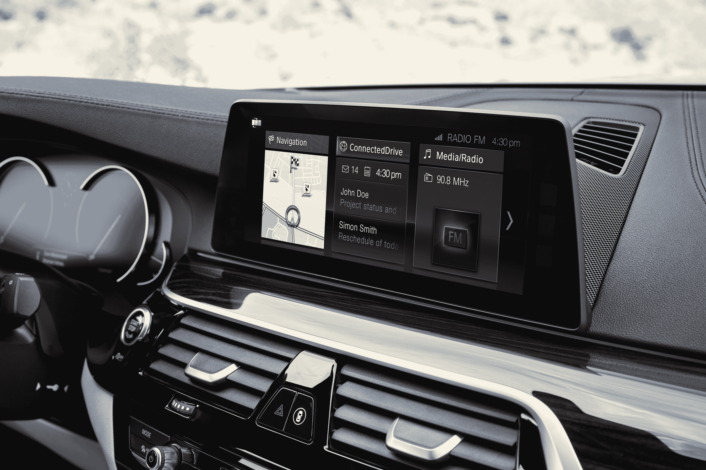
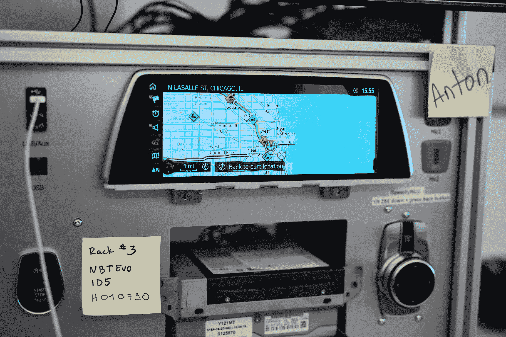

# 宝马为何押注云计算

> 原文：<https://web.archive.org/web/http://techcrunch.com/2017/07/30/why-bmw-is-betting-on-the-cloud/>

10 年后，当自动驾驶成为主流时，我们与汽车和驾驶的关系将会完全不同。

每一家主要的汽车公司都充分意识到了这一点，但并不是所有的公司都以同样的迫切程度来应对这一变化。本月早些时候，宝马在其芝加哥的技术办公室举办了创新日，该公司展示了其连接服务的现状，并展示了其未来的愿景。

与其他制造商不同，宝马决定保留对车内体验的完全控制权，并且不想将这项工作外包给大型科技公司。虽然该公司提供对苹果 CarPlay 的支持，但它不会很快支持 Android Auto(即使是 CarPlay 支持似乎也不是那么令人兴奋)。相反，宝马已经决定，作为一个优质品牌，它的工作是拥有客户体验，并使其适合驾驶体验的其余部分。

“我们使用最新、最棒的技术和工具，目标是将我们的产品、我们的汽车与客户的数字生活方式相结合，”宝马数字产品和服务副总裁 Dieter May 在活动前的一次小型新闻晚宴上表示。“我们认为，我们的汽车需要很好地适应(我们客户的)数字生活方式。"

宝马目前在芝加哥的办公室有 150 人，这是对其在上海、东京和山景城的其他技术办公室的补充。芝加哥团队的核心来自诺基亚。宝马收购了诺基亚在芝加哥的软件团队，现在很好地利用了这一事实，即这一核心团队已经在移动，云和互联网服务方面有了丰富的经验。

“我们在这里做的事情在汽车行业是新的，”梅说。“我们建立了一种新的工作方式。当然，我们面临挑战，因为我们的汽车周期很长，而互联网行业和消费电子行业发展非常快。所以我们需要建造那座桥。这是我们目标的一部分。此外，汽车行业中使用的软件生命周期和工具与数字世界和互联网行业中使用的不同。但这正是我们将云技术、云专业知识引入这家公司的原因。”

汽车行业传统上缓慢的软件生命周期意味着许多团队从未采用现代软件开发技术。因此，虽然像敏捷 it 这样的方法对于任何在初创企业甚至现代企业工作过的人来说似乎微不足道，但对于像宝马这样的公司来说，转向敏捷、使用 Jenkins 作为其自动化服务器并在 JIRA 跟踪 bug 标志着一个重大变化。你很少和汽车制造商交谈，并且在交谈中提到“scrum team”这个词，但是这是今天汽车制造商的新现实。

宝马可以简单地采用 CarPlay 等现有平台，但这不是该公司的战略。相反，宝马正与微软等公司合作，帮助他们将产品引入其汽车。目前，这意味着你汽车的信息娱乐系统可以从 Outlook 向你显示你的约会和电子邮件(这是一个非常符合宝马车主整体人口统计的用例)。对 Skype for Business 的支持即将推出。然而，当你使用这些服务时，你永远看不到微软的标志。这里的计划是深入得多——也可能与其他合作伙伴合作——但仍保留与宝马直接互动的感觉，而不是第三方服务。

这也意味着该公司正在考虑如何集成语音助手。梅认为，不得不说“Alexa”或“嘿谷歌”并不真正符合优质品牌的理念。看看宝马和其他公司将如何处理这一点会很有趣，因为司机也希望能够在他们的汽车上使用他们最喜欢的个人助理。

一旦你有了一辆联网汽车，你也会突然从司机如何与信息娱乐系统互动中获得大量分析。传统上，汽车制造商会建立一个信息娱乐系统，可能会做一些用户测试，调整它，然后等待评论。然后，一年或两年后，下一个版本有望更好(尽管司机将在汽车的生命周期中被旧系统所困)。

现在，通过使用从汽车上获得的数据，宝马可以获得持续的反馈，其软件团队可以立即采取行动，因为它还可以将更新的软件推送到云中，如果有必要的话，还可以推送到汽车上。事实上，一位宝马工程师告诉我们，该公司今年已经发运了 260 台更新。

在与宝马的工程师聊天时，也有很多关于最小可行产品的讨论。当然，这听起来并不是很贵，而且 May 承认这是它的客户可能不得不习惯的事情。但快速的软件开发和反馈周期现在允许像宝马这样的公司在开发新的车载技术时考虑这些问题。

为了做到这一切，并为其各种平台上的 100 万用户服务，宝马显然需要一个云合作伙伴，该公司决定将微软的 Azure 云作为其整体战略的技术基础。宝马显然看了微软的路线图，喜欢它所看到的。但值得注意的是，宝马目前的主要增长市场之一是中国，Azure 在中国的两个地区都有大量业务。

目前，宝马通过三个 Azure 数据中心(美国、欧洲和中国各一个)运行其全球业务。它还将其核心服务与第三方供应商的服务整合在一起。比如，Weather.com 可以提供天气数据，Twilio 可以向司机的手机发送提醒。最重要的是，宝马还大量使用了 Azure 的报告功能和微软的 Power BI 图表工具。

不过，除此之外，宝马还运营着自己的遗留数据中心，主要用于处理客户账户。这些系统目前运行良好，正如一位宝马工程师告诉我的那样，根本没有理由将其引入 Azure。这种宝马拥有的基础设施还可以处理其汽车的远程服务命令。我的理解是，宝马的一些工作负载也在 AWS 上运行，但不清楚这些工作负载到底是什么，也不清楚该公司是否只是将 AWS 作为后备或用于开发和测试。

**更新** : *宝马还公开谈论了这样一个事实，即它使用 AWS 从 7 系汽车收集[传感器数据(使用 S3、DynamoDB 和其他服务)，并使用亚马逊的云](https://web.archive.org/web/20230326205932/https://aws.amazon.com/solutions/case-studies/bmw/)[为其危险预览](https://web.archive.org/web/20230326205932/http://aws-de-media.s3.amazonaws.com/images/_Munich_Loft_Slides/BMW_Winckler_Loft_MUC%20_16thNov16.pdf)服务提供动力。*

毫无疑问，所有这些工作和它们实现的功能都很棒，但该公司这样做是为完全自动驾驶汽车的到来做准备。当这种情况发生时，司机可以突然将他们的驾驶时间用于生产和娱乐，这是一个突然打开的巨大市场。

如果作为一个汽车制造商，你不拥有你与客户的关系，那么别人会。但在未来，汽车所有权可能会变得非常不同，这是像宝马这样的公司能够赚很多钱的地方。虽然汽车和品牌仍然很重要(尽管可能没有今天重要)，但软件服务将是不同选择之间的主要区别。这一领域的聪明玩家知道这一点，这也是促使像宝马这样的公司成为汽车制造商之外的软件商店的原因。