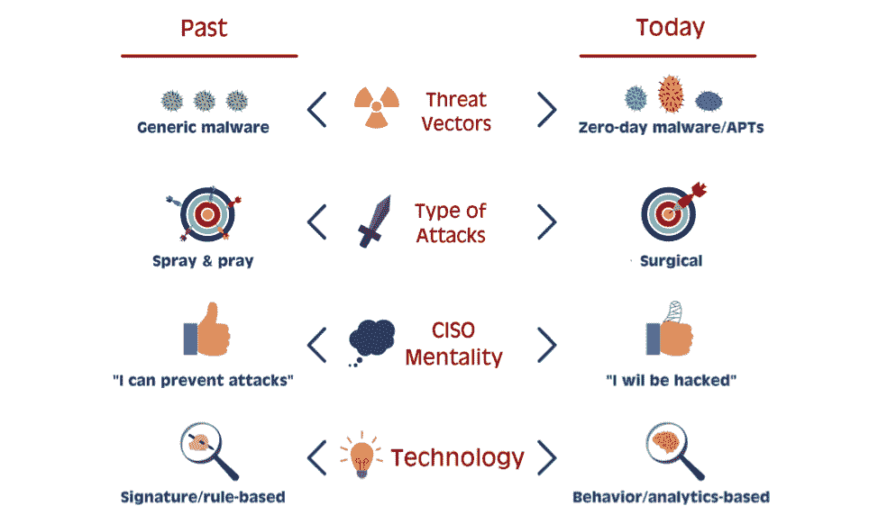
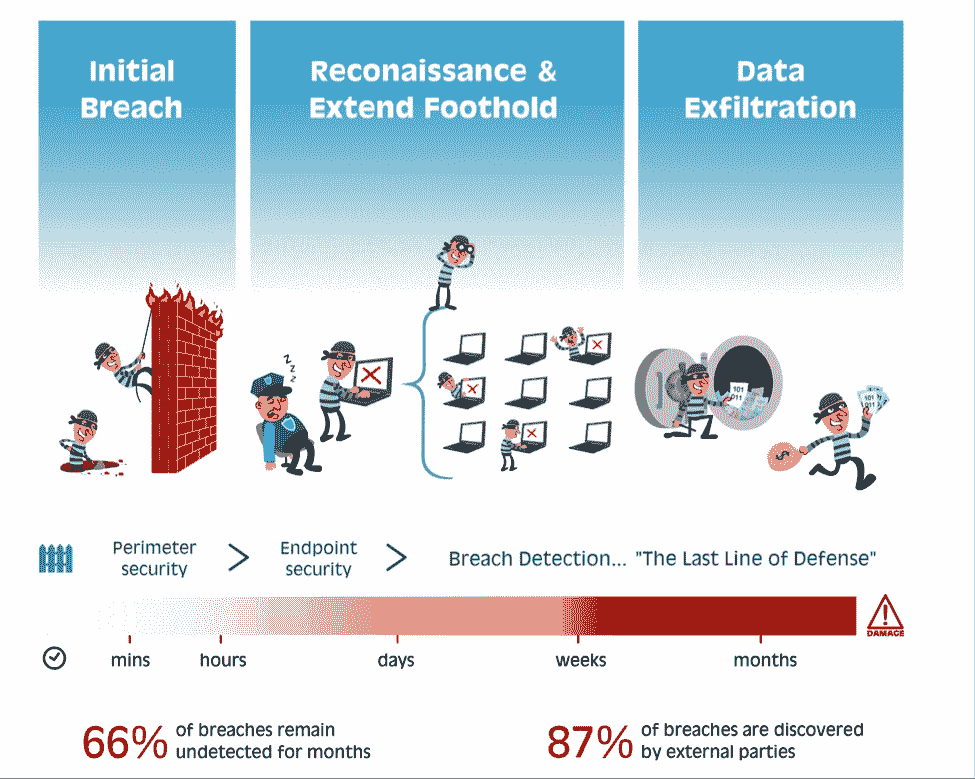

# 为什么入侵检测是您新的必备网络安全工具 

> 原文：<https://web.archive.org/web/https://techcrunch.com/2014/09/06/why-breach-detection-ss-your-new-must-have-cyber-security-tool/>

施然·沙莱夫撰稿人

施兰·沙莱夫是

[Battery Ventures](https://web.archive.org/web/20221205171412/https://www.battery.com/)

在那里，他主要关注软件和消费者投资，包括金融科技。

More posts by this contributor

**编者按:** *[帕兹·艾舍尔](https://web.archive.org/web/20221205171412/https://twitter.com/pazeshel)是副总裁，[巴基·摩尔](https://web.archive.org/web/20221205171412/https://twitter.com/buckymoore)和[施然·沙莱夫](https://web.archive.org/web/20221205171412/https://twitter.com/ShiranShalev)是合伙人，在[电池风投](https://web.archive.org/web/20221205171412/http://www.battery.com/powered/)。Eshel 和 Shalev 在 Battery 的以色列办公室工作，而 Moore 在 Menlo Park 工作。电池投资组合的完整列表，请点击* [*此处*](https://web.archive.org/web/20221205171412/http://www.battery.com/our-companies/list/) *。*

新闻里到处都是网络攻击，似乎没有人能幸免于难——包括[家得宝](https://web.archive.org/web/20221205171412/https://beta.techcrunch.com/2014/09/02/home-depot-credit-card-theft/)、[塔吉特](https://web.archive.org/web/20221205171412/https://beta.techcrunch.com/2013/12/19/target-confirms-point-of-sale-data-breach-announces-it-exposed-40-million-credit-card-numbers/)、Adobe 和[易贝](https://web.archive.org/web/20221205171412/https://beta.techcrunch.com/2014/05/21/ebay-alerts-users-to-change-passwords-following-cyberattack/)。那么，为什么首席信息官们还在束手束脚地打击网络犯罪分子呢？

令人震惊的是，大多数公司仍然依赖过时的、仅部分有效的方法来保护他们的敏感数据，主要是利用专注于防止外来攻击的技术。但是，实际上阻止坏人溜进企业网络并得到他们的敏感数据几乎是不可能的。事实上，在拥有超过 5，000 台计算机的组织中，超过 90%的组织在任何给定时间都有某种形式的主动入侵。更糟糕的是，那些组织可能根本不知道这件事。

首席信息官是时候开始关注打击网络犯罪战争中的下一道防线了:一个名为违规检测的新兴领域，该领域专注于在长尾入侵发生后识别它们并减轻它们的损害，部分是通过使用大数据技术。您公司的信息安全可能依赖于此。

## **一个不断变化的战斗空间；预防是不够的**

在鲨鱼袭击中幸存是相当简单的:只要你游得比旁边的人快，你就有可能成功。不久前，安全性还是老样子。只要你的公司有高于平均水平的安全性，你就可能是安全的，因为其他人会首先受到攻击。

黑客们一直在寻找“易得之果”——容易被攻破的漏洞。网络犯罪分子主要使用广泛的“喷雾祈祷”方法来寻找机会。在那个时代，“基于签名”的安全解决方案是有意义的，它试图识别已知的恶意代码模式并阻止它们。如果一家公司发现了新的威胁，可以为它写一个签名，并分发给其他公司，以保护他们免受感染。

快进到今天。随着组织加强其安全性，黑客也在进化。今天的攻击比以往任何时候都更加复杂和有针对性。如今，黑客们不再发送普通的恶意软件，而是精心策划每一次攻击，使用独特的“零日”攻击，使得基于签名的保护几乎无用。

虽然近年来出现了许多新的安全公司，如 FireEye，试图打击这种类型的攻击，但黑客们仍在继续寻找绕过这些工具的创造性方法。一些黑客甚至购买了他们的目标使用的所有相同的最先进的入侵防御系统，以便他们可以完美地复制目标的确切安全环境，然后测试他们的攻击，并几乎保证其成功。

## **大部分损害发生在初次破坏之后**

在典型的入侵场景中，初始入侵需要几分钟到几个小时，在极少数情况下甚至需要几天。然而，真正的损害发生在黑客绕过第一道防线之后的*，这使得新的事后违规检测工作变得如此重要。一旦进入目标，就像发现了金矿。黑客研究受害者的内部网络，小心翼翼地扩展他们的立足点，然后开始挖掘他们发现的有价值的数据，这些数据在被发现之前会持续数月，甚至数年——通常是意外地。*

例如，Mandiant 最近报告称，中国网络间谍机构之一 APT1 攻击了 20 个行业的 141 家受害公司，在平均每次 365 天的持续攻击中窃取了许多万亿字节的压缩数据。最长的一次袭击持续了四年多。

所有这一切中最令人担忧的部分是，现在很少有组织使用新的违规检测技术，并且实际上能够自己发现这些持续的违规行为，这意味着攻击对受害者的破坏性更大。例如，尽管有许多警报，Target 并没有发现最近导致 4000 万信用卡号被盗的违规事件。相反，直到美国司法部在 12 月中旬通知该公司后，Target 调查人员才回去查明发生了什么。根据威瑞森去年发布的一份报告，这种情况并不少见，只有大约 13%的安全漏洞是在内部发现的。

## **漏洞检测——最后一道防线**

所有这些因素都表明需要强大的违规检测来提供针对这些攻击的“最后一道防线”，而不仅仅是专注于阻止最初的入侵浪潮。

虽然事后检测并不是一个新概念，但老一代的入侵检测系统(IDS)和安全信息和事件管理(SIEM)技术在当今的数据中心环境中普遍存在不足。为什么？

*   **他们依靠预定义的规则/特征来检测违规行为**。在一个定制攻击的世界里，这种解决方案往往会错过最相关的警报。
*   **低信噪比**。想象一下，每天被数百甚至数千条警报淹没，每一条都代表着对您组织最敏感数据的潜在破坏。毫不奇怪，塔吉特和许多其他人一样，没有注意到袭击的警告信号，就像谚语所说的只见树木不见森林。
*   **由于部署在安全边界或依赖日志文件**，可见性有限。如果无法访问扩展到边界之外并包含所有原始信息的丰富数据集(与日志文件相反，日志文件是其衍生物)，这些工具正确检测威胁的能力就会受到削弱。

从本质上来说，下一代违规检测正在解决一个经典的大数据问题:为了有效，这些工具需要以极高的速度分析大量的各种数据，以确定潜在的违规行为。最重要的是，工具必须精确；太多的误报和他们的报告将很快被忽略，就像那个喊狼来了的男孩一样。

一批新的下一代创业公司正在致力于此。它们包括 Aorato、Bit9、Cybereason、Exabeam、Fortscale、LightCyber、Seculert 和 Vectra Networks。这些公司没有依赖于检测已知的签名，而是将机器学习等大数据技术与深入的网络安全专业知识相结合，以描述和理解用户和机器的行为模式，使他们能够检测这种新型攻击。为了避免安全专家淹没在大量无用的警报中，这些公司试图最大限度地减少警报的数量，并提供丰富的用户界面，支持交互式探索和调查。

为了帮助说明这些新技术是如何工作的，想想攻击者在攻击的每个步骤中不可避免地留下的所有在线“面包屑”。

例如，他生成到命令和控制服务器的网络连接。他在整个组织中的行动方式与正常情况略有不同；他可能使用他所能获得的任何凭证来尝试访问敏感资源(例如，尝试使用销售主管的登录来访问开发服务器上的专有代码)。新的违规检测初创公司可以感知所有这些移动和变化。结合对黑客运作方式的深入了解，他们最终能够在更严重的损害发生之前实时拼凑出所有的拼图。

这里事关重大。最终，能够有效消除噪音并指出少量高度相关、可操作的安全警报的解决方案将可能成为重要的“最后一道防线”和下一代企业安全体系的关键组成部分。