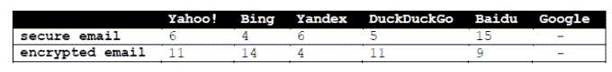
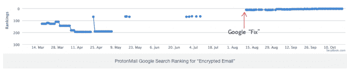

# 为什么 ProtonMail 从谷歌搜索结果中消失了几个月？

> 原文：<https://web.archive.org/web/https://techcrunch.com/2016/10/27/why-did-protonmail-vanish-from-google-search-results-for-months/>

如果你是一个受欢迎的零访问加密网络邮件产品的制造商，突然发现你的产品不再出现在谷歌搜索结果中，例如“安全电子邮件”和“加密电子邮件”，你会得出什么结论？

肯定有什么不对劲。

但更相关的问题是，你的产品的消失是意外还是故意的——鉴于谷歌也提供流行的网络邮件产品 Gmail，尽管该产品不提供零访问权限，因为用户向公司“支付”他们的个人数据，这些数据被输入 Alphabet 的用户档案和广告定位引擎。

因此，换句话说，当竞争对手的电子邮件产品取得成功时，谷歌并不是一个完全无私的旁观者。

考虑到[谷歌正在欧盟](https://web.archive.org/web/20230325071056/https://techcrunch.com/2016/07/14/google-under-fire-again-from-europes-antitrust-regulator-over-adsense-comparison-shopping/)(以及[其他地方](https://web.archive.org/web/20230325071056/https://techcrunch.com/2015/08/31/indias-antitrust-commission-accuses-google-of-rigging-its-search-results/))接受反垄断调查，欧盟委员会的竞争专员正在调查长期以来的投诉，即该公司在自己的搜索结果中主动降低竞争对手的服务——阻碍了他们的竞争能力，在这里考虑意图也是特别恰当的。

在欧洲，谷歌的搜索引擎占据了巨大的市场份额——大约 90%。这意味着从欧洲的谷歌搜索结果中消失会给任何企业在该地区的竞争能力带来特别大的障碍。

**什么是原声邮件？**

问题中的加密电子邮件产品是 ProtonMail，这是一家瑞士初创公司，于 2014 年由[众筹成立，是美国加密](https://web.archive.org/web/20230325071056/https://techcrunch.com/2014/06/23/protonmail-is-a-swiss-secure-mail-provider-that-wont-give-you-up-to-the-nsa/)电子邮件提供商的替代产品，美国加密电子邮件提供商在[向情报机构提交用户数据的压力下](https://web.archive.org/web/20230325071056/https://techcrunch.com/2013/08/13/why-ladar-levison-shuttered-encrypted-email-service-lavabit-in-the-face-of-government-pressure/)倒闭。

2015 年，ProtonMail 的用户已经超过了 50 万。今年早些时候，它退出了测试版，并添加了 iOS 和 Android 应用。据创始人 Andy Yen 说，它现在有大约 200 万用户。回到[三月](https://web.archive.org/web/20230325071056/https://techcrunch.com/2016/03/17/protonmails-encrypted-email-service-exits-beta-adds-ios-android-apps/)，他告诉 TechCrunch，通过捐赠和付费账户，ProtonMail 正接近盈亏平衡。

然而，在昨天发表的一篇[博客文章](https://web.archive.org/web/20230325071056/https://protonmail.com/blog/search-risk-google/)中，该公司声称谷歌从相关搜索结果中删除“质子邮件”几乎扼杀了它的产品并严重削弱了它的盈利能力。

2015 年 11 月，Yen 写道，该公司注意到它不再出现在相关搜索查询的谷歌搜索结果中——尽管到那年秋天它的用户群大约翻了一番——而所有其他主要搜索引擎仍然在他们的结果中显著地返回 ProtonMail:

ProtonMail 在 2016 年春天跟踪了这一情况，试图与谷歌取得联系，询问它为什么从搜索结果中消失了——最初没有得到回应。直到 8 月份，在谷歌员工发了推文之后，谷歌才最终承认了这一投诉。

在那次公开交流之后，ProtonMail 显然在几天内就被告知谷歌已经“修复了一些东西”——在那之后，它能够立即看到积极的结果:

【T2

一项快速测试证实，在谷歌中搜索“安全电子邮件”或“加密电子邮件”,现在会将 ProtonMail 作为第一或第二结果返回。

然而，ProtonMail 表示，谷歌没有提供任何细节，说明是什么样的“问题”导致 ProtonMail 的产品从谷歌搜索引擎的相关搜索中降级或消失。

我们也要求该公司做出解释，但在撰写本文时，它还没有回应我们的问题。

“如果没有谷歌的任何额外解释，我们可能永远也不会知道为什么 ProtonMail 会被取消排名。无论如何，我们很感激谷歌最终采取行动解决问题，我们只是希望它能早点发生，”Yen 写道。

“尽管谷歌是一家美国公司，但它控制着超过 90%的欧洲搜索流量。在这种情况下，谷歌直接导致 ProtonMail 的全球增长率在 10 个月内下降了 25%以上，”他补充道。

“这意味着 ProtonMail 的用户收入也减少了 25%，给我们的运营带来了财务压力。我们从能够支付所有的月支出变成了不得不从应急储备基金中提款。由此造成的收入损失和经济损失达几十万瑞士法郎(1 瑞士法郎= 1.01 美元)，将永远得不到补偿。”

在与 TechCrunch 进一步讨论此事时，Yen 形容谷歌“在搜索问题上是出了名的守口如瓶。他们透露的唯一信息是，他们能够根据我们的数据找到并修复一些东西。考虑到这个问题让我们损失了几十万瑞士法郎，并危及到了业务，这个答案并不令人满意。”

在他的博客文章中，Yen 使用了“搜索风险”这个词来描述这个问题——他认为，对谷歌在搜索领域的主导地位进行“更多的透明和监督”,对于避免其他初创公司因被谷歌指数淘汰而被扼杀的风险至关重要。ProtonMail 现在支持欧盟对谷歌的反垄断诉讼。

“我们幸存下来讲述这个故事的唯一原因是，ProtonMail 的大部分增长来自于口口相传，我们的社区太响亮了，不容忽视。许多其他公司不会这么幸运，”他写道。

“这一事件表明，搜索风险是严重的，这就是为什么我们现在同意欧盟委员会的观点，即鉴于谷歌在搜索领域的主导地位，更多的透明度和监管是至关重要的。”

> 坦率地说，对搜索没有任何监管或透明度是疯狂的。

Yen 认为 ProtonMail 是被谷歌有意从搜索结果中消失的吗？“很难猜测谷歌的内部运作，也很难判断这是不是有意为之，”他回应道。“这也可能是谷歌软件的错误，但我们没有听说过任何其他类似的情况，所以一个错误只影响我们是很奇怪的。不管是不是有意为之，这非常清楚地展示了谷歌搜索垄断可能对现实世界产生的影响。”

自从搜索可发现性问题公之于众后，Yen 说，ProtonMail 受到 Yelp 的邀请，Yelp 是谷歌反垄断原告的[联盟之一，要求在针对谷歌的反垄断案件中获得感兴趣的第三方地位。](https://web.archive.org/web/20230325071056/https://techcrunch.com/gallery/10-slides-debunking-googles-antitrust-defense-of-its-shopping-comparison-service/)

“在做出决定之前，我们将在接下来的几天里权衡这一选择。他补充道:“人们一直在猜测谷歌的搜索结果，但我们的案例似乎是唯一一个有数据支持的案例(无论如何我们都能找到)。”

“这是一个令人不安的案件，我认为它证实了欧盟委员会对谷歌展开的反垄断调查。由于谷歌的搜索垄断，你会遇到这样一种情况，一家公司可以任意摧毁它想要的任何其他业务，而没有明确的法律约束。

“这在历史上是前所未有的，因为具有这种控制和影响力的所有其他行业，如银行业，长期以来一直是受监管的行业。坦率地说，对搜索没有任何监管或透明度是疯狂的。”

他补充说，试图就搜索问题向谷歌索赔收入损失需要在法律上开辟新的领域，而 ProtonMail 没有这些资源。

在他看来，答案显然是监管。

如果看不到谷歌搜索排名算法的内部运作，外人显然不可能核实该公司是否公平地对竞争对手进行排名。

虽然法国和 T2 的政治家们已经采取了一些措施向谷歌施压，要求其公开黑箱算法以接受监管审计，但这需要整个欧洲的一致努力来立法要求披露——尽管心怀不满的竞争对手不断抱怨被挤出搜索结果，但我们还没有到那一步。

你还会认为谷歌会竭尽全力保守其专有秘密。因此，将会动员巨大的游说力量来阻止任何此类监管努力。

但是，随着令人担忧的例子如 ProtonMail 案件继续对其不利，以及[报道暗示](https://web.archive.org/web/20230325071056/http://www.theverge.com/2016/10/1/13132856/eu-considering-fines-google-android-antitrust-play-phones)欧盟正准备以反垄断为由对谷歌罚款，该公司在一个其业务流程仍然受到严重怀疑的地区对自己没有任何好处。

光学看起来很糟糕。未来，监管机构对其搜索算法所做决策进行审计的压力可能会加大。

正如安全评论员 Graham Cluley 所说:“当[ProtonMail]问题第一次引起他们的注意时，谷歌真的应该做出更快的反应。未能早点修复问题，只会让更多人认为这是故意的。”

然而，不管是有意还是无意，损害显然已经造成——这可能是[需要审计日益强大的算法](https://web.archive.org/web/20230325071056/https://techcrunch.com/2016/10/12/ai-accountability-needs-action-now-say-uk-mps/)的最有力的论据。