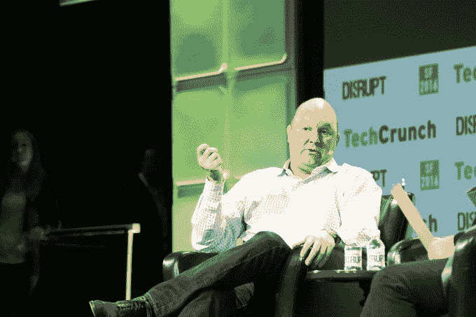
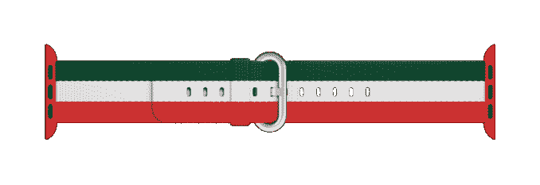
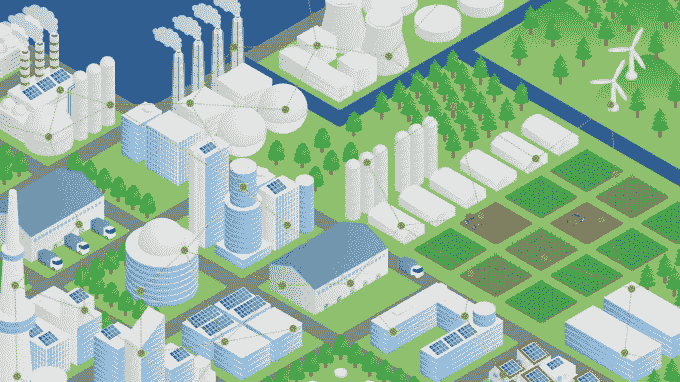
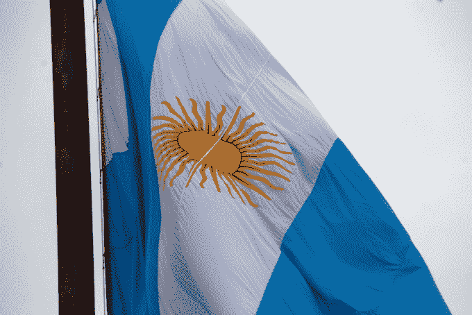

# 为什么硅谷的一些顶级投资者开始投资拉丁美洲？

> 原文：<https://web.archive.org/web/https://techcrunch.com/2016/09/28/why-have-some-of-silicon-valleys-top-investors-started-investing-in-latin-america/>

More posts by this contributor

拉丁美洲可能是这个星球上最被忽视的新兴市场。

拉丁美洲的风险投资无法与印度或中国相比(相比之下，根据《华尔街日报》的数据，中国 2016 年上半年的新风险投资基金为 118 亿美元，下降了 14%，而拉丁美洲的 T2 为 2.18 亿美元)，该地区的 6 亿居民被投资者忽视了，他们认为你需要达到 10 亿用户才能成为“真正的创业公司”

但随着 Andreessen Horowitz(哥伦比亚)、Founders Fund 和 Sequoia Capital(巴西)以及 QED(墨西哥和巴西)的首次投资，这种情况似乎正在改变。

在过去的几年里，[我为 TechCrunch 撰写了关于拉丁美洲投资的](https://web.archive.org/web/20230322162524/https://techcrunch.com/contributor/julie-ruvolo/)，采访了一些初创公司，如 [VivaReal](https://web.archive.org/web/20230322162524/https://techcrunch.com/2014/11/24/real-estate-joins-brazils-big-startup-industries/) 、 [PSafe](https://web.archive.org/web/20230322162524/https://techcrunch.com/2015/07/09/expanding-in-latin-america-brazilian-anti-virus-startup-psafe-raises-30m/) 、 [ComparaOnline](https://web.archive.org/web/20230322162524/https://techcrunch.com/2013/09/14/how-comparaonline-raised-16m-to-build-a-thriving-insurance-comparison-service-in-latin-america/) 和 [Descomplica](https://web.archive.org/web/20230322162524/https://techcrunch.com/2015/07/19/is-for-profit-the-future-of-education-in-brazil/) ，并采访了该地区一些领先的当地投资者，如由大获成功的 MercadoLibre 团队创建的 KaszeK Ventures，以及 Redpoint 和 e.Ventures 的合资企业 Redpoint e.Ventures。

让我展示一下当地投资者眼中的机会:

*   互联网人口将翻一番，从 3 亿增加到 6 亿。

*   一半的人口不属于银行系统(只有 15%的墨西哥人有信用卡)。

*   几乎每个人都通过廉价的机器人上网。

同样值得注意的是，巴西的 2 亿居民中只有一半人上网，但它已经是全球各大社交平台的第二号或第三号观众。根据你正在看的[的](https://web.archive.org/web/20230322162524/http://qz.com/304179/brazil-has-the-worlds-biggest-internet-addicts/) [数据](https://web.archive.org/web/20230322162524/http://www.emarketer.com/Article/Latin-Americans-Most-Avid-Social-Media-Users/1013517)，巴西人上网的时间比其他任何人口都多。(想起来很奇怪[始于【Orkut。)](https://web.archive.org/web/20230322162524/https://www.buzzfeed.com/jruv/why-brazil-is-actually-winning-the-internet)

创业数据怎么样？在过去的五年里，风险投资一直在稳步攀升，2015 年是表现出色的一年，尽管巴西接连遭遇经济和政治危机，但仍有[5 . 94 亿美元](https://web.archive.org/web/20230322162524/http://lavca.org/industry-data/latin-america-venture-capital-five-year-trends/)用于 182 笔交易[，就融资和投资金额而言，巴西是该地区领先的风险市场。](https://web.archive.org/web/20230322162524/https://techcrunch.com/2015/09/27/as-brazilian-economy-descends-into-crisis-tech-is-growing-double-digits/)

根据拉丁美洲私募股权和风险投资协会( [LAVCA](https://web.archive.org/web/20230322162524/http://lavca.org/) )的[年中数据，拉丁美洲的风险投资交易同比增长了 46%，这是一个由 Omidyar Network(我在这里工作)支持的非营利组织。](https://web.archive.org/web/20230322162524/https://lavca.org/member-announcement/2016-mid-year-data-analysis-now-available/)

因此，对于那些认为边境以南“没什么事情”的人来说，这里有一些我正在关注的投资趋势:

## 顶级硅谷公司正在该地区进行首次投资

就在 2016 年，我们看到安德森·霍洛维茨基金对哥伦比亚杂货配送服务公司 [Rappi](https://web.archive.org/web/20230322162524/http://lavca.org/2016/07/27/andreessen-horowitz-invests-colombian-app-rappi-en-espanol/) 进行了第一笔 LatAm 投资。

Founders Fund 也在 LatAm 首次亮相，投资了法律平台 jus Brasil T4 和金融科技初创公司 Nubank。在过去的一年中，Nubank 已经从 Founders Fund、红杉资本(这是他们在巴西的第一笔投资)、Tiger Global、KaszeK Ventures 和 QED 投资者那里筹集了 8000 万美元的资金，今年早些时候，高盛进行了 5200 万美元的债务投资。

高盛今年还牵头对巴西物流初创公司 CargoX 进行了 1，000 万美元的投资，Valor Capital 和优步的联合创始人 Oscar Salazar 也参与了投资。

在墨西哥，Accel Partners 和 QED 投资者进行了首次投资:Accel 参与了墨西哥杂货购物服务 Cornershop 的一笔[670 万美元](https://web.archive.org/web/20230322162524/http://lavca.org/2016/04/14/allvp-leads-us6-7m-series-cornershop/)的首轮投资，由该地区最活跃的风投公司之一 ALLVP 牵头，QED 加入了 KaszeK、Quona Capital、Accion Frontier Inclusion Fund 和墨西哥公司 Jaguar Ventures 在贷款平台 Konfio 的一笔[800 万美元](https://web.archive.org/web/20230322162524/http://lavca.org/2016/05/24/online-mexican-lending-platform-konfio-raises-us8m-new-vc-funding/)的首轮投资。

## 墨西哥[2015 年首次对外集资](https://web.archive.org/web/20230322162524/https://lavca.org/member-announcement/2016-mid-year-data-analysis-now-available/)巴西

****

墨西哥也在 2016 年上半年首次在交易数量方面领先于该地区，交易数量为 [47](https://web.archive.org/web/20230322162524/https://lavca.org/industry-data/2016-mid-year-data-analysis/) (比 2015 年上半年增长 4.2 倍)，这主要是由政府机构 Fondo de Fondos 和国家企业家研究所(INADEM)在过去几年中提供的资本刺激的。

(巴西的风险投资生态系统也有类似的启动，政府资助来自和[FINEP](https://web.archive.org/web/20230322162524/http://www.finep.gov.br/)；同样值得注意的是，多边投资基金的苏珊娜·加西亚-罗伯斯亲自领导了该地区 70 多个基金的锚定投资。)

## 目前，金融科技在拉美风险投资领域占据主导地位

2015 年，金融科技代表了 29%的 IT 投资(按投资总额计算)，2016 年上半年，金融科技代表了 40%的 IT 投资(按 T2 计算)。在墨西哥，除了 Konfio，贷款平台 Kueski 还从 CrunchFund、Rise Capital、Variv Capital 和其他公司筹集了[1000 万美元](https://web.archive.org/web/20230322162524/http://lavca.org/2016/04/21/mexican-fintech-startup-kueski-raises-us35m/)(外加另外[2500 万美元](https://web.archive.org/web/20230322162524/http://lavca.org/2016/04/21/mexican-fintech-startup-kueski-raises-us35m/)债务)。在巴西，国际金融公司在 GuiaBolso 与 KaszeK Ventures、Ribbit Capital 和 QED 投资者一起领投了 1500 万美元的 C 轮融资。有趣的是，由于该地区一半的人口没有银行账户，几乎每一家金融科技初创公司都对金融普惠产生了直接或无意的影响。

## 随着孟山都、高通和巴斯夫的大笔投资，农业科技开始升温

巴西是全球仅次于美国的第二大 T2 农业企业市场，但农业技术在拉丁美洲是一个服务严重不足的行业，自 2011 年以来占拉丁美洲风险投资的不到 1 %( T4)。这种情况似乎正在发生变化:孟山都正在投资高达 9200 万美元的 BR Startups，这是一只由微软和高通公司合作管理的巴西 agtech 基金。

高通风险投资公司(Qualcomm Ventures)还推出了一个[计划](https://web.archive.org/web/20230322162524/https://www.qualcomm.com/news/onq/2016/07/05/how-brazilian-farmers-will-use-drones-boost-agriculture-and-support)，让巴西的每个农场(有超过 200 万个)都有一架无人机。而德国农药巨头巴斯夫刚刚推出 [agtech 加速器 Agrostart](https://web.archive.org/web/20230322162524/https://lavca.org/2016/08/30/basf-ace-launch-agrotech-accelerator-agrostart-em-portugues/) 。

## 巴西移动集团 Movile 正在进行收购

关于拉丁美洲的数字 M&A 交易，没有太多公开可用的数据(我们正在努力)，但 Movile 似乎是目前该地区最活跃的收购者。

刚刚完成 3000 万美元的 F 系列，Movile 的子公司 iFood，该地区领先的按需食品交付初创公司，[收购了](https://web.archive.org/web/20230322162524/https://techcrunch.com/2016/03/16/spoonrocket-finds-a-home-with-brazil-based-ifood/)spoon rocket——这是他们在不到两年的时间里进行的第 15 次收购。

Movile 的按需送货和配送服务 Rappido 紧随其与巴西竞争对手 99Motos 的合并之后，正在墨西哥获得支持。

## 所有的目光都聚焦在阿根廷

随着新当选总统毛里西奥·马克里的上任，阿根廷正在组织一系列的结构性变革，以促进新公司的创建。

马克里和国家企业家秘书 Mariano Mayer 刚刚[宣布了](https://web.archive.org/web/20230322162524/http://www.infobae.com/economia/2016/08/18/los-6-puntos-relevantes-del-proyecto-de-ley-de-emprendedores/)一系列促进企业家精神和新公司创建的法律:Ley del Emprendedor 将允许企业家在 24 小时内【网上】注册并开设公司；《集体利益协会法》将是该地区第一部界定和认可具有可持续环境或社会影响的企业的法律。

还计划创建 10 个新基金，为企业家提供获得资本的途径(三个基金将在年底前各获得 3000 万美元)，并立法允许众筹。墨西哥城和巴西也在进行类似的立法项目，鼓励创建新公司。

在 LAVCA 的[五年趋势](https://web.archive.org/web/20230322162524/http://lavca.org/industry-data/latin-america-venture-capital-five-year-trends/)报告中，阅读拉丁美洲的风险融资和投资数据、最活跃的本地和国际投资者以及最大的交易。要跟踪风投交易，订阅 LAVCA 的双周刊 [LatAm Venture Bulletin](https://web.archive.org/web/20230322162524/http://lavca.org/latam-venture-bulletin-newsletter-signup/) 。