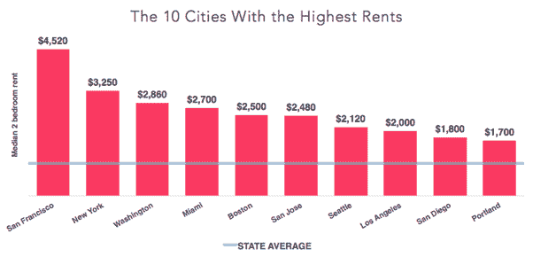
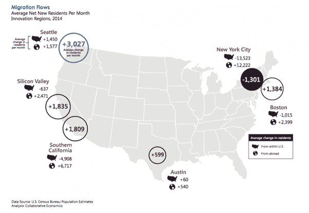

# 为什么我把创业公司从旧金山搬到圣地亚哥 

> 原文：<https://web.archive.org/web/https://techcrunch.com/2016/03/29/why-i-moved-my-startup-from-san-francisco-to-san-diego/>

安德鲁·加兹德基撰稿人

More posts by this contributor

旧金山一直被誉为科技初创公司的故乡，是那些希望为下一件大事奠定基础的企业家的理想之地。作为一个雄心勃勃的移动应用平台，我们加入了这一行列，与硅谷备受称赞的工程师共用了四年的区号，并将自己插入了科技世界的假想中心。

这似乎是最好的选择。有一段时间确实如此。

在硅谷，你会接触到很多天才，灵感似乎是从树上长出来的。但过一段时间后，旧金山的魅力可能会超过它的好处。无论公司是否成功，高昂的生活成本、激烈的招聘竞争和漫长的通勤时间都会给公司带来损失。风险投资支持的公司不负责任的招聘行为烧焦了其他人的土地，营造了一种环境，在这种环境中，取得成功意味着将资金投入投资回报很低的领域。

在 [Bizness Apps](https://web.archive.org/web/20221128042717/https://www.biznessapps.com/) — [连续两年被 Inc.](https://web.archive.org/web/20221128042717/http://www.inc.com/profile/bizness-apps) 评为美国发展最快的公司之一——我们已经体验到了湾区魅力的另一面。我们的快速势头最终被旧金山的饱和所减缓，这阻止了我们获得继续上升所需的一流球员。此外，签订 5 年或 10 年租约的想法并不理想。正如 TechCrunch 报道的那样，“一月份，旧金山的办公室租金超过了纽约，成为全国最贵的。”

不利因素越积越多，我们做出了艰难的决定。今年春天，Bizness Apps 将把科技圣杯抛在身后，搬迁到圣地亚哥，那里可能是未来的科技天堂。以下是您也应该这样做的原因。

## 生活费用失控了

不是闹着玩的。旧金山很贵。两居室公寓的平均价格徘徊在每月 4200 美元左右，除非你每年赚几十万美元，否则很难证明住在这里是合理的。相比之下，你在圣地亚哥需要大约 4900 美元才能维持和在旧金山 8100 美元相同的生活水平。

从雇主的角度来看，降低员工的生活成本实质上相当于给他们加薪 30-50%。让我们面对现实吧，很难支付旧金山要求的薪水。我们在所有岗位上都面临着这一问题，并认识到搬迁意味着我们将获得更多的资金，并在相同的工资水平下为我们的员工提供更高质量的生活。

## 做小池塘里的大鱼

旧金山在科技人才方面是世界上最好的，所以很容易假设如果你想要最好的，这就是你应该来的地方。事实上，招聘战从未如此残酷。在这里，你不仅要与科技界的大腕竞争，还要与全世界的大腕竞争。谷歌、优步、Twitter、Zenefits、苹果和数百家其他“独角兽”拥有足够的杠杆，可以在初创公司听到名字的回音之前就抓住人才。

> 很少能在不做出牺牲的情况下找到完美的解决方案。

初创公司需要各方面的技术人才:工程、销售、客户成功、业务发展、营销等。要发现并欢迎人才加入，你不能是一个小的甚至中等的鱼苗。另一方面，把你的旧金山规模带到像圣地亚哥这样的地区意味着快速增长。突然间，你成了一条大鱼，能够以较低的价格招募到精英中的精英。

作为一家白手起家的公司，吸引人才被证明是困难的，因为我们没有得到大型风投的资助。我们发现这很奇怪，因为至少可以说，在没有风投支持的情况下，在旧金山经营一家盈利且不断增长的企业是一项罕见的成就。不管怎样，得到红杉和 Accell 这样的大公司的资助对顶尖候选人来说是有吸引力的。通过搬迁，我们可以专注于继续发展可持续经营，并吸引那些愿意帮助我们实现这一目标的人，不管有没有风险。

## 移动可以立即增加你的跑道

用不了多久，旧金山的繁荣就会吞噬利润。虽然在硅谷有所作为是有道理的，但你的整个企业并不需要称之为家。此外，随着全球市场进入互联网时代，位置比以往任何时候都不重要。圣地亚哥和其他科技竞争者提供了更多的扩张空间，而不会削弱业务或使员工陷入绝望的房地产市场。在那里，我们可以重新专注于盈利能力、高利润率和成功招聘。

## 科技正在崛起，并向其他地方发展

新的文化和技术影响者很少能够在旧金山破土而出，旧金山位于美国技术金字塔的顶端。后起之秀[纷纷起身离开](https://web.archive.org/web/20221128042717/http://www.vanityfair.com/news/2016/03/silicon-valleys-exodus-begins)，在别处创造新的创业场景。这并不是说旧金山不是一个好地方——但是如果你想不仅仅是大海捞针，还有更好的地方。

圣地亚哥符合科技创业公司的标准。中国日益增长的科技领域让企业家精神得以发扬光大。像 Bizness 应用程序这样走在曲线前面的公司可以更容易地取得进展，成为有影响力的人，并呈上升趋势，而不是停滞不前。(如果你需要更多的证据来证明圣地亚哥在经济和商业上是有意义的，看看圣地亚哥的【T2 之声】和圣地亚哥的[创业公司](https://web.archive.org/web/20221128042717/http://startupsd.org/)来获得更多令人信服的信息。)

## 成为最佳工作场所之一

很难跟上旧金山巨头们的额外津贴。例如，看看 Dropbox 的员工待遇，正如 [David Tvaltchrelidze](https://web.archive.org/web/20221128042717/https://www.quora.com/What-are-the-perks-of-working-at-Dropbox) 所引用的:

*   我们著名的小吃店每天提供免费的早餐、午餐和晚餐，外加大量的小吃和饮料
*   非常灵活的时间
*   18 天的带薪假期和 11 天的带薪假期，所有你需要的病假，以及慷慨的育儿假政策
*   提供洗衣服务和健身课程的室内健身房，以及其他健身房和健康计划的报销
*   办公室距离第四街和国王街仅几步之遥。使用免费的 Caltrain Go 通行证、公交优惠或我们在旧金山的免费 Dropbox 班车服务
*   401(k)，与公司匹配
*   为员工支付 100%的健康保险费
*   帮助您节省时间的福利，如现场理发、补贴按摩和免费清洁服务
*   加入乐队。配有鼓、钢琴、扩音器等的完整音乐工作室。
*   每周公司欢乐时光
*   桌游之夜、乒乓球、游戏机游戏室、DDR(是的，一台真实的机器)、星际争霸、台球等等

很疯狂，对吧？我们提供一些额外津贴，但肯定不是全部。现在想象一下，你搬到了一个城市，那里的企业负担不起太阳底下的一切。相比之下，你有机会变得非常受欢迎。我们希望成为圣地亚哥最优秀的雇主之一。通过搬迁，我们将创造一个更加轻松、成本更低的工作环境。

## 你的创业公司并不是唯一感受到压力的公司

[硅谷竞争力和创新项目发现](https://web.archive.org/web/20221128042717/http://svcip.com/)超过 7600 名硅谷居民离开该地区前往美国其他城市。这些结果还显示，仅在一年内，房价上涨了 13%，房租上涨了 12%。此外，SVCIP 的报告发现，2014 年，硅谷通勤者平均在交通拥堵中损失了 67 个小时，比 2010 年增加了 13.6%。

## 有什么不好的地方吗？

嗯，商业决策总是包含风险。很少能在不做出牺牲的情况下找到完美的解决方案。有些人认为，如果你从事科技行业，你需要硅谷。我们不这么认为。

是的，你可以选择的候选人会更少。搬迁一家公司需要做很多工作，所以在这个过程中你也会失去一些员工。但最终，难道你不想让你的公司扎根于你能获得更多关注、吸引更优秀人才并获得竞争优势的地方吗？搬家有助于实现这一点，将你的创业从阴影中带到聚光灯下。

## 从旧金山搬走创造了持久的竞争优势

商业的核心是竞争优势，所以竞争较少的低成本地点可能正是你的公司发展所需要的公式。我们相信，这一举措将推动我们在旧金山前所未有的快速扩张。移动行业正在蓬勃发展，圣地亚哥是我们为未来奠定基础的新领域。