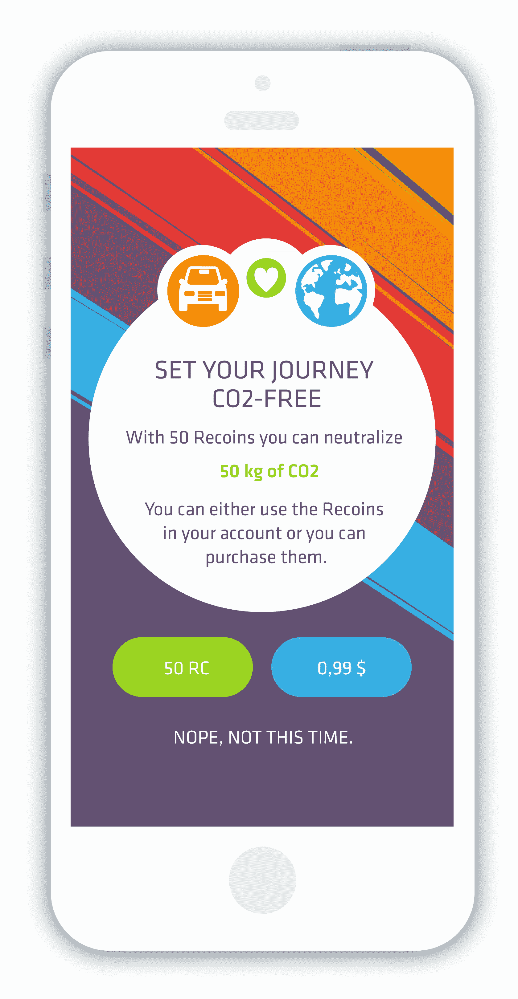
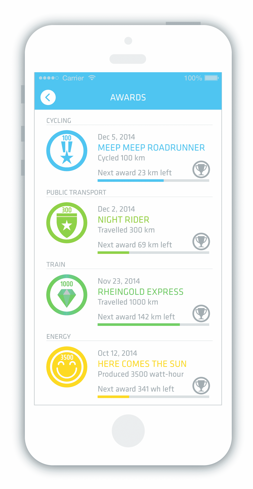
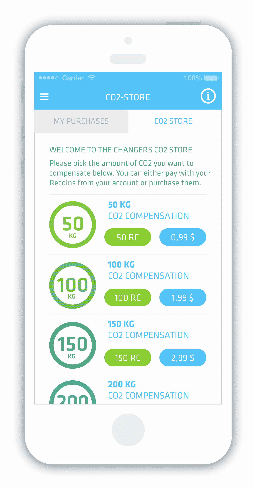
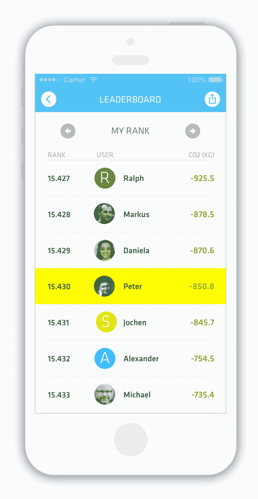
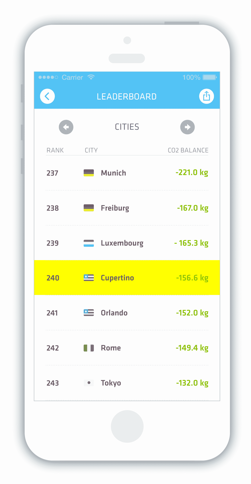
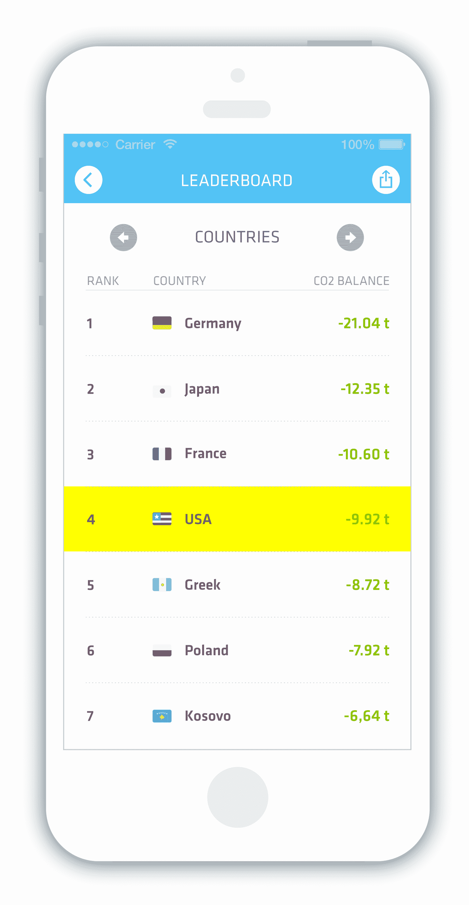
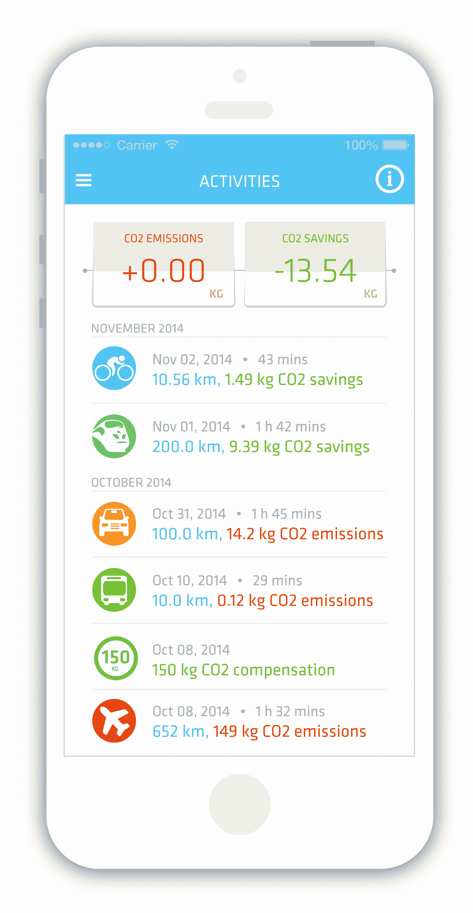
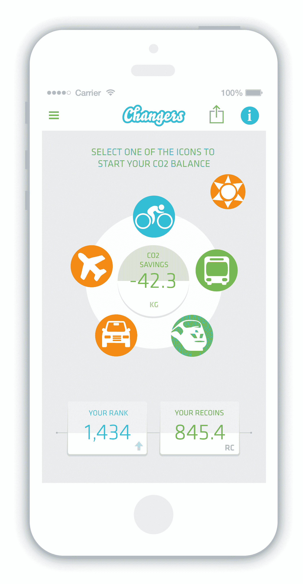
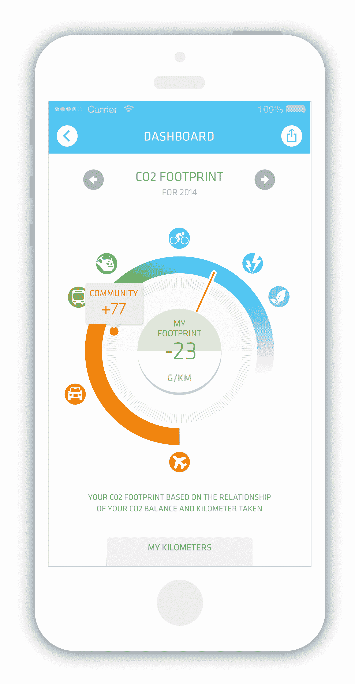
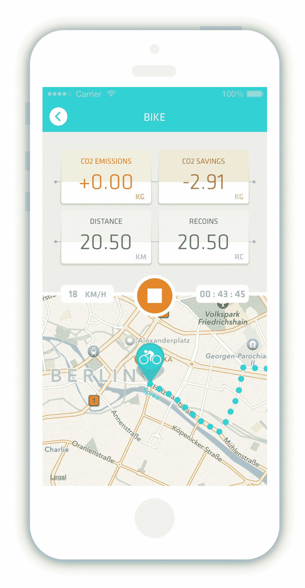

# 为什么我对新的 CO2 Fit 应用程序感到兴奋，这是一款让地球变得健康的应用程序 

> 原文：<https://web.archive.org/web/http://techcrunch.com/2015/01/05/why-im-excited-by-the-new-co2-fit-app-an-app-to-get-the-planet-fit/>

多年来，我一直在想:如果我们可以测量我们的健康状况，或者我们走了多少步，从而测量我们的整体健康状况，为什么我们不能对环境做同样的事情呢？为什么不能有人创建一个应用程序来“游戏化”我们骑自行车，而不是开车，或者坐火车，或者只是一般地向大气中排放更少的二氧化碳，并创造[全球怪异](https://web.archive.org/web/20230130011902/http://www.nytimes.com/2010/02/17/opinion/17friedman.html?_r=0)？如果我们能对《部落冲突》上瘾，为什么我们不能对拯救地球上瘾呢？

现在，一家初创公司已经迈出了第一步，我希望这将成为一个真正强大的平台。

绿色科技初创公司 [Changers](https://web.archive.org/web/20230130011902/https://www.changers.com/) 推出了一款名为 CO2 Fit 的手机应用程序(适用于 [iPhone](https://web.archive.org/web/20230130011902/https://itunes.apple.com/app/id938264264) 和 [Android](https://web.archive.org/web/20230130011902/https://play.google.com/store/apps/details?id=com.blacksquared.changers) ),该程序鼓励健身，奖励绿色行为，并有望激励你减少二氧化碳排放。因为上帝知道北极熊会喜欢你的。

(去年，Changers 完成了 150 万美元的首轮融资，来自德国政府支持的基金 BFB·勃兰登堡，清洁能源专家 Heliocentris 以及其他私人投资者参与了融资)。

CO2 Fit 的理念是，你进入你即将开始的旅程，无论是开车、骑自行车、坐火车还是坐飞机。该应用程序随后会监控你的位置、速度等，并估计出你可能排放了多少二氧化碳，然后将其转换为“可再生能源币”(Recoin)——他们想出的一种单位，代表用户节省的每千克二氧化碳。

如果你节省了二氧化碳，你会得到回报——兑换数字货币。如果你排放了二氧化碳，比如开车，你的二氧化碳排放量也会显示出来。之后，你可以通过骑自行车和乘坐公共交通工具来抵消负的二氧化碳平衡。用户还可以通过几年前推出的智能转换器太阳能充电器来生产可再生能源，从而创造出自己的能源。该应用程序还显示奖项，徽章&全球排名，以激励你。

那么它是如何工作的呢？

骑自行车每行驶 1 公里，乘公共汽车每行驶 5 公里，乘火车每行驶 20 公里，你就可以获得一笔收入。大约 50 公斤二氧化碳补偿需要 50 个回收币，相当于 0.89 欧元。此外，1 吨二氧化碳补偿需要 1，000 个回收币或 9.99 欧元。因此，要获得 1000 分，你需要骑行 1000 公里。

如果你已经获得了回报，你只能购买黄金标准二氧化碳证书来抵消你的碳排放，而且你只能通过改变你的行为来获得回报。这样，你可以比现在更容易地参与二氧化碳排放交易。

每当你通过骑自行车、乘公共汽车或乘火车旅行获得至少 50 个碳排放额度时，你就可以从 Changers 应用程序中购买气候证书，这相当于减少了 25 公斤的二氧化碳排放。这些“黄金标准气候证书”是由包括世界野生动物基金会(WWF)在内的几个环境组织于 2003 年推出的。这些是由伦敦二氧化碳证书交易所颁发的。这就像在游戏中购买虚拟物品，实际上对世界有一定的影响。

这里还有一个很大的连锁效应。如果人们通过应用程序购买二氧化碳证书，证书的价格就会上涨。这将给那些在碳交易中已经不得不购买碳排放补偿证书的公司带来压力。这将有效地激励他们提高技术效率，使用更多的绿色能源。

61 个国家和 736 个城市的用户现在使用该应用程序将他们的二氧化碳排放游戏化。谁储蓄最多，谁就领先。

Changers 的联合创始人 Daniela Schiffer 表示，她希望这款应用程序有趣，并帮助人们意识到自己行为的影响。

“对于那些无法避免的旅程，尤其是飞行，我们会在旅程结束后立即在应用程序中为那些舒适的人提供补偿。因此，你不必去某个网站，经历整个购买过程，而是有可能在你的应用程序中点击一下来进行补偿，”希弗说。

事实上，Changers 也在考虑建立一种基于可再生能源价值的真正的加密货币。然而，现在可能是比特币，因为开采比特币越来越多地消耗大量能源，从而抵消了兑换商想要实现的储蓄。我很想看看他们会想出什么。

希弗说，Changers 正在与几个城市和公司进行谈判，以在今年推出这款应用，并为市民和员工提供奖金，奖励他们通过更环保的交通方式减少二氧化碳排放量。

也许 CO2 Fit 不会成为“游戏”我们拯救地球的最终应用，但这是一个好的开始。

