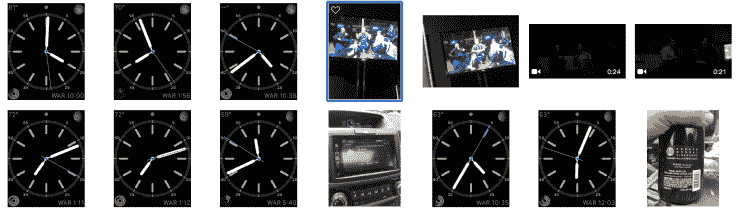

# 为什么我还戴着 Apple Watch 

> 原文：<https://web.archive.org/web/https://techcrunch.com/2015/05/16/why-im-still-wearing-my-apple-watch/>

作为 TechCrunch 的常驻记者 [手表发烧友](https://web.archive.org/web/20221209104449/http://johnbiggsbooks.com/go/marie-antoinettes-watch/)，我多次被问及是否要用我的 Omegas、Seikos 和 jlc 换苹果手表。

我做到了。我真的有。自从我拿到苹果手表以来，我每天都戴着它，我不知道什么时候我会带上一个机械手表。对我来说，这是世界上最悲伤的事情，但多年来，我一直认为每款智能手表都很好，但不是必需的，出于多种原因，我终于屈服于这款闪亮的小玩意。

## 它能正确地发出通知

我戴过多个 Android Wear 设备，还有一个 Pebble。我也看到过像 Martian 和 [Geak](https://web.archive.org/web/20221209104449/https://beta.techcrunch.com/gallery/beauty-and-the-geak/) 这样的其他设备来来去去，但它们都没有做智能手表应该做的事情:向我发送通知，我可以采取行动，也可以忽略。Pebble 最接近这个目标(我确实预订了彩色 Pebble，因为我喜欢这家公司)，但它缺乏让三星和苹果智能手表等产品更优越的大多数功能，包括锻炼监测和简单的“应用程序”

也就是说，我为什么不穿上 Fitbit 和我的 Speedmaster 呢？因为我认为 Apple Watch 在包装上做到了这两个方面的最佳，在某种程度上，让 Speedmaster 花了不少钱。就这么简单。

## 太美了

我知道手表是如何制造的。我修理过一些机械，也参观过一些手表厂。我很确定有很多瑞士公司在争论他们的 Montrachet 和苹果是如何成功的。他们已经能够以远低于任何瑞士房屋所能提供的价格，建造一个带有曲边和水晶的钢制表壳。

考虑一下备受喜爱的 3 型。它与 2500 美元的瑞士陆军 Alpnach 自动计时表(可以说是你能找到的最便宜的机械计时表，但绝对不是垃圾)的主要区别在于表壳和表面。设计这个箱子花费了很多昂贵的人很多时间，但我怀疑这些人中有谁像苹果工程师一样昂贵。

简而言之，一款售价 3.4 万美元的雷森斯手表的最大卖点——一款带有枕头、近乎有机的表壳和表盘风格的手表——已经由一家制造手机的公司进行了改进和大规模生产。我永远不会把名副其实的艺术品 Ressence 与 Apple Watch 相提并论，但从制造的角度来看，两者几乎没有区别。

作为题外话，我不认为 Apple Watch 上的表带去除系统特别新颖。多年来，我一直看到 Jaeger Le Coltre 和 Cartier 手表采用相同的按钮系统。苹果偷！

## 它取代了我的其他可穿戴设备和手机

正如我提到的，Apple Watch 取代了我的 Fitbit。虽然许多人会说在你的身体上有一个步跟踪器是一厢情愿的想法，但我喜欢知道我在白天移动和开槽。此外，让我的通知和健康数据显示在我的手腕上而不是手机上是一个惊人的好处。

我注意到自己在查看手表，而不是掏出手机，由于可靠的通知，我可以花更多的时间查找，而不是翻遍应用程序，结果发现一封电子邮件并不是我想象的那样。

我一直在使用计时表盘，它为我提供了足够的日常信息，让我保持兴趣。当我不戴苹果手表的时候，我现在很想念它，今天我发现自己想要滑动我的贝尔&罗斯手表的表面。

## 它是新的

手表很诱人。当我真正开始收藏的时候，从 2004 年到 2006 年，我曾经拥有 60 块手表。手表收藏家有一种渴望，迫使他们几乎无休止地寻找新手表。这种新癖是不健康的，而且在很大程度上，不会持续很久。

大多数手表收藏者在 20 岁左右安顿下来——我知道我是这样的——然后买卖手表来买新的。但 Apple Watch 可能会在很长一段时间内满足这种新鲜感。手表是拥有者永远羡慕的物品。

我记得我摘下手表，检查每一个角落和服务，惊叹于展览背后旋转的摆轮，注意到秒针扫过表面时的运动。Apple Watch 允许同样的魅力，但通过软件，这显然是一个对新事物上瘾的人危险的事情。

我会回到机械行业吗？大概吧。我知道坚固机械表的价值，也知道制表业的历史和起源。我知道手表曾经是我们人类的最高成就，我也知道仅在上个世纪，科技就多次超越了手表行业。

伟大的制造商——劳力士、欧米茄、宝玑——存在于利润丰厚的泡沫中，直到 20 世纪 70 年代末，它们几乎被精工、卡西欧和德州仪器以非常真实的方式摧毁。第一批石英表的价格和汽车一样高，但一旦电子产品制造商在冲压零件方面做得更好，他们就能把价格降低到美元或便士。瑞士手表行业的反应是走向高端，这一举动已经让我们许多人失去了这一爱好。

## 瑞士怎么样？

我现在担心苏黎世吗？是也不是。瑞士长期以来一直停留在多方面的成就上，忽视了普通消费者。我在 2004 年创建了我的网站[手表评论](https://web.archive.org/web/20221209104449/http://www.wristwatchreview.com/)，因为我很困惑。我会打开《GQ》和《时尚先生》的页面，看到模特们穿着普拉达夹克(900 美元)、杰尼亚衬衫(400 美元)和百年灵手表(2 万美元)。我明白，如果你花 900 美元买一件夹克，你可能就是太富有了，但我不明白，为什么这块手表如今在底特律较好的地段要和一栋房子一样贵。

制表师从未告诉我们——现在也不会告诉我们——21 世纪的制表业就像制造马车或使用[明胶镀银工艺](https://web.archive.org/web/20221209104449/http://en.wikipedia.org/wiki/Gelatin_silver_process)冲洗照片一样敏感。然而，有什么比月光下坐在马车上或一幅刚刚出生的婴儿的美丽图画更好的呢？

科技已经用机器人焊枪和低工资的工厂工人取代了制表师的大部分艺术，这就是为什么作为一名钟表爱好者，与世界分享制表业的历史、辉煌和重要性变得如此重要。我想让人们理解这件事的艺术。

但是瑞士从来没有得到过。就拿[职业赛车手](https://web.archive.org/web/20221209104449/http://www.omegawatches.com/collection/speedmaster/moonwatch/presentation/speedmaster-professional)来说吧。瑞士主要将这款腕表作为第一款登月腕表进行销售。但著名的 Speedmaster Pro 之所以重要，并不是因为它曾登上月球，而是因为它是现存最清晰、最可靠的机械计时器之一。

20 世纪 50 年代和 60 年代的伟大思想家佩戴过它们，对于信息时代的兴起，我们应该感谢早期计时表的创造者和佩戴者。这是一个早期的引人注目的人工制品，在一个独特的设计和机械掌握的时代锻造。

瑞士发现了一匹死马，不断地敲打它。我喜欢的公司宇舶表(Hublot)基本上提供了一种不同排列的手表。劳力士在上个世纪没有太大变化(但不要告诉劳力士书呆子们)，除了价格。即使在石英危机之后，这种古板而冷漠的伦理也为他们工作了几十年。他们制造一只手表，一遍又一遍地制造精致的版本，无限地在价格上加更多的零，因为这是收藏家愿意支付的价格。这是对理智的消费者的冒犯，没有上下文,“好”的手表看起来是淫秽的，而不是可取的。

“老式机械表是前数字时代最精美的化石之一。每一个对自己来说都是一个微型世界，一个微小的运行机制，一堆微小而神秘的运动部件。移动部件！因此，从某种意义上说，这些手表是活的。他们有心跳，”[威廉·吉布森](https://web.archive.org/web/20221209104449/http://archive.wired.com/wired/archive/7.01/ebay_pr.html)在十五年前写道。“他们似乎像电子鸡一样对‘爱’做出回应，通常是由专业技术人员提供昂贵的服务。就像古老的蒸汽拖拉机或文森特摩托车一样，它们可以从几乎任何阶段的废墟中精心修复。”

我完全同意他的观点。纯机械有一种神奇的东西，一个如此复杂的物体，一个专家需要花一生的时间来掌握制造它的步骤。在一个商品硬件和轻松互动的时代，这意味着什么。

但是，即使是吉布森这位控制论中的预言家，也无法预见另一种更吸引人的电子鸡的出现。Apple Watch 对爱情的反应并不完全相同——它是冷漠和精心设计的——而是通过设计和欲望、技术和时尚、团结和联系的怪异融合来产生爱情。这些融合正是瑞士需要警惕的原因。