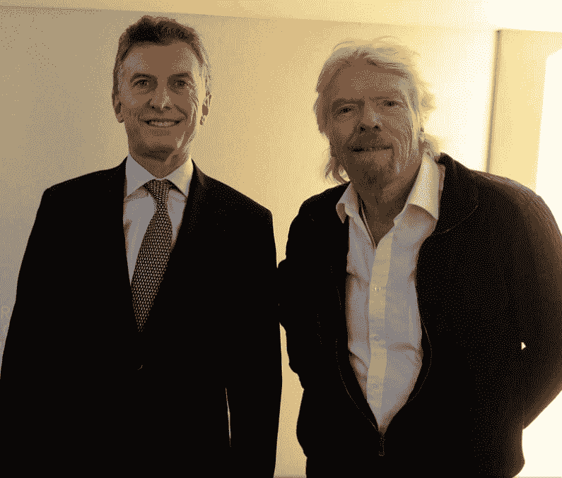

# 为什么拉丁美洲经济体转向比特币 

> 原文：<https://web.archive.org/web/https://techcrunch.com/2016/03/16/why-latin-american-economies-are-turning-to-bitcoin/>

# 为什么拉丁美洲经济体转向比特币

桑尼·辛格是

[BitPay](https://web.archive.org/web/20221205143553/https://bitpay.com/)

.

More posts by this contributor

Alberto Vega 是拉丁美洲地区经理

[BitPay](https://web.archive.org/web/20221205143553/https://bitpay.com/)

.

2016 年拉丁美洲的经济前景不容乐观。随着该地区一些最大的经济体政局不稳，以及石油和其他商品价格的普遍下跌，企业和消费者正面临萧条，在委内瑞拉，经济崩溃。中国股市的崩溃也严重损害了经济——中国是该地区几个国家的头号商业伙伴。

 许多拉丁美洲人正在将比特币作为一种解决方案，而最近的危机似乎只是加速了这种应用。

 去年，数字货币的采用打破了拉丁美洲的记录。支付处理器 BitPay [报告称，2015 年年中，商户交易量增长了 510%](https://web.archive.org/web/20221205143553/http://www.ibtimes.co.uk/what-greece-can-learn-bitcoin-adoption-latin-america-1511183),但最显著的增长发生在去年年底。拉丁 美国商业交易从 2015 年初至今已经增长了惊人的 1747%。来自巴西比特币生态系统的其他关键数据显示比特币 [交易所交易激增 322 %,而比特币钱包使用率增长 461.4%](https://web.archive.org/web/20221205143553/http://bitvalor.com/files/Infografico_Bitcoins_Mercado_Brasileiro_Dezembro2015.pdf)。2015 年，墨西哥的外汇交易增长了 600%。

 在拉丁美洲，因比特币的 T2 而闻名的国家是阿根廷。虽然阿根廷人均拥有最多的 T4 比特币爱好者，但这种情况可能正在开始改变。巴西人和委内瑞拉人也有很好的理由采用比特币—2015 年比特币持有者在 2015 年[享受的收益比委内瑞拉玻利瓦尔高出 400%以上，比巴西雷亚尔高出 92%以上，比墨西哥比索高出 65%以上，比阿根廷比索高出 41%以上。](https://web.archive.org/web/20221205143553/http://www.cnbc.com/2015/12/29/bitcoin-is-one-of-2015s-biggest-winners.html)

 ## 通货膨胀和支付问题促使消费者和企业转向其他选择

 拉丁 美洲 经济体面临的危机并非始于 2016 年。阿根廷、委内瑞拉和巴西在 2015 年结束时面临严重的经济问题，包括巨大的通货膨胀率——委内瑞拉高达[275%(2014 年为 63)](https://web.archive.org/web/20221205143553/http://m.cnnexpansion.com/economia/2016/01/22/el-fmi-pronostica-inflacion-de-venezuela-en-720-para-2016)、[~ 30%(2014 年为 36.4)](https://web.archive.org/web/20221205143553/https://www.cia.gov/library/publications/the-world-factbook/rankorder/2092rank.html)和[10.4%(2014 年为 6.3)](https://web.archive.org/web/20221205143553/http://www.infobae.com/2016/01/08/1781699-crisis-brasil-la-inflacion-llego-1067-su-mayor-nivel-2002)。

 

这些问题始于前几年，政府继续影响着这些 T4 经济体。国际货币基金组织(IMF)预测，2016 年委内瑞拉的通胀率将达到 720%。根据国际货币基金组织的预测，巴西经济已经进入了自 1930-31 年以来持续时间最长的一次衰退。阿根廷财政部长预测最低通胀率为 25 %,分析师预测[估计 2016 年通胀率可能高达 38 %,阿根廷比索对美元贬值 30%。](https://web.archive.org/web/20221205143553/https://igdigital.com/2016/01/cuanto-va-estar-el-dolar-fin-de-2016/)

> 2016 年，拉丁美洲成为比特币的一片乐土。

随着危机在拉丁美洲加深，一些政府正在收紧资本控制。巴西政府宣布对汇出国外的款项(包括汇款、旅游费用和其他服务)征收新税，费用将增加 25%(最高 33%)。对于进行跨境和本地支付的企业和消费者来说，还有其他一些主要问题:结算可能需要数周时间，成本超过 10%。

 ## 七份 bit 加入的申请在拉丁美洲

 比特币已被证明是解决许多由通货膨胀和随后的资本管制引发的问题的方法。尽管工人和商人已经将比特币作为对冲贬值的当地货币的首选，但这项技术作为一种支付方式已经开始找到许多实际应用。

 1.  比特币作为一种通用货币，已经允许消费者在国际上购物和汇款。从苹果到沃尔玛，可能不接受拉丁美洲本地支付选择的国际企业可以使用比特币继续接触该地区的在线购物者。
*   比特币或许能帮助拉丁 美国旅游业渡过当前的经济危机。因为比特币可以被任何有互联网连接的人使用，它可以降低游客和商人的外汇成本。由于来自拉丁美洲的游客通常不带信用卡，比特币可能是该地区以外热门旅游目的地接触更多顾客的一种方式。*   拉丁 美国向国际工人发送工资支付的公司可以从更快、更简单的支付中受益，而没有汇款的成本和延迟。埃克森美孚在阿根廷雇佣了 1500 多名员工，因此比特币可能会为它和其他国际石油公司提供一种更容易的方式，将钱寄给拉丁美洲、T42 美洲国家的受款人。*   像 OPSkins 这样的在线市场已经在使用比特币向国际供应商支付款项方面取得了巨大的成功。像易贝(2014 年进入该地区)和亚马逊这样的市场可能会发现比特币是支付拉丁美洲买家和卖家的最佳解决方案。*   有了资本控制，企业很难向拉丁美洲以外的供应商和公司办事处付款。像麦当劳和肯德基这样的特许经营企业可能会发现，在持续的经济危机中，比特币是支付特许经营费和其他供应成本的理想方式。*   虽然拉丁美洲的进口商可以在交货时支付货款，但是长时间的交货会使他们面临货币价值波动的风险。在阿根廷有子公司的跨国公司可以转向比特币来大幅降低这些成本。*   虽然许多拉丁美洲人无法使用信用卡，但伯利兹的 Advanced Cash 等服务为消费者提供借记卡和电子钱包，可以在接受主要信用卡的商家使用。比特币为消费者提供了一种无需银行转账就能为这些账户充值的实惠方式。因为比特币充值付款可以从世界任何地方寄出，所以对于拉丁美洲的消费者来说，这也是一种从该地区以外接收汇款的直接可行的方式。

 ## b 的词根it join采用拉丁语美洲:移动革命

 虽然看起来不太可能成功，但比特币的发展在拉丁美洲互联网的迅速普及中有先例。虽然与发达国家相比，拉丁美洲的网络用户份额仍然很小，但该地区的电子商务规模已经攀升至近 500 亿美元(年增长率约为 24%)。该地区的社交媒体用户几乎是网络浏览器用户的四倍，这表明移动电子商务和社交网络对普通人来说变得多么重要。

 > 尽管比特币在拉丁美洲的使用正在快速增长，但它仍然面临着几个障碍。

自 2014 年以来，脸书、推特和 WhatsApp 已经成为受益于拉丁美洲增长的主要网络。拉丁语 美国用户占 WhatsApp 用户群的 38%，而拉丁语 美国用户占脸书全球用户群的 20%。阿根廷人和巴西人是世界上在社交媒体上花费时间最多的群体之一。

 随着越来越多的拉丁美洲人习惯于社交媒体等网络技术提供的自由和全球联系，比特币将继续成为为前数字世界建立的支付系统的一个有吸引力的替代品。

 ## 各国政府开始探索 bit join

 阿根廷新总统毛里西奥·马克里的当选代表着基什内尔家族统治阿根廷 12 年后的政治转变。马克里政府已经表现出欢迎采用比特币的迹象。马克里在阿根廷被称为[，因为他在社交媒体上的表现，他被称为【脸书总统】](https://web.archive.org/web/20221205143553/https://www.fayerwayer.com/2016/01/macri-es-el-presidente-que-mas-publica-en-facebook/?utm_source=feedburner&utm_medium=feed&utm_campaign=Feed:%20fayerwayer%20(FayerWayer))，通过他在脸书的个人资料，他谈到了他与比特币投资者理查德·布兰森爵士的会面，[称比特币](https://web.archive.org/web/20221205143553/https://m.facebook.com/story.php?story_fbid=10153939507798478&substory_index=0&id=55432788477) 是这位亿万富翁最有趣的活动之一。

   马克里在成为总统之前是布宜诺斯艾利斯的市长，正是在他的任期内，市政府于 2015 年 7 月在布宜诺斯艾利斯组织了第一届比特币论坛。这座城市还支持在《银行》杂志上宣布的 [比特币友好布宜诺斯艾利斯倡议](https://web.archive.org/web/20221205143553/http://www.bankmagazine.com.ar/?p=2504)，声明“由于我们的货币历史，也因为我们迅速采用阿根廷比索的替代品，我们在比特币的受欢迎程度中发挥了重要作用。

 阿根廷的比特币热潮也没有被当地政客忽视。该国最年轻的市长马丁·耶扎在推特上表示，他的中期议程将包括比特币的实施和对流行的拼车平台优步的监管批准。

 接受比特币将是本届政府在实现经济自由目标的道路上向前迈出的一大步，本届政府已经结束了前任政府创建的“cepo”资本管制。除了其他重要的自由化措施，马克里政府还宣布放宽进出口限制。  虽然还不清楚巴西和委内瑞拉政府是否会以同样的方式回应比特币，但比特币将成为阿根廷政府应对经济危机的变革的核心。

 ## 路障 bit join领养

 尽管比特币在拉丁美洲的使用正在快速增长，但它仍然面临着一些障碍。电子商务在拉丁美洲还没有像在北美和欧洲更大的市场那样产生同样的影响。虽然一些拉丁美洲的 T42 人不信任他们自己的货币，但他们并不都准备好在日常交易中使用比特币或依赖它作为价值储存手段。

 采用比特币的另一个挑战是消费者买卖比特币的摩擦。在比特币势头最猛的市场，几乎没有大型的比特币交易所或比特币钱包，向拉丁美洲以外的交易所转移资金也很困难。虽然墨西哥和巴西用户与 Bitso、MexBT 和 Volabit(墨西哥)以及 Mercado 比特币、FoxBit 和 Bitcointoyou(巴西)的交流基础不断增长，但阿根廷和委内瑞拉的交流资源仍然有限。

 ## 结论

 拉丁2016 年，美国成为了比特币的机遇之地。推动比特币在 T21 普及的不是兴趣，而是真实的需求，巴西、委内瑞拉、墨西哥和阿根廷可能会成为推动比特币进入主流的最佳国家。