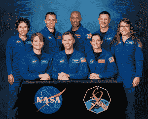
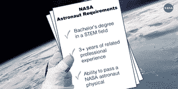
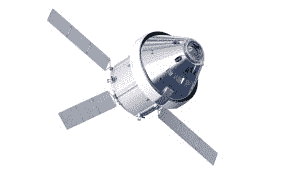

# 为什么 NASA 收到了创纪录数量的宇航员申请，以及他们下一步可以期待什么 

> 原文：<https://web.archive.org/web/https://techcrunch.com/2016/02/23/why-nasa-received-a-record-number-of-astronaut-applications-and-what-they-can-expect-next/>

超过 18300 人申请加入美国宇航局最新的宇航员班，打破了 1978 年创下的 8000 人的纪录。今年的投票率也比美国宇航局 2012 年的上一次申请高出近 3 倍。

这些有希望的人都在竞争成为最新的 14 名宇航员中的一员，他们最终将乘坐美国宇航局的下一艘飞船。虽然这个小数字可能令人生畏，但成为宇航员候选人的基本资格并不像人们想象的那样具有预防性。

*美国宇航局 2013 年宇航员班级/图片由美国宇航局提供*

没有年龄要求，但你必须是美国公民，并拥有科学、技术、工程或数学(STEM)领域的学位。除了 STEM 学位，你还需要完成 3 年的相关工作经验。如果你喜欢更多的学校，更高的学位可以代替工作经验:硕士学位算作 1 年，博士学位相当于 3 年。

或者，如果你喜欢飞行，如果飞行员在喷气式飞机上有超过 1000 小时的机长时间，他们可以放弃 3 年的工作经验。

你可以矮到 4 英尺 8 英寸，也可以高到 6 英尺 3 英寸，而且你必须能够通过基本的飞行资格体检。几乎完美的视力是必需的，但是从 2007 年开始，像 LASIK 这样的矫正手术是允许的。

*图片由美国宇航局提供*

这些要求在过去几轮申请中大致相同，那么为什么今年的申请数量创下纪录？

随着越来越多的人[连接到网上](https://web.archive.org/web/20221206234914/http://www.pewinternet.org/2015/10/08/social-networking-usage-2005-2015/)，可能有更多的人知道了这一轮特殊的比赛。

同样重要的是要考虑到申请没有很高的门槛，因为你实际上不需要满足提交基本申请的资格要求。18，300 份申请中的许多将因不符合资格要求而立即被丢弃。

然而，也许更重要的是，近年来，STEM 和空间探索在公众中的受欢迎程度明显上升。

*SpaceX 公司首席执行官埃隆·马斯克/图片由盖蒂图片社提供*

美国国家科学基金会报告称，授予工程和自然科学学士学位的数量从 2000 年的 241，000 个稳步增长到 2012 年的 355，000 个。

最近对申请的呼吁可能极大地受益于这一增长，因为许多最近的毕业生(在拥有最多 STEM 学位的年份)还没有资格参加 NASA 的 2012 年申请轮。

近年来，美国宇航局和太空探索的知名度似乎也越来越高。多亏了像 SpaceX、T2、蓝色起源、T4 和维珍银河这样知名度很高的公司，普通人更加了解太空产业正在发生的事情。

美国国家航空航天局也更加努力地宣传他们的任务。社交媒体有影响力的人经常被邀请在 NASA 的私人媒体活动中报道发射。该机构在 Twitter 上还有一个最受关注的[账户](https://web.archive.org/web/20221206234914/https://twitter.com/NASA)，在全球拥有近 1500 万粉丝。

*图片由美国宇航局提供*

好莱坞尤其让太空探索变得有趣和容易接近。自从美国宇航局 2012 年呼吁宇航员申请以来，像《星际穿越》、《地心引力》和《火星人》这样的大片都已经上映。

这些因素都可能导致申请实现童年太空旅行梦想的公民人数达到历史最高水平。但对于最终被选中的少数幸运儿来说，他们将何去何从，何时发生？

*美国宇航局的猎户座飞船/图片由美国宇航局提供*

美国宇航局约翰逊航天中心公共事务办公室的布兰迪·迪恩告诉 TechCrunch，下一届宇航员将有机会乘坐 3 种交通工具之一飞行:SpaceX 的 Crew Dragon，波音的 CST-100 Starliner，或美国宇航局的 Orion 太空舱。

“龙”或 CST-100 将被用于将宇航员送往国际空间站执行任务，而“猎户座”将涉及前往小行星、月球或火星的深空任务。

然而，被选中参加美国国家航空航天局的飞行任务需要几年时间。首先，有几年的宇航员候选人培训，随后可能还要等待几年才能被选中飞行。不幸的是，一些宇航员从未被选中参加飞行任务。

迪恩说，2009 年宇航员班的一名宇航员早在 2013 年就进行了飞行，但同一班的许多人尚未被选中飞行。

> “宇航员候选人培训持续 2 年左右。在这个过程的最后，候选人被认为是宇航员，有资格被分配到一个任务。与此同时，他们在宇航员办公室里被赋予技术职责。一旦他们被分配到一个任务，他们将经历另一轮关于他们特定任务的训练。”–Brandi Dean，美国国家航空航天局公共事务部

无论是在太空还是在地面，宇航员的服务都可以获得政府的工资，根据他们的学术成就和经验，每年可以从 66，000 美元到 144，500 美元不等。

从现在到 9 月，18，300 名申请人将接受美国宇航局小组的审查，并缩小到 400-600 名“高度合格”的候选人。迪安说，有飞行经验的宇航员将高度参与到选拔过程中。

*宇航员凯蒂·科尔曼望向国际空间站窗外/图片由美国宇航局提供*

高度合格的申请人将被缩小到 120 人，他们将在美国宇航局的约翰逊航天中心接受面试。面试将在 2017 年 2 月至 4 月之间进行，由宇航员选拔委员会进行，该委员会主要由经验丰富的宇航员组成。

到 2017 年 5 月，决赛选手将被确定，到 6 月，美国宇航局将正式向公众宣布最新的宇航员班级。

随着申请人数超过以往任何时候，美国国家航空航天局的宇航员选拔委员会有他们的工作要做。2017 年 8 月，18，300 名候选人中的 14 人将开始他们的宇航员候选人培训，并开始他们的旅程——希望——最终成为美国宇航局的太空任务。