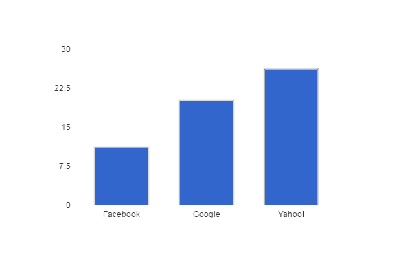
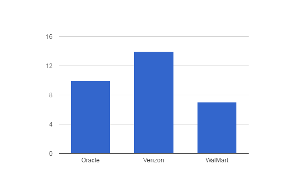

# 为什么非互联网公司购买 adtech 

> 原文：<https://web.archive.org/web/https://techcrunch.com/2016/10/24/why-non-internet-companies-are-buying-into-adtech/>

More posts by this contributor

研究表明，M&A 在广告行业的疾风骤雨丝毫没有减缓。仅在 2016 年的 Q1，广告技术、营销技术和数字媒体公司之间就发生了 72 起并购事件。

很明显，这种交易活动大多与行业整合有关，谷歌和脸书等巨头(以及他们自己的收购之前——美国在线和雅虎)收购中小型公司，以支持或建立自己的受众，完善他们的技术栈或消除潜在的威胁。

相关收购数量

但是，在广告技术领域，还有什么其他趋势在推动 M&A 的活动呢？如果你超越已经在这个领域运营的互联网或广告公司，看看这个领域之外的大规模收购者，会发生什么？

相关收购数量

看看这些数据，三个明显的巨头出现了:威瑞森、沃尔玛和甲骨文。但为什么来自电信、零售和企业软件等各行各业的公司都在认真投资 adtech 呢？观察这些公司可以发现，随着 adtech 和其他垂直行业之间的界限变得模糊，更广泛的趋势延伸到了它们各自的垂直行业。

## 电信公司

威瑞森在广告技术领域以积极的收购者而闻名，2015 年以 44 亿美元收购了美国在线，2016 年 7 月以 48 亿美元收购了雅虎。他们并不孤单。

新加坡最大的电信公司 SingTel 是另一个主要电信提供商紧跟广告技术潮流的例子。Kontera、Adconion 和 [Amobee](https://web.archive.org/web/20230212124806/https://techcrunch.com/2012/03/05/more-mobile-ad-consolidation-carrier-singtel-buys-amobee-for-321-million/) ，这些被 [SingTel 收购](https://web.archive.org/web/20230212124806/https://techcrunch.com/2014/06/10/amobee-buys-adconion-for-235m-and-kontera-for-150m-in-consolidation-play/)的公司，都帮助 SingTel 更好地利用他们收集的大量消费者数据，使潜在的广告商更容易接触到他们的目标受众，并提供相关的信息、交易和促销。

此外，挪威主要电信公司[Telenor](https://web.archive.org/web/20230212124806/https://techcrunch.com/2016/02/01/telenor-jumps-into-ad-tech-acquires-tapad-for-360m/)收购了跨设备重定向解决方案 Tapad ，以帮助其更好地了解用户的行为。最后， [Ooyala](https://web.archive.org/web/20230212124806/https://www.crunchbase.com/organization/ooyala#/entity) ，澳洲最大电信公司 Telstra 的[子公司，在 2015 年收购了视频 SSP](https://web.archive.org/web/20230212124806/https://techcrunch.com/2014/08/11/telstra-ooyala/) [Videoplaza](https://web.archive.org/web/20230212124806/https://techcrunch.com/2014/10/20/ooyala-buys-euro-video-ad-startup-videoplaza-in-its-first-acquisition/) 。

面对一个大部分被开发的无线市场，并且被联邦通信委员会和 DOJ 阻止在电信领域进行合并和收购(见:对美国电话电报公司试图收购 T-Mobile USA 的联邦诉讼)，电信提供商正在寻找新的方法来创造收入。

收购 adtech 公司使电信提供商能够利用他们最大的资产——独特的消费者数据，并从中获利。有了合适的 adtech 基础设施，他们可以为广告商构建目标定位和跨设备匹配解决方案，并利用移动连接消费者的有利可图的需求。让威瑞森的戏剧与众不同的是，它还希望通过内容资产组合(如 TechCrunch、赫芬顿邮报和雅虎)拥有更多观众。美国在线和雅虎收购案带来的影响。

通过这种方式，威瑞森试图复制谷歌和脸书拥有观众以及连接和赚钱的方式。

## B2C 公司

过去几年，沃尔玛一直在收购多种营销、参与和分析解决方案。2014 年，[沃尔玛实验室收购了时尚应用 Stylr](https://web.archive.org/web/20230212124806/https://techcrunch.com/2014/06/16/walmartlabs-grabs-its-first-silicon-alley-startup-with-acquisition-of-fashion-app-stylr/) ，这是一款从当地商店提取库存以帮助顾客找到他们喜欢的衣服的应用，然后又收购了电子商务技术公司 [Adchemy](https://web.archive.org/web/20230212124806/https://techcrunch.com/2014/05/05/walmartlabs-buys-adtech-startup-adchemy-its-biggest-talent-deal-yet/) 。

随后在 2015 年推出了收集店内活动和顾客忠诚度数据的平台 [PunchTab](https://web.archive.org/web/20230212124806/https://techcrunch.com/2015/09/22/with-focus-on-sams-club-customers-walmartlabs-snaps-up-silicon-valley-based-punchtab/) ，最近又推出了电子商务初创公司【Jet.com】T2，凸显了沃尔玛在接近顾客的方式上变得更加数字化的重要性。

[2014 年，Priceline Group 以 300 万美元收购了本地化广告定位初创公司 Qlika](https://web.archive.org/web/20230212124806/https://techcrunch.com/2014/03/11/priceline-buys-israels-qlika-for-15-20m-to-boost-global-expansion-with-rocket-science-powered-ad-tech/) 。被并入公司的 Qlika 正在帮助 Priceline 将他们的广告引入内部。具体来说，这家在线旅游提供商正在使用 Qlika 的算法来优化他们的广告，包括基于微位置的个性化信息、广告定位和关键词竞价。

这些 B2C 进入 adtech 的举动似乎旨在将媒体购买、数字广告和营销自动化能力带入内部，以试图解决媒体机构的透明度问题，并在他们的领域中获得相对于其他公司的竞争优势。

许多大型品牌看到了发展内部编程能力的价值，并避免了对外部技术和媒体合作伙伴的依赖，失去了与每个中间商的更多支出。通过控制程序化生态系统本身的所有方面，他们可以保证更好地利用他们的营销预算，并拥有更多的数据。

随着 B2C 广告客户将更多的支出分配到数字和移动广告上(仅 CPG 广告客户今年就预计在数字广告上花费近 60 亿美元)，B2C 品牌可以明智地跟随沃尔玛的脚步，在内部整合他们的广告能力。它可以最大限度地减少额外利润，并大幅降低成本。

## SaaS/DaaS 公司

甲骨文在消费者数据和广告技术方面进行了大量投资，2014 年以 4 亿美元收购了 [BlueKai](https://web.archive.org/web/20230212124806/http://www.oracle.com/us/corporate/press/2150812) ，以 12 亿美元收购了 [Datalogix](https://web.archive.org/web/20230212124806/https://techcrunch.com/2014/12/22/oracle-continues-march-to-cloud-buying-data-as-a-service-broker-datalogix/) ，2015 年以 2 亿美元收购了 [Maxymiser](https://web.archive.org/web/20230212124806/http://www.businessinsider.com/why-oracle-bought-maxymiser-2015-8) ，2016 年以 2 亿美元收购了 [AddThis](https://web.archive.org/web/20230212124806/https://techcrunch.com/2016/01/05/oracle-addthis/) 。

通过将关键的营销数据和功能添加到 Oracle 数据云中，并允许他们更好地与 Adobe 等其他云广告竞争对手竞争，这些收购巩固了 Oracle 作为数据即服务公司的地位。

同样，Salesforce 一直在收购 adtech 公司以支持其产品供应，收购 [MetaMind](https://web.archive.org/web/20230212124806/https://techcrunch.com/2016/04/04/saleforce-acquires-metamind/) 和 [ExactTarget](https://web.archive.org/web/20230212124806/https://techcrunch.com/2013/06/04/with-exacttarget-acquisition-salesforce-com-has-spent-close-to-3-5-billion-to-get-into-the-chief-marketing-officers-suite/) 旨在增加营销自动化和个性化服务，并加速 Salesforce 营销云的发展。

IBM 甚至更看好营销和广告技术。他们正在把沃森变成一个数字营销的发电站，并把他们的互动体验(iX)部门建设成世界上最大的数字代理网络。在 2 月份的一周时间里，iX 收购了三家数字广告和设计公司；iX 现在拥有[1100 名设计师和 10000 名员工](https://web.archive.org/web/20230212124806/https://techcrunch.com/2016/02/03/ibm-buys-germanys-ecx-io-its-third-creative-services-acquisition-in-a-week/)。

该公司正在积极行动，因为他们已经认识到数字营销的巨大机会，也因为他们专注于从硬件快速过渡到基于云的分析。

对于像 IBM、Salesforce 和 Oracle 这样的企业软件巨头来说，投资建立一套强大的基于云的营销服务来扩展他们现有的服务组合正成为一个越来越重要的优先事项，这可能反映了他们的客户公司越来越重视数字营销，将其作为他们业务的核心问题。

## 展望未来

在考察 M&A adtech 的大公司时，不可能忽略中国。仅在过去一年，中国公司就促成了三起重大的 adtech 收购案；2 月，Mobvista 以 2450 万美元收购 NativeX 月，[先锋整合营销传播集团以 1.48 亿美元](https://web.archive.org/web/20230212124806/https://techcrunch.com/2016/06/09/mobile-ad-tech-firm-smaato-acquired-by-china-based-group-for-148m/)收购 Smaato 月，[美特诺通信科技以 9 亿美元收购 Media.net](https://web.archive.org/web/20230212124806/https://techcrunch.com/2016/08/22/media-net-acquired-for-900m-in-mega-ad-tech-deal/)。

虽然中国 M&A 活动的增加可以归因于英美烟草公司在当地的主导地位，或者中国公司寻求投资于美国现有的规模化技术，但显而易见的是，西方巨头的购买力现在正与来自东方的资金相匹配。

在大多数情况下，行业整合是一个自然而系统的过程。不可预测性通常在于收购者将是谁，以及他们来自哪个行业、历史或地理位置。随着广告技术领域继续发展，我们知道电信、B2C、SaaS/DaaS 和中国公司将保持活跃，还有新的未知进入者。