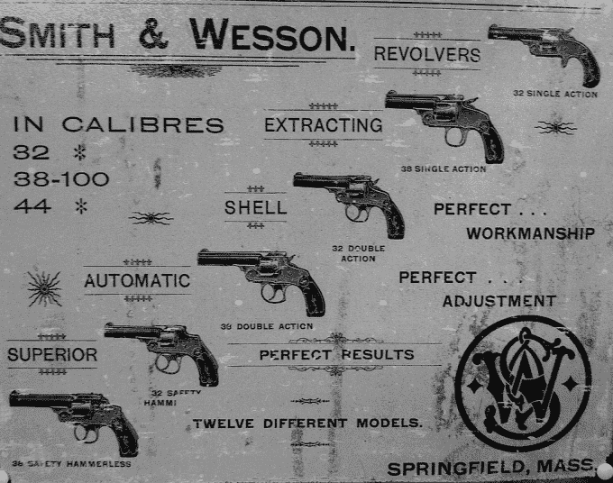
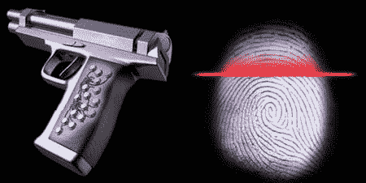

# 为什么奥巴马的智能枪计划会失败

> 原文：<https://web.archive.org/web/http://techcrunch.com/2016/01/05/why-obamas-smart-gun-push-will-misfire/>

More posts by this contributor

在桑迪胡克大屠杀和随后的大规模枪击事件之后再次爆发的枪支控制战争中，有一种技术被硅谷的技术专家、东海岸的媒体类型和来自美国各地的进步政治家们确定为美国枪支暴力问题长期解决方案的可行部分:智能枪。

奥巴马总统[最近为智能枪支研究](https://web.archive.org/web/20230128104816/http://www.cnet.com/news/obama-orders-feds-to-study-smart-gun-technology/)提供资金，作为他任期结束时推动枪支控制的一部分，很容易看出这个想法的吸引力。智能枪承诺从技术上解决枪支暴力问题，让枪支远离不应该拥有枪支的人——小偷、儿童和任何未经授权的使用者。

不幸的是，对于总统和其他电子枪支控制的善意支持者来说，智能枪的所有化身都是幻想。

不仅不可能生产出枪支购买者实际上会大量购买的智能枪，而且即使技术障碍可以被克服，结果也肯定会让那些一直将这些武器视为某种可以结束枪支暴力的银弹的人彻底失望。

事实上，已经提出的许多流行的智能枪想法实际上可能会使我们更加不安全。

对智能枪的反对意见就像智能枪技术本身一样多种多样，要涵盖辩论的每一点和对应点，需要一本书的篇幅。此外，我们都在社交媒体上，我们已经听到了这一切。或者，至少，我们认为我们有。

在过去三年里，我跨越了技术和户外新闻的世界，我发现有许多聪明人对枪支暴力问题充满热情，他们在枪支周围长大，甚至可能自己也拥有几支枪，但他们并不具备他们认为他们对后 9/11“[枪支文化 2.0](https://web.archive.org/web/20230128104816/http://www.today.com/video/meet-the-next-generation-of-us-gun-owners-473473603991) ”的防御和性能导向思维的洞察力，这种思维现在主导着枪支领域。

此外，这些人热切希望通过技术手段快速解决枪支暴力问题，这让他们看不到混合软件和小型武器带来的许多明显问题。

这一块有点长，所以这里是 TL；对于那些不能或不愿读完整本书的人来说:

*   首先，没有一种电子技术是 100%可靠的，很少有人会相信一把可以因一些机载电路故障而变成砖头的枪。
*   第二，每当您将软件附加到某个新类别的事物上时，尤其是与外部世界有任何类型连接的软件，无论是通过 RFID 还是实际网络，那么除了该事物以前存在的任何问题之外，您还引入了一系列全新的安全和身份问题，这些问题对该事物来说是新的，必须被发现和修补，然后修补程序会有必须被发现和修补的问题，如此循环下去。

*简而言之，软件安全是一场虚拟的军备竞赛，当你把软件放进武器时，你就把它变成了一场字面上的军备竞赛。最终，给枪支(或汽车，或起搏器，或任何其他东西)添加软件并不会使它们更安全或更可靠——相反，它会使它们更不安全，因为它给有创造力的坏演员提供了一个全新的利用途径。*

但是，大多数智能枪的反对者并不主要担心他们的枪被精通技术的罪犯或敌对的外国或国内政府远程禁用。

不，他们对新型智能枪的主要关注可以追溯到一个时代，那时人们携带一把大刀作为备用武器，以防他们的一支或全部手枪无法开火*。*

## 最重要的是:可靠性

照片由 Flickr/ [DM](https://web.archive.org/web/20230128104816/https://www.flickr.com/photos/dmott9/) 提供

对枪支的一个最重要的要求是，每当你想让它开枪时，它就开枪。如果你没有绝对的信心你的枪会在每次打开保险扣动扳机的时候开枪，那么这把枪就没有价值。因此，枪支拥有者往往讨厌任何增加额外复杂性和增加发射失败几率的东西。(见[对史密斯&韦森决定在他们的左轮手枪上集成机械锁的强烈反对](https://web.archive.org/web/20230128104816/http://www.luckygunner.com/lounge/smith-and-wesson-internal-lock/)。)

枪支购买者如此痴迷于可靠性，以至于他们会牺牲几乎任何东西——重量、容量、精度、成本——来获得尽可能接近 100%的可靠性。事实上，除了怀旧之外，老式左轮手枪仍有市场的主要原因是，在我们拥有格洛克(GLOCK)等轻型大容量手枪的世界里，射手们有一个共同的(但也是激烈争论的)看法，即左轮手枪是一种绝对简单的设备，永远不会失败。

左轮手枪中没有额外的弹簧或气动进给机构会导致失败，因此执法人员甚至海豹突击队员有时仍将他们的生命押在这些简单、经过时间考验的枪支上。

当枪手把电子设备和他们的枪混在一起时，他们会非常小心。例如，现代特种部队的步枪，比如击毙奥萨马·本·拉登的那把配备了价值数千美元的电子设备，但是如果这些设备中的任何一个或全部出现故障，那么这把枪仍然完全可以使用。

即使是现代军用卡宾枪上的先进光学系统也由一套[老式铁瞄准镜](https://web.archive.org/web/20230128104816/https://en.wikipedia.org/wiki/Iron_sights)支持，因为尽管这些光学系统具有传奇般的耐用性，但它们在战场上可能也会失败。

我的最终观点是，任何买枪的人，如果期望有一天能把自己的生命托付给它——这个名单包括家庭防卫购买者、执法人员，甚至是在熊之国携带枪支的徒步旅行者或露营者——都会非常抵制购买带有任何类型的电子技术的枪，因为电子技术会失效。当电子设备受到枪支在战场上容易遇到的那种滥用和不利条件时，它们尤其会失灵。

但你会问，猎人或打靶者呢？你可能认为他们会选择智能枪，但你错了。

想想看:如果你花了 3000 多美元在一次有向导的麋鹿狩猎中，并且你已经在丛林中追踪一只动物好几天了，那么当你的枪锁定失败时，你永远也不会想有一只麋鹿出现在你的视线中。那把枪可能经受了极端的温度，变得潮湿和泥泞，并且通常在狩猎过程中被滥用。智能锁真的经得起这种虐待，每次都有效吗？

即使是一个普通的猎鹿人，从密西西比州的家开车几分钟到自己的土地上打猎，也不会去找智能枪，因为如果他外出时遇到一头棕熊怎么办？或者万一他瞄准了一只千载难逢的雄鹿，但枪失败了呢？

然后是竞赛射手，一个快速增长的“枪支文化 2.0”类别的射手。这些爱好者花费数千美元来配置、调整和定制他们与之竞争的枪支。为了比赛，他们一年到头都在训练。那么如果你在州外射击比赛的半决赛中，你的智能枪刚好不让你开枪了呢？你不能借别人的枪去完成比赛。你完蛋了——几个月的努力和几千美元的训练弹药和旅行都浪费了。

我可以继续说下去，但我的观点现在应该很清楚了:没有一个认真对待自卫、家庭防卫、目标射击或狩猎的枪支所有者会自愿购买智能枪，因为智能枪严重依赖电子设备，而电子设备又一次失灵了。

这就是智能枪没有市场的原因，也是枪械行业不会制造这些武器的原因。这并不是因为枪支制造商都是无情的、大男子主义的混蛋，他们认为安全是娘娘腔的事——他们和其他人一样都是资本家，哪里有钱就去哪里。枪支制造商不制造智能枪，因为射击公众知道，在枪上增加一个可以阻止枪开火的电子设备是一个糟糕的想法，这使得枪无法用于任何严肃的目的。

当然，我完全理解，在许多人看来，这些基于可靠性的对智能枪的反对只是加深了一种印象，即枪支拥有者是自私的幻想者，他们更关心自己的个人安全和爱好，而不是让枪支远离危险的罪犯。但这是不公平的，因为持枪者可以看到任何对技术了解最少的人都显而易见的事情:不仅 100%采用智能枪不会对枪支犯罪产生任何影响(枪支犯罪持续了几十年的下降趋势),而且根据智能枪技术的具体情况，它可能会使事情变得更糟。

## 假设:我们已经解决了可靠性问题！

为了便于讨论，让我们想象一下[罗恩·康韦智能枪基金会](https://web.archive.org/web/20230128104816/https://smarttechfoundation.org/)已经生产出一种完全可靠的智能枪，其电子元件在战场上不可能出现故障。现在有了一种罪犯不可能使用的武器，世界难道不会变得更安全吗？

好吧，我几乎不能面无表情地打出这句话，因为如果你真的认为有可能发明一种消费技术，即使最不聪明的坏演员一旦有一点独处的时间并访问 YouTube，也无法“越狱”，那么你跟踪技术的时间不会很长。

当我在 1998 年开始报道技术时，英特尔决心阻止业余爱好者和无良经销商超频他们的处理器。我为 Ars Technica 写了我的第一篇受欢迎的文章，内容是你可以用一点胶带绕过 B21 号引脚来破解这些措施。

英特尔从未能够阻止拥有最低技术技能和互联网接入的普通用户超频他们的芯片，这是*英特尔*，这些是*CPU*。我的观点是，任何种类的电子锁，RFID 身份信标，或其他你加到枪上的小玩意都会在短时间内被击败。

对于枪来说尤其如此，因为枪是为了定期清洁和维护而被拆卸的。因此，无论你把 RFID 芯片、生物识别锁或其他电子设备放在枪的什么地方，任何有一点时间和信息的人都可以用 Dremel 研磨它，用某种东西覆盖它以阻止它传输，或者简单地替换那个特定的部分。枪管、扳机和像格洛克手枪这样受欢迎的枪支的所有其他部件都可以在配件市场上买到——你甚至可以用由[第三方供应商](https://web.archive.org/web/20230128104816/https://www.lonewolfdist.com/)制造的配件市场格洛克手枪部件来打造一个完整的非格洛克“格洛克”。

## 基于 RFID 的智能枪:让坏主意变得更糟

不仅电子安全措施可能会失效，而且如果这些措施涉及 RFID 或任何类型的远程访问武器，那么它们也可能会对其用户不利。

市场上的每一台消费电子设备都曾在某个时候遭到黑客攻击，并完全被平民和国家行为者所拥有。同样，也很难防止坏人获得远程锁定警察或潜在受害者枪支的能力，或者使用这些枪支发出的任何无线信号来识别隐藏的武器并锁定这些武器进行盗窃。

最后这一点尤其重要，因为隐蔽携带枪支的支持者对更激进的公开携带人群的敌意大多源于前者的信念，即当没有人知道谁携带枪支，谁没有携带枪支时，枪支在公共场所最能起到威慑作用。

一旦犯罪分子能够扫描一个区域，通过射频识别识别出谁在打包，那么任何一个携带武器的人都会成为潜在的目标。罪犯可以并且确实[在公共场合伏击开着的运输船](https://web.archive.org/web/20230128104816/http://gawker.com/open-carrying-guy-has-his-brand-new-pistol-stolen-at-gu-1644022889)并企图夺取他们的武器；通过在隐藏的携带枪上放置 RFID 信标，你有效地使每个人都成为公开的携带者。

那么藏在汽车或家中的具有 RFID 功能的枪支呢？潜在的枪支窃贼可能会驾驶一些为从支持 RFID 的信用卡中窃取身份而开发的工具[，就像黑客寻找一个开放的 WiFi 网络进行劫持一样，在一排房子旁边偷枪。](https://web.archive.org/web/20230128104816/https://en.wikipedia.org/wiki/Wireless_identity_theft)

## 最好的情况也没那么好

所以 RFID 是不好的，这意味着我们只是使用生物识别锁，对不对？毫无疑问，对于智能枪的支持者来说，最好的情况是开发一种超级可靠的生物识别锁，绝对没有远程检测或操纵的手段。

考虑到犯罪分子需要花一定的时间单独使用枪支来破坏任何锁，在两种情况下，这种智能枪会比普通枪更好:1)当武器的控制权突然从其所有者手中夺走时，以及 2)当孩子拿到枪时。

关于第一种情况，唯一经常发现自己可能突然失去对武器的控制的人是警察和民用敞篷车。这些人可能愿意用一些可靠性来换取额外的安全性，因为他们知道在街头斗殴中他们的枪不会对准他们，事实上，出于这个原因，一些警察部队已经对智能枪表示了兴趣。

至于防止儿童开枪，这是迄今为止任何可靠的、基于生物识别的智能枪解决方案中最有吸引力的应用。然而，问题是已经有两种相对便宜、流行的技术可以阻止儿童扣动枪的扳机:扳机锁和枪保险。这些解决方案为枪支增加了零成本和复杂性，并且它们向后兼容现有的每一把枪。简而言之，虔诚地锁定你的枪，无论是出于简单的谨慎还是因为这是法律，并使用随身携带的方法(这样一个蹒跚学步的孩子就不会从你的钱包里掏出枪)会让你拥有生物锁的所有优点，而没有任何缺点。

我很清楚不负责任的枪支拥有者并不总是保护好他们的枪，但是你真的认为把枪放在孩子可以找到的地方的人会出于安全考虑购买带有生物识别锁的枪，如果这种锁不是政府强制要求的话？

再说一次，除了政府的命令，智能枪没有市场。在极其可靠的生物识别锁定枪的最佳情况下，你已经生产了一种目标受众(即那些如此不负责任以至于不保护自己武器的人)几乎不太可能购买的产品。

## 不会的

总而言之，智能枪是不会出现的，因为电子锁永远不会可靠到让开枪的公众接受它们。有可能警察最终会对智能枪产生兴趣，因为警察公开携带枪支，并不断面临自己的枪支被用来对付他们的风险。但是对于每一个没有公开携带和/或穿着制服大喊“有人持枪”的守法公民来说由于上述原因，智能枪将不再具有吸引力。

即使公众对智能枪感兴趣，这也不会阻止犯罪分子发射偷来的武器，因为没有办法锁定枪支或任何其他小工具，使其无法“越狱”。犯罪分子将只是移除锁，或者更糟的是，他们将学会远程禁用受害者和警察的枪。对于那些把电子锁留在原处的守法的隐蔽运营商来说，任何依赖于无线技术的方案都将有效地让这些人为任何能够窃听信号的人打开运营商。

如果智能枪的支持者真的认真对待拯救生命，他们将不再浪费时间去寻求一种注定失败的快速技术解决一系列令人讨厌的社会问题，而是将他们的努力集中在实际上可以拯救生命的变革上。如何结束毒品战争，警察非军事化，倡导监狱改革，投资街头干预项目，或者停止无人机袭击和无休止的军事干预，这些行动杀害了无数平民，使幸存者变得激进。在这些领域中的任何一个领域，即使是一个小小的胜利，也会比想象中最先进的智能枪挽救更多的生命。

但是，我刚才提出的所有这些东西都是*硬*，它涉及*政治*，随着时间的推移，我们的政治似乎越来越无可救药地崩溃。因此，我当然很想在这个系统里转转，在枪支暴力问题上抛出一些硅谷式的“颠覆”。作为三个漂亮小女孩的父亲，我向上帝祈祷，希望有一个杀手级的应用程序能够阻止甚至显著减少杀戮。但没有，除非有人发明一种技术，可以解决更深层次的系统性问题，这些问题促使各行各业的美国人武装自己，否则永远不会有。