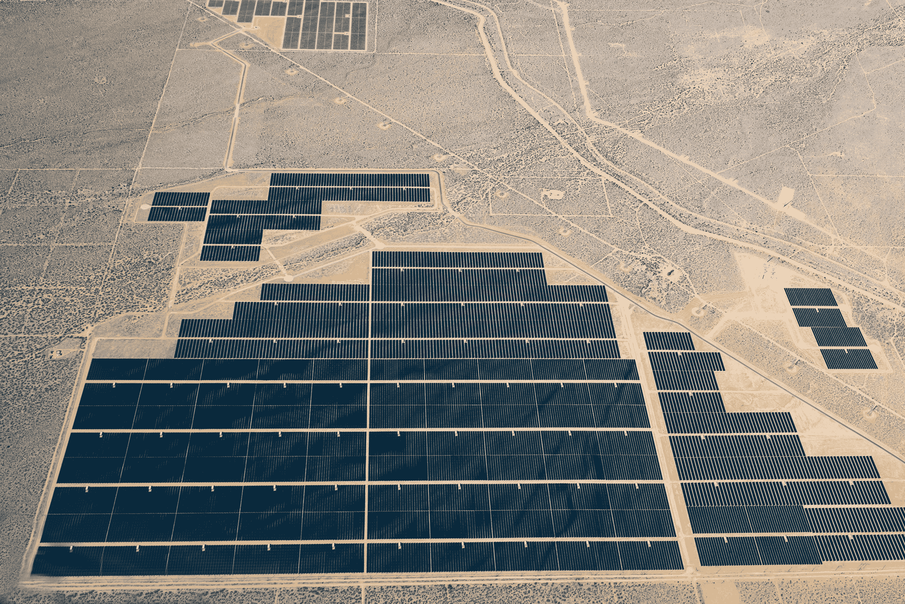

# 为什么退出巴黎协议会损害美国的经济未来

> 原文：<https://web.archive.org/web/https://techcrunch.com/2017/06/02/why-pulling-out-of-paris-accords-damages-americas-economic-future/>

赫曼特·塔内贾撰稿人

More posts by this contributor

拔 [出](https://web.archive.org/web/20230406041858/http://www.cnn.com/2017/06/01/politics/trump-paris-climate-decision/) 巴黎 气候变化协议 将成为美国总统有生之年犯下的最大经济错误之一。

人们可以不同意气候变化背后的科学前提，但无论如何，世界正在以清洁能源取代碳能源，这是一个不可回避的事实。这使得先进的能源技术成为未来几十年最大的商机之一。 领先的公司和国家将成为下一个 经济超级大国。

特朗普总统表示，他将退出该协议，因为这会让美国人失去工作。但是，尽管他可能会挽救相对较少的煤炭和石油工作岗位，但他正在损害美国创造大量先进能源工作岗位的机会。

无论如何，许多煤炭和石油行业的工作最终都注定要失败——随着世界将碳排放到身后，这些行业的未来有限。高级能源工作将会逐年增加。如果美国没有获得这项工作，其他国家也会获得。

公司获得市场领导地位是因为它们首先在本地市场茁壮成长，然后成为全球 。这就是中国太阳能电池板制造业的情况——政府斥巨资为这项技术创造了一个本土市场。

仅在 2015 年，中国就向该行业投入了 895 亿美元，2017 年 1 月，中国国家能源局宣布，到 2020 年，中国将在可再生能源领域投入 3600 亿美元。中国公司 已经 完善了工艺并扩大了制造规模，他们已经处于统治全球太阳能电池板的地位。 当今最大的三家太阳能制造商是总部设在中国的:天合光能、 晶科太阳能 和晶澳太阳能。

如果终止我们对巴黎协议 的参与减缓了美国先进能源市场的 o ur 美国公司将在全球范围内处于巨大的竞争劣势 。他们 w乐百氏本地 的市场给 搭上了。不久，我们会发现自己从其他国家购买能源技术，就像其他国家现在吸收我们的数字技术产品一样。

更糟糕的是，这种损害可能超越能源，波及美国所有行业。新能源不仅仅是因为它们可能延缓气候变化而被采用，而是因为它们比碳基能源更便宜。

太阳能 正处于一个与摩尔定律相呼应的轨迹上，这解释了为什么几十年来计算机每 18 个月以同样的价格获得两倍的功能。自 20 世纪 80 年代以来，太阳能的成本下降了 95%，而效率却直线上升。还有太阳能农场，用数英亩的太阳能电池板铺设在阳光充足的气候中，可以是最有效率的。

照片:克里斯·萨特伯格/混合图片/盖蒂图片

以今天的技术，太阳能电池板仅仅覆盖得克萨斯州的几个县就可以 [供应整个美国所需的全部电力](https://web.archive.org/web/20230406041858/http://fusion.net/how-much-land-is-needed-to-power-the-u-s-with-solar-n-1793847493)。 五月，加州的某些日子里 [产生的](https://web.archive.org/web/20230406041858/http://www.independent.co.uk/news/world/americas/california-renewable-energy-record-80-per-cent-state-power-green-methods-water-hydro-wind-solar-a7748956.html) 电能占该州使用的可再生能源总电能的 80%——因为它比碳更便宜。

因此，如果美国在先进能源方面落后，而我们的公司转而依赖碳，最终美国企业的运营成本将高于依赖清洁能源的全球竞争对手。

看准川普的公告，5 月初25 大美国公司——包括苹果、 。。 公司在这些市场处于领先地位。退出该协议将限制我们接触他们，并可能使我们面临报复措施。”

> 如果美国在先进能源方面落后，我们的公司转而依赖碳，最终美国企业的运营成本将高于依赖清洁能源的全球竞争对手。赫曼特·塔内贾

竞争的国家已经知道川普的行动意味着机会。 中国总理李克强，访问德国，表示他的国家将 [保持](https://web.archive.org/web/20230406041858/http://www.cbsnews.com/news/china-li-keqiang-vows-to-stick-to-paris-climate-deal/) 致力于梳理 气候变化 。

欧盟委员会主席让-克洛德·容克 [宣称](https://web.archive.org/web/20230406041858/http://www.politico.eu/article/trump-climate-juncker-you-cant-leave-paris-deal-overnight/):“将产生的真空必须得到填补，欧洲渴望在 这一整个过程中有一个自然的领导。”

尽管特朗普政府言辞激烈，但至少美国公司已经推进了这项计划。 在商店屋顶安装太阳能电池板的沃尔玛宣布，它打算 100%使用太阳能，2016 年消耗了整个旧金山市能源的谷歌表示，到 2017 年底，其全球所有数据中心将完全使用可再生能源。

关于特朗普行动的最好消息是，退出《巴黎协定》将需要四年时间，因此最终决定将在下届总统选举时做出。从现在到那时，美国工业必须发出一个明确的信息:我们的经济未来在于引领世界远离碳排放。否则，我们肯定会成为追随者。