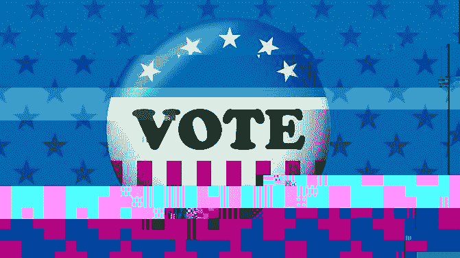
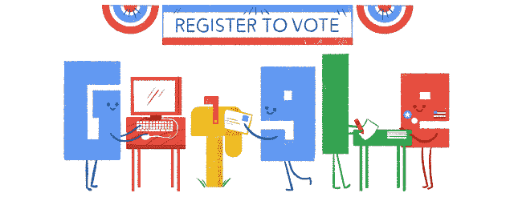

# 为什么雷德·哈斯汀斯是美国遏制金钱政治影响力的最佳机会 

> 原文：<https://web.archive.org/web/https://techcrunch.com/2016/12/03/why-reed-hastings-is-the-nations-best-chance-for-curbing-the-influence-of-money-in-politics/>

More posts by this contributor

唐纳德·特朗普(Donald Trump)的当选证明并反驳了许多政治福音，但没有人谈论的一个关键问题是，这场选举如何突显出政治电视广告越来越无效。特朗普在电视上的支出在初选中大大超过了希拉里·克林顿。没关系。

部分问题是他的对手缺乏令人信服的信息，但部分问题是越来越少的选民看电视广告。

在网飞、亚马逊 Prime、Hulu 和老式 DVR 之间，除了老年人观看传统新闻广播和人们观看现场体育比赛之外，电视广告再也没有那么多选民了。

由于电视广告占任何重大竞选活动(国会、市长、州长、总统)支出的 80%左右，随着竞选活动开始意识到广告的价值越来越小(随着靠广告支出赚钱的政治顾问最终老化和退休)，竞选活动根本不需要那么多钱。

当然，数字广告支出将填补一些真空，但目前的大部分支出将消失。

这是减少金钱在政治中影响的一个关键。另一个是投票率。大约 55%的合格选民实际上在最近的总统选举中投票。不用说，现在，大多数比赛的投票率都在低水平和极低水平之间(比如，纽约市议会的平均投票率徘徊在 15%左右)。

政治家不傻。他们知道谁投票，因为留任是他们的首要任务，他们的选择和行动旨在吸引两个群体:(1)在他们的竞选中实际投票的 15%；(2)主要的特殊利益集团，他们的钱很容易影响低投票率的选举(这就是为什么工会有这么大的权力)。

在过去五年中，我花了很多时间与优步和 FanDuel 这样的初创公司合作，动员我们的客户和合作伙伴倡导政治。因为我们让人们畅所欲言变得如此方便(他们可以直接在平台上发推特或电子邮件表达自己的观点)，让人们支持一家盈利公司实际上比在选举中投票更容易。

当人们可以在手机上投票时，这一切都将改变。

如果每个人都有一周的时间来投票(甚至更长)，你所要做的就是登录，脸书、Snapchat、Instagram、Twitter 和其他所有平台不停地打扰你，直到你投票，大多数人都会投票。

如果投票率从 15%上升到 70%,政治家们会很快调整他们的观点来代表 70%的选民，而不是 15%。

这将极大地削弱任何特殊利益集团实质上决定一个政治家在任何一个问题上如何行动的能力。这不会一蹴而就(尤其是移动投票)，但如果我们把时间和精力花在投票率和投票的便利性上，而不是仅仅鼓动和起诉竞选财务立法和诉讼，我们最终会取得更大的成就。

对于我们这些关心扩大代议制民主的政界人士来说，专注于移动投票(通过创建一个平台来确保你就是你，并为你的投票保密，然后说服司法机构采用它)是产生一个更好、更真实的民有民治政府的实际结果的唯一途径。越来越多的人投票，越来越少的人捐款，这是我们实现目标的方式。

等式的成本方面已经发生了(我很确定我们可以指望雷德·哈斯汀斯继续做他的那部分)。特朗普证明了这一点。现在让我们解决需求方面的问题——最终得到我们都应得的民主和政府。